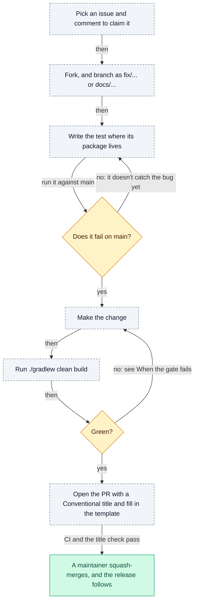

# 🤝 Contributing to unruly-engine

Thank you for considering a contribution! Bug reports, documentation fixes and code are all welcome, and everyone
taking part is expected to follow the [Code of Conduct](CODE_OF_CONDUCT.md).

- [Ways to contribute](#-ways-to-contribute)
- [Your first pull request](#-your-first-pull-request)
- [Development setup](#-development-setup)
- [Where things live](#-where-things-live)
- [Prove your test fails first](#-prove-your-test-fails-first)
- [Run the gate locally](#-run-the-gate-locally)
- [When the gate fails](#-when-the-gate-fails)
- [Design principles](#-design-principles)
- [Commit and PR titles](#-commit-and-pr-titles)
- [Documentation](#-documentation)
- [License](#-license)

## 💡 Ways to contribute

| If you | Do this |
| --- | --- |
| 🐛 **Found a bug?** | [Search the issues](https://github.com/brantunger/unruly-engine/issues) to see if it's known, then [open a bug report](https://github.com/brantunger/unruly-engine/issues/new/choose). |
| ✨ **Have an idea?** | [Open a feature request](https://github.com/brantunger/unruly-engine/issues/new/choose) describing your use case. |
| 🔒 **Found a vulnerability?** | Don't open an issue. Follow [SECURITY.md](SECURITY.md). |
| 🩹 **Spotted a doc problem?** | Fixes to the README, `docs/` and Javadoc are as welcome as code. |
| 🙋 **Want something to work on?** | Look for issues labelled [good first issue][good-first-issue] or [help wanted][help-wanted], and comment on one to claim it. |

[good-first-issue]: https://github.com/brantunger/unruly-engine/issues?q=is%3Aissue+is%3Aopen+label%3A%22good+first+issue%22
[help-wanted]: https://github.com/brantunger/unruly-engine/issues?q=is%3Aissue+is%3Aopen+label%3A%22help+wanted%22

## 🚀 Your first pull request

The whole path, from an issue to a release:



1. **Pick an issue** and comment to claim it.
2. **Fork** and branch as `fix/...` or `docs/...`.
3. **Write the test** where [Where things live](#-where-things-live) says.
4. **See it fail on `main`**: [Prove your test fails first](#-prove-your-test-fails-first).
5. **Make the change**, and update the docs with it: [Documentation](#-documentation).
6. **Run `./gradlew clean build`**: [When the gate fails](#-when-the-gate-fails).
7. **Open a pull request** with a [Conventional title](#-commit-and-pr-titles), and fill in the template.
8. **Wait for CI.** Once it and the title check are green, a maintainer squash-merges the PR and the release
   follows: [RELEASING.md](RELEASING.md).

## 💻 Development setup

You need **JDK 21** installed: the build compiles with a Java 21 toolchain, and Gradle doesn't download one, so a
missing JDK fails the build naming the version it needs. **JDK 25** is optional: only `-PtestJdk=25` needs it.

```bash
git clone https://github.com/<your-username>/unruly-engine.git
cd unruly-engine
./gradlew clean build
```

| Task | macOS/Linux (bash or zsh) | Windows PowerShell | Windows cmd |
| --- | --- | --- | --- |
| The full gate | `./gradlew clean build` | `./gradlew clean build` | `gradlew clean build` |
| One test class | `./gradlew :mvel:test --tests '*StatefulSemanticsTest*'` | `./gradlew :mvel:test --tests '*StatefulSemanticsTest*'` | `gradlew :mvel:test --tests "*StatefulSemanticsTest*"` |
| The coverage report | `./gradlew jacocoTestReport` | `./gradlew jacocoTestReport` | `gradlew jacocoTestReport` |
| The tests on JDK 25 | `./gradlew :mvel:test -PtestJdk=25` | `./gradlew :mvel:test -PtestJdk=25` | `gradlew :mvel:test -PtestJdk=25` |

> [!WARNING]
> In cmd.exe, single quotes aren't quotes: `--tests '*Foo*'` passes them to Gradle, which then reports
> `No tests found for given includes`. Use double quotes there. PowerShell and bash accept either.

## 📌 Where things live

| Project | Publishes | Contains |
| --- | --- | --- |
| `core` | `unruly-engine-core` | The API (`api`, `api.exception`, `api.language`) and the engine (`core`), without an expression language |
| `mvel` | `unruly-engine` | The MVEL language, and all the tests: those of `core` and `test-kit` too, because most of them run MVEL rules |
| `test-kit` | `unruly-engine-test` | Tools for testing an expression language: the contract test and `LanguageTestContexts` |
| `benchmarks` | — | JMH benchmarks; not published, and the build checks its sources without running them |
| `native-smoke` | — | An application CI builds into a GraalVM native image and runs; not published |

Settings shared by the projects are in the convention plugins in `buildSrc/src/main/groovy`. The `core` package is
internal: its module exports it only to the test kit's module, and a class in it is public only where the builder
or the test kit needs it.

Where does my test go? The tests are under `mvel/src/test/java/io/github/brantunger/unruly/`; the paths below are
relative to it unless given in full:

| You changed | Put the test in | Why |
| --- | --- | --- |
| A public type in `api`, `api.exception` or `api.language` | The same package, under `api/` | The tests of a package sit next to it, whichever project holds it |
| An internal class in `core` | The same package, under `core/` | The tests run on the class path, so a test in the package sees its package-private classes |
| The MVEL language | `mvel/` | Everything that is only true of MVEL stays in the `mvel` package |
| The test kit | `test/` for `LanguageTestContexts`; `api/language/ContractKitChecksTest` for the contract test | The kit's own checks are tested with a toy language |
| What the engine promises for a rule in any language | `ExpressionLanguageContractTest` in `test-kit/src/main/java` | It runs for MVEL through `mvel/MvelExpressionLanguageContractTest` and for a toy language through `api/language/ToyExpressionLanguageContractTest` |
| Module-path behaviour | A sample application under `mvel/src/test/resources/module-path/` | `ModulePathTest` compiles each one against the built jars and runs it in a new JVM |

## 🧪 Prove your test fails first

A test that passes on `main` proves nothing about your fix, so run it there before you make the change. A worktree
keeps your branch untouched:

```bash
git fetch origin
git worktree add ../unruly-main origin/main
cp mvel/src/test/java/io/github/brantunger/unruly/core/NullPriorityTest.java \
   ../unruly-main/mvel/src/test/java/io/github/brantunger/unruly/core/
(cd ../unruly-main && ./gradlew :mvel:test --tests '*NullPriorityTest*')   # expect FAILED
git worktree remove --force ../unruly-main
```

Expect `FAILED`, and name the failing assertion in the PR description. A test that uses API your PR adds fails to
compile on `main` instead; say so in the PR. On Windows, delete the worktree's `build` and `.gradle` directories
first, then remove it with `git -c core.longpaths=true worktree remove --force ../unruly-main`.

## ✅ Run the gate locally

`./gradlew clean build` is the gate. CI runs the same build on each of its operating systems, runs the tests again
on JDK 25, and checks the PR title.

| Gate | Checks | Configured in |
| --- | --- | --- |
| 🧪 **Tests** | The JUnit suite | `mvel/src/test` |
| 📏 **Checkstyle** | Main and test sources | `config/checkstyle/checkstyle.xml` |
| 🔍 **PMD** | Main sources, with the best-practices and error-prone rule sets | `buildSrc/src/main/groovy/unruly.java-conventions.gradle` |
| ⚠️ **Warnings** | No javac warning (`-Xlint:all -Werror`) in the published projects, and no Javadoc warning (`-Xdoclint:all -Werror`) | `buildSrc/src/main/groovy/unruly.java-conventions.gradle` |
| 📊 **JaCoCo** | **100%** instruction *and* branch coverage of the published artifacts' main sources | `build.gradle` |
| 🧬 **API compatibility** | No binary- or source-incompatible change to a public or protected member since the latest release | `buildSrc/src/main/groovy/unruly.library.gradle`, `config/japicmp/accepted-breaks.txt` |
| 🧭 **Module path** | `ModulePathTest` compiles four applications against the built jars and runs each on the module path | `mvel/src/test/resources/module-path` |
| 🧱 **Design rules** | Package dependencies, the API's shape, sealed contexts, nullness annotations, engine visibility, class-file version | The structural tests in [Build and gates](docs/contributing/build-and-gates.md#-what-build-runs) |

Three things to know about the gate:

- Skipping the tests with `-x test` fails the coverage gate on purpose: it would have nothing to measure. Run
  `./gradlew build -x check` to only compile and package.
- Coverage excludes one class: the test kit's `ExpressionLanguageContractTest`, a test class whose always-throwing
  lambdas leave instructions JaCoCo can't reach.
- A Gradle deprecation fails every build (`org.gradle.warning.mode=fail` in `gradle.properties`).

On every pull request and push to `main`, CI runs `./gradlew build jacocoTestReport` on **JDK 21** on Linux, Windows
and macOS, the tests again on **JDK 25** on Linux, and the native-image check, except on a
[documentation-only pull request](docs/contributing/build-and-gates.md#-ci). It also checks the PR title, and warns,
for now, about broken links, CRLF line endings and the style of the changed pages. No branch protection requires a
check; maintainers merge when CI and the title check are green. The reports, caches and artifacts are described in
[Build and gates](docs/contributing/build-and-gates.md).

## 🩺 When the gate fails

| Failing task or message | Where the report is | Usual fix |
| --- | --- | --- |
| `:mvel:test` | `mvel/build/reports/tests/test/index.html` | Read the failed test's assertion; the structural tests below have their own rows |
| `jacocoTestCoverageVerification` | `build/reports/jacoco/html/index.html` | Run `./gradlew jacocoTestReport`, open the report, and cover the red lines and yellow branches |
| `pmdMain` | `<project>/build/reports/pmd/main.html` | Fix the finding; suppress only as [Build and gates](docs/contributing/build-and-gates.md#-pmd-suppressions) shows |
| `checkstyleMain`, `checkstyleTest` | `<project>/build/reports/checkstyle/main.html`, `test.html` | Braces on every block, no star or unused imports |
| `compileJava`, `compileTestJava` with `-Werror` | The console | Fix the warning; every javac lint is on |
| `javadoc` | The console | Every public member needs a comment with `@param`, `@return` and `@throws`, and every `{@link}` must resolve |
| `japicmp` | `<project>/build/reports/japicmp/report.html` | See [API compatibility](docs/contributing/api-compatibility.md) |
| `PackageDependencyTest` | The test report | A package used one it may not; `PackageDependencyTest` lists what each package may use |
| `EngineApiShapeTest`, `SealedContextsTest`, `NullnessAnnotationsTest`, `EngineVisibilityTest`, `ClassFileVersionTest` | The test report | A public type changed shape, or a class targets a newer Java; read the test's `@DisplayName` for the rule it protects |
| A result you don't believe | — | Add `--rerun`, or `--no-build-cache --no-configuration-cache`, to rebuild from scratch |

> [!TIP]
> Coverage is the gate that most often fails. When it does, `./gradlew jacocoTestReport` and the HTML report show
> the uncovered lines and branches in every artifact at once.

## 🎯 Design principles

> [!IMPORTANT]
> A breaking change needs a `!` in the PR title, a line in `config/japicmp/accepted-breaks.txt` and a section in
> [Migrating to 2.0](docs/migrating-to-2.md), or, if it breaks the language SPI or `RulesEngine`, in
> [Migrating a language or an engine](docs/migrating-to-2-implementers.md), so every user can find what to change.

- **Any language, not just MVEL.** Code, Javadoc and messages in `unruly-engine-core` must not assume MVEL. What is
  only true of MVEL goes in the `mvel` package and [docs/languages/mvel.md](docs/languages/mvel.md).
- **Framework-neutral.** Prefer a plain hook every framework can call over an integration with one framework.
  Propose an integration in an issue before building it.
- **Breaking changes are visible.** The callout above says what each one needs;
  [API compatibility](docs/contributing/api-compatibility.md) says how the check decides what is a break.

## 📝 Commit and PR titles

PRs are squash-merged using **the PR title as the commit message**, and that message is the only input to the
release automation. Titles must follow [Conventional Commits](https://www.conventionalcommits.org/):

```text
<type>: <lowercase description with no trailing period>
```

The type decides the next version:

| Title | Effect on `1.2.3` |
| --- | --- |
| `fix: guard against a null rule condition` | `1.2.4`, a patch release |
| `feat: add RuleListener hooks` | `1.3.0`, a minor release |
| `feat!: remove the Factory interface` | `2.0.0`, a major release |
| `deps: bump mvel2 to 2.5.4` | No release, and not listed in the changelog |
| `docs: clarify first-match semantics` | No release, and not listed in the changelog |

The other accepted types are `perf`, `refactor`, `test`, `build`, `ci`, `chore` and `revert`. Like `deps` and
`docs`, none of them cuts a release or appears in the changelog; their changes ship with the next `feat:` or
`fix:` release. Only `feat` and `fix` may carry the breaking-change `!`: release-please would read `deps!:` or
`chore!:` as a major release too, so the title check rejects it. A malformed title fails the title check, so it's
caught before it can silently skip a release.

## 📚 Documentation

- The **README** is the landing page: features, installation, quick start and core concepts.
- The **guides** in [`docs/`](docs/README.md) hold the details.
- The **Javadoc** in each published project's `src/main/java` is published to
  [GitHub Pages](https://brantunger.github.io/unruly-engine/latest/) on each release, as one site for all the
  modules. `./gradlew clean build` generates it too, and fails on any warning.

When writing docs, follow the [docs style guide](docs/STYLE.md): the page template, emojis, callouts, diagrams,
examples and a checklist to run before you open a pull request. Its [Javadoc](docs/STYLE.md#-javadoc) section
lists the Javadoc rules:

- A class's Javadoc opens with one sentence of purpose, then, only where they apply and in this order: who
  implements it, which threads call it, nullness beyond `@NullMarked`, and `@see` links to the guide that owns the
  topic.
- `@throws` lists every exception the method throws, in the words of
  [Exceptions by method](docs/error-handling.md#-exceptions-by-method).
- Examples use `{@snippet :}`.
- Javadoc in `unruly-engine-core` names MVEL only as an example: "a language such as MVEL".
- Use the [glossary](docs/glossary.md)'s terms: **output supplier**, **rule list**, **run**, **compiled copy**,
  **session**.

## 📃 License

By contributing, you agree that your contributions are licensed under the
[GNU General Public License v3.0](LICENSE).
