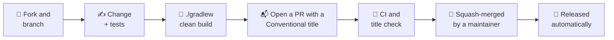

# 🤝 Contributing to unruly-engine

Thank you for considering a contribution! Bug reports, documentation fixes and code are all welcome.

- [Ways to contribute](#-ways-to-contribute)
- [Development setup](#-development-setup)
- [Quality gates](#-quality-gates)
- [Making a change](#-making-a-change)
- [Commit and PR titles](#-commit-and-pr-titles)
- [Documentation](#-documentation)

Everyone taking part is expected to follow the [Code of Conduct](CODE_OF_CONDUCT.md).

## 💡 Ways to contribute

| | |
| --- | --- |
| 🐛 **Found a bug?** | [Search the issues](https://github.com/brantunger/unruly-engine/issues) to see if it's known, then [open a bug report](https://github.com/brantunger/unruly-engine/issues/new/choose). |
| ✨ **Have an idea?** | [Open a feature request](https://github.com/brantunger/unruly-engine/issues/new/choose) describing your use case. |
| 🔒 **Found a vulnerability?** | Don't open an issue. Follow [SECURITY.md](SECURITY.md). |
| 📖 **Spotted a doc problem?** | Fixes to the README, `docs/` and Javadoc are as welcome as code. |

## 🛠 Development setup

You need a JDK (17 or later) to run Gradle. The build compiles with a **Java 17 toolchain**, which Gradle downloads
automatically if it isn't installed.

```bash
git clone https://github.com/<your-username>/unruly-engine.git
cd unruly-engine
./gradlew clean build
```

| Command | What it does |
| --- | --- |
| `./gradlew clean build` | Compiles, tests, and runs every quality gate: exactly what CI checks |
| `./gradlew test` | Runs the tests only |
| `./gradlew test --tests '*StatefulSemanticsTest*'` | Runs a single test class |
| `./gradlew test -PtestJdk=21` | Runs the tests on JDK 21 instead of 17 |
| `./gradlew jacocoTestReport` | Writes the coverage report to `build/reports/jacoco/test/html/index.html` |
| `./gradlew japicmp` | Checks the public API against the latest release and writes `build/reports/japicmp/report.html` |

## ✅ Quality gates

| Gate | Checks | Configured in |
| --- | --- | --- |
| 🧪 **Tests** | The JUnit 5 suite | `src/test` |
| 📏 **Checkstyle** | Main and test sources | `config/checkstyle/checkstyle.xml` |
| 🔍 **PMD** | Main sources, with the best-practices and error-prone rule sets | `build.gradle` |
| 📊 **JaCoCo** | **100%** instruction *and* branch coverage of the main sources | `build.gradle` |
| 🧬 **API compatibility** | No binary- or source-incompatible change to a public or protected member since the latest release | `build.gradle`, `config/japicmp/accepted-breaks.txt` |

On every pull request, CI runs `./gradlew build jacocoTestReport` on **JDK 17 and JDK 21**, and a separate check
validates the PR title.

> [!TIP]
> Coverage is the gate that most often fails. When it does, run `./gradlew jacocoTestReport` and open the HTML
> report to find the uncovered lines and branches.

### 🧬 API compatibility

The versions follow [Semantic Versioning](https://semver.org/), so a `fix:` or `feat:` release must not break code
written or compiled against an earlier release. `./gradlew build` compares the jar with the **latest release on Maven
Central** using [japicmp](https://siom79.github.io/japicmp/), and fails when a public or protected member is removed
or changes incompatibly. Examples: a changed method signature, a class made `final`, a new abstract method on an
interface, a new checked exception, or a new field in `Rule`, which changes its Lombok-generated all-args
constructor. Additions such as new classes, methods and `default` methods pass. The report is at
`build/reports/japicmp/report.html`.

An intended break belongs in a major release:

1. For each element the report lists, add a line to [`config/japicmp/accepted-breaks.txt`](config/japicmp/accepted-breaks.txt)
   with the baseline version and why users can live with the break. The file's header shows the format.
2. Title the PR with a `!`, such as `feat!: make the engine classes package-private`, and describe the migration
   under ⚠️ Behavior changes in the PR description.

A line only applies while its version is the latest release. Once the major version is published, the build warns
that the old lines no longer apply, and they can be deleted.

The check downloads the baseline, so `./gradlew build` needs access to Maven Central, or `--offline` with the
baseline already in the Gradle cache.

## 🔄 Making a change



1. **Fork** the repository and create a branch with a descriptive name, such as `fix/null-priority` or
   `docs/listener-guide`.
2. **Write tests** that fail without your change and pass with it.
3. **Keep coverage at 100%** for both instructions and branches.
4. **Update the docs.** If behavior or the public API changes, update the README, the relevant guide in `docs/`
   and the Javadoc.
5. **Open a pull request** with a Conventional Commit title (see below), fill in the template, and link the issue
   it closes.

Checks aren't enforced by branch protection, but maintainers merge a PR only once CI and the title check pass.
After it's merged, there's nothing more for you to do: [RELEASING.md](RELEASING.md) explains how the version
bump, changelog, tag, GitHub Release and Maven Central publish follow automatically.

## 📝 Commit and PR titles

PRs are squash-merged using **the PR title as the commit message**, and that message is the only input to the
release automation. Titles must follow [Conventional Commits](https://www.conventionalcommits.org/):

```text
<type>: <lowercase description with no trailing period>
```

The type decides the next version:

| Title | Effect on `1.2.3` |
| --- | --- |
| `fix: guard against a null rule condition` | `1.2.4`, a patch release |
| `feat: add RuleListener hooks` | `1.3.0`, a minor release |
| `feat!: remove the Factory interface` | `2.0.0`, a major release |
| `deps: bump mvel2 to 2.5.4` | No release, and not listed in the changelog |
| `docs: clarify stateless semantics` | No release, and not listed in the changelog |

The other accepted types are `perf`, `refactor`, `test`, `build`, `ci`, `chore` and `revert`. Like `deps` and
`docs`, none of them cuts a release or appears in the changelog; their changes ship with the next `feat:` or
`fix:` release. A malformed title fails the title check, so it's caught before it can silently skip a release.

## 📖 Documentation

- The **README** is the landing page: features, installation, quick start and core concepts.
- The **guides** in [`docs/`](docs/README.md) hold the details.
- The **Javadoc** in `src/main/java` is published to [GitHub Pages](https://brantunger.github.io/unruly-engine/latest/) on each release.
  `./gradlew clean build` doesn't generate it, so run `./gradlew javadoc` after changing it and fix any errors.

When writing docs:

- Make sure every Java snippet compiles and behaves as described against the current API.
- Draw diagrams in [Mermaid](https://mermaid.js.org/), which GitHub renders natively, and keep images as SVG in
  `docs/images/`.
- Don't change the version numbers in the README's install snippets. release-please updates everything between the
  `x-release-please-start-version` and `x-release-please-end` markers.

## 📜 License

By contributing, you agree that your contributions are licensed under the
[GNU General Public License v3.0](LICENSE).
