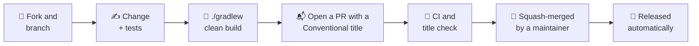

# 🤝 Contributing to unruly-engine

Thank you for considering a contribution! Bug reports, documentation fixes and code are all welcome.

- [Ways to contribute](#-ways-to-contribute)
- [Development setup](#-development-setup)
- [Quality gates](#-quality-gates)
- [Making a change](#-making-a-change)
- [Commit and PR titles](#-commit-and-pr-titles)
- [Documentation](#-documentation)

Everyone taking part is expected to follow the [Code of Conduct](CODE_OF_CONDUCT.md).

## 💡 Ways to contribute

| | |
| --- | --- |
| 🐛 **Found a bug?** | [Search the issues](https://github.com/brantunger/unruly-engine/issues) to see if it's known, then [open a bug report](https://github.com/brantunger/unruly-engine/issues/new/choose). |
| ✨ **Have an idea?** | [Open a feature request](https://github.com/brantunger/unruly-engine/issues/new/choose) describing your use case. |
| 🔒 **Found a vulnerability?** | Don't open an issue. Follow [SECURITY.md](SECURITY.md). |
| 📖 **Spotted a doc problem?** | Fixes to the README, `docs/` and Javadoc are as welcome as code. |

## 🛠 Development setup

You need a JDK (17 or later) to run Gradle. The build compiles with a **Java 21 toolchain**, which Gradle downloads
automatically if it isn't installed.

```bash
git clone https://github.com/<your-username>/unruly-engine.git
cd unruly-engine
./gradlew clean build
```

The build has three projects:

| Project | Publishes | Contains |
| --- | --- | --- |
| `core` | `unruly-engine-core` | The API, the language SPI and the engine, without an expression language |
| `mvel` | `unruly-engine` | The MVEL language, and all the tests: most of them run MVEL rules |
| `test-kit` | `unruly-engine-test` | Tools for testing an expression language: the contract test and `LanguageTestContexts` |

Settings shared by the published projects are in the convention plugins in `buildSrc/src/main/groovy`.

| Command | What it does |
| --- | --- |
| `./gradlew clean build` | Compiles, tests, and runs every quality gate: exactly what CI checks |
| `./gradlew test` | Runs the tests only |
| `./gradlew test --tests '*StatefulSemanticsTest*'` | Runs a single test class |
| `./gradlew test -PtestJdk=25` | Runs the tests on JDK 25 instead of 21 |
| `./gradlew jacocoTestReport` | Writes the coverage report for both artifacts to `build/reports/jacoco/html/index.html` |
| `./gradlew japicmp` | Checks each artifact's public API against its newest release up to the build's version and writes `build/reports/japicmp/report.html` in `core`, `mvel` and `test-kit` |
| `./gradlew javadoc` | Generates the Javadoc site for all the modules in `build/docs/javadoc` |

## ✅ Quality gates

| Gate | Checks | Configured in |
| --- | --- | --- |
| 🧪 **Tests** | The JUnit 5 suite | `mvel/src/test` |
| 📏 **Checkstyle** | Main and test sources | `config/checkstyle/checkstyle.xml` |
| 🔍 **PMD** | Main sources, with the best-practices and error-prone rule sets | `buildSrc/src/main/groovy/unruly.java-conventions.gradle` |
| 📊 **JaCoCo** | **100%** instruction *and* branch coverage of both artifacts' main sources | `build.gradle` |
| 🧬 **API compatibility** | No binary- or source-incompatible change to a public or protected member since the latest release | `buildSrc/src/main/groovy/unruly.library.gradle`, `apiCheck` in each published project's `build.gradle`, `config/japicmp/accepted-breaks.txt` |
| 🧭 **Module path** | `ModulePathTest` compiles three applications against the built jars and runs each on the module path in a new JVM: one requires `io.github.brantunger.unruly` and runs MVEL rules, one requires only `io.github.brantunger.unruly.core` and brings its own language, and one runs the test kit's contract test with JUnit | `mvel/src/test/java/io/github/brantunger/unruly/ModulePathTest.java`, `mvel/src/test/resources/module-path` |

On every pull request, CI runs `./gradlew build jacocoTestReport javadoc` on **JDK 21**, and the tests again on
**JDK 25** with `./gradlew :mvel:test -PtestJdk=25`. A separate check validates the PR title. CI restores Gradle's
caches from `main`, so a pull request only rebuilds what it changed.

> [!TIP]
> Coverage is the gate that most often fails. When it does, run `./gradlew jacocoTestReport` and open the HTML
> report to find the uncovered lines and branches.

### 🧬 API compatibility

The versions follow [Semantic Versioning](https://semver.org/), so a `fix:` or `feat:` release must not break code
written or compiled against an earlier release. `./gradlew build` compares each artifact's jar with its **newest release on
Maven Central that isn't higher than the version in the root `build.gradle`** using [japicmp](https://siom79.github.io/japicmp/),
and fails when a public or protected member is removed
or changes incompatibly. Examples: a changed method signature, a class made `final`, a new abstract method on an
interface, a new checked exception, or a changed `Rule` constructor. When you add a field to `Rule`, add it to
the builder; don't add a constructor, because the positional constructors are deprecated. Additions such as new classes, methods and `default` methods
pass. Each project writes its report to `build/reports/japicmp/report.html`.
`unruly-engine-core` has no release before 2.0.0, so until then it's compared with the last 1.x `unruly-engine` jar,
without that jar's `mvel` package. `unruly-engine-test` is new in 2.0.0, so its check is skipped until then.

**Nullness annotations are API for Kotlin.** Kotlin reads the JSpecify annotations strictly, and japicmp doesn't
check them. Marking a parameter non-null that accepted `null`, or a return value, generic type or listener parameter
`@Nullable` that wasn't, breaks Kotlin sources, so it belongs in a major release like any other break.

**Adding a method to a public interface.** Users implement several of them: `RulesEngine` (for example to decorate an
engine), `RuleListener`, `FactStore`, `FactReference`, and a language's `ExpressionLanguage`, `ExpressionCompiler`,
`CompiledCondition`, `CompiledAction` and `Session`. Within 1.x, a method added to any public interface is a `default` method,
and the check fails on an abstract one. When no generic implementation makes sense, the default throws
`UnsupportedOperationException`, as `RulesEngine.registerLanguage` does. The engine-only `CompileContext`,
`EvaluationContext` and `ActionContext` are sealed, so they can gain any method. Each interface's Javadoc says who
implements it. japicmp can't see sealing, so sealing an interface needs a `!` by hand.

An intended break belongs in a major release:

1. For each element the report lists, add a line to [`config/japicmp/accepted-breaks.txt`](config/japicmp/accepted-breaks.txt)
   with the major version the break ships in (for example `2`) and why users can live with the break. The file's
   header shows the format.
2. Title the PR with a `!`, such as `feat!: make the engine classes package-private`, and describe the migration
   under ⚠️ Behavior changes in the PR description.

A line applies while the baseline is from an earlier major version, so a hotfix released from the `1.x` branch in
the meantime doesn't turn it off. Once that major version is published and becomes the baseline, the build warns that
its lines no longer apply, and they can be deleted. Because the baseline is never higher than the build's own version,
`main` and the `1.x` branch are each checked against their own release line.

The check downloads the baseline, so `./gradlew build` needs access to Maven Central, or `--offline` with the
baseline already in the Gradle cache. The lookup is kept for 24 hours, so a new release becomes the baseline within a
day; pass `-PapiCheck.refresh` to look it up again, as the release workflow does.

## 🔄 Making a change



1. **Fork** the repository and create a branch with a descriptive name, such as `fix/null-priority` or
   `docs/listener-guide`.
2. **Write tests** that fail without your change and pass with it.
3. **Keep coverage at 100%** for both instructions and branches.
4. **Update the docs.** If behavior or the public API changes, update the README, the relevant guide in `docs/`
   and the Javadoc.
5. **Open a pull request** with a Conventional Commit title (see below), fill in the template, and link the issue
   it closes.

Checks aren't enforced by branch protection, but maintainers merge a PR only once CI and the title check pass.
After it's merged, there's nothing more for you to do: [RELEASING.md](RELEASING.md) explains how the version
bump, changelog, tag, GitHub Release and Maven Central publish follow automatically.

## 📝 Commit and PR titles

PRs are squash-merged using **the PR title as the commit message**, and that message is the only input to the
release automation. Titles must follow [Conventional Commits](https://www.conventionalcommits.org/):

```text
<type>: <lowercase description with no trailing period>
```

The type decides the next version:

| Title | Effect on `1.2.3` |
| --- | --- |
| `fix: guard against a null rule condition` | `1.2.4`, a patch release |
| `feat: add RuleListener hooks` | `1.3.0`, a minor release |
| `feat!: remove the Factory interface` | `2.0.0`, a major release |
| `deps: bump mvel2 to 2.5.4` | No release, and not listed in the changelog |
| `docs: clarify stateless semantics` | No release, and not listed in the changelog |

The other accepted types are `perf`, `refactor`, `test`, `build`, `ci`, `chore` and `revert`. Like `deps` and
`docs`, none of them cuts a release or appears in the changelog; their changes ship with the next `feat:` or
`fix:` release. Only `feat` and `fix` may carry the breaking-change `!`: release-please would read `deps!:` or
`chore!:` as a major release too, so the title check rejects it. A malformed title fails the title check, so it's caught before it can silently skip a release.

## 📖 Documentation

- The **README** is the landing page: features, installation, quick start and core concepts.
- The **guides** in [`docs/`](docs/README.md) hold the details.
- The **Javadoc** in each published project's `src/main/java` is published to [GitHub Pages](https://brantunger.github.io/unruly-engine/latest/) on each release, as one site for all the modules.
  `./gradlew clean build` doesn't generate it, so run `./gradlew javadoc` after changing it and fix any errors.

When writing docs:

- Make sure every Java snippet compiles and behaves as described against the current API.
- Draw diagrams in [Mermaid](https://mermaid.js.org/), which GitHub renders natively, and keep images as SVG in
  `docs/images/`.
- Don't change the version numbers in the README's install snippets. release-please updates everything between the
  `x-release-please-start-version` and `x-release-please-end` markers.

## 📜 License

By contributing, you agree that your contributions are licensed under the
[GNU General Public License v3.0](LICENSE).
