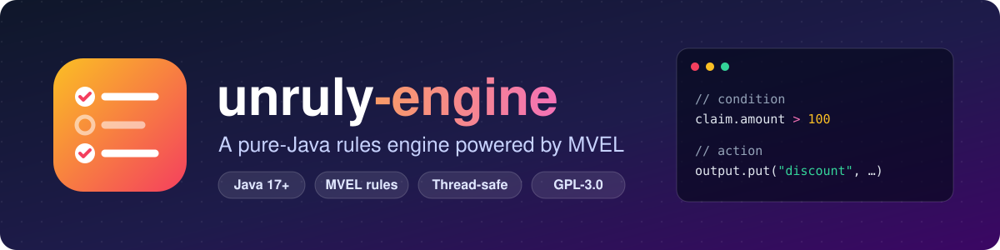
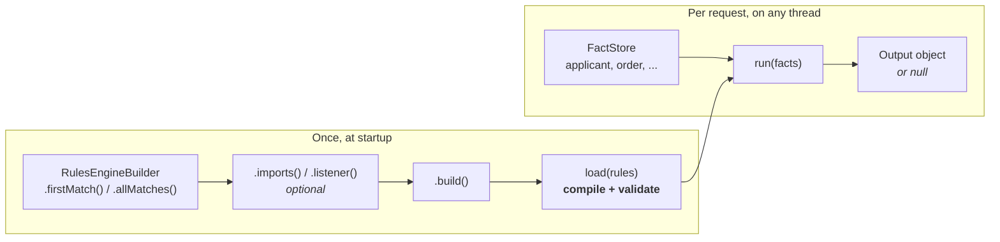
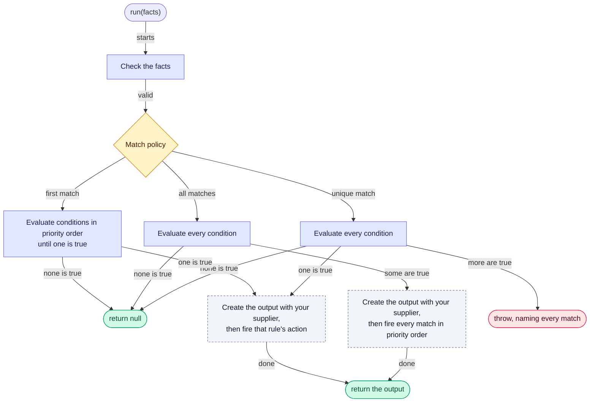

<div align="center">



<br>

[](https://github.com/brantunger/unruly-engine/actions/workflows/ci.yml)
[](https://central.sonatype.com/artifact/io.github.brantunger/unruly-engine)
[](https://brantunger.github.io/unruly-engine/latest/)
[](https://codecov.io/gh/brantunger/unruly-engine)
[](https://adoptium.net/)
[](LICENSE)

**Keep business rules out of your code.**<br>
Write each rule's condition and action as an [MVEL](https://github.com/mvel/mvel) expression, or in an expression
language of your own, load the rules once, and evaluate them against your Java objects from as many threads as you
like.

[Quick start](#-quick-start) · [How it works](#-how-it-works) · [Where next](#-where-next) · [FAQ](#-faq) · [Javadoc](https://brantunger.github.io/unruly-engine/latest/) · [Changelog](CHANGELOG.md)

</div>

---

## ✨ Features

| Feature | What you get |
| --- | --- |
| 📝 **Rules as data** | Conditions and actions are strings, so rules can live in a database, a YAML file or a config service, and be reloaded while the application runs. Rules are code, so load them only from [trusted sources](#-security). |
| 🔀 **Three match policies** | A *first-match* engine fires only the highest-priority match. An *all-matches* engine fires every match. A *unique-match* engine fires the one match, and fails when two rules apply. |
| 🔖 **Rules chosen per run** | Disable a rule, give it a validity window, or tag it by market or product, and runs [skip the rules that don't apply](docs/engines-and-runs.md#-choosing-which-rules-a-run-uses). A window opens and closes without a reload. |
| 🔢 **Predictable ordering** | Higher priorities fire first, equal priorities keep their list order, and `null` priorities go last. |
| 🛡️ **Fails fast** | Most syntax errors, blank expressions, duplicate rule names and assignments in conditions are rejected when rules are loaded. Fact and property names are checked when a rule runs, unless MVEL's [strong typing](docs/languages/mvel.md#-strong-typing) is on. |
| 🧵 **Thread-safe** | Load rules once, call `run()` from any number of threads, and swap in new rules atomically. |
| 👂 **Observable** | Lifecycle listeners with guaranteed before/after pairing, a ready-made SLF4J logging listener, and [Flight Recorder events](docs/listeners-and-logging.md#-flight-recorder-events) for slow runs by default, and for every run and rule on request. |
| 🧩 **Pluggable languages** | Rules are written in MVEL, or in other expression languages you give the engine, chosen per rule, even within one rule list. |
| 🪶 **Lightweight** | Three runtime dependencies: MVEL 2.5, the SLF4J API, and JSpecify's annotations, which mark what can be `null` for [Kotlin](docs/kotlin.md), IDEs and nullness checkers. Without MVEL, `unruly-engine-core` needs only the last two. |
| 🧊 **Native image** | Runs in a GraalVM [native image](docs/native-image.md), with MVEL's JIT turned off and the classes your rules use registered for reflection. CI builds and runs one on every pull request. |

## 📦 Installation

Requires **Java 21** or later. Moving from 1.x? See the [migration guide](docs/migrating-to-2.md).

<details open>
<summary><b>Gradle (Groovy)</b></summary>

<!-- x-release-please-start-version -->
```groovy
implementation 'io.github.brantunger:unruly-engine:2.4.0'
```
<!-- x-release-please-end -->

</details>

<details>
<summary><b>Gradle (Kotlin)</b></summary>

<!-- x-release-please-start-version -->
```kotlin
implementation("io.github.brantunger:unruly-engine:2.4.0")
```
<!-- x-release-please-end -->

</details>

<details>
<summary><b>Maven</b></summary>

<!-- x-release-please-start-version -->
```xml
<dependency>
    <groupId>io.github.brantunger</groupId>
    <artifactId>unruly-engine</artifactId>
    <version>2.4.0</version>
</dependency>
<!-- Only to test a language of your own. Declare it after unruly-engine. -->
<dependency>
    <groupId>io.github.brantunger</groupId>
    <artifactId>unruly-engine-test</artifactId>
    <version>2.4.0</version>
    <scope>test</scope>
</dependency>
```
<!-- x-release-please-end -->

</details>

`unruly-engine` is the engine with MVEL. If all your rules are written in [other languages](docs/languages/README.md),
depend on `unruly-engine-core` instead: the same engine and API, without MVEL. To test a language of your own, add
`unruly-engine-test` at the same version. With Maven, declare it after the engine, or an older kit can downgrade
`unruly-engine-core`; see [Testing with the contract kit](docs/languages/contract-kit.md).

<details>
<summary><b>On the module path</b></summary>

On the module path, `unruly-engine` is the module `io.github.brantunger.unruly`, and `unruly-engine-core` is
`io.github.brantunger.unruly.core`. Require one of them: it requires SLF4J, and MVEL for `unruly-engine`. Two modules
then read your classes: the engine, `io.github.brantunger.unruly.core`, reads the facts and writes the output, and the
language's module reads whatever its expressions reach. So export or open every package whose classes rules use: fact
types, the output type, the types of properties rules reach through them, and imported classes. An export without a
`to` clause works for every language; [Packaging](docs/languages/custom.md#-packaging) shows the narrower export an
application can use when its language doesn't reflect on facts itself.

```java
module com.example.app {
    requires io.github.brantunger.unruly; // or io.github.brantunger.unruly.core, without MVEL
    exports com.example.app.model; // or opens; either way without a "to" clause
}
```

- **The engine's module requires `jdk.jfr`**, for its
  [Flight Recorder events](docs/listeners-and-logging.md#-flight-recorder-events). jlink adds it to an image that
  requires the engine. On the class path it's optional: without it the engine records no events.
- **MVEL's jar has no module name**, so on the module path its name, `mvel2`, comes from the file name
  `mvel2-2.5.4.Final.jar`. Gradle puts a jar without a module name on the class path instead, and the application
  fails to start with `FindException: Module mvel2 not found, required by io.github.brantunger.unruly`. Give the jar
  its name with the [extra-java-module-info](https://github.com/gradlex-org/extra-java-module-info) plugin:
  ```groovy
  plugins {
      id 'org.gradlex.extra-java-module-info' version '1.14.2'
  }

  extraJavaModuleInfo {
      automaticModule('org.mvel:mvel2', 'mvel2')
  }
  ```
  The plugin also fails the build for every other jar without a module name, unless you name it the same way or set
  `failOnMissingModuleInfo = false`. A renamed MVEL jar fails the same way. `jlink` can't use `mvel2`, which is an
  automatic module, so only an application without MVEL can build a runtime image.
- **Without the export**, a rule that uses one of your classes fails on its first run, for example with
  `RuleExecutionException: ... [Error: could not access field: com.example.app.model.Applicant.creditScore]`. JDK
  types and `Map` facts need no export.
- **Don't export or open the package only `to mvel2`.** Rules then work for about 50 runs, until MVEL's JIT
  optimizer generates accessor classes. Those classes aren't in the `mvel2` module, so from then on every run fails
  with `IllegalAccessError: ... module com.example.app does not export com.example.app.model to unnamed module`. If
  you need the qualified export, start the JVM with `-Dmvel2.disable.jit=true`, which keeps MVEL on its slower
  reflective accessors. Exporting only `to io.github.brantunger.unruly` doesn't work either: MVEL reads the classes,
  not the engine.

</details>

> [!TIP]
> The engine logs through the SLF4J API. Add an SLF4J 2.x provider such as Logback if your application doesn't
> already have one, or its messages go nowhere. See [Listeners & logging](docs/listeners-and-logging.md#-logging-setup).

## 🚀 Quick start

A loan desk wants one rate per applicant: prime for excellent credit, standard for good credit. The rules read an
`Applicant` fact and change a `LoanDecision` output object, each in its own file:

```java
// Applicant.java
package com.example.loans;

// Your fact type: any object with readable properties (a record, a JavaBean, a Map, ...)
public record Applicant(String name, int creditScore) {}
```

```java
// LoanDecision.java
package com.example.loans;

import java.util.ArrayList;
import java.util.List;

// Your output type: mutable, because MVEL actions change it in place
public class LoanDecision {
    private boolean approved;
    private double interestRate;
    private final List<String> notes = new ArrayList<>();

    public boolean isApproved() { return approved; }
    public void setApproved(boolean approved) { this.approved = approved; }
    public double getInterestRate() { return interestRate; }
    public void setInterestRate(double interestRate) { this.interestRate = interestRate; }
    public List<String> getNotes() { return notes; }
}
```

```java
// LoanDesk.java
package com.example.loans;

import io.github.brantunger.unruly.api.FactMap;
import io.github.brantunger.unruly.api.FactStore;
import io.github.brantunger.unruly.api.Rule;
import io.github.brantunger.unruly.api.RulesEngine;
import io.github.brantunger.unruly.api.RulesEngineBuilder;

import java.util.List;

public class LoanDesk {

    public static void main(String[] args) {
        // 1. Build an engine. The supplier creates a fresh output object for each run.
        RulesEngine<LoanDecision> engine = RulesEngineBuilder.firstMatch(LoanDecision::new).build();

        // 2. Load the rules once. Each rule has an MVEL condition and an MVEL action.
        engine.load(List.of(
                Rule.builder()
                        .ruleName("prime-rate")
                        .priority(10)
                        .condition("applicant.creditScore >= 750")
                        .action("output.approved = true; output.interestRate = 4.5; output.notes.add('prime')")
                        .build(),
                Rule.builder()
                        .ruleName("standard-rate")
                        .priority(5)
                        .condition("applicant.creditScore >= 650")
                        .action("output.approved = true; output.interestRate = 6.9; output.notes.add('standard')")
                        .build()));

        // 3. Put your facts in a store. Rules refer to each fact by its name.
        FactStore<Object> facts = new FactMap<>();
        facts.setValue("applicant", new Applicant("Ada", 780));

        // 4. Run the rules.
        LoanDecision decision = engine.run(facts);   // approved = true, interestRate = 4.5, notes = [prime]
    }
}
```

Both conditions are true for a score of 780. The first-match engine fires only the highest-priority match,
`prime-rate`. For a score of 600, no rule matches and `decision` is `null`.

In an application, build one engine and reuse it for every run, from any number of threads, and call `close()` on it
when the application shuts down.

> [!IMPORTANT]
> `run()` returns **`null`** when no rule fires, so always check for it. See
> [What a run reports](docs/run-results.md#-what-a-run-reports).

Three more things people get wrong on day one:

- The output supplier must return a new object on every call: a shared one collects every run's results. See
  [The output object](docs/engines-and-runs.md#-the-output-object).
- `load()` doesn't catch a misspelled fact or property name: the first run that evaluates the rule fails. See
  [Caught when loading or only when running?](docs/error-handling.md#-caught-when-loading-or-only-when-running)
- A timeout doesn't interrupt a rule that is running. See
  [What a timeout doesn't do](docs/stopping-runs.md#-what-a-timeout-doesnt-do).

## 🧭 How it works



`load()` compiles every expression up front and rejects the mistakes it can detect. Each `run()` then
follows the same path:



A run first checks the facts: a fact name the rules can't use throws `IllegalArgumentException`. A first-match engine
then evaluates conditions in priority order and stops at the first true one. An all-matches engine evaluates every
condition before it fires any action. Either way, the output supplier is called only once a rule has matched, and a
run in which no rule matches, or whose rule list is empty, returns `null`. A condition or action that fails fails the
run: `run()` throws a `RuleExecutionException`, and no result is returned. See
[Engines and runs](docs/engines-and-runs.md).

## 🧩 Core concepts

### Rules

A `Rule` is immutable. It has a `ruleName`, a `condition` and an `action`, and an optional `priority`, `description`
and `language`, and `enabled`, `validFrom`, `validTo` and `tags`, which choose the runs that use it. Create one with
`Rule.builder()`, whose `build()` throws `IllegalStateException` when the name, condition or action is missing.

- **The name** must be unique within a rule list. It names the rule in errors, exceptions and listener callbacks.
- **The condition** must evaluate to a `boolean`. It can't assign to a fact, but it can call methods; see
  [What rules can change](docs/writing-rules.md#-what-rules-can-change).
- **The action** runs when the rule fires, usually changing `output`.
- **The priority** sets the order: higher first. See [Rule order](docs/engines-and-runs.md#-rule-order).
- **The language:** a rule without one is written in the engine's default language, which is MVEL when MVEL is the
  only language found. See [Expression languages](docs/languages/README.md).

[Writing rules](docs/writing-rules.md) covers each field, and how to read rules from JSON.

### Facts

Facts are the inputs. Put them in a `FactStore`, such as the built-in `FactMap`; each fact's name is the variable rules
use. A fact name can't be `output`, and must be a name the rules' languages can refer to: in MVEL, a Java identifier
that isn't a reserved word such as `empty` or `in`, or a class name MVEL resolves, such as `Math`. `run()` throws
`IllegalArgumentException` for a name that breaks these rules. Build a new store for each request. See
[Naming rules](docs/facts.md#-naming-rules).

### The output object

The output supplier creates it once in a run, after a rule has matched, and must return a new object on every call.
Actions see it as `output` and change it. `run()` returns it, or `null` exactly when no rule fired. `runWithResult()`
also reports the rules that fired, what each rule's condition evaluated to, a checksum of the rules the run used,
and the run's tags and start instant. See [The output object](docs/engines-and-runs.md#-the-output-object).

### Choosing an engine

| Compared | `RulesEngineBuilder.firstMatch(...)` | `RulesEngineBuilder.allMatches(...)` | `RulesEngineBuilder.uniqueMatch(...)` |
| --- | --- | --- | --- |
| **Conditions evaluated** | Until the first match; the rules below it aren't evaluated | All of them, before any action runs | All of them, before any action runs |
| **Actions fired** | Only the highest-priority match | Every match, highest priority first, on one output object | The one match; two or more fail the run, naming them |
| **Good for** | Decision tables and "first match wins" logic | Scoring, tagging, and collecting every violation | Decision tables whose rows must not overlap |

> [!WARNING]
> An all-matches run is **not atomic**. If an action throws, the actions that already ran keep their changes to the
> output object and to any facts they modified, and `run()` throws a `RuleExecutionException` naming only the
> rule that failed. A failing condition changes nothing, because no action has run yet.

The full comparison, including what happens when an action changes a fact, is in
[First match or all matches](docs/engines-and-runs.md#-first-match-or-all-matches).

## 📚 Where next

- **Write your first rules:** [Writing rules](docs/writing-rules.md), then [Facts](docs/facts.md).
- **Take rules to production:** [Before you go to production](docs/production.md), then
  [Engines and runs](docs/engines-and-runs.md), [Error handling](docs/error-handling.md),
  [Thread safety](docs/thread-safety.md), [Compiled copies](docs/compiled-copies.md) and
  [Virtual threads](docs/virtual-threads.md).
- **Use or write another expression language:** [Expression languages](docs/languages/README.md), then
  [Writing a language](docs/languages/custom.md).
- **Upgrade from 1.x:** [Migrating to 2.0](docs/migrating-to-2.md), then
  [Migrating a language or an engine](docs/migrating-to-2-implementers.md) if you implement the engine's interfaces.
- **Something's wrong?** [Troubleshooting](docs/troubleshooting.md).

Every guide is listed in the [documentation index](docs/README.md), and the API in the
[Javadoc](https://brantunger.github.io/unruly-engine/latest/).

## 🔒 Security

> [!CAUTION]
> **Rules are code.** A rule written in MVEL has the same access to the JVM as your own Java code: it can start
> processes, read files, open sockets and use reflection. The engine has **no sandbox**, and a
> [timeout](docs/stopping-runs.md#-what-a-timeout-doesnt-do) only stops a run between rules or when an expression
> returns: MVEL rules can't be stopped inside an expression, so `while (true) {}` blocks the calling thread forever.

- Load rules only from sources you trust as much as your application code, such as your repository or a table
  only administrators can change.
- Never build rules from end-user input. Facts are the safe way to pass user data in.
- If less trusted people must write rules, run the engine in a separate, restricted process. `runTimeout` isn't a
  defence against a rule that never returns.
- A rule in another expression language can reach whatever that language allows. Check the language's own
  documentation before relying on it as a sandbox.

To report a vulnerability, see [SECURITY.md](SECURITY.md).

## ❓ FAQ

Symptoms and exception messages are in [Troubleshooting](docs/troubleshooting.md).

<details>
<summary><b>Why does <code>run()</code> return <code>null</code>?</b></summary>

No rule fired: no condition was true, or the rule list is empty. The output supplier isn't even called in that case.
Check for `null`, or, on a first-match engine, add a lowest-priority catch-all rule with the condition `true`. See
[What a run reports](docs/run-results.md#-what-a-run-reports).

</details>

<details>
<summary><b>Can I change the rules without restarting?</b></summary>

Yes. Call `load()` again at any time, even while other threads are running. A run already in progress
finishes with the old rules, and later runs use the new ones. If the new list fails to compile, the old rules stay
in place. See [Reloading rules](docs/engines-and-runs.md#-reloading-rules) and
[Thread safety](docs/thread-safety.md).

</details>

<details>
<summary><b>Can I remove a listener?</b></summary>

No. An engine's listeners are set when it's built and can't change. If you need to switch one off, give it an enabled
flag, or build a new engine.

</details>

<details>
<summary><b>How does this compare with Drools or Easy Rules?</b></summary>

unruly-engine is intentionally small. It has no Rete network, no working memory and no forward chaining. Each
`run()` makes a single pass in priority order — a first-match engine stops at the first match, an all-matches or a
unique-match engine evaluates every condition and then fires — and actions never trigger re-evaluation. That makes
it simple to reason about and a good fit for decision tables and moderate rule sets. If you need inference over
changing facts, use a full production-rule system.

</details>

<details>
<summary><b>What license is it under?</b></summary>

2.0.0 onwards, the Apache License 2.0: use, modify and redistribute it, including inside closed-source software.
Each contributor also grants a patent license, limited to the claims their contribution necessarily infringes,
alone or combined with the engine, and it ends if you bring patent litigation claiming the engine infringes. 1.8.0
and earlier were released under the GNU General Public License v3.0.

Running the engine in a service you host asks nothing of you. Shipping software that contains it — a fat jar, a
WAR, a container image or an installer, repackaged or not — means keeping its copyright notices and including the
[LICENSE](LICENSE) and the [NOTICE](NOTICE) alongside your own. If you modify its source files, mark them as
changed.

</details>

## 🤝 Contributing

Contributions are welcome! Start with [CONTRIBUTING.md](CONTRIBUTING.md) for the build, the quality gates and the
PR title format. Please also read the [Code of Conduct](CODE_OF_CONDUCT.md). Maintainers can find the release
process in [RELEASING.md](RELEASING.md).

## 📄 License

unruly-engine 2.0.0 and later are licensed under the [Apache License 2.0](LICENSE), and a redistribution carries
the [NOTICE](NOTICE) with it. 1.8.0 and earlier were released under the GNU General Public License v3.0, and the
copies of them on Maven Central carry that license; the rights it granted can't be withdrawn.
