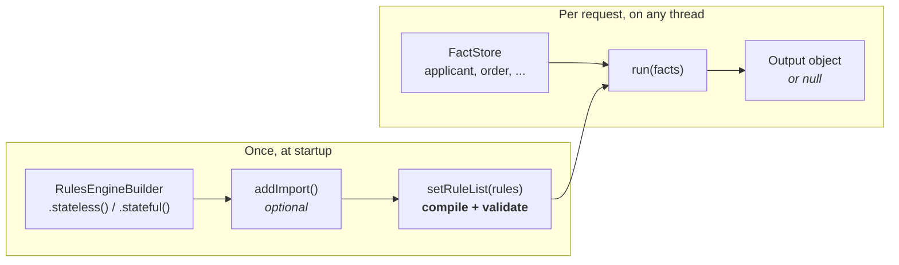
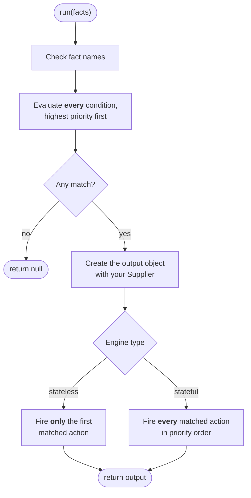

<div align="center">


<br>

[](https://github.com/brantunger/unruly-engine/actions/workflows/ci.yml)
[](https://central.sonatype.com/artifact/io.github.brantunger/unruly-engine)
[](https://brantunger.github.io/unruly-engine/latest/)
[](https://codecov.io/gh/brantunger/unruly-engine)
[](https://adoptium.net/)
[](LICENSE)

**Keep business rules out of your code.**<br>
Write each rule's condition and action as an [MVEL](https://github.com/mvel/mvel) expression, or in an expression
language of your own, load the rules once, and evaluate them against your Java objects from as many threads as you
like.

[Quick start](#-quick-start) · [How it works](#-how-it-works) · [Guides](#-guides) · [FAQ](#-faq) · [Javadoc](https://brantunger.github.io/unruly-engine/latest/) · [Changelog](CHANGELOG.md)

</div>

---

## ✨ Features

|    | Feature | What you get |
| -- | --- | --- |
| 📝 | **Rules as data** | Conditions and actions are strings, so rules can live in a database, a YAML file or a config service, and be reloaded while the application runs. Rules are code, so load them only from [trusted sources](#-security). |
| 🔀 | **Two engine types** | A *stateless* engine fires only the highest-priority match. A *stateful* engine fires every match. |
| 🔢 | **Predictable ordering** | Higher priorities fire first, equal priorities keep their list order, and `null` priorities go last. |
| 🛡 | **Fails fast** | Most syntax errors, blank expressions, duplicate rule names and assignments in conditions are rejected when rules are loaded. |
| 🧵 | **Thread-safe** | Load rules once, call `run()` from any number of threads, and swap in new rules atomically. |
| 👂 | **Observable** | Lifecycle listeners with guaranteed before/after pairing, plus a ready-made SLF4J logging listener. |
| 🧩 | **Pluggable languages** | Rules are written in MVEL by default. Register another expression language and choose it per rule, even within one rule list. |
| 🪶 | **Lightweight** | Three runtime dependencies: MVEL 2.5, the SLF4J API, and JSpecify's annotations, which mark what can be `null` for [Kotlin](docs/kotlin.md), IDEs and nullness checkers. Without MVEL, `unruly-engine-core` needs only the last two. |

## 📦 Installation

Requires **Java 21** or later. Moving from 1.x? See the [migration guide](docs/migrating-to-2.md).

<details open>
<summary><b>Gradle (Groovy)</b></summary>

<!-- x-release-please-start-version -->
```groovy
implementation 'io.github.brantunger:unruly-engine:1.8.0'
```
<!-- x-release-please-end -->

</details>

<details>
<summary><b>Gradle (Kotlin)</b></summary>

<!-- x-release-please-start-version -->
```kotlin
implementation("io.github.brantunger:unruly-engine:1.8.0")
```
<!-- x-release-please-end -->

</details>

<details>
<summary><b>Maven</b></summary>

<!-- x-release-please-start-version -->
```xml
<dependency>
    <groupId>io.github.brantunger</groupId>
    <artifactId>unruly-engine</artifactId>
    <version>1.8.0</version>
</dependency>
```
<!-- x-release-please-end -->

</details>

`unruly-engine` is the engine with MVEL. If all your rules are written in [other languages](docs/languages/custom.md),
depend on `unruly-engine-core` instead: the same engine and API, without MVEL. To test a language of your own, add
`unruly-engine-test`; see [Testing a language](docs/languages/custom.md#-testing-a-language).

On the module path, `unruly-engine` is the module `io.github.brantunger.unruly`, and `unruly-engine-core` is
`io.github.brantunger.unruly.core`. Require one of them: it requires SLF4J, and MVEL for `unruly-engine`. Rules read your
classes through MVEL, so also export every package whose classes rules use: fact types, the output type, the types
of properties rules reach through them, and imported classes.

```java
module com.example.app {
    requires io.github.brantunger.unruly; // or io.github.brantunger.unruly.core, without MVEL
    exports com.example.app.model; // or opens; either way without a "to" clause
}
```

- **MVEL's jar has no module name**, so on the module path its name, `mvel2`, comes from the file name
  `mvel2-2.5.4.Final.jar`. Gradle puts a jar without a module name on the class path instead, and the application
  fails to start with `FindException: Module mvel2 not found, required by io.github.brantunger.unruly`. Give the jar
  its name with the [extra-java-module-info](https://github.com/gradlex-org/extra-java-module-info) plugin:
  ```groovy
  plugins {
      id 'org.gradlex.extra-java-module-info' version '1.14.2'
  }

  extraJavaModuleInfo {
      automaticModule('org.mvel:mvel2', 'mvel2')
  }
  ```
  The plugin also fails the build for every other jar without a module name, unless you name it the same way or set
  `failOnMissingModuleInfo = false`. A renamed MVEL jar fails the same way. `jlink` can't use `mvel2`, which is an
  automatic module, so only an application without MVEL can build a runtime image.
- **Without the export**, a rule that uses one of your classes fails on its first run, for example with
  `RuleExecutionException: ... [Error: could not access field: com.example.app.model.Applicant.creditScore]`. JDK
  types and `Map` facts need no export.
- **Don't export or open the package only `to mvel2`.** Rules then work for about 50 runs, until MVEL's JIT
  optimizer generates accessor classes. Those classes aren't in the `mvel2` module, so from then on every run fails
  with `IllegalAccessError: ... module com.example.app does not export com.example.app.model to unnamed module`. If
  you need the qualified export, start the JVM with `-Dmvel2.disable.jit=true`, which keeps MVEL on its slower
  reflective accessors. Exporting only `to io.github.brantunger.unruly` doesn't work either: MVEL reads the classes,
  not the engine.

> [!TIP]
> The engine logs through the SLF4J API. Add an SLF4J 2.x provider such as Logback if your application doesn't
> already have one, or its messages go nowhere. See [Listeners & logging](docs/listeners-and-logging.md#-logging-setup).

## 🚀 Quick start

A loan desk wants one rate per applicant: prime for excellent credit, standard for good credit.

```java
package com.example.loans;

// Your fact type: any object with readable properties (a record, a JavaBean, a Map, ...)
public record Applicant(String name, int creditScore) {}

// Your output type: mutable, because actions change it in place
public class LoanDecision {
    private boolean approved;
    private double interestRate;
    private final List<String> notes = new ArrayList<>();
    // getters and setters ...
}
```

```java
// 1. Create an engine. The supplier creates a fresh output object for each run.
RulesEngine<LoanDecision> engine = RulesEngineBuilder.stateless(LoanDecision::new);

// 2. Load the rules once. Each rule has an MVEL condition and an MVEL action.
engine.setRuleList(List.of(
        Rule.builder()
                .ruleName("prime-rate")
                .priority(10)
                .condition("applicant.creditScore >= 750")
                .action("output.approved = true; output.interestRate = 4.5; output.notes.add('prime')")
                .build(),
        Rule.builder()
                .ruleName("standard-rate")
                .priority(5)
                .condition("applicant.creditScore >= 650")
                .action("output.approved = true; output.interestRate = 6.9; output.notes.add('standard')")
                .build()));

// 3. Put your facts in a store. Rules refer to each fact by its name.
FactStore<Object> facts = new FactMap<>();
facts.setValue("applicant", new Applicant("Ada", 780));

// 4. Run the rules.
LoanDecision decision = engine.run(facts);   // approved = true, interestRate = 4.5, notes = [prime]
```

Both conditions are true for a score of 780. The stateless engine fires only the highest-priority match,
`prime-rate`.

> [!IMPORTANT]
> `run()` returns **`null`** when no rule matches. For an applicant with a score of 600, `decision` is `null`,
> so always check for it.

## 🧭 How it works



`setRuleList()` compiles every expression up front and rejects the mistakes it can detect. Each `run()` then
follows the same path:



## 🧩 Core concepts

### Rules

A `Rule` is a plain object with six fields:

| Field | Type | Required | Purpose |
| --- | --- | :---: | --- |
| `ruleName` | `String` | recommended | Names the rule in error messages and listener callbacks. Must be unique within a rule list. Unnamed rules are allowed and show as `(unnamed)`. |
| `condition` | `String` | ✅ | An expression that must evaluate to a `boolean`. It can't assign or declare anything, but it can call methods; see [What rules can change](docs/writing-rules.md#-what-rules-can-change). |
| `action` | `String` | ✅ | An expression that runs when the rule fires, usually changing `output`. |
| `priority` | `Integer` | | Higher numbers fire first. Equal priorities keep their list order, and `null` sorts last. |
| `description` | `String` | | Free text for your own use. The engine ignores it, but listeners receive it. |
| `language` | `String` | | The expression language the condition and action are written in. `null` means MVEL. See [Other expression languages](docs/languages/custom.md). |

Create a rule with `Rule.builder()`. The no-arg constructor and the setters still work, but are deprecated since
1.8.0 because `Rule` is expected to become immutable in 2.0: a JSON or configuration binder can build rules through
`Rule.RuleBuilder` instead, for example with a Jackson mix-in using
`@JsonDeserialize(builder = Rule.RuleBuilder.class)` and `@JsonPOJOBuilder(withPrefix = "")`. Copy a rule with a change with `toBuilder()`, such as `rule.toBuilder().priority(5).build()`. The
positional constructors, `new Rule(ruleName, condition, action, priority, description[, language])`, are deprecated
because their parameters change whenever a field is added. `setRuleList()` copies each rule, so changing a
`Rule` afterwards has no effect until you call `setRuleList()` again.

### Facts

Facts are the inputs. Put them in a `FactStore`; `FactMap` is the built-in implementation. Each fact's name is
the variable that rules use:

```java
FactStore<Object> facts = new FactMap<>();
facts.setValue("applicant", new Applicant("Ada", 780));   // rules can now use applicant.creditScore
```

A fact name can't be `output`, and must be a name the rules' languages can refer to: in MVEL, a valid Java
identifier that isn't a keyword such as `empty` or `in`. Build a new store for each request. See the [Facts guide](docs/facts.md) for the details.

### The output object

- Your `Supplier` creates it, once per run that matches at least one rule. It must return a **new** object each
  time, never a shared instance.
- Actions see it as `output` and change it in place, for example with `output.approved = true` or
  `output.put('discount', 10)`. An action can't replace it with `output = ...`, so the output type must be mutable.
- `run()` returns it, or `null` when no rule matched.

### 🔀 Choosing an engine

|  | 🎯 Stateless | 📚 Stateful |
| --- | --- | --- |
| **Create with** | `RulesEngineBuilder.stateless(...)` | `RulesEngineBuilder.stateful(...)` |
| **Conditions evaluated** | All of them | All of them |
| **Actions fired** | Only the highest-priority match | Every match, highest priority first |
| **Output** | Shaped by exactly one rule | Shared by all matched actions, so a later, lower-priority action can overwrite an earlier one |
| **Good for** | Decision tables and "first match wins" logic | Scoring, tagging, and collecting every violation |
| **Quick start, score 780** | `4.5`, `[prime]` | `6.9`, `[prime, standard]` |

Both engines **match first, then fire**. Every condition is evaluated before any action runs, and an action
never causes a condition to be checked again. If a higher-priority action changes a fact, a lower-priority rule
that already matched still fires.

> [!CAUTION]
> A stateful run is **not atomic**. If an action throws, the actions that already ran keep their changes to the
> output object and to any facts they modified, and `run()` throws a `RuleExecutionException` naming only the
> rule that failed.

## 📚 Guides

| Guide | Covers |
| --- | --- |
| ✍️ [Writing rules](docs/writing-rules.md) | Anatomy of a rule, choosing a language, what rules may change, and testing rules |
| ⚡ [MVEL](docs/languages/mvel.md) | MVEL syntax, imports and built-in class names, and comparison gotchas |
| 🧩 [Other expression languages](docs/languages/custom.md) | Choosing a language per rule, and writing, registering and testing your own |
| 🗂️ [Facts](docs/facts.md) | `FactStore`, `FactMap` and `Fact`, naming rules, null and missing facts, copying and sharing |
| 🌱 [Spring Boot](docs/spring-boot.md) | Configuring engines as beans, loading rules, reloading them, and using several engines |
| 👂 [Listeners & logging](docs/listeners-and-logging.md) | `RuleListener` callbacks, tracing, `LoggingRuleListener`, and logger configuration |
| 🚨 [Error handling](docs/error-handling.md) | Every exception by method, what's caught when rules load and what only at run time |
| 🟣 [Kotlin](docs/kotlin.md) | Nullness from Kotlin, and what to change in code written for 1.4 or earlier |
| 🧵 [Thread safety](docs/thread-safety.md) | Concurrency guarantees, reloading rules while running, and compiled copies for concurrent runs and how to limit them |
| 📖 [Javadoc](https://brantunger.github.io/unruly-engine/latest/) | The API reference |

## 🔒 Security

> [!WARNING]
> **Rules are code.** MVEL, the default language, gives a rule the same access to the JVM as your own Java code: it can start
> processes, read files, open sockets and use reflection. The engine has **no sandbox and no timeout**, so
> `while (true) {}` blocks the calling thread forever.

- Load rules only from sources you trust as much as your application code, such as your repository or a table
  only administrators can change.
- Never build rules from end-user input. Facts are the safe way to pass user data in.
- If less trusted people must write rules, run the engine in a separate, restricted process and enforce your own
  time limit around `run()`.
- A rule in another expression language can reach whatever that language allows. Check the language's own
  documentation before relying on it as a sandbox.

To report a vulnerability, see [SECURITY.md](SECURITY.md).

## ❓ FAQ

<details>
<summary><b>Why does <code>run()</code> return <code>null</code>?</b></summary>

No rule matched, or the rule list is empty. The output supplier isn't even called in that case. Check for `null`,
or add a lowest-priority catch-all rule with the condition `true`.

</details>

<details>
<summary><b>What do <code>unresolvable property or identifier</code> and <code>could not resolve class</code> mean?</b></summary>

The rule used a name that is neither a fact in the store nor a class MVEL knows. Which message you get depends on
how the name is used: `Objects.isNull(x)` fails with `unresolvable property or identifier`, and `new ArrayList()` with
`could not resolve class`. Common causes:

- The fact wasn't added, or was added under a different name. To test whether a fact exists, use `isdef name`.
- The rule uses a class that isn't built in to MVEL, such as `Objects` or `ArrayList`, without an import. Call
  `engine.addImport("java.util")` **before** `setRuleList()`, or write the fully qualified name, such as
  `java.util.Objects`. See [Classes and imports](docs/languages/mvel.md#-classes-and-imports).

</details>

<details>
<summary><b>What does <code>NoClassDefFoundError: applicant (wrong name: Applicant)</code> mean?</b></summary>

While compiling `applicant.creditScore`, MVEL checks whether `applicant` is a class. Your classes are in the default
package and in a class directory, as an IDE or `javac *.java` leaves them, on a case-insensitive file system (the
default on Windows and macOS), so the lookup for `applicant.class` found `Applicant.class`. Before 1.6.1 that failed
`setRuleList()`. From 1.6.1 the engine treats such a class file as a different class and reads `applicant` as the
fact. On an older version, put your classes in a package; classes packaged in a jar aren't affected.

</details>

<details>
<summary><b>My enum comparison never matches</b></summary>

MVEL compares an enum to a string as `false`, with no error. Write `order.status.name() == 'SHIPPED'`. See
[Comparison gotchas](docs/languages/mvel.md#-comparison-gotchas).

</details>

<details>
<summary><b>Can I change the rules without restarting?</b></summary>

Yes. Call `setRuleList()` again at any time, even while other threads are running. A run already in progress
finishes with the old rules, and later runs use the new ones. If the new list fails to compile, the old rules stay
in place. See [Thread safety](docs/thread-safety.md).

</details>

<details>
<summary><b>Can I remove a listener?</b></summary>

No. Listeners can be added but not removed. If you need to switch one off, give it an enabled flag, or build a new
engine.

</details>

<details>
<summary><b>How does this compare with Drools or Easy Rules?</b></summary>

unruly-engine is intentionally small. It has no Rete network, no working memory and no forward chaining. Each
`run()` makes a single pass that evaluates every condition and then fires actions, and actions never trigger
re-evaluation. That makes it simple to reason about and a good fit for decision tables and moderate rule sets.
If you need inference over changing facts, use a full production-rule system.

</details>

<details>
<summary><b>What license is it under?</b></summary>

The GNU General Public License v3.0, not the LGPL. Check that it's compatible with how you distribute your
software before depending on it.

</details>

## 🤝 Contributing

Contributions are welcome! Start with [CONTRIBUTING.md](CONTRIBUTING.md) for the build, the quality gates and the
PR title format. Please also read the [Code of Conduct](CODE_OF_CONDUCT.md). Maintainers can find the release
process in [RELEASING.md](RELEASING.md).

## 📄 License

unruly-engine is licensed under the [GNU General Public License v3.0](LICENSE).
