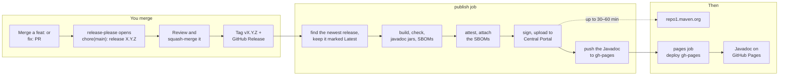

# 🚀 Releasing unruly-engine

> [!NOTE]
> This page is for the maintainer. A contributor has nothing to do here: once a `feat:` or `fix:` PR is
> squash-merged, release-please opens the release PR, and the maintainer's merge of it publishes the release.
> [CONTRIBUTING.md](CONTRIBUTING.md) is the page for contributors.

Releases are automated, and they all come from `main`: merging a PR is the only manual act. The version bump,
changelog, git tag, GitHub Release, Maven Central publish and [Javadoc site](#-the-javadoc-site) all follow from it.
1.8.0 is the last 1.x release, so there is no second release line to publish from; [SECURITY.md](SECURITY.md) is the
policy.

- [The normal flow](#-the-normal-flow)
- [Forcing a release](#-forcing-a-release)
- [Required secrets](#-required-secrets)
- [One-time GPG setup](#-one-time-gpg-setup)
- [When a publish half-completes](#-when-a-publish-half-completes)
- [Checking a release by hand](#-checking-a-release-by-hand)
- [The Javadoc site](#-the-javadoc-site)
- [Verifying signing locally](#-verifying-signing-locally)

---

## 🔄 The normal flow



1. Merge PRs to `main` with [Conventional Commit](CONTRIBUTING.md#-commit-and-pr-titles) titles. `feat:` bumps the
   minor version, `fix:` the patch version, and a `!` suffix the major version.
2. [release-please](https://github.com/googleapis/release-please) opens a PR titled
   **chore(main): release X.Y.Z**. It bumps `gradle.properties`, the README install snippets,
   `.release-please-manifest.json` and `CHANGELOG.md`, and updates the PR as further commits land.
3. Review the proposed version and changelog. The release PR is opened with `GITHUB_TOKEN`, so its CI run waits for
   a maintainer's approval (`action_required`), and the PR title check doesn't run on it at all. Approve the waiting
   run in the Actions tab, then **squash-merge the release PR** once CI is green.
4. That merge makes release-please create the tag `vX.Y.Z` and a GitHub Release, which triggers the `publish` job in
   the same workflow run. The job checks out the tag, finds the highest released version for the `Latest` mark and
   [`/latest/`](#-the-javadoc-site), and runs the full `build` (including Checkstyle, PMD, the coverage gate and the
   [API compatibility check](docs/contributing/api-compatibility.md) against the previous release), the javadoc jars
   and an [SBOM](#the-sboms) for each jar's module. It [attests](#-checking-a-release-by-hand) the nine jars and
   three SBOMs, attaches the SBOMs, publishes the jars and the [BOM](docs/glossary.md#artifacts) to the Central
   Portal, attaches the jars and adds the Javadoc to the `gh-pages` branch. A second job, `pages`, deploys that
   branch to [GitHub Pages](#-the-javadoc-site).

The Release notes are the changelog entry, with links to [Migrating to 2.0](docs/migrating-to-2.md) and
[Migrating a language or an engine](docs/migrating-to-2-implementers.md) appended by the `release-please` job. The
links are pinned to the tag, so each release's notes keep pointing at the guides as that release left them. The
step that appends them was added after 2.0.0, so that release's links were added by hand, in the shape it writes.

Central Portal validation is synchronous, so a green `publish` job means the release was accepted. Propagation to
`repo1.maven.org` can take up to a further 30–60 minutes; for 2.0.0 it took about 4 minutes. The workflow doesn't
wait for it, so the release queue isn't held up; see
[Checking a release by hand](#-checking-a-release-by-hand) to confirm the sync.

## 🚦 Forcing a release

Only `feat:`, `fix:` and breaking (`!`) commits open a release PR. Every other type (`deps`, `perf`, `refactor`,
`revert`, `docs`, `chore`, `build`, `ci`, `test`) is hidden in `release-please-config.json`, so it never cuts a
release on its own and never appears in the changelog. That's by design, so weekly Dependabot bumps don't each ship
a version; they go out with the next release. To release pending dependency bumps sooner, merge a `fix:` PR. The
bumps ship in that release without their own changelog entries.

> [!WARNING]
> `Release-As:` footers do **not** work here. The repository squash-merges with the PR title only, so commit bodies
> never reach `main`.

## 🔑 Required secrets

The secrets are stored on the `maven-central` environment, not at repository level, so the publish job is the only
thing that can read them.

| Secret | What it is |
| --- | --- |
| `MAVEN_USER` | Central Portal user token username (`central.sonatype.com` → Account → Generate User Token) |
| `MAVEN_PASSWORD` | Central Portal user token password |
| `GPG_KEY` | ASCII-armored **private** signing key, from `gpg --armor --export-secret-keys <KEY_ID>` |
| `GPG_PASSWORD` | The passphrase for that key |
| `GPG_KEY_ID` | The key ID. The workflow doesn't use it; it's kept for the keyserver step below. |

The workflow passes these to Gradle as `ORG_GRADLE_PROJECT_mavenCentralUsername`, `…Password`,
`…signingInMemoryKey` and `…signingInMemoryKeyPassword`, and only to the publish step, which skips `check`: the full
build, with its tests and checks, has already run in an earlier step without them. Every action in the workflows is
pinned to a commit SHA, with its version in a comment, and Dependabot updates both. A `gradle/actions` bump that
changes the [dependency-graph plugin](docs/contributing/dependency-verification.md#-the-dependency-graph-plugin)'s
version also needs its pin updated by hand. Signing happens in memory; no GPG keyring is imported onto the runner.

Build provenance needs no secret. The `publish` job has `id-token: write` and `attestations: write` on top of
`contents: write`, so the attestation step can sign with the run's own short-lived OIDC token and record the result
on the repository.

## 🔐 One-time GPG setup

Central verifies signatures against a public keyserver, so the **public** half of the key has to be published
once. This isn't a per-release step and doesn't run in CI:

```bash
gpg --keyserver keyserver.ubuntu.com --send-keys "$GPG_KEY_ID"
# Mirrors are independent; publishing to a second one speeds up verification.
gpg --keyserver keys.openpgp.org --send-keys "$GPG_KEY_ID"
```

### Rotating the key

1. Generate a new key with `gpg --full-generate-key` (RSA 4096, with an expiry date).
2. `--send-keys` the new key ID to the keyservers above.
3. Update `GPG_KEY`, `GPG_PASSWORD` and `GPG_KEY_ID` on the `maven-central` environment.
4. Leave the old public key on the keyservers, because it still verifies past releases.
5. Once the first release signed with the new key is on Central, and before the next release, regenerate the
   dependency verification metadata, or the build can't verify its API baseline: see
   [The API baseline](docs/contributing/dependency-verification.md#-the-api-baseline).

If the armored export contains more than one secret key, also set `ORG_GRADLE_PROJECT_signingInMemoryKeyId` to
the short (8-character) key ID so the plugin picks the right one.

## 🩹 When a publish half-completes

> [!CAUTION]
> Maven Central is immutable. A released version can never be re-uploaded or deleted.

| Failure | What to do |
| --- | --- |
| **Before the upload** (the newest-release lookup, build, Checkstyle, PMD, coverage, API compatibility, Javadoc, the attestation or attaching the SBOMs failed) | Nothing shipped to Central, but the tag and GitHub Release for that version already exist. The lookup, in the `Keep the newest release marked Latest` step, runs right after the checkout, before anything is built, and tries `gh release list` three times, 10 seconds apart. When the third try fails, the job stops with `Couldn't list the releases after 3 tries`; a GitHub 5xx or a rate limit is the likely cause, and **Re-run failed jobs** repeats the lookup, runs the rest of `publish`, and then `pages`. For any other failure that was transient, use **Re-run failed jobs**; the job rebuilds from the tag, attests new SBOMs and replaces any already attached. Otherwise, fixing `main` can't repair that tag: edit the GitHub Release to say the version was never published, fix forward on `main`, and ship the next version. |
| **During the upload** | Check the deployment at <https://central.sonatype.com/publishing/deployments>. A deployment stuck in `FAILED` or `VALIDATED` can be dropped from that page; then re-run the `publish` job. |
| **After the upload** (attaching the jars or adding the Javadoc to `gh-pages` failed) | The version is already on Central, so don't re-run the `publish` job; Central would reject the second upload. Attach the jars from `repo1` with `gh release upload vX.Y.Z <jars>`, and republish the Javadoc as shown in [The Javadoc site](#-the-javadoc-site). The SBOMs are already attached: the job attaches them before the upload. |
| **Only the `pages` job failed** | Everything else shipped. Re-run the failed job, or redeploy with `gh workflow run pages.yml --ref main`. |
| **The migration guides weren't linked from the notes** (a warning in the `release-please` job) | Cosmetic, and deliberately not a failure: failing there would skip `publish`, and a re-run couldn't repair it, because release-please would find the Release already made and report no new release. The step links every guide or none, so notes that carry the `<!-- migration-guides -->` marker are complete and notes without it are untouched. Add the links by hand in the shape the step writes: `gh release view vX.Y.Z --json body --jq .body > notes.md`, then append a blank line, the marker line, a blank line, a `### 🔼 Upgrading from 1.x` heading, a blank line and one link per guide pinned to the tag, and `gh release edit vX.Y.Z --notes-file notes.md`. If you're repairing a repair of your own, first delete everything from the blank line before the marker to the end, rather than appending a second copy. The warning quotes what `gh` said about each page it couldn't confirm: a 404 means the page really isn't at that tag, anything else (401, 403, a rate limit, a 5xx) means the lookup never got an answer and the link was fine. |
| **The `Latest` mark didn't move** (a warning in the `publish` job, and only possible when the version just released isn't the highest one) | Cosmetic, and deliberately not a failure: the lookup worked, and only moving the mark didn't, so `publish` goes on to build and upload as usual. A lookup that fails is a different case: it fails the job before the build, as in the first row. Nothing reads the mark — `/latest/` on the Javadoc site is decided by the version that step found, not by the mark — so leaving it is safe. To put it back, run `gh release edit vX.Y.Z --latest` for the highest released version, which the `NEWEST` snippet in [The Javadoc site](#-the-javadoc-site) computes. |
| **Released but broken** | Don't try to replace it. Cut the next patch version. |

## 🔎 Checking a release by hand

Deployment status is on the Portal (login required): <https://central.sonatype.com/publishing/deployments>.

The public artifact page on `central.sonatype.com` answers HTTP 200 for any version, even one that doesn't exist,
so it can't confirm a release. Check `repo1` instead. Allow up to 30–60 minutes, but try sooner: for 2.0.0 the POMs
were 404 at 19:20:25 UTC and served at 19:23:09 UTC, about four minutes after the `publish` job ended.

```bash
VERSION=<version>
curl -sI "https://repo1.maven.org/maven2/io/github/brantunger/unruly-engine/$VERSION/unruly-engine-$VERSION.pom"
curl -sI "https://repo1.maven.org/maven2/io/github/brantunger/unruly-engine-core/$VERSION/unruly-engine-core-$VERSION.pom"
curl -sI "https://repo1.maven.org/maven2/io/github/brantunger/unruly-engine-test/$VERSION/unruly-engine-test-$VERSION.pom"
curl -sI "https://repo1.maven.org/maven2/io/github/brantunger/unruly-engine-bom/$VERSION/unruly-engine-bom-$VERSION.pom"
# HTTP 200 once synced, 404 before. unruly-engine-core and unruly-engine-test start at 2.0.0, unruly-engine-bom at
# 2.6.0.
```

The Javadoc for the same version is live as soon as the `pages` job finishes:

```bash
curl -sI "https://brantunger.github.io/unruly-engine/$VERSION/index.html"
# HTTP 200 once the pages job has deployed gh-pages
```

Each of the nine published jars also carries a
[build provenance](https://docs.github.com/en/actions/concepts/security/artifact-attestations) attestation, which
names the workflow and the commit it was built from. Verify a downloaded jar against it:

```bash
curl -sfO "https://repo1.maven.org/maven2/io/github/brantunger/unruly-engine/$VERSION/unruly-engine-$VERSION.jar"
gh attestation verify "unruly-engine-$VERSION.jar" --repo brantunger/unruly-engine
# Exit 0 = verified. Exit 1 = no attestation matches the file's digest; that error is always printed.
GH_FORCE_TTY=1 gh attestation verify "unruly-engine-$VERSION.jar" --repo brantunger/unruly-engine 2>&1
# The summary: build and signer repository and workflow, the workflow as
# .github/workflows/release.yml@refs/heads/main.
gh attestation verify "unruly-engine-$VERSION.jar" --repo brantunger/unruly-engine --format json
# The whole predicate on stdout, including the commit the jar was built from.
```

> [!IMPORTANT]
> On success that summary goes to **stderr**, and only when `gh` is attached to a terminal. Piped or redirected,
> the command prints nothing on either stream and still exits 0 — so a script must read the exit code, not the
> output. `GH_FORCE_TTY=1` with `2>&1` brings the summary back; `--format json` prints on a pipe either way.

The ref is the **branch**, not the tag, even though the job builds the tag: the workflow is triggered by the push to
`main`, and release-please creates the tag inside that same run, so the run's identity stays on
the branch. A `--signer-workflow` or `--cert-identity` filter has to use that ref. The commit in the predicate is the
one that was tagged.

Unlike the `curl` checks above, this one calls the API, so `gh` has to be logged in (`gh auth status`). `-sf` makes
`curl` fail on a 404 instead of saving the error page as the jar, which would then fail verification for the wrong
reason. The same works for the `-sources.jar` and `-javadoc.jar` files and for the other two artifacts. 2.0.0 is the
first release with attestations; the command fails for an earlier one.

The GitHub Release carries the same nine jars that are on Central, and from the release after 2.2.0 the three SBOMs
below. The workflow names each file it attaches, so nothing else the build makes, such as `core`'s test fixtures,
gets there.

### The SBOMs

From the release after 2.2.0, each release also attaches a [CycloneDX](https://cyclonedx.org/) 1.6 SBOM (software bill
of materials, unlike the version-pinning [BOM](docs/glossary.md#artifacts)) for each jar's module to its GitHub Release,
beside the jars. Each is a JSON file named after its artifact, such as `unruly-engine-core-$VERSION.cdx.json`. The same
provenance attestation covers them, so they verify the same way, and the exit code and output rules above apply:

```bash
gh release download "v$VERSION" --repo brantunger/unruly-engine --pattern '*.cdx.json'
gh attestation verify "unruly-engine-core-$VERSION.cdx.json" --repo brantunger/unruly-engine
```

| Question | Answer |
| --- | --- |
| Which modules have one? | Each with a jar: `unruly-engine-core`, `unruly-engine` and `unruly-engine-test` |
| What does it list? | The module's runtime dependencies, transitive ones included, from its `runtimeClasspath`: no test, build or plugin dependencies. `unruly-engine-test`'s also lists the `org.junit:junit-bom` platform |
| Is it on Maven Central? | No. It's only on the GitHub Release, and the Central deployment is unchanged |
| Can I rebuild the same file? | No. Its serial number and timestamp differ on every run, so only the file the release run built matches the attestation |
| Are its package URLs exact? | Yes, except where one module depends on another: see below |

The package URLs (purls) of the SBOM's own module and of third-party dependencies name the right coordinates, such
as `pkg:maven/org.slf4j/slf4j-api@2.0.19?type=jar`. A dependency on another of this project's modules is wrong: it
names the Gradle project instead of the artifact, so `unruly-engine`'s SBOM lists `unruly-engine-core` as
`pkg:maven/io.github.brantunger/core@<version>?project_path=%3Acore`. A scanner that matches on purls won't
recognise that entry; the module's own SBOM has the right one,
`pkg:maven/io.github.brantunger/unruly-engine-core@<version>?project_path=%3Acore`.

The SBOMs are attached right after the attestation and before the upload to Central, because they can't be rebuilt
the same: a re-run of the job builds, attests and attaches new ones in their place.

## ☕ The Javadoc site

The `publish` job copies the Javadoc it built to the `gh-pages` branch, and the `pages` job
([`pages.yml`](.github/workflows/pages.yml)) deploys that branch to <https://brantunger.github.io/unruly-engine/>.

| Path | Contents |
| --- | --- |
| `/latest/` | The newest release, by version number: publishing an older version later doesn't replace it. The README links here. |
| `/X.Y.Z/` | Each release, kept permanently. There's no `/1.0.0/`: that version was published without a `-javadoc.jar`. |
| `/` | Redirects to `/latest/` |

**Settings → Pages → Source** must be **GitHub Actions**. A push to `gh-pages` doesn't deploy on its own; only the
`pages` job does. Before that job existed, releases only pushed to the branch, so the Javadoc of 1.1.26 through 1.5.0
never went live. To redeploy the branch as it is, for example after changing it by hand, run:

```bash
gh workflow run pages.yml --ref main
```

The branch was seeded with the Javadoc of 1.0.4 through 1.1.25, unpacked from their `-javadoc.jar` files on Maven
Central.

Don't delete `gh-pages`; a repository ruleset blocks deleting or force-pushing it. If the branch is missing anyway
when a release publishes, the `publish` job recreates it with only that release's Javadoc, `/latest/` and the `/`
redirect, and logs a warning. Every older `/X.Y.Z/` then returns 404 until you add it back with the script below,
once per version.

If the publish step failed, rebuild that version's directory from its tag. The site covers all the modules, but each
artifact's `-javadoc.jar` holds only its own, so the script builds the site. The script replaces
`pages/latest` only when `VERSION` is the newest release, so it's also safe for an older version:

```bash
VERSION=<version>
# The highest released version, the same way the release workflow decides: from the Releases, not the tags, which
# can hold a vX.Y.Z that was never released, and not "Latest", which a mistake can move.
NEWEST=$(gh release list --repo brantunger/unruly-engine --limit 1000 \
  --exclude-drafts --exclude-pre-releases --json tagName --jq '.[].tagName' \
  | sed -n 's#^v\([0-9]*\.[0-9]*\.[0-9]*\)$#\1#p' | sort -V | tail -n 1)
# A failed lookup would leave NEWEST empty, and the comparison below would then silently skip latest/.
: "${NEWEST:?the release lookup found nothing; check gh auth status}"
git clone --depth 1 --branch gh-pages https://github.com/brantunger/unruly-engine.git pages
git clone --depth 1 --branch "v$VERSION" https://github.com/brantunger/unruly-engine.git "unruly-engine-$VERSION"
(cd "unruly-engine-$VERSION" && ./gradlew javadoc)
rm -rf "pages/$VERSION"
cp -r "unruly-engine-$VERSION/build/docs/javadoc" "pages/$VERSION"
if [ "$VERSION" = "$NEWEST" ]; then
  rm -rf pages/latest
  cp -r "pages/$VERSION" pages/latest
fi
git -C pages add --all
git -C pages commit -m "docs: Javadoc $VERSION"
git -C pages push origin HEAD:gh-pages
gh workflow run pages.yml --repo brantunger/unruly-engine --ref main   # deploy the updated branch
```

## 🧾 Verifying signing locally

`./gradlew clean build` needs no credentials. Publishing, even to a local Maven repository, signs every artifact,
so `publishToMavenLocal` fails with `No configured signatory` unless a signing key is supplied. A throwaway key in
a temporary keyring is enough:

```bash
export GNUPGHOME="$(mktemp -d)"
gpg --batch --pinentry-mode loopback --passphrase test --quick-generate-key "unruly test <test@example.com>" rsa3072 sign never
export ORG_GRADLE_PROJECT_signingInMemoryKey="$(gpg --batch --pinentry-mode loopback --passphrase test --armor --export-secret-keys test@example.com)"
export ORG_GRADLE_PROJECT_signingInMemoryKeyPassword=test

./gradlew publishToMavenLocal
ls ~/.m2/repository/io/github/brantunger/unruly-engine{,-core,-test,-bom}/<version>/
```

Expect `.jar`, `-sources.jar`, `-javadoc.jar`, `.module` and `.pom` files in each (the BOM only the last two), each with
a matching `.asc` signature, and nothing else. `core` builds test fixtures for this build's own tests, so check in
particular that `unruly-engine-core` has no `-test-fixtures*` file: `core/build.gradle` keeps all three of their
variants out of the publication, and Maven Central can't take one back.
