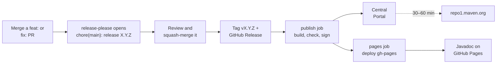

# 🚀 Releasing unruly-engine

> [!NOTE]
> This page is for the maintainer. A contributor has nothing to do here: once a `feat:` or `fix:` PR is
> squash-merged, release-please opens the release PR, and the maintainer's merge of it publishes the release.
> [CONTRIBUTING.md](CONTRIBUTING.md) is the page for contributors.

Releases are automated. Merging a PR to `main` (or to `1.x`, for a [hotfix](#-hotfix-releases-from-1x)) is the only
manual act. The version bump, changelog, git tag, GitHub Release, Maven Central publish and
[Javadoc site](#-the-javadoc-site) all follow from it.

- [The normal flow](#-the-normal-flow)
- [Forcing a release](#-forcing-a-release)
- [Hotfix releases from 1.x](#-hotfix-releases-from-1x)
- [Required secrets](#-required-secrets)
- [One-time GPG setup](#-one-time-gpg-setup)
- [When a publish half-completes](#-when-a-publish-half-completes)
- [Checking a release by hand](#-checking-a-release-by-hand)
- [The Javadoc site](#-the-javadoc-site)
- [Verifying signing locally](#-verifying-signing-locally)

---

## 🔄 The normal flow



1. Merge PRs to `main` with [Conventional Commit](CONTRIBUTING.md#-commit-and-pr-titles) titles. `feat:` bumps the
   minor version, `fix:` the patch version, and a `!` suffix the major version.
2. [release-please](https://github.com/googleapis/release-please) opens a PR titled
   **chore(main): release X.Y.Z**. It bumps `gradle.properties`, the README install snippets,
   `.release-please-manifest.json` and `CHANGELOG.md`, and updates the PR as further commits land.
3. Review the proposed version and changelog, then **squash-merge the release PR**.
4. That merge makes release-please create the tag `vX.Y.Z` and a GitHub Release, which triggers the `publish` job
   in the same workflow run. The job checks out the tag, runs the full `build` (including Checkstyle, PMD, the
   coverage gate and the [API compatibility check](docs/contributing/api-compatibility.md) against the previous
   release), publishes to the Central Portal, attaches the jars to the GitHub Release and adds the Javadoc to
   the `gh-pages` branch. A second job, `pages`, then deploys that branch to [GitHub Pages](#-the-javadoc-site).

Central Portal validation is synchronous, so a green `publish` job means the release was accepted. Propagation to
`repo1.maven.org` takes a further **30–60 minutes**. The workflow doesn't wait for it, so the release queue isn't
held up; see [Checking a release by hand](#-checking-a-release-by-hand) to confirm the sync.

## 🚦 Forcing a release

Only `feat:`, `fix:` and breaking (`!`) commits open a release PR. Every other type (`deps`, `perf`, `refactor`,
`revert`, `docs`, `chore`, `build`, `ci`, `test`) is hidden in `release-please-config.json`, so it never cuts a
release on its own and never appears in the changelog. That's by design, so weekly Dependabot bumps don't each ship
a version; they go out with the next release. To release pending dependency bumps sooner, merge a `fix:` PR. The
bumps ship in that release without their own changelog entries.

> [!WARNING]
> `Release-As:` footers do **not** work here. The repository squash-merges with the PR title only, so commit bodies
> never reach `main`.

## 🌿 Hotfix releases from 1.x

2.0 is developed on `main`, so once its first breaking change is merged, a 1.x fix can't be released from there.
1.x fixes ship from a `1.x` branch instead. The release workflow and CI run on it the same way as on `main`:
release-please opens **chore(1.x): release 1.X.Y** against `1.x`, and merging that PR publishes the version.

### Once, before the first hotfix

1. Create the branch from the last 1.x release tag:

   ```bash
   git fetch origin --tags
   git push origin 'v1.8.0^{commit}:refs/heads/1.x'
   ```

2. Allow the branch in both deployment environments. They only accept `main` (and `gh-pages`), so the `publish` and
   `pages` jobs would fail on `1.x` before running:

   ```bash
   gh api -X POST repos/brantunger/unruly-engine/environments/maven-central/deployment-branch-policies -f name=1.x -f type=branch
   gh api -X POST repos/brantunger/unruly-engine/environments/github-pages/deployment-branch-policies -f name=1.x -f type=branch
   ```

3. Protect the branch like `main` (pull requests only, no force pushes or deletion; admins can bypass):

   ```bash
   gh api -X POST repos/brantunger/unruly-engine/rulesets --input - <<'EOF'
   {"name": "Protect 1.x", "target": "branch", "enforcement": "active",
    "bypass_actors": [{"actor_id": 5, "actor_type": "RepositoryRole", "bypass_mode": "always"}],
    "conditions": {"ref_name": {"include": ["refs/heads/1.x"], "exclude": []}},
    "rules": [{"type": "deletion"}, {"type": "non_fast_forward"},
              {"type": "pull_request", "parameters": {"required_approving_review_count": 0,
               "dismiss_stale_reviews_on_push": false, "require_code_owner_review": false,
               "require_last_push_approval": false, "required_review_thread_resolution": false}}]}
   EOF
   ```

4. Optionally, for weekly dependency bumps on `1.x` too, copy both entries in `.github/dependabot.yml` on `main`
   and add `target-branch: "1.x"` to the copies. Dependabot reads that file only from the default branch, and its
   security updates only ever target the default branch, so check `1.x` by hand when an alert names a dependency it
   uses.

### Each hotfix

1. Fix it on `main` first if the bug is there too, then cherry-pick the squashed commit onto a branch from `1.x`
   and open a PR into `1.x` with the same `fix:` title. CI runs on it as it does for `main`. The API check
   compares `1.x` with the newest 1.x release, never with a 2.x one.
2. Squash-merge it. release-please opens **chore(1.x): release 1.X.Y**; review and squash-merge that too.
3. The `publish` and `pages` jobs publish the version and add `/1.X.Y/` to the Javadoc site. `/latest/` and the
   repository's **Latest** GitHub Release stay on the newest version: the workflow moves them only for the highest
   release tag.
4. `CHANGELOG.md` on `main` doesn't list the hotfix. Its GitHub Release and the changelog on `1.x` do.

## 🔑 Required secrets

The secrets are stored on the `maven-central` environment, not at repository level, so the publish job is the only
thing that can read them.

| Secret | What it is |
| --- | --- |
| `MAVEN_USER` | Central Portal user token username (`central.sonatype.com` → Account → Generate User Token) |
| `MAVEN_PASSWORD` | Central Portal user token password |
| `GPG_KEY` | ASCII-armored **private** signing key, from `gpg --armor --export-secret-keys <KEY_ID>` |
| `GPG_PASSWORD` | The passphrase for that key |
| `GPG_KEY_ID` | The key ID. The workflow doesn't use it; it's kept for the keyserver step below. |

The workflow passes these to Gradle as `ORG_GRADLE_PROJECT_mavenCentralUsername`, `…Password`,
`…signingInMemoryKey` and `…signingInMemoryKeyPassword`, and only to the publish step, which skips `check`: the full
build, with its tests and checks, has already run in an earlier step without them. Every action in the workflows is
pinned to a commit SHA, with its version in a comment, and Dependabot updates both. Signing happens in memory; no GPG keyring is imported
onto the runner.

## 🔐 One-time GPG setup

Central verifies signatures against a public keyserver, so the **public** half of the key has to be published
once. This isn't a per-release step and doesn't run in CI:

```bash
gpg --keyserver keyserver.ubuntu.com --send-keys "$GPG_KEY_ID"
# Mirrors are independent; publishing to a second one speeds up verification.
gpg --keyserver keys.openpgp.org --send-keys "$GPG_KEY_ID"
```

### Rotating the key

1. Generate a new key with `gpg --full-generate-key` (RSA 4096, with an expiry date).
2. `--send-keys` the new key ID to the keyservers above.
3. Update `GPG_KEY`, `GPG_PASSWORD` and `GPG_KEY_ID` on the `maven-central` environment.
4. Leave the old public key on the keyservers, because it still verifies past releases.

If the armored export contains more than one secret key, also set `ORG_GRADLE_PROJECT_signingInMemoryKeyId` to
the short (8-character) key ID so the plugin picks the right one.

## 🩹 When a publish half-completes

> [!CAUTION]
> Maven Central is immutable. A released version can never be re-uploaded or deleted.

| Failure | What to do |
| --- | --- |
| **Before the upload** (build, Checkstyle, PMD, coverage, API compatibility or Javadoc failed) | Nothing shipped, but the tag and GitHub Release for that version already exist. If the failure was transient, use **Re-run failed jobs**; the job rebuilds from the tag. Otherwise, fixing `main` can't repair that tag: edit the GitHub Release to say the version was never published, fix forward on `main`, and ship the next version. |
| **During the upload** | Check the deployment at <https://central.sonatype.com/publishing/deployments>. A deployment stuck in `FAILED` or `VALIDATED` can be dropped from that page; then re-run the `publish` job. |
| **After the upload** (attaching the jars or adding the Javadoc to `gh-pages` failed) | The version is already on Central, so don't re-run the `publish` job; Central would reject the second upload. Attach the jars from `repo1` with `gh release upload vX.Y.Z <jars>`, and republish the Javadoc as shown in [The Javadoc site](#-the-javadoc-site). |
| **Only the `pages` job failed** | Everything else shipped. Re-run the failed job, or redeploy with `gh workflow run pages.yml --ref main`. |
| **Released but broken** | Don't try to replace it. Cut the next patch version. |

## 🔎 Checking a release by hand

Deployment status is on the Portal (login required): <https://central.sonatype.com/publishing/deployments>.

The public artifact page on `central.sonatype.com` answers HTTP 200 for any version, even one that doesn't exist,
so it can't confirm a release. Check `repo1` instead, 30–60 minutes after publishing:

```bash
VERSION=<version>
curl -sI "https://repo1.maven.org/maven2/io/github/brantunger/unruly-engine/$VERSION/unruly-engine-$VERSION.pom"
curl -sI "https://repo1.maven.org/maven2/io/github/brantunger/unruly-engine-core/$VERSION/unruly-engine-core-$VERSION.pom"
curl -sI "https://repo1.maven.org/maven2/io/github/brantunger/unruly-engine-test/$VERSION/unruly-engine-test-$VERSION.pom"
# HTTP 200 once synced, 404 before. unruly-engine-core and unruly-engine-test start at 2.0.0.
```

The Javadoc for the same version is live as soon as the `pages` job finishes:

```bash
curl -sI "https://brantunger.github.io/unruly-engine/$VERSION/index.html"
# HTTP 200 once the pages job has deployed gh-pages
```

## ☕ The Javadoc site

The `publish` job copies the Javadoc it built to the `gh-pages` branch, and the `pages` job
([`pages.yml`](.github/workflows/pages.yml)) deploys that branch to <https://brantunger.github.io/unruly-engine/>.

| Path | Contents |
| --- | --- |
| `/latest/` | The newest release, by version number: a hotfix of an older line doesn't replace it. The README links here. |
| `/X.Y.Z/` | Each release, kept permanently. There's no `/1.0.0/`: that version was published without a `-javadoc.jar`. |
| `/` | Redirects to `/latest/` |

**Settings → Pages → Source** must be **GitHub Actions**. A push to `gh-pages` doesn't deploy on its own; only the
`pages` job does. Before that job existed, releases only pushed to the branch, so the Javadoc of 1.1.26 through 1.5.0
never went live. To redeploy the branch as it is, for example after changing it by hand, run:

```bash
gh workflow run pages.yml --ref main
```

The branch was seeded with the Javadoc of 1.0.4 through 1.1.25, unpacked from their `-javadoc.jar` files on Maven
Central.

Don't delete `gh-pages`; a repository ruleset blocks deleting or force-pushing it. If the branch is missing anyway
when a release publishes, the `publish` job recreates it with only that release's Javadoc, `/latest/` and the `/`
redirect, and logs a warning. Every older `/X.Y.Z/` then returns 404 until you add it back with the script below,
once per version.

If the publish step failed, rebuild that version's directory from its tag. The site covers both modules, but each
artifact's `-javadoc.jar` holds only its own, so the script builds the site. The script replaces
`pages/latest` only when `VERSION` is the newest release, so it's also safe for an older version or a 1.x hotfix:

```bash
VERSION=<version>
# The highest release tag, the same way the release workflow decides. Not "Latest", which a mistake can move.
NEWEST=$(git ls-remote --tags --refs https://github.com/brantunger/unruly-engine.git 'v*' \
  | sed -n 's#^.*refs/tags/v\([0-9]*\.[0-9]*\.[0-9]*\)$#\1#p' | sort -V | tail -n 1)
git clone --depth 1 --branch gh-pages https://github.com/brantunger/unruly-engine.git pages
git clone --depth 1 --branch "v$VERSION" https://github.com/brantunger/unruly-engine.git "unruly-engine-$VERSION"
(cd "unruly-engine-$VERSION" && ./gradlew javadoc)
rm -rf "pages/$VERSION"
cp -r "unruly-engine-$VERSION/build/docs/javadoc" "pages/$VERSION"
if [ "$VERSION" = "$NEWEST" ]; then
  rm -rf pages/latest
  cp -r "pages/$VERSION" pages/latest
fi
git -C pages add --all
git -C pages commit -m "docs: Javadoc $VERSION"
git -C pages push origin HEAD:gh-pages
gh workflow run pages.yml --repo brantunger/unruly-engine --ref main   # deploy the updated branch
```

## 🧾 Verifying signing locally

`./gradlew clean build` needs no credentials. Publishing, even to a local Maven repository, signs every artifact,
so `publishToMavenLocal` fails with `No configured signatory` unless a signing key is supplied. A throwaway key in
a temporary keyring is enough:

```bash
export GNUPGHOME="$(mktemp -d)"
gpg --batch --pinentry-mode loopback --passphrase test --quick-generate-key "unruly test <test@example.com>" rsa3072 sign never
export ORG_GRADLE_PROJECT_signingInMemoryKey="$(gpg --batch --pinentry-mode loopback --passphrase test --armor --export-secret-keys test@example.com)"
export ORG_GRADLE_PROJECT_signingInMemoryKeyPassword=test

./gradlew publishToMavenLocal
ls ~/.m2/repository/io/github/brantunger/unruly-engine{,-core,-test}/<version>/
```

Expect `.jar`, `-sources.jar`, `-javadoc.jar`, `.module` and `.pom` files in each, each with a matching `.asc`
signature.
