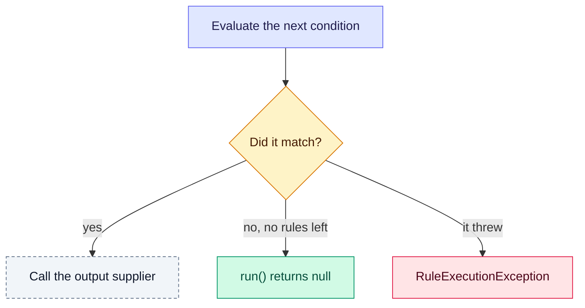

# 🎨 Docs style guide

The rules every page in this repository follows: its shape, emojis, callouts, diagrams, tables, examples and Javadoc.

**Who it's for:** contributors writing or reviewing documentation.
**You'll be able to:** start a new page from the template, choose the right callout, emoji and diagram, and check a
page before you open a pull request.
**Before you start:** nothing. [CONTRIBUTING.md](../CONTRIBUTING.md#-documentation) says where each kind of
documentation lives.

[← Documentation index](README.md)

- [Page template](#-page-template)
- [Writing](#-writing)
- [Emojis](#-emojis)
- [Callouts](#-callouts)
- [Diagrams](#-diagrams)
- [Tables](#-tables)
- [Examples](#-examples)
- [Links and the glossary](#-links-and-the-glossary)
- [Gotchas and questions you might not think to ask](#-gotchas-and-questions-you-might-not-think-to-ask)
- [Javadoc](#-javadoc)
- [Checklist](#-checklist)

---

## 📄 Page template

```markdown
# <emoji> <Title>

<One sentence: what this page covers.>

**Who it's for:** <rule authors | application developers | language authors | contributors>.
**You'll be able to:** <two or three outcomes>.
**Before you start:** <links to the pages to read first, or "nothing">.

[← Documentation index](README.md)

- [Section](#-section)   (every H2, in order)

---

## <emoji> <The common task, with a minimal example>

## <emoji> <The rules>

## 🚧 Gotchas

> [!NOTE]
> The rest of this page is for <audience>. You can stop here if <condition>.

## <emoji> <Advanced topic>

## ❓ Questions you might not think to ask

## 📋 Reference
```

- **The order is progressive:** overview, quick example, rules, gotchas, advanced topics, reference. A reader who
  stops at any H2 has still read something true and complete.
- **One back link**, to the documentation index. Pages under `languages/` link to the index too, not to two parents.
- **The TOC** lists every H2, in order, when a page has three or more.
- **Leave out a section the page has nothing for.** A reference page such as this one has no common task or gotchas.
- **Length:** a guide aims for at most about 1,500 words of prose and 8 H2s. Split a guide that grows past about
  2,500 words.
- **One owner per rule.** When two pages need the same rule, one page states it and the other links to it.
- **Before a major release,** a guide that describes the unreleased version says so in a NOTE under its H1, with a
  link to the same page at the last released tag. Remove the notes in a `docs:` PR merged just before the release
  PR, not in the release PR itself: release-please rewrites its branch.

## 📝 Writing

- One idea per paragraph. A paragraph or list longer than about 90 words gets split, or its items become H3s.
- Hard-wrap prose at 120 characters. Don't wrap table rows.
- The guides describe the engine, whatever the expression language. Start a statement that is only true of MVEL with
  "In MVEL, …", or put it in [languages/mvel.md](languages/mvel.md).
- Use one name for each idea, the one the [glossary](glossary.md) uses: **match policy** (not "engine type" or "hit
  policy"; "first-match engine" and "all-matches engine" are fine), **output supplier** (not "output factory"),
  **rule list**, **run**, **compiled copy**, **session**.
- Say what happens, not what "should" happen. When the engine doesn't guarantee something, say that.

## 😀 Emojis

- **Exactly one emoji on the H1 and on each H2, and none on an H3 or below.** Links to an H3 then never depend on an
  emoji: `### Limiting the copies` is `#limiting-the-copies`.
- **Never in prose or in code.** In a table, an emoji may start each cell of the first column, but only when every
  row has one. Status cells may use ✅ yes, ❌ no and ⚠️ sometimes.
- **No emoji inside mermaid labels.**
- **A heading's emoji is one that is colour by default.** Some glyphs, such as ⚠ ⏱ ⚙ ✍ 🗂 🛠, render as monochrome
  symbols unless U+FE0F follows them, and GitHub keeps that invisible character in the anchor: `## ⏱️ Stopping` is
  `#️-stopping`, not `#-stopping`. So headings use only the emojis in the table below, or others that need no U+FE0F,
  and a link to a heading never contains a hidden character. In tables and callouts, add U+FE0F after such a glyph.
- **Use a concept's emoji below, and don't reuse it for anything else.** For a concept that isn't listed, pick
  another emoji, and add a row here once two pages need it.

| Concept | Emoji | Concept | Emoji |
| --- | --- | --- | --- |
| Quick start, first use | 🚀 | Errors and exceptions | 🚨 |
| Installation, packaging, artifacts | 📦 | Stopping a run, timeouts | ⏳ |
| How it works, overview | 🧭 | Threads, concurrency | 🧵 |
| Rules | 📜 | Listeners | 👂 |
| Facts | 📁 | Logging | 🪵 |
| Output object | 📤 | Security | 🔒 |
| Match policy | 🔀 | Testing | 🧪 |
| Expression languages in general | 🧩 | Configuration, builder options | 🔧 |
| MVEL only | ⚡ | Reloading | 🔄 |
| Writing a language | 🔨 | Migration, upgrading | 🔼 |
| Compiled copies, sessions | 📑 | Handling failures | 🧯 |
| Closing, lifecycle | 🛑 | Auditing, checksums | 🔏 |
| Gotchas | 🚧 | Questions you might not think to ask, FAQ | ❓ |
| Examples | 📐 | Reference tables | 📋 |
| Glossary | 📖 | Troubleshooting | 🩺 |
| Production checklist | 🏭 | Contributing | 🤝 |
| Development setup | 💻 | Documentation, the guide index | 📚 |

## 💬 Callouts

| Type | Use it for | Example |
| --- | --- | --- |
| `> [!NOTE]` | Background a reader may skip | Why the logger name is fixed |
| `> [!TIP]` | A better way to do something that already works | Single quotes inside MVEL string literals |
| `> [!IMPORTANT]` | Something you must do, or it won't work | `run()` returns `null`, so check for it |
| `> [!WARNING]` | A trap that silently gives wrong results | An enum compared with a string is always `false` |
| `> [!CAUTION]` | A security exposure, data loss or a deadlock | Rules are code; the JDK 21-23 virtual-thread deadlock |

- **One idea, at most 4 lines.** The detail goes in the text after the callout.
- **At most one callout for each H2**, and never two in a row.
- **Never inside a list or a table.**
- A trap the page owns also gets a row in its [Gotchas](#-gotchas-and-questions-you-might-not-think-to-ask) table.

## 📊 Diagrams

GitHub renders [Mermaid](https://mermaid.js.org/) diagrams in Markdown, so draw diagrams in Mermaid rather than as
images.

- **Choose the type by purpose:** `sequenceDiagram` for the order of callbacks and calls, `flowchart` for decisions
  and failure paths, `stateDiagram-v2` for lifecycles. Use a table instead of a `classDiagram` unless the
  relationships are the point.
- **Keep it small:** at most 12 nodes or 12 messages, and at most 4 nodes in a row in a left-to-right flowchart, so it
  fits a phone screen. Split a bigger diagram.
- **Label every edge** in a flowchart, including "yes" and "no".
- **The text says the same thing.** A reader who can't see the diagram mustn't miss anything.
- **Colour is optional, and never the only signal.** When you use it, use only these classes. Each sets its text
  colour, so a node reads the same in GitHub's light and dark themes:

```text
classDef step     fill:#e0e7ff,stroke:#6366f1,color:#1e1b4b
classDef decision fill:#fef3c7,stroke:#d97706,color:#451a03
classDef ok       fill:#d1fae5,stroke:#059669,color:#064e3b
classDef fail     fill:#ffe4e6,stroke:#e11d48,color:#4c0519
classDef yours    fill:#f1f5f9,stroke:#64748b,color:#0f172a,stroke-dasharray:4 3
```

| Class | Means |
| --- | --- |
| `step` | Something the engine does |
| `decision` | A branch, drawn as a `{…}` node |
| `ok` | A normal outcome, including `run()` returning `null` |
| `fail` | An exception is thrown |
| `yours` | Code the application or a language supplies, such as the output supplier, a listener or a language. It's dashed, so it doesn't depend on colour |

For example, part of a first-match run:



- Don't style edges, edge labels or subgraph backgrounds: GitHub's theme sets them.
- Put what Mermaid can't draw in `docs/images/` as SVG. Give each SVG `role="img"`, a `<title>`, a `<desc>` and its own
  background, and give its `` an `alt` text. Don't use screenshots of code.

## 📋 Tables

- Use a table for reference data and for "if you need X, do Y" decisions. Explain in prose.
- At most 4 columns, and cells of at most about 150 characters. Put a longer explanation under the table.
- **Every column has a header.** The first column holds what the reader scans for.
- Repeat the key in each row instead of leaving a cell blank to mean "same as above".
- Centre only ✅/❌ columns.
- Common shapes: **Lookup** (`To | Write`), **Reference** (`Method | Exception | When`), **Decision**
  (`If you need | Use | See`), **Before and after** (`1.x | 2.0`), and **Gotchas** (below).

## 📐 Examples

- **Every fence has a language.** Use `text` for output, log lines and compiler messages.
- **Use the loan domain** (`LoanDecision`, `Applicant`, `prime-rate`, `standard-rate`), so examples connect across
  pages.
- **Examples compile and behave as described against the current API.** Say what they use that isn't shown, for
  example "`Applicant` is the record from the Quick start".
- Comments state results: `// approved = true, interestRate = 4.5`.
- Rules are usually Java string literals, so MVEL strings inside them use single quotes.
- Avoid fences indented inside list items. Put the fence after the list when you can.
- Don't change the version numbers in the README's install snippets. release-please updates everything between the
  `x-release-please-start-version` and `x-release-please-end` markers.

## 🔗 Links and the glossary

- Use relative links to pages and anchors, and check the anchors after renaming a heading. GitHub lowercases the
  heading, turns spaces into hyphens and drops emojis and most punctuation. A heading that starts with an emoji keeps
  the space after it as a leading hyphen: `## 🚀 Quick start` is `#-quick-start`.
- Link a term to the [glossary](glossary.md) the first time a page uses it, and at most once for each section.
- A glossary entry defines a term in a sentence or two and links to the page that owns it. It never holds a rule that
  isn't stated on that page.

## 🚧 Gotchas and questions you might not think to ask

**Gotchas** is a table on the page that owns the behaviour. Only behaviour that is **silent or surprising** belongs
in it; an exception with a clear message doesn't.

| Gotcha | What happens | Do this instead |
| --- | --- | --- |
| **A short name** | What the reader writes, and the surprising result | The fix |

**Questions you might not think to ask** comes near the end of a page, with one H3 for each question and a short
answer that links to the section that owns the rule. H3s, rather than collapsed `<details>` blocks, so each answer
can be linked and found with find-in-page.

```markdown
### Do the actions that already ran keep their changes when a later one throws?

Yes. An all-matches run isn't atomic. See [Choosing an engine](../README.md#choosing-an-engine).
```

- Cover ordering, defaults, failures, concurrency, `null` and missing values, and what changed from the last major
  version.
- Never make an answer the only statement of a rule. A question whose answer is a trap also gets a Gotchas row.

## ☕ Javadoc

- A class's Javadoc opens with one sentence saying what it's for. Then, only where they apply and in this order: who
  implements it, which threads call it, nullness beyond `@NullMarked`, and `@see` links.
- `@see` links point to the guide that owns the type's topic. The contract belongs in the Javadoc; the reasons and the
  worked cases belong in the guide.
- `@throws` lists every exception the method throws, in the words of the guide's
  [Exceptions by method](error-handling.md#-exceptions-by-method) table. That table owns the full list, and the
  Javadoc owns each method's part of it.
- Use `{@snippet :}` for examples.
- Javadoc in `unruly-engine-core` names MVEL only as an example, as in "a language such as MVEL".
- `./gradlew clean build` doesn't build the Javadoc. Run `./gradlew javadoc` after changing it, and fix any errors.

## ✅ Checklist

- [ ] The opening says who the page is for, what they'll be able to do, and what to read first.
- [ ] The TOC lists every H2. Each H2 has one emoji from the table above, and no H3 has one.
- [ ] No paragraph or list is longer than about 90 words, and no table cell is longer than about 150 characters.
- [ ] Each callout's type matches the callout table, and there's at most one for each H2.
- [ ] Each diagram has at most 12 nodes and labelled edges, uses only the palette classes, and the text says the same.
- [ ] Every fence has a language, and every example compiles.
- [ ] Links and anchors resolve, and glossary terms are linked on first use.
- [ ] Statements that are only true of MVEL say so.
