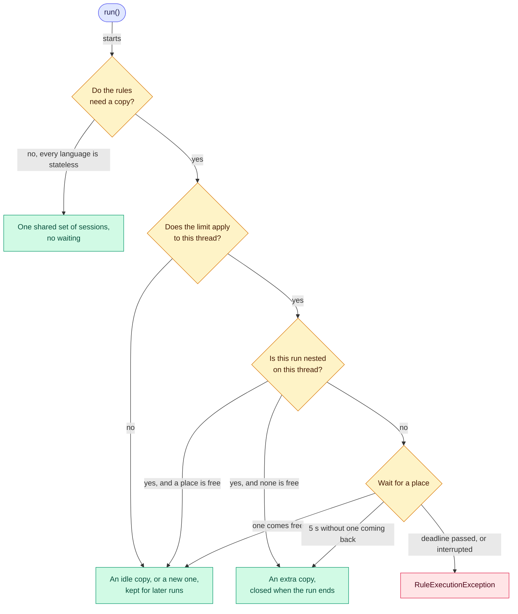

# 📑 Compiled copies

> [!NOTE]
> Describes 2.0.0, which isn't released yet.

Each run works on a compiled copy of the rules. This page says what a copy is, how many an engine keeps,
how to limit them, how to make them when the rules load, what a run waits for when they run out, and what changes on
virtual threads.

**Who it's for:** application developers sizing an engine for many concurrent runs, or tuning it for virtual
threads.
**You'll be able to:** estimate the memory the copies take, choose a copy limit for your workload, and tell
why a run waited.
**Before you start:** [Thread safety](thread-safety.md), which covers what an engine shares and how it reloads
and closes.

[← Documentation index](README.md)

- [How copies work](#-how-copies-work)
- [Limiting the copies](#-limiting-the-copies)
- [Virtual threads](#-virtual-threads)
- [Gotchas](#-gotchas)
- [Questions you might not think to ask](#-questions-you-might-not-think-to-ask)

---

## 🧭 How copies work

Every run shares the rules as `load()` compiled them. What an expression language changes while its expressions run
lives in a *[session](glossary.md#session)*, and a **compiled copy** of the rules is one session for each language the
rules use. Each `run()` borrows a copy that no other run is using, makes a new one if every copy is busy (as the first
run after `load()` does, unless the engine [makes copies at load](#making-copies-at-load)), and gives it back when it
finishes.

A rule list that needs no copy at all is never limited, once the engine knows. When every language of the list returns
`Session.none()`, nothing a copy holds changes while the rules run, so every run shares one set of sessions. The engine
learns this from the list's first copy, so straight after a reload from rules that did need copies, the first such run
may still wait, unless the engine [makes copies at load](#making-copies-at-load), when `load()` learns it. See
[Thread safety for language authors](languages/custom.md#-thread-safety) for what a language must do to qualify.

In MVEL, a session compiles each expression again the first time that copy runs it, and MVEL generates accessor
classes for that session alone. See [Compiled copies in MVEL](languages/mvel.md#-compiled-copies).

### Memory sizing

| Copies alive at one instant | How many |
| --- | --- |
| Runs the limit applies to | At most the limit, for the whole engine, across reloads |
| Runs the limit doesn't apply to | One for each such run at your busiest moment |
| [Extra copies](glossary.md#extra-copy) | At most one for each nested or stalled run in progress; a nested run that finds a place free takes a kept copy |
| A rule list [a reload replaced](thread-safety.md#-reloading-rules-while-running) | The copies its unfinished runs still hold, unlimited ones only |
| [Copies made at load](#making-copies-at-load) | `n` idle copies from each `load()` until the next one, even above the default limit, which bounds only the copies runs hold; during a reload, the new rules' `n` and the old rules' kept copies, until the swap |

Count each engine separately: an engine's limit is its own. By default the limit applies only to runs on virtual
threads, so a platform thread pool of `N` threads can keep up to `N` copies. Don't add the last row to the first: a
draining list's *limited* runs hold permits from the same limit, so they're already in it.

**Kept copies never shrink.** The engine keeps as many as the most runs that held one at once, up to the limit, or as
many as it [made at load](#making-copies-at-load) if that is more, until the next `load()` or `close()`. Memory
doesn't come back after a traffic spike; a periodic reload releases it, at the cost of rebuilding copies on the next
runs.

## 🔧 Limiting the copies

A copy isn't free: in MVEL each expression is compiled again the first time that copy runs it, and the copy generates
accessor classes of its own. A thread pool bounds the number of copies, because runs can't overlap more than its
threads. Virtual threads don't bound
anything: when each request runs on its own virtual thread, thousands of runs overlap, and the engine makes and keeps a
copy for each.

So an engine limits **runs on virtual threads** to one copy for every two processors, and at least one. The number of
processors is read once, by `build()`, so an engine's limit doesn't change while it runs. Runs on platform threads
aren't limited: the pool they come from already bounds how many copies exist. Set your own limit, or turn the default
off:

```java
// A limit on runs from every kind of thread, virtual and platform
RulesEngine<LoanDecision> engine = RulesEngineBuilder.firstMatch(LoanDecision::new).maxCopies(64).build();

// As many copies as the runs in progress need, on any thread, which is what 1.x did
RulesEngine<LoanDecision> unlimited = RulesEngineBuilder.firstMatch(LoanDecision::new).unlimitedCopies().build();
```

| Your runs are on | Your rules mostly | Build it with |
| --- | --- | --- |
| A platform thread pool | Anything | The default: the pool size already bounds the copies |
| Virtual threads | Compute | The default |
| Virtual threads | Wait on a database, a service or a file | `unlimitedCopies()`, or `maxCopies(n)` sized for the waiting runs you want at once |
| Virtual threads, MVEL rules, JDK 21 to 23 | Anything | See [Virtual threads](#-virtual-threads) before you raise the limit |
| Anything, with memory to protect | Anything | `maxCopies(n)`, which bounds platform-thread runs too |

The limit belongs to the **engine**, not to one rule list: while `load()` swaps in a new list (see
[Reloading rules while running](thread-safety.md#-reloading-rules-while-running)), runs still using the old list
count against the same limit as runs on the new one, so a reload never raises it. Right after a reload, a run on
the new rules may wait for runs on the old rules to finish, when together they already hold every copy. Several
engines each have a limit of their own, so their limits add up.

`maxCopies(n)` therefore bounds the runs that make progress, not the copies that can exist at one instant: nested and
stalled runs take an extra copy on top (below), and the list a reload replaced keeps the copies its runs still hold.

### Making copies at load

By default no copy exists until a run needs one, so the first runs after each `load()` make them. With
`copiesAtLoad(n)`, which is off by default, `load()` makes `n` copies itself and runs borrow them ready:

```java
// 8 is the default limit on virtual threads with 16 processors: runs there use no more copies than that at once
RulesEngine<LoanDecision> engine = RulesEngineBuilder.firstMatch(LoanDecision::new).copiesAtLoad(8).build();
```

`load()` makes the copies one after another, on its own thread, after every rule has compiled and before it swaps the
new rules in, so runs go on using the rules it replaces meanwhile. For each copy, it creates a session in every
language that keeps state between runs and warms it up. MVEL's warm-up compiles every condition and action into the
session, not only the ones a run reaches.

What it costs:

- **A slower `load()`.** In the measurement under [Virtual threads](#-virtual-threads), 16 copies of 21 MVEL rules
  added about 65 ms to a reload that otherwise took 15 ms, and about 80 ms to the first load in a new JVM.
- **Memory from the start.** The copies exist from `load()` until the next `load()` or `close()`, whether runs use
  them or not. During a reload, the old rules' copies and the new ones exist together until the swap.

What it doesn't change:

- **The limit.** A limited run still waits for a place; it just finds a copy ready. `build()` throws
  `IllegalArgumentException` when `n` is more than `maxCopies(...)`. The default limit and `unlimitedCopies()` accept
  any `n`. Any run can borrow any idle copy, but with the default limit no more runs on virtual threads than the limit
  hold one at the same time, so the copies above it are used only while runs on platform threads hold copies too.
- **Copies made during a run.** A copy a run makes because none is idle, and the extra copy of a nested or stalled
  run, are made as before, and not warmed up.
- **Rules that need no copy.** When every language returns `Session.none()`, `load()` makes the one shared set of
  sessions for any `n` above zero, and no more. `validate()` makes no copies.

A language that fails to create or warm up a session for a copy fails `load()` with a `RuleCompilationException` that
names the language, and the rules loaded before stay loaded; see
[Exceptions by method](error-handling.md#-exceptions-by-method).

### What a run waits for



While a run waits:

- A run that starts while every copy is in use waits until one is free, so at most that many runs make progress at
  once. On a virtual thread, a waiting run doesn't hold a platform thread.
- **Waiting isn't first-come-first-served**, and without a deadline it has no upper bound: as long as copies keep
  coming back, a run keeps waiting. Give runs a [timeout](stopping-runs.md#-quick-start) if latency matters.
- Listeners don't see a wait that ends with a copy: the run borrows it before `beforeRun`, so a listener's timings
  don't include the wait. Measure around `run()` instead.

When the wait is stopped:

- If the thread is interrupted while its run waits, `run()` throws a `RuleExecutionException` caused by the
  `InterruptedException`, and the thread's interrupt status stays set. A run whose thread was **already** interrupted
  doesn't wait: it takes a free copy and then stops at its first rule, exactly as it does without a limit. When no copy
  is free, `run()` fails at once, with the same exception.
- If the run's deadline passes while it waits, `run()` throws a `RuleExecutionException` caused by a
  `TimeoutException`. Waiting counts towards the timeout.

When the wait itself is stopped, by the deadline or by an interrupt with no copy free, the listeners still hear of
it: the run calls `beforeRun` and then `onRunError`, although it never held a copy and ran no rule. See
[What listeners see](stopping-runs.md#-what-listeners-see).

### Runs that don't wait

> [!WARNING]
> A run whose deadline is less than five seconds away never gives up waiting for an extra copy: it waits until its
> deadline and then fails with a `TimeoutException` cause, saying every copy was in use. A run started on a thread
> that already holds a copy never waits, deadline or not: it takes a free copy, or an extra one.

Two kinds of run never wait for a copy, so a limit can't deadlock an engine.

**A run started on a thread that is already holding a copy**, from an action or a listener of the run that holds it.
The copy it would wait for may be that one. This covers a run on any engine and any rule list, including rules a
`load()` has since replaced.

A run that stopped while waiting for a copy holds none, so a run started from its callbacks isn't covered by this
rule, but it doesn't wait either: it inherits that run's passed deadline, or sees the same interrupt, so it takes a
free copy or fails at once.

**A run that has waited five seconds without one single copy being given back.** That's what waiting for a run of
this engine on *another* thread looks like: a fan-out from an action, `executor.submit(engine::run).get()`, or two
engines whose actions run each other. A rule slower than the wait does it too, because a copy it holds comes back
only when it finishes.

An engine that is merely busy keeps giving copies back, so such a run keeps waiting and the limit holds: any copy
coming back restarts the five-second window. Giving up is logged at WARN once for each rule list, naming
`unlimitedCopies()`.

A stalled run, and a nested run that finds no place free, get an extra copy that isn't kept: its sessions are closed
when the run gives it back. So a limit bounds the runs that can make progress, rather than the copies that can exist
at one instant.

## 🧵 Virtual threads

> [!CAUTION]
> On JDK 21 to 23, a virtual thread waiting on a monitor keeps the platform thread carrying it. A language whose
> expressions contend on a lock shared by the whole JVM can then hold every carrier and deadlock. MVEL is one: read
> [MVEL on virtual threads](languages/mvel.md#-virtual-threads) before you raise the limit.

With more than one processor, the default is **below the number of processors**, which is how many platform threads
carry virtual threads unless the scheduler is configured otherwise. That makes a deadlock less likely without ruling
it out: the limit is per engine, so several engines' limits add up, a run that gives up waiting takes an extra copy,
and `-Djdk.virtualThreadScheduler.parallelism` can leave fewer carriers than the limit. Nothing changes for a Tomcat,
Jetty or executor pool: the default doesn't apply to runs on platform threads.

The default is **sized for rules that compute**. A rule that waits — on a database, a service, a file — holds its copy
while it waits, so a limit of `N` caps how many such runs make progress at once, however many virtual threads you
start. Build those engines with `unlimitedCopies()`, or with a `maxCopies(...)` sized for how many waiting runs you
want at once.

**Known issue on JDK 24 and later.** A virtual thread still keeps its carrier while the JVM loads a class. MVEL loads
classes while it compiles, and generates accessor classes during a copy's first runs, so a run that makes a new
compiled copy can pin its carrier for as long as that takes. Since
[#387](https://github.com/brantunger/unruly-engine/pull/387), MVEL's class lookups no longer wait on each other, which
shortens the waiting without removing the pinning.

[`copiesAtLoad(n)`](#making-copies-at-load) moves that compiling, and the classes it loads, into `load()` for the
copies it makes. It doesn't move the accessor classes, which MVEL still generates during each copy's first runs, or
the compiling of a copy a run makes itself.
[#421](https://github.com/brantunger/unruly-engine/issues/421) tracks `unlimitedCopies()` with MVEL on JDK 24 and
later, which `copiesAtLoad(n)` can't help.

Measured on JDK 26.0.1 with 32 cores, 100,000 virtual threads sharing 2,000,000 runs of 21 MVEL rules, and
`copiesAtLoad(16)`, the default limit there, against copies made by runs: pinned events fell by about a third, from
1,214–1,316 to 775–842 over three runs, a one-time cost either way. Throughput didn't change, at about
690,000–745,000 runs a second. On JDK 21 there were no pins either way.

## 🚧 Gotchas

| Gotcha | What happens | Do this instead |
| --- | --- | --- |
| **`maxCopies(n)` isn't a cap on copies** | A stalled run, or a nested run that finds no place free, takes an extra copy, and runs the limit doesn't apply to keep copies of their own | Size memory with [Memory sizing](#memory-sizing) |
| **Kept copies never shrink** | The memory a traffic spike took stays until the next `load()` or `close()` | Reload periodically, if that memory matters |
| **`copiesAtLoad(n)` above the default limit** | `build()` accepts it, but runs on virtual threads never borrow more than the limit of them at once, so the rest sit idle unless runs on platform threads use them | Make `n` no more than the limit, or add `maxCopies(n)` with the same `n`, so the limit applies to every thread |
| **A deadline under five seconds never takes an extra copy** | A fan-out that would need one waits until its deadline and fails with a `TimeoutException` cause | Give engines that run each other `unlimitedCopies()` |
| **A reused interrupted thread** | The next run on that thread stops at its first rule, or fails at once when it would have waited | Call `Thread.interrupted()` before reusing the thread |

## ❓ Questions you might not think to ask

### Does `maxCopies(4)` mean at most four copies exist?

No. It bounds the runs making progress. A stalled run, or a nested run that finds no place free, takes an extra copy;
runs the limit doesn't apply to keep copies of their own, also on a rule list a reload replaced; and every other
engine has its own limit. See [Memory sizing](#memory-sizing).

### Does memory shrink after a traffic spike?

No. Kept copies stay until the next `load()` or `close()`. A periodic reload releases them, and the next runs pay to
build new ones.

### Should I make the copies at load?

Only if the first runs after each `load()` matter more to you than the time `load()` takes. Its main use is MVEL rules
run on virtual threads on JDK 24 and later, where it cut the carrier pinning of those first runs by about a third
in one benchmark, without changing throughput. See [Making copies at load](#making-copies-at-load).

### Does waiting for a copy show up in my listener timings?

Not when the run gets a copy: the wait happens before `beforeRun`, so measure around `run()`. A wait that ends in a
stop calls `beforeRun` and then `onRunError`, with a run that never held a copy. See
[What a run waits for](#what-a-run-waits-for).

### My thread was interrupted earlier and I reuse it: why does every run fail?

The engine leaves the interrupt status set, so the next run on that thread stops at its first rule, or fails at once if
it would have waited for a copy. Call `Thread.interrupted()` before reusing the thread.
