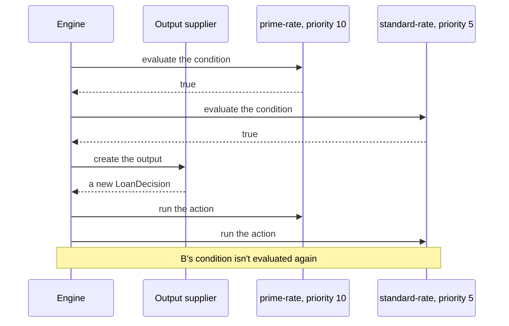
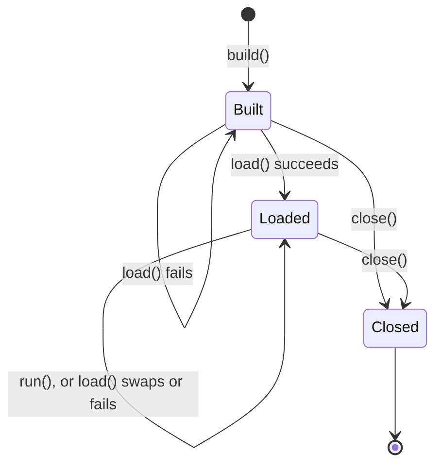

# 🔀 Engines and runs

The order rules run in, what a first-match, an all-matches and a unique-match engine do, when the output object is
created, and what a run and an engine report about the rules they used.

**Who it's for:** application developers who build engines, run rules and record decisions.
**You'll be able to:** predict which rules fire and in what order, write an output supplier that works, read a
`RunResult`, and tie a decision to the rules that made it.
**Before you start:** the [Quick start](../README.md#-quick-start). [Writing rules](writing-rules.md) covers what goes
in a rule.

[← Documentation index](README.md)

- [At a glance](#-at-a-glance)
- [Rule order](#-rule-order)
- [Choosing which rules a run uses](#-choosing-which-rules-a-run-uses)
- [First match or all matches](#-first-match-or-all-matches)
- [The output object](#-the-output-object)
- [What a run reports](#-what-a-run-reports)
- [Gotchas](#-gotchas)
- [Auditing a decision](#-auditing-a-decision)
- [Reloading rules](#-reloading-rules)
- [Questions you might not think to ask](#-questions-you-might-not-think-to-ask)

---

## 🧭 At a glance

`LoanDecision`, `Applicant` and the two rules, here `rules`, are from the [Quick start](../README.md#-quick-start).

```java
// At startup: build one engine, load its rules, and share it between threads.
RulesEngine<LoanDecision> engine = RulesEngineBuilder.firstMatch(LoanDecision::new).build();
engine.load(rules);

// For each decision:
FactStore<Object> facts = new FactMap<>();
facts.setValue("applicant", new Applicant("Ada", 780));
RunResult<LoanDecision> result = engine.runWithResult(facts);
LoanDecision decision = result.output();        // interestRate = 4.5, notes = [prime]
List<Rule> fired = result.firedRules();         // the prime-rate rule
List<RuleEvaluation> why = result.evaluations(); // prime-rate=MATCHED, standard-rate=NOT_EVALUATED
String checksum = result.ruleSetChecksum();     // identifies the rules this run used

// At shutdown:
engine.close();
```

- A [run](glossary.md#run) evaluates the rules in [evaluation order](glossary.md#evaluation-order): highest priority
  first.
- A run uses every loaded rule except the ones it [skips](#-choosing-which-rules-a-run-uses): disabled rules, rules
  outside their validity window, and, when the run is given tags, rules that carry none of them.
- A **first-match** engine stops at the first rule whose condition is true, and fires only that rule. An
  **all-matches** engine evaluates every condition, then fires every match in order. A **unique-match** engine
  evaluates every condition, fires the one match, and fails the run when there are more.
- The [output supplier](glossary.md#output-supplier) is called once in a run, after a rule has matched. `run()`
  returns `null` exactly when no rule fired.
- A condition or action that fails fails the run: it throws, and returns no result. See
  [What happens on each failure](error-handling.md#-what-happens-on-each-failure).
- Calling `load()` again swaps in new rules at once, and a run finishes with the rules it started with.

## 📜 Rule order

`load()` sorts the rule list into evaluation order once, and every run of the engine uses that order, on every thread
and with every match policy:

- A higher `priority` comes first.
- Equal priorities keep their order from the list passed to `load()`.
- A `null` priority comes after every number, even a negative one such as `-1000`. Rules without a priority keep their
  list order too.

| Rule list passed to `load()` (name: priority) | Evaluation order |
| --- | --- |
| `a: 5`, `b: null`, `c: 5`, `d: -1000` | `a`, `c`, `d`, `b` |

The order of the list only matters between rules with equal priorities, or with none. That's also the only time it
changes the [checksum](#-auditing-a-decision).

> [!TIP]
> `engine.rules().rules()` returns the loaded rules in evaluation order, so a test can assert the order the engine
> uses.

## 🔖 Choosing which rules a run uses

A run uses every loaded rule, except the ones it **skips**. A rule's `enabled`, its validity window and its tags, and
the tags a run is given, decide which:

```java
// primeRate and standardRate are the Quick start's rules, and facts holds Ada, score 780, from At a glance.
// Instant and Set are from java.time and java.util.
Rule summerRate = Rule.builder()
        .ruleName("summer-rate")
        .priority(20)
        .condition("applicant.creditScore >= 700")
        .action("output.approved = true; output.interestRate = 3.9; output.notes.add('summer')")
        .validFrom(Instant.parse("2027-06-01T00:00:00Z"))   // used from this instant
        .validTo(Instant.parse("2027-09-01T00:00:00Z"))     // until, but not at, this one
        .tags(Set.of("eu"))
        .build();
RulesEngine<LoanDecision> engine = RulesEngineBuilder.firstMatch(LoanDecision::new).build();
engine.load(List.of(summerRate, primeRate, standardRate));

engine.runWithResult(facts).evaluations();
// July 2027:    summer-rate=MATCHED, prime-rate=NOT_EVALUATED, standard-rate=NOT_EVALUATED
// October 2027: summer-rate=SKIPPED, prime-rate=MATCHED, standard-rate=NOT_EVALUATED
engine.runWithResult(facts, RunOptions.defaults().withTags(Set.of("eu"))).evaluations();
// July 2027:    summer-rate=MATCHED, prime-rate=SKIPPED, standard-rate=SKIPPED (they have no tags)
```

| A run skips a rule when | Set with |
| --- | --- |
| The rule is disabled | `enabled(false)` on the rule's builder; rules are enabled by default |
| The run starts before the rule's `validFrom`, or at or after its `validTo` | `validFrom(Instant)` and `validTo(Instant)` on the rule's builder; `null`, the default, means no start or no end |
| The run was given tags, and the rule carries none of them | `tags(...)` on the rule's builder, and `RunOptions.defaults().withTags(...)` for the run |

A skipped rule is treated the same whichever reason applies:

- Its condition isn't evaluated and its action doesn't run.
- No listener hears about it: no `beforeEvaluate`, `afterEvaluate`, `beforeExecute`, `afterExecute` or `onError`.
  It has no Flight Recorder rule event, and the run event's `rulesEvaluated` doesn't count it.
- `evaluations()` still lists it, as `SKIPPED`, wherever it is in the order. On a first-match engine that includes
  below the match; a rule there that the run doesn't skip is still `NOT_EVALUATED`.
- It can't be the second match that fails a unique-match run.
- It stays loaded: `load()` and `validate()` compile it, so its errors still fail `load()`, and `rules().rules()`
  lists it. A rule whose window opens later needs no reload.

### The validity window and the engine's clock

A run reads the engine's clock **once**, when `run()` is called, before it waits for a
[compiled copy](glossary.md#compiled-copy), and judges every rule's window at that instant, however long the run
takes. A [nested run](glossary.md#nested-run) reads the clock again. The window includes `validFrom` and excludes
`validTo`, and `build()` rejects a `validTo` that isn't after `validFrom`.

The clock is `Clock.systemUTC()` unless the builder's `clock(Clock)` sets another. A test can run the rules as they
will be on a date with `.clock(Clock.fixed(Instant.parse("2027-07-01T00:00:00Z"), ZoneOffset.UTC))`. Only windows
use this clock: a [run timeout](stopping-runs.md) is measured by the system clock, whatever `clock(...)` is set to.

`RunContext.startedAt()` and `RunResult.startedAt()` return the instant the run judged the windows at. It comes from
the engine's clock, so a fixed clock gives every run the same instant. Don't compare it with `rules().loadedAt()` or
with the run's deadline: those use the system clock.

### Tags

A rule's tags are names that group it, such as a market or a product; a rule has none by default. A run given tags
with `RunOptions.defaults().withTags(Set.of("eu", "retail"))` uses only the rules that carry at least one of them. A
run without tags uses rules whatever their tags. Tags are compared exactly, case included, so `EU` doesn't select `eu`.

`withTags(...)` needs at least one tag: to use every rule, don't call it. `withTags(...)` keeps the options' timeout,
and `withTimeout(...)` keeps their tags. `RunOptions.tags()` returns them, empty when the run uses every rule, and
`RunContext.tags()` and `RunResult.tags()` return the same tags for the run they describe.

> [!WARNING]
> A run given tags skips every rule that has no tags, including a default meant to apply everywhere, such as a
> lowest-priority rule whose condition is `true`. Give such a rule every tag your runs are given.

## 🔀 First match or all matches

The [match policy](glossary.md#match-policy) is chosen when the engine is built, and can't change. There are three:
first match, all matches, and [unique match](#unique-match-one-rule-or-none), for a decision table whose rows must
not overlap.

| Compared | First match | All matches | Unique match |
| --- | --- | --- | --- |
| **Create with** | `RulesEngineBuilder.firstMatch(...)` | `RulesEngineBuilder.allMatches(...)` | `RulesEngineBuilder.uniqueMatch(...)` |
| **Conditions evaluated** | In order, until one is true. The rules below it aren't evaluated | All of them, before any action runs | All of them, before any action runs |
| **Actions fired** | Only the first match | Every match, in evaluation order | The one match; more than one fails the run |
| **`firedRules()`** | At most one rule | Every match, in firing order | At most one rule |
| **`evaluations()`** | `MATCHED` or `NOT_MATCHED` down to the match, then `NOT_EVALUATED`; `SKIPPED` for a skipped rule anywhere | `MATCHED` or `NOT_MATCHED` for every rule, or `SKIPPED` | `MATCHED` or `NOT_MATCHED` for every rule, or `SKIPPED` |
| **Output** | Shaped by exactly one rule | Shared by every matched action, so a later action can overwrite an earlier one's change | Shaped by exactly one rule |
| **A condition fails** | The run fails. A broken rule below the first match isn't evaluated, so it can't fail the run | The run fails before any action runs and before the output is created | The same as all matches |
| **An action fails** | The run fails | The run fails, and the actions that already ran keep their changes | The run fails |
| **`RunContext.matchPolicy()`** | `"firstMatch"` | `"allMatches"` | `"uniqueMatch"` |
| **Good for** | Decision tables and "first match wins" logic | Scoring, tagging, and collecting every violation | Decision tables whose rows must not overlap |
| **Quick start, score 780** | `4.5`, `[prime]` | `6.9`, `[prime, standard]` | Fails: both rules match |

The table describes the rules a run uses. On every policy, a rule the run
[skips](#-choosing-which-rules-a-run-uses) isn't evaluated, doesn't fire and doesn't count as a match.

| If you need | Use |
| --- | --- |
| One answer, from the highest-priority rule that applies | `firstMatch(...)` |
| Every rule that applies to add to the output | `allMatches(...)` |
| A default when no other rule applies | `firstMatch(...)`, with a lowest-priority rule whose condition is `true` |
| To know every rule that matched | `allMatches(...)`, then `RunResult.firedRules()` |
| To know why a rule didn't apply | `RunResult.evaluations()`; see [What a run reports](#-what-a-run-reports) |
| To be told when two rules apply to the same facts | `uniqueMatch(...)` |

No policy chains rules: a run is one pass over the rules. An all-matches run **matches first, then fires**. It
evaluates every condition, calls the output supplier once, then runs each matched action in order. An action never
causes a condition to be evaluated again: if a higher-priority action changes a fact, a rule that already matched still
fires, and its action sees the changed fact.



> [!WARNING]
> An all-matches run isn't atomic. If an action throws, the actions that already ran keep their changes to the output
> object and to any facts they changed, and the run throws a `RuleExecutionException` naming the failing rule. A
> failing condition changes nothing, because no action has run yet.

### Unique match: one rule or none

In a decision table, two rows that match the same input usually mean a mistake in the table, and a first-match engine
hides it by picking the higher priority. A unique-match engine evaluates every condition, like an all-matches engine,
and then:

- **No match:** returns `null` and fires nothing.
- **One match:** creates the output and fires that rule.
- **More than one match:** fires nothing, never calls the output supplier, and throws a `RuleExecutionException`
  naming every matched rule in evaluation order:
  `2 rules matched, but a unique-match engine allows one: 'prime-rate', 'standard-rate'`. The list of names is cut
  at 1,000 characters, like text copied from an exception.

The failure belongs to no rule, so `getRuleName()` is `null`. Listeners get `afterEvaluate` for every rule and then
`onRunError`, and no `onError`. It's logged at ERROR.

```java
RulesEngine<LoanDecision> engine = RulesEngineBuilder.uniqueMatch(LoanDecision::new).build();
engine.load(rules);                       // the Quick start's prime-rate and standard-rate
engine.run(facts);                        // score 780 matches both: throws RuleExecutionException
```

The check counts conditions that were true, whatever language the rules are written in. It finds an overlap only for
the facts of that run: to check a table for every input, run it against the inputs you care about in a test.

What each failure throws, logs and tells listeners is in
[What happens on each failure](error-handling.md#-what-happens-on-each-failure). A timeout or an interrupt stops a run
instead of failing a rule; see [Stopping a run](stopping-runs.md).

## 📤 The output object

The [output object](glossary.md#output-object) is what a run's actions change, and what `run()` returns. The output
supplier, the `Supplier` you give `firstMatch(...)`, `allMatches(...)` or `uniqueMatch(...)`, creates it.

| In a run where | The supplier is called |
| --- | --- |
| A first-match engine finds a true condition | Once, after that condition and before its action |
| An all-matches engine finds at least one true condition | Once, after every condition and before the first action |
| A unique-match engine finds exactly one true condition | Once, after every condition and before the action |
| A unique-match engine finds more than one true condition | Never, and the run throws |
| No condition is true, the rule list is empty, or the run skips every rule | Never, and `run()` returns `null` |
| A condition fails, or the run is stopped before a rule matches | Never, and the run throws |

- **It must return a new object on every call.** The engine doesn't copy what it returns. A supplier that returns one
  shared object gives every run that object, so results pile up (`notes = [prime, prime]` after two runs), and runs on
  different threads change it at once.
- **It must not return `null` or throw.** Either fails the run with a `RuleExecutionException` that names no rule.
- `outputType(...)` on the builder only tells languages the output's type. The engine never checks the output against
  it.

> [!WARNING]
> `firstMatch(() -> decision)`, with one `decision` object, compiles and passes a test that runs once. In production
> every run adds to the same object. Write `firstMatch(LoanDecision::new)`.

### How actions change it

An action changes the output in one of two ways, depending on its language:

- **In place.** The action changes the object itself and returns `ActionResult.done()`. MVEL actions work this way
  (`output.approved = true`), so the output type must be mutable.
- **By returning properties.** A language whose expressions have no side effects returns
  `ActionResult.set(properties)`. The engine sets each property **after the action returns**, in the map's order, with
  the engine's `OutputWriter`. If the run is stopped when that action returns, none of them are set.

The default writer, `OutputWriter.beansAndMaps()`, calls `put` on a `Map` output, and otherwise the output's public
setter whose parameter accepts the value, such as `setInterestRate` for `interestRate`. It converts nothing: a `Double`
reaches a `double` setter, but an `Integer` doesn't, and `null` doesn't reach a primitive. A property it can't set,
including through a setter the engine can't reach, fails the rule with a `RuleExecutionException` that names the rule
and the property. Give the engine a writer of your own with `outputWriter(...)` on the builder.

## 📊 What a run reports

| Call | Returns | Use it when |
| --- | --- | --- |
| `run(facts)` | The output object, or `null` | You only need the decision |
| `runWithResult(facts)` | A `RunResult` | You also record which rules fired, and which rules the run used |
| `runWithResult(facts, options)` | A `RunResult` | One run needs its own timeout ([Stopping a run](stopping-runs.md)) or only the rules with given [tags](#tags) |

`run(facts)` is `runWithResult(facts).output()`: the same run, with the same checks, listener callbacks and exceptions.
A [run result](glossary.md#run-result) holds:

- `output()`: the output object, or `null` exactly when no rule fired.
- `firedRules()`: the rules whose actions ran, in firing order. It's unmodifiable, and has at most one rule on a
  first-match or unique-match engine.
- `evaluations()`: one [rule evaluation](glossary.md#rule-evaluation) for every loaded rule, in evaluation order,
  each with the rule and its outcome: `MATCHED`, `NOT_MATCHED`, `NOT_EVALUATED` for a rule after the match on a
  first-match engine, or `SKIPPED` for a rule the run [skipped](#-choosing-which-rules-a-run-uses). It's
  unmodifiable, and empty when the rule list is.
- `ruleSetChecksum()`: the checksum of the rules this run used.

It also says what chose the rules the run used:

- `tags()`: the tags the run was given, `RunOptions.tags()`, in `String` order. It's unmodifiable, never `null`, and
  empty when the run used every rule.
- `startedAt()`: the instant the run judged every rule's [validity window](#the-validity-window-and-the-engines-clock)
  at, from the engine's clock.

The engine fills in both on every result it returns. A `RulesEngine` of your own, such as a test double, that builds
its result with `RunResult.of(...)` returns empty `tags()` and a `null` `startedAt()`, just as the short `of(...)`
form has empty `evaluations()`. `withRun(run)` returns a copy of a result that carries a `RunContext`'s tags and
instant.

A run that fails throws, so there's never a partial result, and no evaluation is reported for a rule that failed.

The evaluations answer "why didn't rule X apply?" without a listener:

```java
RunResult<LoanDecision> result = engine.runWithResult(facts);
for (RuleEvaluation evaluation : result.evaluations()) {
    System.out.println(evaluation.rule().getRuleName() + ": " + evaluation.outcome());
}
// prime-rate: MATCHED
// standard-rate: NOT_EVALUATED
```

On a first-match engine, `NOT_EVALUATED` says only that the rule came after the match. To know whether it would have
matched, use an all-matches or a unique-match engine, which evaluate every condition. `SKIPPED` says the run didn't
use the rule, but not which of the three reasons applied. The result holds what decided it: compare the rule's
`isEnabled()`, its `getValidFrom()` and `getValidTo()` with `result.startedAt()`, and its `getTags()` with
`result.tags()`.

Since 2.2.0, an evaluation also has `detail()`: what the rule's expression language says about why the condition
came out as it did, or `null`. Its type and content are the language's own. It's `null` when the language gives none,
and for a `NOT_EVALUATED` or `SKIPPED` rule, whose condition never ran. In MVEL, the only language the engine ships,
it's always `null`.

The engine records a detail whenever the language gives one with a `Boolean` value; there's nothing to turn on. It
isn't part of `equals()` or `hashCode()`, which compare the rule and the outcome, and a listener's `afterEvaluate`
doesn't receive it. A `RulesEngine` of your own creates an evaluation with a detail with
`RuleEvaluation.of(rule, outcome, detail)`. A language author returns it as
[Writing an expression language](languages/custom.md#explaining-a-conditions-result) describes.

> [!IMPORTANT]
> `run()` returns `null` when no rule fired: no condition was true, or the rule list is empty. A rule that fired always
> gives a non-`null` output, even when its action changed nothing, so check for `null` before you read the output.

The engine keeps the `Rule` objects you pass to `load()`. `rules().rules()`, `firedRules()`, `evaluations()` and
listener callbacks all give you those same instances, so you can compare them with `==` or use them as keys in a map.

### The loaded rules

`engine.rules()` returns a `RuleSetInfo`, which describes the [loaded rules](glossary.md#loaded-rules):

| Engine state | `rules()` | `checksum()` | `loadedAt()` |
| --- | --- | --- | --- |
| Before the first `load()` | Empty | The checksum of no rules, `e3b0c442…b855` | `null` |
| After `load(List.of())` | Empty | The checksum of no rules, `e3b0c442…b855` | When they loaded |
| After `load(rules)` | The rules, in evaluation order | Their checksum | When they loaded |

Before the first `load()`, `run()` throws `IllegalStateException` (`load() must be called before run()`). After an empty
`load()`, every run returns `null`, and still checks the facts' names. On a closed engine, `rules()` throws
`IllegalStateException`.

## 🚧 Gotchas

| Gotcha | What happens | Do this instead |
| --- | --- | --- |
| **A shared output object** | `firstMatch(() -> decision)` gives every run the same object, so results from earlier runs pile up | Return a new object: `firstMatch(LoanDecision::new)` |
| **`null` from `run()`** | No rule fired, and code that reads the output throws `NullPointerException` | Check for `null`, or add a lowest-priority rule whose condition is `true` |
| **A `null` priority** | The rule comes after every number, even `-1000` | Give every rule a priority, and assert the order with `rules().rules()` |
| **Rules below a first match** | They aren't evaluated, so they're neither matched nor unmatched: `evaluations()` reports them as `NOT_EVALUATED`, or `SKIPPED` if the run skips them, and listeners hear nothing about them | Use `allMatches(...)` or `uniqueMatch(...)` to evaluate every rule |
| **A run given tags, and rules without any** | The run skips every rule with no tags, including a catch-all default | Give such a rule every tag your runs are given |
| **Tags that differ only in case** | `withTags(Set.of("EU"))` skips a rule tagged `eu` | Use one spelling for each tag |
| **Two rows of a decision table overlap** | A first-match engine fires the higher priority and hides the overlap | Use `uniqueMatch(...)`, which fails the run and names both rules |
| **An action changes a fact in an all-matches run** | Rules that already matched still fire; conditions aren't evaluated again | Decide in conditions, from the facts as the run was given them |
| **An action fails in an all-matches run** | The actions before it keep their changes | Discard the output and any facts the actions changed |
| **The same checksum on every match policy** | Engines with the same rules report the same checksum, whatever their policy | Record `RunContext.matchPolicy()` too; see [Auditing a decision](#-auditing-a-decision) |
| **`rules().checksum()` read after a run** | A reload in between gives the new rules' checksum | Record `RunResult.ruleSetChecksum()` |
| **A changed description** | The checksum stays the same, but the two `Rule` objects aren't `equals` | Compare checksums to tell whether the rules changed what they do |

> [!NOTE]
> The rest of this page is for applications that record decisions or reload rules. You can stop here if you load your
> rules once, at startup.

## 🔏 Auditing a decision

To tie a decision to the rules that made it, record these with it:

- **`RunResult.ruleSetChecksum()`**: which rules the run used. Don't read `engine.rules().checksum()` afterwards: a
  reload in between changes it, while the run finished with the rules it started with.
- **The match policy**: `RunContext.matchPolicy()`, which is `"firstMatch"`, `"allMatches"` or `"uniqueMatch"`.
- **`RunResult.firedRules()`**: which rules fired, in order.
- **`RunResult.evaluations()`**, when the audit must also say why the other rules didn't apply. It marks the rules
  the run skipped, but not why.
- **`tags()` and `startedAt()`**, on `RunContext` or `RunResult`: what explains a `SKIPPED` rule. Runs with the same
  checksum can use different rules when their tags or start differ.

A listener's `afterRun` receives all of them, after every run that succeeds:

```java
// auditLog is your own code.
RuleListener audit = new RuleListener() {
    @Override
    public void afterRun(RunContext run, RunResult<?> result) {
        auditLog.record(run.matchPolicy(), result.ruleSetChecksum(),
                result.firedRules().stream().map(Rule::getRuleName).toList(),
                run.tags(), run.startedAt());
    }
};
RulesEngine<LoanDecision> engine = RulesEngineBuilder.firstMatch(LoanDecision::new).listener(audit).build();
```

> [!WARNING]
> The checksum identifies the rules, not the engine. Engines with different match policies loaded with the same rules
> report the same checksum, although they can decide differently. Record `RunContext.matchPolicy()` with
> `RunResult.ruleSetChecksum()`.

The checksum is the lowercase hex SHA-256 over each rule, in evaluation order: its name, its priority as decimal text,
its [resolved language](glossary.md#resolved-language), its condition, its action, `true` or `false` for whether it's
enabled, its `validFrom` and `validTo` as ISO-8601 text as `Instant.toString()` writes it (`2027-06-01T00:00:00Z`),
and its tags. Each value is written as its length in UTF-8 bytes, in four bytes with the most significant first, then
those bytes. A `null` priority, `validFrom` or `validTo` is written as the length `-1`.

The tags are written as their count, in four bytes, then each tag as a value, sorted by their UTF-8 bytes compared as
unsigned numbers, which can differ from Java's `String` order. So another system can compute the same checksum from
the same rules.

| Change | Changes the checksum? |
| --- | :---: |
| A rule's name, condition or action | ✅ |
| A rule's priority, including from `null` to `0` | ✅ |
| Enabling or disabling a rule | ✅ |
| A rule's `validFrom` or `validTo`, including from `null` | ✅ |
| Adding or removing a rule's tag | ✅ |
| Adding or removing a rule | ✅ |
| Swapping two rules with equal priorities in the list | ✅ |
| A different default language on the engine, for a rule with no `language` | ✅ |
| A rule's description | ❌ |
| The list order of rules whose priorities differ | ❌ |
| Setting `language("mvel")` on a rule when MVEL is already the default | ❌ |
| The match policy | ❌ |
| The order a rule's tags were given in, or a tag given twice | ❌ |
| Imports, listeners, options, declared facts, output type or writer, copy limit, timeout or clock | ❌ |
| The tags a run is given, or when it runs | ❌ |
| Loading the same rules again (`loadedAt()` changes) | ❌ |

## 🔄 Reloading rules

What a caller sees when it calls `load()` on an engine that already has rules:

- **The swap is atomic.** `load()` compiles the whole new list first, then swaps it in at once. A run uses either the
  old rules or the new ones, never a mix.
- **A failed load changes nothing.** If any rule fails, `load()` throws a `RuleCompilationException`, and the old
  rules, their checksum and their `loadedAt()` stay. Runs keep using them.
- **A run in progress finishes with the rules it started with,** so its `ruleSetChecksum()` can differ from
  `rules().checksum()` read after it returns.
- **Only the rules change.** The match policy, output supplier, languages, imports, listeners, options and every other
  builder setting are fixed when the engine is built. To change one, build a new engine and close the old one.

To check which rules are loaded, compare `engine.rules().checksum()` with the checksum you expect:

```java
try {
    engine.load(newRules);
} catch (RuleCompilationException e) {
    // Nothing changed: engine.rules().checksum() is still the old rules' checksum.
    // e.failures() has one exception for each rule that failed.
}
```



- **Built:** `run()` throws `IllegalStateException` (`load() must be called before run()`), and `rules()` reports no
  rules.
- **Loaded:** runs and reloads, from any number of threads.
- **Closed:** `run()`, `runWithResult()`, `load()`, `validate()` and `rules()` throw `IllegalStateException`
  (`The engine is closed`) at once. `close()` returns at once, and runs in progress finish, except in the race
  [Closing](thread-safety.md#closing) describes. A `load()` already under way isn't stopped, but the closed engine
  never serves what it loads. Closing again does nothing.

Runs in flight during a reload, two loads at once, and what `close()` releases are in
[Thread safety](thread-safety.md#-reloading-rules-while-running) and [Closing](thread-safety.md#closing).

### Checking a list before loading it

`validate(rules)` compiles a list exactly as `load()` would, with the engine's languages, imports, options and
declared facts, and returns the problems instead of throwing: one `RuleCompilationException` for each, in the order
`load()` would find them, or an empty list when there are none. Nothing is loaded and nothing about the rules
is logged, not even a language's compile warnings, so a rule editor or an admin endpoint can call it as often as it
likes.

```java
List<RuleCompilationException> problems = engine.validate(newRules);
if (problems.isEmpty()) {
    engine.load(newRules);                          // compiles the list again, then swaps it in
} else {
    problems.forEach(problem -> log.warn("{}", problem.getMessage()));
}
```

Unlike `load()`, a `null` entry or a duplicate name doesn't stop the check: every other rule is still compiled, so
one call lists everything. `getRuleName()` names the rule a problem belongs to, and is `null` for a `null` entry, a
language that couldn't create its compiler, or a declared fact name the languages reject.

One problem `validate()` can't report. It makes no copies, but an engine built with
[`copiesAtLoad(n)`](compiled-copies.md#making-copies-at-load) above zero makes them once the rules compile, and a
language that throws while creating or warming up a session for one, or returns `null` instead of a session, fails
that `load()`, naming the language. With the default `copiesAtLoad(0)` nothing is outside what it can see.

## ❓ Questions you might not think to ask

### Does a lower-priority rule still run after a match?

On a first-match engine, no, and its condition isn't evaluated either. On an all-matches engine, yes: every condition
is evaluated first, then every match fires in priority order, and no condition is evaluated again after an action. A
unique-match engine evaluates every condition too, and fails the run if a second one is true. On every policy, a rule
the run skips never runs. See [First match or all matches](#-first-match-or-all-matches).

### How do I find out why a rule didn't apply?

Read `runWithResult(facts).evaluations()`: it has every rule with `MATCHED`, `NOT_MATCHED`, `NOT_EVALUATED` after the
match on a first-match engine, or `SKIPPED` when the run didn't use the rule because it's disabled, outside its
validity window, or without the run's tags. To tell which, compare the rule with the result's `startedAt()` and
`tags()`. A rule whose condition threw has no outcome, because the run threw instead. See
[What a run reports](#-what-a-run-reports).

To learn why a condition came out as it did, read the evaluation's `detail()`, if the rule's language gives one.
MVEL doesn't, so for an MVEL rule it's `null`.

### How do I switch a rule off, or schedule it?

To switch it off, load it built with `enabled(false)`. A rule is immutable, so switching it on again means loading
`rule.toBuilder().enabled(true).build()`. To schedule it, give it `validFrom(...)`, `validTo(...)` or both: runs skip
it outside that window, and it needs no reload when the window opens or closes. Either way the rule is still compiled
by `load()`. See [Choosing which rules a run uses](#-choosing-which-rules-a-run-uses).

### Does a rule with no tags run when I pass tags?

No. A run given tags skips every rule without one of them, including rules with no tags at all. See
[Tags](#tags).

### How do I catch two rules that apply to the same facts?

Build the engine with `uniqueMatch(...)`. A run in which more than one rule matches fires nothing and throws, naming
every matched rule. See [Unique match: one rule or none](#unique-match-one-rule-or-none).

### If an all-matches run fails, did some actions already run?

A failing condition fails the run before any action runs or the output object exists. A failing action leaves the
changes of the actions before it. See [First match or all matches](#-first-match-or-all-matches).

### Can a condition change facts?

It can't assign to one: a language that passes the contract test kit rejects that at `load()`, and the engine rejects
any write to the facts at run time.
But a method call that changes a fact object isn't caught, and the rest of the run and your own code see the change.
See [What rules can change](writing-rules.md#-what-rules-can-change).

### When is my output supplier called, and can it return a shared object?

Once in a run, and only after a rule has matched; never when nothing matches. It must return a new object, because a
shared one collects the results of every run. See [The output object](#-the-output-object).

### Does `null` from `run()` always mean no rule fired?

Yes, exactly. A rule that fired gives a non-`null` output even when its action changed nothing. See
[What a run reports](#-what-a-run-reports).

### Does the checksum tell a first-match decision from an all-matches or a unique-match one?

No. It covers only the rules: each one's name, priority, resolved language, condition, action, whether it's enabled,
its validity window and its tags. Record
`RunContext.matchPolicy()` with `RunResult.ruleSetChecksum()`. See [Auditing a decision](#-auditing-a-decision).

### Should I build an engine for each request?

No. Building an engine and loading its rules compiles every rule. Build one engine at startup, load its rules once, run
it from any number of threads, and call `close()` at shutdown to release what its languages hold. See
[Thread safety](thread-safety.md).
