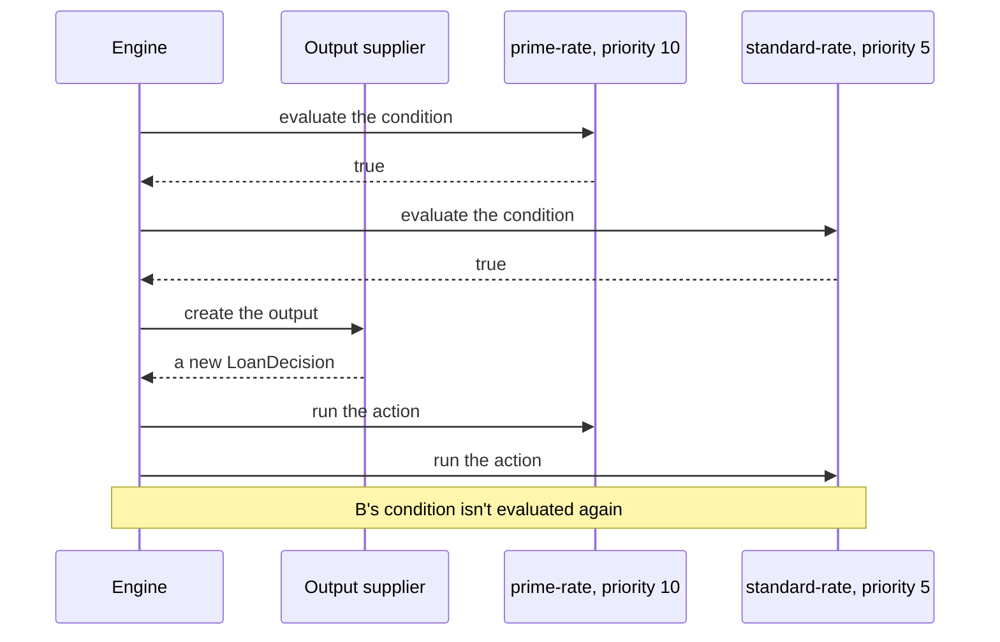
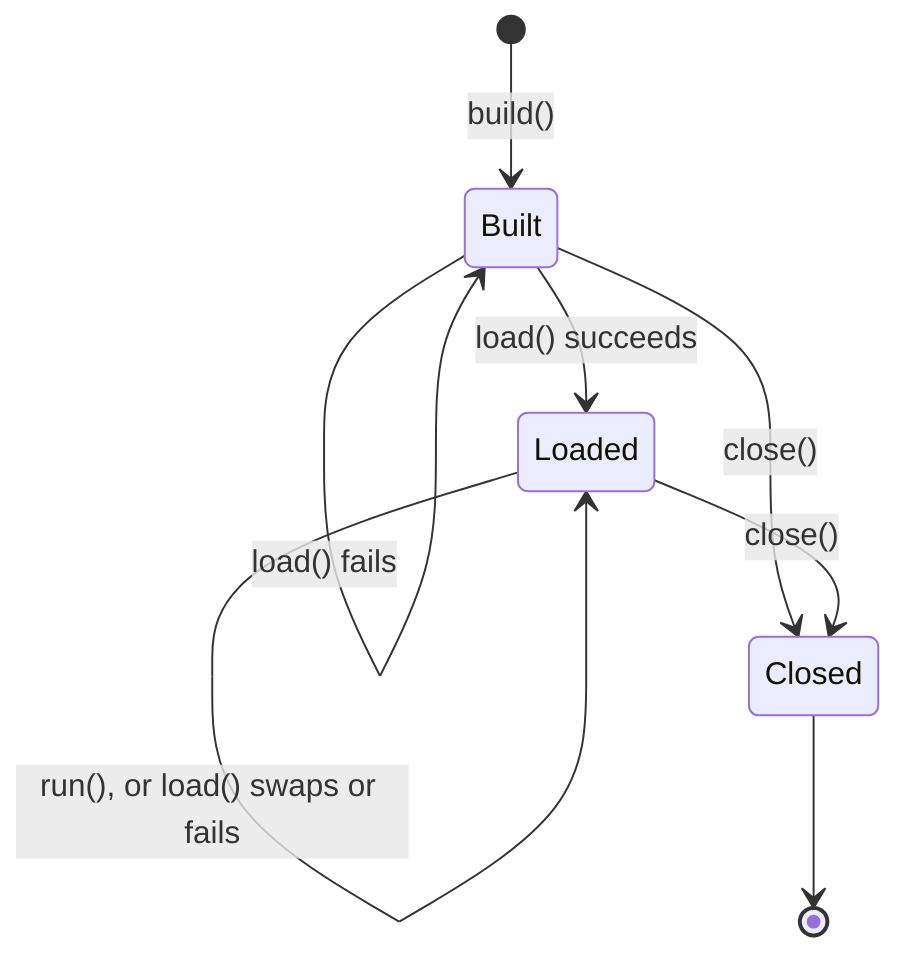

# 🔀 Engines and runs

The order rules run in, which rules a run uses, what a first-match, an all-matches and a unique-match engine do, when
the output object is created, and how rules are reloaded. [Run results and audits](run-results.md) covers what a run
reports and how to tie a decision to the rules that made it.

**Who it's for:** application developers who build engines and run rules.
**You'll be able to:** predict which rules fire and in what order, write an output supplier that works, and reload
rules while the engine runs.
**Before you start:** the [Quick start](../README.md#-quick-start). [Writing rules](writing-rules.md) covers what goes
in a rule.

[← Documentation index](README.md)

- [At a glance](#-at-a-glance)
- [Rule order](#-rule-order)
- [Choosing which rules a run uses](#-choosing-which-rules-a-run-uses)
- [First match or all matches](#-first-match-or-all-matches)
- [The output object](#-the-output-object)
- [What a run reports](#-what-a-run-reports)
- [Auditing a decision](#-auditing-a-decision)
- [Gotchas](#-gotchas)
- [Reloading rules](#-reloading-rules)
- [Questions you might not think to ask](#-questions-you-might-not-think-to-ask)

---

## 🧭 At a glance

`LoanDecision`, `Applicant` and the two rules, here `rules`, are from the [Quick start](../README.md#-quick-start).

```java
// At startup: build one engine, load its rules, and share it between threads.
RulesEngine<LoanDecision> engine = RulesEngineBuilder.firstMatch(LoanDecision::new).build();
engine.load(rules);

// For each decision:
FactStore<Object> facts = new FactMap<>();
facts.setValue("applicant", new Applicant("Ada", 780));
RunResult<LoanDecision> result = engine.runWithResult(facts);
LoanDecision decision = result.output();        // interestRate = 4.5, notes = [prime]
List<Rule> fired = result.firedRules();         // the prime-rate rule
List<RuleEvaluation> why = result.evaluations(); // prime-rate=MATCHED, standard-rate=NOT_EVALUATED
String checksum = result.ruleSetChecksum();     // identifies the rules this run used

// At shutdown:
engine.close();
```

- A [run](glossary.md#run) evaluates the rules in [evaluation order](glossary.md#evaluation-order), highest priority
  first, and [skips](#-choosing-which-rules-a-run-uses) disabled rules, rules outside their validity window, and, on a
  run given tags, rules with none of them.
- A **first-match** engine stops at the first rule whose condition is true and fires only that one. An
  **all-matches** engine evaluates every condition, then fires every match in order. A **unique-match** engine
  evaluates every condition too, then fires its one match, or fails the run if more match.
- The [output supplier](glossary.md#output-supplier) is called once per run, and only after a rule has
  matched. `run()` returns `null` exactly when no rule fired.
- A failing condition or action fails the run: it throws. See
  [What happens on each failure](error-handling.md#-what-happens-on-each-failure).
- Another `load()` swaps in new rules at once; a run finishes with the rules it started with.

## 📜 Rule order

`load()` sorts the rule list into evaluation order once, and every run of the engine uses that order, on every thread
and with every match policy:

- A higher `priority` comes first.
- Equal priorities keep their order from the list passed to `load()`.
- A `null` priority comes after every number, even a negative one such as `-1000`. Rules without a priority keep their
  list order too.

| Rule list passed to `load()` (name: priority) | Evaluation order |
| --- | --- |
| `a: 5`, `b: null`, `c: 5`, `d: -1000` | `a`, `c`, `d`, `b` |

The order of the list only matters between rules with equal priorities, or with none. That's also the only time it
changes the [checksum](run-results.md#-auditing-a-decision).

> [!TIP]
> `engine.rules().rules()` returns the loaded rules in evaluation order, so a test can assert the order the engine
> uses.

## 🔖 Choosing which rules a run uses

A run uses every loaded rule, except the ones it **skips**. A rule's `enabled`, its validity window and its tags, and
the tags a run is given, decide which:

```java
// primeRate and standardRate are the Quick start's rules, and facts holds Ada, score 780, from At a glance.
// Instant and Set are from java.time and java.util.
Rule summerRate = Rule.builder()
        .ruleName("summer-rate")
        .priority(20)
        .condition("applicant.creditScore >= 700")
        .action("output.approved = true; output.interestRate = 3.9; output.notes.add('summer')")
        .validFrom(Instant.parse("2027-06-01T00:00:00Z"))   // used from this instant
        .validTo(Instant.parse("2027-09-01T00:00:00Z"))     // until, but not at, this one
        .tags(Set.of("eu"))
        .build();
RulesEngine<LoanDecision> engine = RulesEngineBuilder.firstMatch(LoanDecision::new).build();
engine.load(List.of(summerRate, primeRate, standardRate));

engine.runWithResult(facts).evaluations();
// July 2027:    summer-rate=MATCHED, prime-rate=NOT_EVALUATED, standard-rate=NOT_EVALUATED
// October 2027: summer-rate=SKIPPED, prime-rate=MATCHED, standard-rate=NOT_EVALUATED
engine.runWithResult(facts, RunOptions.defaults().withTags(Set.of("eu"))).evaluations();
// July 2027:    summer-rate=MATCHED, prime-rate=SKIPPED, standard-rate=SKIPPED (they have no tags)
```

| A run skips a rule when | Set with |
| --- | --- |
| The rule is disabled | `enabled(false)` on the rule's builder; rules are enabled by default |
| The run starts before the rule's `validFrom`, or at or after its `validTo` | `validFrom(Instant)` and `validTo(Instant)` on the rule's builder; `null`, the default, means no start or no end |
| The run was given tags, and the rule carries none of them | `tags(...)` on the rule's builder, and `RunOptions.defaults().withTags(...)` for the run |

Whatever the reason a rule is skipped:

- Its condition isn't evaluated and its action doesn't run.
- No listener hears about it: no `beforeEvaluate`, `afterEvaluate`, `beforeExecute`, `afterExecute` or `onError`.
  It has no Flight Recorder rule event, and the run event's `rulesEvaluated` doesn't count it.
- `evaluations()` still lists it as `SKIPPED`, even below a first match, where a rule that isn't skipped is
  `NOT_EVALUATED`.
- It can't be the second match that fails a unique-match run.
- It stays loaded: `load()` and `validate()` compile it, so its errors still fail `load()`, and `rules().rules()`
  lists it. A rule whose window opens later needs no reload.

### The validity window and the engine's clock

A run reads the engine's clock **once**, when `run()` is called, before it waits for a
[compiled copy](glossary.md#compiled-copy), and judges every rule's window at that instant, however long the run
takes. A [nested run](glossary.md#nested-run) reads the clock again. The window includes `validFrom` and excludes
`validTo`, and `build()` rejects a `validTo` that isn't after `validFrom`.

The clock is `Clock.systemUTC()` unless the builder's `clock(Clock)` sets another. A test can run the rules as they
will be on a date with `.clock(Clock.fixed(Instant.parse("2027-07-01T00:00:00Z"), ZoneOffset.UTC))`. Only windows
use this clock: a [run timeout](stopping-runs.md) is measured by the system clock, whatever `clock(...)` is set to.

`RunContext.startedAt()` and `RunResult.startedAt()` return the instant the run judged the windows at. It comes from
the engine's clock, so a fixed clock gives every run the same instant. Don't compare it with `rules().loadedAt()` or
with the run's deadline: those use the system clock.

### Tags

A rule's tags are names that group it, such as a market or a product; a rule has none by default. A run given tags
with `RunOptions.defaults().withTags(Set.of("eu", "retail"))` uses only the rules that carry at least one of them. A
run without tags uses rules whatever their tags. Tags are compared exactly, case included, so `EU` doesn't select `eu`.

`withTags(...)` needs at least one tag: to use every rule, don't call it. `withTags(...)` keeps the options' timeout,
and `withTimeout(...)` keeps their tags. `RunOptions.tags()` returns them, empty when the run uses every rule, and
`RunContext.tags()` and `RunResult.tags()` return the same tags for the run they describe.

> [!WARNING]
> A run given tags skips every rule that has no tags, including a default meant to apply everywhere, such as a
> lowest-priority rule whose condition is `true`. Give such a rule every tag your runs are given.

## 🔀 First match or all matches

The [match policy](glossary.md#match-policy) is chosen when the engine is built, and can't change. There are three:
first match, all matches, and [unique match](#unique-match-one-rule-or-none), for a decision table whose rows must
not overlap.

| Compared | First match | All matches | Unique match |
| --- | --- | --- | --- |
| **Create with** | `RulesEngineBuilder.firstMatch(...)` | `RulesEngineBuilder.allMatches(...)` | `RulesEngineBuilder.uniqueMatch(...)` |
| **Conditions evaluated** | In order, until one is true. The rules below it aren't evaluated | All of them, before any action runs | All of them, before any action runs |
| **Actions fired** | Only the first match | Every match, in evaluation order | The one match; more than one fails the run |
| **`firedRules()`** | At most one rule | Every match, in firing order | At most one rule |
| **`evaluations()`** | `MATCHED` or `NOT_MATCHED` down to the match, then `NOT_EVALUATED`; `SKIPPED` for a skipped rule anywhere | `MATCHED` or `NOT_MATCHED` for every rule, or `SKIPPED` | `MATCHED` or `NOT_MATCHED` for every rule, or `SKIPPED` |
| **Output** | Shaped by exactly one rule | Shared by every matched action, so a later action can overwrite an earlier one's change | Shaped by exactly one rule |
| **A condition fails** | The run fails. A broken rule below the first match isn't evaluated, so it can't fail the run | The run fails before any action runs and before the output is created | The same as all matches |
| **An action fails** | The run fails | The run fails, and the actions that already ran keep their changes | The run fails |
| **`RunContext.matchPolicy()`** | `"firstMatch"` | `"allMatches"` | `"uniqueMatch"` |
| **Good for** | Decision tables and "first match wins" logic | Scoring, tagging, and collecting every violation | Decision tables whose rows must not overlap |
| **Quick start, score 780** | `4.5`, `[prime]` | `6.9`, `[prime, standard]` | Fails: both rules match |

On every policy, a rule the run [skips](#-choosing-which-rules-a-run-uses) isn't evaluated, doesn't fire and
doesn't count as a match.

| If you need | Use |
| --- | --- |
| One answer, from the highest-priority rule that applies | `firstMatch(...)` |
| Every rule that applies to add to the output | `allMatches(...)` |
| A default when no other rule applies | `firstMatch(...)`, with a lowest-priority rule whose condition is `true` |
| To know every rule that matched | `allMatches(...)`, then `RunResult.firedRules()` |
| To know why a rule didn't apply | `RunResult.evaluations()`; see [What a run reports](run-results.md#-what-a-run-reports) |
| To be told when two rules apply to the same facts | `uniqueMatch(...)` |

No policy chains rules: a run is one pass over the rules. An all-matches run **matches first, then fires**. It
evaluates every condition, calls the output supplier once, then runs each matched action in order. An action never
causes a condition to be evaluated again: if a higher-priority action changes a fact, a rule that already matched still
fires, and its action sees the changed fact.



> [!WARNING]
> An all-matches run isn't atomic. If an action throws, the actions that already ran keep their changes to the output
> object and to any facts they changed, and the run throws a `RuleExecutionException` naming the failing rule. A
> failing condition changes nothing, because no action has run yet.

### Unique match: one rule or none

In a decision table, two rows that match the same input usually mean a mistake in the table, and a first-match engine
hides it by picking the higher priority. A unique-match engine evaluates every condition, like an all-matches engine,
and then:

- **No match:** returns `null` and fires nothing.
- **One match:** creates the output and fires that rule.
- **More than one match:** fires nothing, never calls the output supplier, and throws a `RuleExecutionException`
  naming every matched rule in evaluation order:
  `2 rules matched, but a unique-match engine allows one: 'prime-rate', 'standard-rate'`. The list of names is cut
  at 1,000 characters, like text copied from an exception.

The failure belongs to no rule, so `getRuleName()` is `null`. Listeners get `afterEvaluate` for every rule and then
`onRunError`, and no `onError`. It's logged at ERROR.

```java
RulesEngine<LoanDecision> engine = RulesEngineBuilder.uniqueMatch(LoanDecision::new).build();
engine.load(rules);                       // the Quick start's prime-rate and standard-rate
engine.run(facts);                        // score 780 matches both: throws RuleExecutionException
```

The check counts conditions that were true, whatever the rules' language. It finds an overlap only for
the facts of that run: to check a table for every input, run it against the inputs you care about in a test.

What each failure throws, logs and tells listeners is in
[What happens on each failure](error-handling.md#-what-happens-on-each-failure). A timeout or an interrupt stops a run
instead of failing a rule; see [Stopping a run](stopping-runs.md).

## 📤 The output object

The [output object](glossary.md#output-object) is what a run's actions change, and what `run()` returns. The output
supplier, the `Supplier` you give `firstMatch(...)`, `allMatches(...)` or `uniqueMatch(...)`, creates it.

| In a run where | The supplier is called |
| --- | --- |
| A first-match engine finds a true condition | Once, after that condition and before its action |
| An all-matches engine finds at least one true condition | Once, after every condition and before the first action |
| A unique-match engine finds exactly one true condition | Once, after every condition and before the action |
| A unique-match engine finds more than one true condition | Never, and the run throws |
| No condition is true, the rule list is empty, or the run skips every rule | Never, and `run()` returns `null` |
| A condition fails, or the run is stopped before a rule matches | Never, and the run throws |

- **It must return a new object on every call.** The engine doesn't copy what it returns. A supplier that returns one
  shared object gives every run that object, so results pile up (`notes = [prime, prime]` after two runs), and runs on
  different threads change it at once.
- **It must not return `null` or throw.** Either fails the run with a `RuleExecutionException` that names no rule.
- `outputType(...)` on the builder only tells languages the output's type. The engine never checks the output against
  it.

> [!WARNING]
> `firstMatch(() -> decision)` passes a test that runs once, but in production every run adds to the one `decision`.
> Write `firstMatch(LoanDecision::new)`.

### How actions change it

An action changes the output in one of two ways:

- **In place.** The action changes the object itself and returns `ActionResult.done()`. MVEL actions work this way
  (`output.approved = true`), so the output type must be mutable.
- **By returning properties.** A language whose expressions have no side effects returns
  `ActionResult.set(properties)`. The engine sets each property **after the action returns**, in the map's order, with
  the engine's `OutputWriter`. If the run stops when that action returns, none are set; a later
  [stop](stopping-runs.md#-what-stops-a-run) leaves those written.

The default writer, `OutputWriter.beansAndMaps()`, calls `put` on a `Map` output, storing the value as is, and
otherwise the output's public setter, such as `setInterestRate`. A setter that accepts the value as is wins. Among
several, the most specific wins, as in Java: `setAmount(BigDecimal)` over `setAmount(Number)`, and `setP(Integer)` over
`setP(int)`. If no single one is the most specific, it calls the same one on every run.

Only when none accepts the value does it widen it to the nearest primitive, as a
[primitive fact declaration](facts.md#primitive-types-widen) does: an `Integer` reaches `setR(long)` before
`setR(float)`.

Nothing else is converted: a `Long` doesn't reach `setR(int)`, an `Integer` doesn't reach `setR(Long)`, and a
`BigDecimal`, a `BigInteger` or `null` doesn't reach any primitive. So a CEL integer, a `Long`, needs a setter
taking it or a `float` or `double` one, and a Groovy decimal literal, a `BigDecimal`, one that takes it; otherwise,
write an `outputWriter(...)`.

Beside a same-named setter with a different parameter, one declared with its class's own type variable,
`setContent(T)` in `Box<T>`, takes only what Java gives `T` in the output class, as in `LongBox extends Box<Long>` or
`new Box<Long>() {}`. In `LongBox`, a `Short` widens to `setContent(long)` and a `String` fails, as in Java.
Unlike Java:

- Without such an overload, it takes `T`'s erasure.
- `new Box<Long>()` gives `T` nothing: it takes `T`'s bound.
- With `T` a `String`, `setContent(CharSequence)` takes a `String`; Java calls `setContent(T)`.
- A type variable an inner class uses from its enclosing class, as in `Outer<T>.Inner`, isn't resolved: a setter
  declared with it, or with a variable it's passed to, takes the variable's bound.
- A varargs `setR(int...)` takes only an array.

A property it can't set, including through a setter the engine can't reach, fails the rule, naming it and the
property, unless the run must [stop](stopping-runs.md#-what-stops-a-run). When no setter of that name accepts a
number, a character or a boolean, but one takes a primitive or a boxed primitive, the message adds:
`(setR(int) exists, but a value is only widened as Java widens a primitive, never narrowed or converted)`.

## 📊 What a run reports

[What a run reports](run-results.md#-what-a-run-reports) covers `run()`, `runWithResult()`, `evaluations()` and
`engine.rules()`.

## 🔏 Auditing a decision

[Auditing a decision](run-results.md#-auditing-a-decision) covers tying a decision to its rules, and the checksum.

## 🚧 Gotchas

| Gotcha | What happens | Do this instead |
| --- | --- | --- |
| **A shared output object** | `firstMatch(() -> decision)` gives every run the same object, so results from earlier runs pile up | Return a new object: `firstMatch(LoanDecision::new)` |
| **A `null` priority** | The rule comes after every number, even `-1000` | Give every rule a priority, and assert the order with `rules().rules()` |
| **Rules below a first match** | They aren't evaluated, so they're neither matched nor unmatched: `evaluations()` reports them as `NOT_EVALUATED`, or `SKIPPED` if the run skips them, and listeners hear nothing about them | Use `allMatches(...)` or `uniqueMatch(...)` to evaluate every rule |
| **A run given tags, and rules without any** | The run skips every rule with no tags, including a catch-all default | Give such a rule every tag your runs are given |
| **Tags that differ only in case** | `withTags(Set.of("EU"))` skips a rule tagged `eu` | Use one spelling for each tag |
| **Two rows of a decision table overlap** | A first-match engine fires the higher priority and hides the overlap | Use `uniqueMatch(...)`, which fails the run and names both rules |
| **An action changes a fact in an all-matches run** | Rules that already matched still fire; conditions aren't evaluated again | Decide in conditions, from the facts as the run was given them |
| **An action fails in an all-matches run** | The actions before it keep their changes | Discard the output and any facts the actions changed |

> [!NOTE]
> The rest of this page is for applications that reload rules. You can stop here if you load your rules once, at
> startup.

## 🔄 Reloading rules

When an engine that already has rules is loaded again:

- **The swap is atomic.** `load()` compiles the whole list, then swaps it in: a run uses the old rules or the new
  ones, never a mix.
- **A failed load changes nothing.** If a rule fails, `load()` throws a `RuleCompilationException`; the old rules,
  their checksum and their `loadedAt()` stay, and runs keep using them.
- **A fatal error can follow a swap:** see [A fatal error while closing](thread-safety.md#a-fatal-error-while-closing);
  the new rules stay loaded.
- **A run in progress finishes with the rules it started with,** so its `ruleSetChecksum()` can differ from
  `rules().checksum()` read after it returns.
- **Only the rules change.** The match policy, the output supplier and every other builder setting are fixed at
  `build()`. To change one, build a new engine and close the old one.

To check which rules are loaded, compare `engine.rules().checksum()` with the checksum you expect:

```java
try {
    engine.load(newRules);
} catch (RuleCompilationException e) {
    // Nothing changed: engine.rules().checksum() is still the old rules' checksum.
    // e.failures() has one exception for each rule that failed.
}
```



- **Built:** `run()` throws `IllegalStateException` (`load() must be called before run()`), and `rules()` reports no
  rules.
- **Loaded:** runs and reloads, from any number of threads.
- **Closed:** `run()`, `runWithResult()`, `load()`, `validate()` and `rules()` throw `IllegalStateException`
  (`The engine is closed`) at once. `close()` returns at once, and runs in progress finish, except in the race
  [Closing](thread-safety.md#closing) describes. A `load()` already under way isn't stopped, but the closed engine
  never serves what it loads. Closing again does nothing.

Runs in flight during a reload, two loads at once, and what `close()` releases are in
[Thread safety](thread-safety.md#-reloading-rules-while-running) and [Closing](thread-safety.md#closing).

### Checking a list before loading it

`validate(rules)` compiles a list exactly as `load()` would, with the engine's languages, imports, options and
declared facts, and returns the problems instead of throwing: one `RuleCompilationException` for each, in the order
`load()` would find them, or an empty list when there are none. Nothing is loaded and nothing about the rules
is logged, not even a language's compile warnings, so a rule editor can call it freely.

```java
List<RuleCompilationException> problems = engine.validate(newRules);
if (problems.isEmpty()) {
    engine.load(newRules);                          // compiles the list again, then swaps it in
} else {
    problems.forEach(problem -> log.warn("{}", problem.getMessage()));
}
```

Unlike `load()`, a `null` entry or a duplicate name doesn't stop the check: every other rule is still compiled, so
one call lists everything. `getRuleName()` names the rule a problem belongs to, and is `null` for a `null` entry, a
language that couldn't create its compiler, or a declared fact name the languages reject.

One problem `validate()` can't report. It makes no copies, but an engine built with
[`copiesAtLoad(n)`](compiled-copies.md#making-copies-at-load) above zero makes them once the rules compile, and a
language that throws while creating or warming up a session for one, or returns `null` instead of a session, fails
that `load()`, naming the language. With the default `copiesAtLoad(0)` nothing is outside what it can see.

## ❓ Questions you might not think to ask

### Does a lower-priority rule still run after a match?

On a first-match engine, no: it isn't even evaluated. On an all-matches engine, yes, in priority order, once every
condition is evaluated. A unique-match engine fails the run on a second match. A skipped rule never runs. See
[First match or all matches](#-first-match-or-all-matches).

### How do I switch a rule off, or schedule it?

To switch it off, load it built with `enabled(false)`. A rule is immutable, so to switch it on again, load
`rule.toBuilder().enabled(true).build()`. To schedule it, give it `validFrom(...)`, `validTo(...)` or both: runs skip
it outside that window, with no reload. Either way `load()` still compiles it. See
[Choosing which rules a run uses](#-choosing-which-rules-a-run-uses).

### How do I catch two rules that apply to the same facts?

Build the engine with `uniqueMatch(...)`: a run with a second match fires nothing and throws, naming every match.
See [Unique match: one rule or none](#unique-match-one-rule-or-none).

### If an all-matches run fails, did some actions already run?

A failing condition fails it before any action runs or the output exists. A failing action leaves the earlier
actions' changes. See [First match or all matches](#-first-match-or-all-matches).

### Can a condition change facts?

It can't assign to one: a language that passes the contract test kit rejects that at `load()`, and the engine rejects
any write to the facts at run time.
But a method call that changes a fact object isn't caught, and the rest of the run and your own code see the change.
See [What rules can change](writing-rules.md#-what-rules-can-change).

### Should I build an engine for each request?

No: loading compiles every rule. Build one engine at startup, load its rules once, run it from any number of
threads, and call `close()` at shutdown to release what its languages hold. See
[Thread safety](thread-safety.md).
