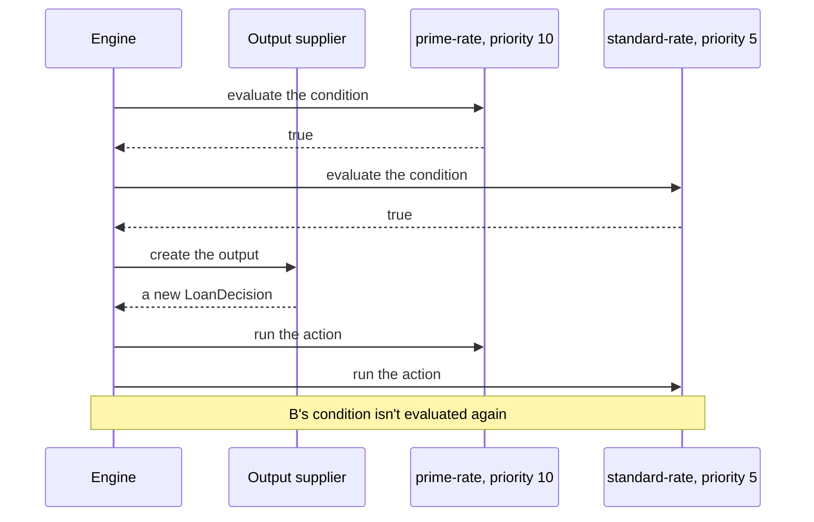
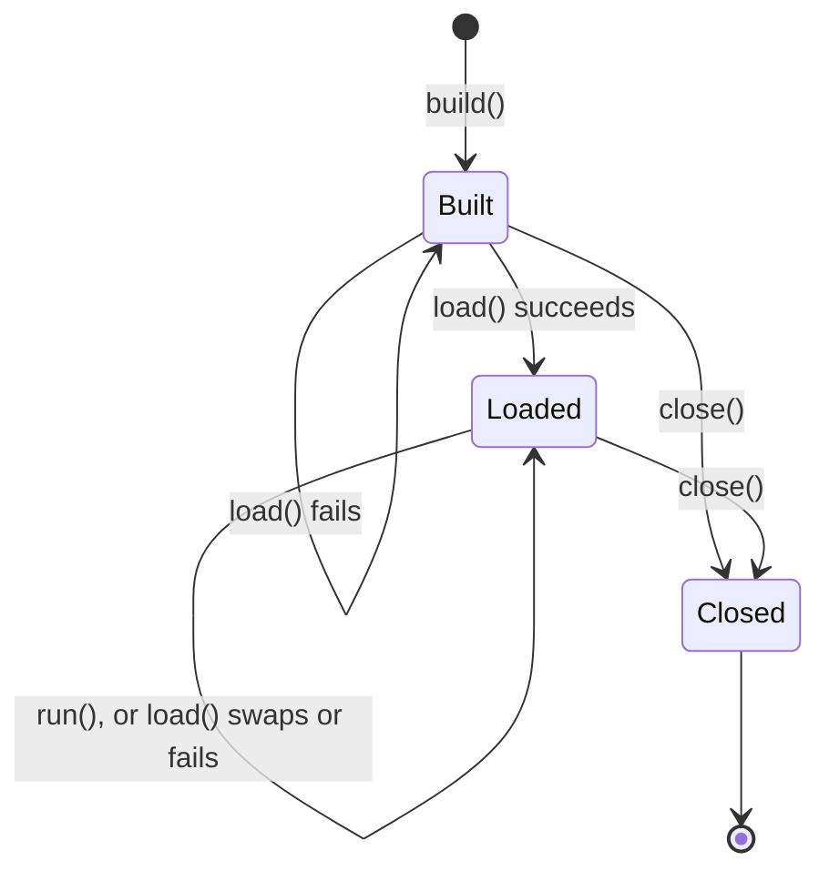

# 🔀 Engines and runs

> [!NOTE]
> Describes 2.0.0, which isn't released yet.

The order rules run in, what a first-match and an all-matches engine do, when the output object is created, and what a
run and an engine report about the rules they used.

**Who it's for:** application developers who build engines, run rules and record decisions.
**You'll be able to:** predict which rules fire and in what order, write an output supplier that works, read a
`RunResult`, and tie a decision to the rules that made it.
**Before you start:** the [Quick start](../README.md#-quick-start). [Writing rules](writing-rules.md) covers what goes
in a rule.

[← Documentation index](README.md)

- [At a glance](#-at-a-glance)
- [Rule order](#-rule-order)
- [First match or all matches](#-first-match-or-all-matches)
- [The output object](#-the-output-object)
- [What a run reports](#-what-a-run-reports)
- [Gotchas](#-gotchas)
- [Auditing a decision](#-auditing-a-decision)
- [Reloading rules](#-reloading-rules)
- [Questions you might not think to ask](#-questions-you-might-not-think-to-ask)

---

## 🧭 At a glance

`LoanDecision`, `Applicant` and the two rules, here `rules`, are from the [Quick start](../README.md#-quick-start).

```java
// At startup: build one engine, load its rules, and share it between threads.
RulesEngine<LoanDecision> engine = RulesEngineBuilder.firstMatch(LoanDecision::new).build();
engine.load(rules);

// For each decision:
FactStore<Object> facts = new FactMap<>();
facts.setValue("applicant", new Applicant("Ada", 780));
RunResult<LoanDecision> result = engine.runWithResult(facts);
LoanDecision decision = result.output();        // interestRate = 4.5, notes = [prime]
List<Rule> fired = result.firedRules();         // the prime-rate rule
String checksum = result.ruleSetChecksum();     // identifies the rules this run used

// At shutdown:
engine.close();
```

- A [run](glossary.md#run) evaluates the rules in [evaluation order](glossary.md#evaluation-order): highest priority
  first.
- A **first-match** engine stops at the first rule whose condition is true, and fires only that rule. An
  **all-matches** engine evaluates every condition, then fires every match in order.
- The [output supplier](glossary.md#output-supplier) is called once in a run, after a rule has matched. `run()`
  returns `null` exactly when no rule fired.
- A condition or action that fails fails the run: it throws, and returns no result. See
  [What happens on each failure](error-handling.md#-what-happens-on-each-failure).
- Calling `load()` again swaps in new rules at once, and a run finishes with the rules it started with.

## 📜 Rule order

`load()` sorts the rule list into evaluation order once, and every run of the engine uses that order, on every thread
and with either match policy:

- A higher `priority` comes first.
- Equal priorities keep their order from the list passed to `load()`.
- A `null` priority comes after every number, even a negative one such as `-1000`. Rules without a priority keep their
  list order too.

| Rule list passed to `load()` (name: priority) | Evaluation order |
| --- | --- |
| `a: 5`, `b: null`, `c: 5`, `d: -1000` | `a`, `c`, `d`, `b` |

The order of the list only matters between rules with equal priorities, or with none. That's also the only time it
changes the [checksum](#-auditing-a-decision).

> [!TIP]
> `engine.rules().rules()` returns the loaded rules in evaluation order, so a test can assert the order the engine
> uses.

## 🔀 First match or all matches

The [match policy](glossary.md#match-policy) is chosen when the engine is built, and can't change.

| Compared | First match | All matches |
| --- | --- | --- |
| **Create with** | `RulesEngineBuilder.firstMatch(...)` | `RulesEngineBuilder.allMatches(...)` |
| **Conditions evaluated** | In order, until one is true. The rules below it aren't evaluated | All of them, before any action runs |
| **Actions fired** | Only the first match | Every match, in evaluation order |
| **`firedRules()`** | At most one rule | Every match, in firing order |
| **Output** | Shaped by exactly one rule | Shared by every matched action, so a later action can overwrite an earlier one's change |
| **A condition fails** | The run fails. A broken rule below the first match isn't evaluated, so it can't fail the run | The run fails before any action runs and before the output is created |
| **An action fails** | The run fails | The run fails, and the actions that already ran keep their changes |
| **`RunContext.matchPolicy()`** | `"firstMatch"` | `"allMatches"` |
| **Good for** | Decision tables and "first match wins" logic | Scoring, tagging, and collecting every violation |
| **Quick start, score 780** | `4.5`, `[prime]` | `6.9`, `[prime, standard]` |

| If you need | Use |
| --- | --- |
| One answer, from the highest-priority rule that applies | `firstMatch(...)` |
| Every rule that applies to add to the output | `allMatches(...)` |
| A default when no other rule applies | `firstMatch(...)`, with a lowest-priority rule whose condition is `true` |
| To know every rule that matched | `allMatches(...)`, then `RunResult.firedRules()` |

Neither policy chains rules: a run is one pass over the rules. An all-matches run **matches first, then fires**. It
evaluates every condition, calls the output supplier once, then runs each matched action in order. An action never
causes a condition to be evaluated again: if a higher-priority action changes a fact, a rule that already matched still
fires, and its action sees the changed fact.



> [!WARNING]
> An all-matches run isn't atomic. If an action throws, the actions that already ran keep their changes to the output
> object and to any facts they changed, and the run throws a `RuleExecutionException` naming the failing rule. A
> failing condition changes nothing, because no action has run yet.

What each failure throws, logs and tells listeners is in
[What happens on each failure](error-handling.md#-what-happens-on-each-failure). A timeout or an interrupt stops a run
instead of failing a rule; see [Stopping a run](stopping-runs.md).

## 📤 The output object

The [output object](glossary.md#output-object) is what a run's actions change, and what `run()` returns. The output
supplier, the `Supplier` you give `firstMatch(...)` or `allMatches(...)`, creates it.

| In a run where | The supplier is called |
| --- | --- |
| A first-match engine finds a true condition | Once, after that condition and before its action |
| An all-matches engine finds at least one true condition | Once, after every condition and before the first action |
| No condition is true, or the rule list is empty | Never, and `run()` returns `null` |
| A condition fails, or the run is stopped before a rule matches | Never, and the run throws |

- **It must return a new object on every call.** The engine doesn't copy what it returns. A supplier that returns one
  shared object gives every run that object, so results pile up (`notes = [prime, prime]` after two runs), and runs on
  different threads change it at once.
- **It must not return `null` or throw.** Either fails the run with a `RuleExecutionException` that names no rule.
- `outputType(...)` on the builder only tells languages the output's type. The engine never checks the output against
  it.

> [!WARNING]
> `firstMatch(() -> decision)`, with one `decision` object, compiles and passes a test that runs once. In production
> every run adds to the same object. Write `firstMatch(LoanDecision::new)`.

### How actions change it

An action changes the output in one of two ways, depending on its language:

- **In place.** The action changes the object itself and returns `ActionResult.done()`. MVEL actions work this way
  (`output.approved = true`), so the output type must be mutable.
- **By returning properties.** A language whose expressions have no side effects returns
  `ActionResult.set(properties)`. The engine sets each property **after the action returns**, in the map's order, with
  the engine's `OutputWriter`. If the run is stopped when that action returns, none of them are set.

The default writer, `OutputWriter.beansAndMaps()`, calls `put` on a `Map` output, and otherwise the output's public
setter whose parameter accepts the value, such as `setInterestRate` for `interestRate`. It converts nothing: a `Double`
reaches a `double` setter, but an `Integer` doesn't, and `null` doesn't reach a primitive. A property it can't set,
including through a setter the engine can't reach, fails the rule with a `RuleExecutionException` that names the rule
and the property. Give the engine a writer of your own with `outputWriter(...)` on the builder.

## 📊 What a run reports

| Call | Returns | Use it when |
| --- | --- | --- |
| `run(facts)` | The output object, or `null` | You only need the decision |
| `runWithResult(facts)` | A `RunResult` | You also record which rules fired, and which rules the run used |
| `runWithResult(facts, options)` | A `RunResult` | One run needs a timeout of its own; see [Stopping a run](stopping-runs.md) |

`run(facts)` is `runWithResult(facts).output()`: the same run, with the same checks, listener callbacks and exceptions.
A [run result](glossary.md#run-result) holds:

- `output()`: the output object, or `null` exactly when no rule fired.
- `firedRules()`: the rules whose actions ran, in firing order. It's unmodifiable, and has at most one rule on a
  first-match engine.
- `ruleSetChecksum()`: the checksum of the rules this run used.

A run that fails throws, so there's never a partial result.

> [!IMPORTANT]
> `run()` returns `null` when no rule fired: no condition was true, or the rule list is empty. A rule that fired always
> gives a non-`null` output, even when its action changed nothing, so check for `null` before you read the output.

The engine keeps the `Rule` objects you pass to `load()`. `rules().rules()`, `firedRules()` and listener callbacks all
give you those same instances, so you can compare them with `==` or use them as keys in a map.

### The loaded rules

`engine.rules()` returns a `RuleSetInfo`, which describes the [loaded rules](glossary.md#loaded-rules):

| Engine state | `rules()` | `checksum()` | `loadedAt()` |
| --- | --- | --- | --- |
| Before the first `load()` | Empty | The checksum of no rules, `e3b0c442…b855` | `null` |
| After `load(List.of())` | Empty | The checksum of no rules, `e3b0c442…b855` | When they loaded |
| After `load(rules)` | The rules, in evaluation order | Their checksum | When they loaded |

Before the first `load()`, `run()` throws `IllegalStateException` (`load() must be called before run()`). After an empty
`load()`, every run returns `null`, and still checks the facts' names. On a closed engine, `rules()` throws
`IllegalStateException`.

## 🚧 Gotchas

| Gotcha | What happens | Do this instead |
| --- | --- | --- |
| **A shared output object** | `firstMatch(() -> decision)` gives every run the same object, so results from earlier runs pile up | Return a new object: `firstMatch(LoanDecision::new)` |
| **`null` from `run()`** | No rule fired, and code that reads the output throws `NullPointerException` | Check for `null`, or add a lowest-priority rule whose condition is `true` |
| **A `null` priority** | The rule comes after every number, even `-1000` | Give every rule a priority, and assert the order with `rules().rules()` |
| **Rules below a first match** | They aren't evaluated, so they're neither matched nor unmatched, and listeners hear nothing about them | Use `allMatches(...)` to see every match |
| **An action changes a fact in an all-matches run** | Rules that already matched still fire; conditions aren't evaluated again | Decide in conditions, from the facts as the run was given them |
| **An action fails in an all-matches run** | The actions before it keep their changes | Discard the output and any facts the actions changed |
| **The same checksum on both match policies** | A first-match and an all-matches engine with the same rules report the same checksum | Record `RunContext.matchPolicy()` too; see [Auditing a decision](#-auditing-a-decision) |
| **`rules().checksum()` read after a run** | A reload in between gives the new rules' checksum | Record `RunResult.ruleSetChecksum()` |
| **A changed description** | The checksum stays the same, but the two `Rule` objects aren't `equals` | Compare checksums to tell whether the rules changed what they do |

> [!NOTE]
> The rest of this page is for applications that record decisions or reload rules. You can stop here if you load your
> rules once, at startup.

## 🔏 Auditing a decision

To tie a decision to the rules that made it, record these with it:

- **`RunResult.ruleSetChecksum()`**: which rules the run used. Don't read `engine.rules().checksum()` afterwards: a
  reload in between changes it, while the run finished with the rules it started with.
- **The match policy**: `RunContext.matchPolicy()`, which is `"firstMatch"` or `"allMatches"`.
- **`RunResult.firedRules()`**: which rules fired, in order.

A listener's `afterRun` receives all three, after every run that succeeds:

```java
// auditLog is your own code.
RuleListener audit = new RuleListener() {
    @Override
    public void afterRun(RunContext run, RunResult<?> result) {
        auditLog.record(run.matchPolicy(), result.ruleSetChecksum(),
                result.firedRules().stream().map(Rule::getRuleName).toList());
    }
};
RulesEngine<LoanDecision> engine = RulesEngineBuilder.firstMatch(LoanDecision::new).listener(audit).build();
```

> [!WARNING]
> The checksum identifies the rules, not the engine. A first-match and an all-matches engine loaded with the same rules
> report the same checksum, although they can decide differently. Record `RunContext.matchPolicy()` with
> `RunResult.ruleSetChecksum()`.

The checksum is the lowercase hex SHA-256 over each rule, in evaluation order: its name, its priority as decimal text,
its [resolved language](glossary.md#resolved-language), its condition and its action. Each value is written as its
length in UTF-8 bytes, in four bytes with the most significant first, then those bytes. A `null` priority is written as
the length `-1`. So another system can compute the same checksum from the same rules.

| Change | Changes the checksum? |
| --- | :---: |
| A rule's name, condition or action | ✅ |
| A rule's priority, including from `null` to `0` | ✅ |
| Adding or removing a rule | ✅ |
| Swapping two rules with equal priorities in the list | ✅ |
| A different default language on the engine, for a rule with no `language` | ✅ |
| A rule's description | ❌ |
| The list order of rules whose priorities differ | ❌ |
| Setting `language("mvel")` on a rule when MVEL is already the default | ❌ |
| The match policy | ❌ |
| Imports, listeners, options, declared facts, output type or writer, copy limit or timeout | ❌ |
| Loading the same rules again (`loadedAt()` changes) | ❌ |

## 🔄 Reloading rules

What a caller sees when it calls `load()` on an engine that already has rules:

- **The swap is atomic.** `load()` compiles the whole new list first, then swaps it in at once. A run uses either the
  old rules or the new ones, never a mix.
- **A failed load changes nothing.** If any rule fails, `load()` throws a `RuleCompilationException`, and the old
  rules, their checksum and their `loadedAt()` stay. Runs keep using them.
- **A run in progress finishes with the rules it started with,** so its `ruleSetChecksum()` can differ from
  `rules().checksum()` read after it returns.
- **Only the rules change.** The match policy, output supplier, languages, imports, listeners, options and every other
  builder setting are fixed when the engine is built. To change one, build a new engine and close the old one.

To check which rules are loaded, compare `engine.rules().checksum()` with the checksum you expect:

```java
try {
    engine.load(newRules);
} catch (RuleCompilationException e) {
    // Nothing changed: engine.rules().checksum() is still the old rules' checksum.
    // e.failures() has one exception for each rule that failed.
}
```



- **Built:** `run()` throws `IllegalStateException` (`load() must be called before run()`), and `rules()` reports no
  rules.
- **Loaded:** runs and reloads, from any number of threads.
- **Closed:** `run()`, `runWithResult()`, `load()`, `validate()` and `rules()` throw `IllegalStateException`
  (`The engine is closed`). `close()` returns at once, runs in progress finish, and closing again does nothing.

Runs in flight during a reload, two loads at once, and what `close()` releases are in
[Thread safety](thread-safety.md#-reloading-rules-while-running) and [Closing](thread-safety.md#closing).

### Checking a list before loading it

`validate(rules)` compiles a list exactly as `load()` would, with the engine's languages, imports, options and
declared facts, and returns every problem instead of throwing: one `RuleCompilationException` for each, in the order
`load()` would find them, or an empty list when the rules would load. Nothing is loaded and nothing about the rules
is logged, not even a language's compile warnings, so a rule editor or an admin endpoint can call it as often as it
likes.

```java
List<RuleCompilationException> problems = engine.validate(newRules);
if (problems.isEmpty()) {
    engine.load(newRules);                          // compiles the list again, then swaps it in
} else {
    problems.forEach(problem -> log.warn("{}", problem.getMessage()));
}
```

Unlike `load()`, a `null` entry or a duplicate name doesn't stop the check: every other rule is still compiled, so
one call lists everything. `getRuleName()` names the rule a problem belongs to, and is `null` for a `null` entry, a
language that couldn't create its compiler, or a declared fact name the languages reject.

## ❓ Questions you might not think to ask

### Does a lower-priority rule still run after a match?

On a first-match engine, no, and its condition isn't evaluated either. On an all-matches engine, yes: every condition
is evaluated first, then every match fires in priority order, and no condition is evaluated again after an action. See
[First match or all matches](#-first-match-or-all-matches).

### If an all-matches run fails, did some actions already run?

A failing condition fails the run before any action runs or the output object exists. A failing action leaves the
changes of the actions before it. See [First match or all matches](#-first-match-or-all-matches).

### Can a condition change facts?

It can't assign to one: a language that passes the contract test kit rejects that at `load()`, and the engine rejects
any write to the facts at run time.
But a method call that changes a fact object isn't caught, and the rest of the run and your own code see the change.
See [What rules can change](writing-rules.md#-what-rules-can-change).

### When is my output supplier called, and can it return a shared object?

Once in a run, and only after a rule has matched; never when nothing matches. It must return a new object, because a
shared one collects the results of every run. See [The output object](#-the-output-object).

### Does `null` from `run()` always mean no rule fired?

Yes, exactly. A rule that fired gives a non-`null` output even when its action changed nothing. See
[What a run reports](#-what-a-run-reports).

### Does the checksum tell a first-match decision from an all-matches one?

No. It covers only the rules: each one's name, priority, resolved language, condition and action. Record
`RunContext.matchPolicy()` with `RunResult.ruleSetChecksum()`. See [Auditing a decision](#-auditing-a-decision).

### Should I build an engine for each request?

No. Building an engine and loading its rules compiles every rule. Build one engine at startup, load its rules once, run
it from any number of threads, and call `close()` at shutdown to release what its languages hold. See
[Thread safety](thread-safety.md).
