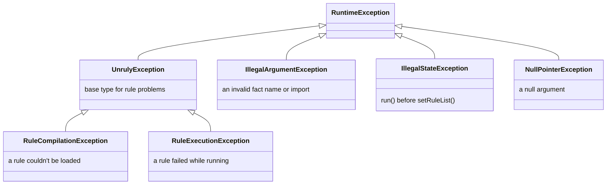

# 🚨 Error handling

The engine throws its own exceptions for rule problems and standard JDK exceptions for misuse of the API.

[← Back to README](../README.md)

- [Exception types](#-exception-types)
- [Exceptions by method](#-exceptions-by-method)
- [Caught when loading or only when running?](#-caught-when-loading-or-only-when-running)
- [Handling failures](#-handling-failures)

---

## 🧬 Exception types



All of them are unchecked.

> [!NOTE]
> `catch (UnrulyException e)` doesn't catch `IllegalArgumentException`, `IllegalStateException` or
> `NullPointerException`. Those signal a programming error rather than a problem with a rule.

## 📋 Exceptions by method

| Method | Exception | When |
| --- | --- | --- |
| `RulesEngineBuilder.stateless()` / `stateful()` | `NullPointerException` | The output supplier is `null` |
| `setRuleList(rules)` | `RuleCompilationException` | A rule in the list is `null`; two rules share a name; a condition or action is `null` or blank; a condition contains an assignment; an expression has a syntax error MVEL detects |
| | `NullPointerException` | The list itself is `null` |
| `run(facts)` | `RuleExecutionException` | A condition or action throws; a condition evaluates to `null` or a non-boolean; the output supplier throws or returns `null` |
| | `IllegalArgumentException` | A fact is named `output`, or has a name rules can't use (see [Facts](facts.md#-naming-rules)) |
| | `IllegalStateException` | `setRuleList()` has never been called |
| | `NullPointerException` | `facts` is `null` |
| | `Error` (rethrown) | A rule throws an `Error` other than `StackOverflowError` or `AssertionError`, such as `OutOfMemoryError` |
| `addImport()` / `addImports()` | `IllegalArgumentException` | A string is neither a loadable class nor a valid package name. Nothing is imported. |
| | `NullPointerException` | The argument or an element is `null` |
| `registerListener()` / `registerListeners()` | `NullPointerException` | The listener, list or an element is `null`. Nothing is registered. |
| `FactMap` methods | `IllegalArgumentException` | A `null` name, a key that differs from the fact's name, or a duplicate name in the constructor |

Messages about a specific rule name it, for example
`Failed to evaluate condition for rule 'prime-rate': ...`. A rule without a name appears as `(unnamed)`.
When MVEL or your code threw the underlying error, it's available from `getCause()`.

## 🔍 Caught when loading or only when running?

`setRuleList()` compiles every expression, but MVEL's parser is lenient, so some mistakes only surface when a rule
is evaluated.

| Mistake | Detected by |
| --- | --- |
| `null` or blank condition or action | ✅ `setRuleList()` |
| Duplicate rule name | ✅ `setRuleList()` |
| Assignment in a condition (`applicant.approved = true`, `x++`, `with`, `def`) | ✅ `setRuleList()` |
| Most syntax errors (`applicant.creditScore >=`) | ✅ `setRuleList()` |
| Some malformed expressions (`true)`, `output.put("k" 1)`) | ⚠️ only `run()` |
| A class that isn't imported (`Objects` without `addImport("java.util")`) | ⚠️ only `run()` |
| A misspelled fact or property name | ⚠️ only `run()` |
| A condition that isn't a boolean (`applicant.name`) | ⚠️ only `run()` |
| A method call that changes a fact inside a condition (`applicant.setApproved(true)`) | ❌ never |

> [!TIP]
> Don't rely on `setRuleList()` alone. Test each rule against sample facts; see
> [Testing rules](writing-rules.md#-testing-rules).

## 🛠 Handling failures

```java
try {
    LoanDecision decision = engine.run(facts);
    // ...
} catch (RuleExecutionException e) {
    // A rule failed at run time. The message names the rule; getCause() holds the underlying error.
} catch (IllegalArgumentException e) {
    // A fact has a name that rules can't use.
}
```

Keep in mind:

- **Stateful runs aren't atomic.** Actions that ran before the failing one keep their changes to the output object
  and to any facts they modified. Discard the output object when `run()` throws.
- **A failed reload is safe.** If `setRuleList()` throws, the engine keeps the rules it had before.
- **Failures are already logged.** The engine logs each one at ERROR before throwing; see
  [Logging setup](listeners-and-logging.md#-logging-setup).
- **Listeners hear about it first.** `onError` receives the same exception before `run()` throws it.
