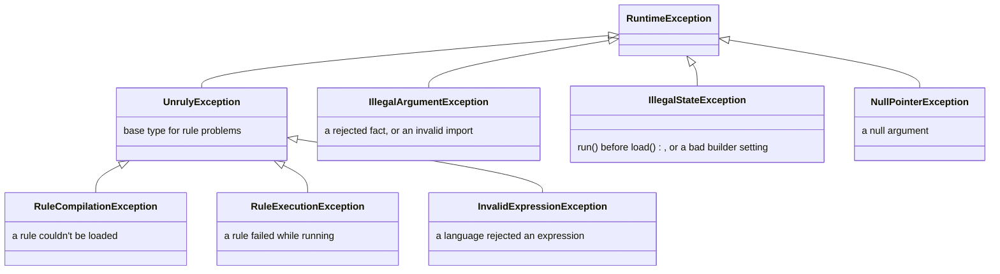

# 🚨 Error handling

The engine throws its own exceptions for rule problems and standard JDK exceptions for misuse of the API.
[Exceptions by method](exceptions-by-method.md) lists what each method throws, and when. Starting from a symptom or a
message? [Troubleshooting](troubleshooting.md) maps each one to the section that explains it.

[← Documentation index](README.md)

- [Exception types](#-exception-types)
- [Exceptions by method](#-exceptions-by-method)
- [Caught when loading or only when running?](#-caught-when-loading-or-only-when-running)
- [Stopping a run](#-stopping-a-run)
- [What happens on each failure](#-what-happens-on-each-failure)
- [Handling failures](#-handling-failures)

---

## 🧬 Exception types



All of them are unchecked. A language throws `InvalidExpressionException` to reject an expression, and `load()`
reports it as the cause of a `RuleCompilationException`.

> [!WARNING]
> `catch (UnrulyException e)` doesn't catch `IllegalArgumentException`, `IllegalStateException` or
> `NullPointerException`. Those signal a programming error rather than a problem with a rule.

## 📋 Exceptions by method

[Exceptions by method](exceptions-by-method.md) lists what each method throws, and when, and what the engine does with
the text of an exception.

## 🔍 Caught when loading or only when running?

`load()` compiles every expression, but MVEL's parser is lenient, so some mistakes in MVEL rules only
surface when a rule is evaluated. Another language decides what it catches when compiling.

| Mistake | Detected by |
| --- | --- |
| `null` or blank condition or action | ✅ `load()` |
| Duplicate rule name | ✅ `load()` |
| A rule in an expression language the engine doesn't have | ✅ `load()` |
| Assignment in a condition, which every conforming language rejects (in MVEL: `applicant.approved = true`, `x++`, `with`, `def`, `import_static`) | ✅ `load()` |
| Most syntax errors (`applicant.creditScore >=`) | ✅ `load()` |
| Some malformed expressions (`true)`, `output.put("k" 1)`) | ⚠️ only `run()` |
| A class that isn't imported (`Objects` without `imports("java.util")`) | ⚠️ only `run()` |
| A misspelled fact or property name | ⚠️ only `run()`, unless MVEL's [strong typing](languages/mvel.md#-strong-typing) is on: then `load()` |
| A condition that isn't a boolean (`applicant.name`) | ⚠️ only `run()` |
| A method call that changes a fact inside a condition (`applicant.setApproved(true)`) | ❌ never |

> [!TIP]
> Don't rely on `load()` alone. Test each rule against sample facts; see
> [Testing rules](writing-rules.md#-testing-rules).

## ⏳ Stopping a run

A run stops once its thread is interrupted or it passes its timeout: before each condition and action, when one
returns, while it waits for a compiled copy, or while it reads the engine's rules again after a reload or `close()`
closed the list it had read; an interrupt also stops it while it waits for a build slot.
[Stopping a run](stopping-runs.md) covers timeouts, what they can't stop, nested runs and what listeners see.

## 🧾 What happens on each failure

What `run()` throws, which [listener](listeners-and-logging.md) callbacks each failure reaches, and how the engine logs
it. The listener column leaves out `beforeRun`, except where a run never gets it. "Names the rule" means
`getRuleName()` returns the rule's name; "no rule" means it returns `null`. A
[fatal error](glossary.md#fatal-error) is a `VirtualMachineError` other than `StackOverflowError`, such as
`OutOfMemoryError`.

| Failure | `run()` throws | Listeners get | Logged |
| --- | --- | --- | --- |
| A condition or action throws, including a `Throwable` that is neither an `Exception` nor an `Error` | `RuleExecutionException` that names the rule | `onError`, then `onRunError`, with that exception | ERROR |
| A condition returns `null` or a non-boolean, an action returns `null`, or a property can't be set | `RuleExecutionException` that names the rule | `onError`, then `onRunError`, with that exception | ERROR |
| The output supplier throws or returns `null` | `RuleExecutionException`, no rule | The conditions' callbacks, then `onRunError`; no `onError` | ERROR |
| More than one rule matches on a unique-match engine | `RuleExecutionException`, no rule, naming every matched rule in its message | The conditions' callbacks, then `onRunError`; no `onError` and no action callback | ERROR |
| A fact name the engine or a language rejects, or a fact that doesn't match its [declaration](facts.md#-declaring-facts) | `IllegalArgumentException` | `onRunError` with that `IllegalArgumentException` | ERROR |
| A language fails to create a session for the run | `RuleExecutionException`, no rule | Nothing, not even `beforeRun`: the run fails before it starts | ERROR |
| The run is stopped between rules | `RuleExecutionException`, no rule, with an `InterruptedException` or `TimeoutException` cause | `onRunError`; the rule it would have gone on to gets nothing | WARN |
| The run is stopped when a condition or action returns, or throws anything with no `Error` in its cause chain | The same as between rules | `onError` with the stop, then `onRunError` | WARN |
| The run is stopped while it waits for a compiled copy | The same as between rules | `beforeRun` only when the wait ends, then `onRunError` | WARN |
| The run is interrupted while it waits for a build slot; a deadline never stops this wait | `RuleExecutionException`, no rule, with an `InterruptedException` cause | `beforeRun` only when the wait ends, then `onRunError` | WARN |
| The run is stopped while it reads the engine's rules again, after a reload or `close()` closed the list it had read | The same as between rules | `beforeRun`, then `onRunError` | WARN |
| A listener throws anything but a fatal error: an exception, an `Error` that isn't fatal, or a `Throwable` that is neither an `Exception` nor an `Error` | Nothing: the run goes on | Every other listener still gets that callback | WARN, with the message escaped and shortened; the stack trace at DEBUG |
| A fatal error from a rule | The error itself | `onError`, then `onRunError`, with a `RuleExecutionException` that names the rule | ERROR |
| A fatal error from `beforeRun`, a `before*` or an `after*` callback | The error itself | Every listener gets that callback first, then `onRunError` | ERROR, naming the listener's error |
| A fatal error from `onError`, closing a failure that isn't fatal itself | The error itself; the reported exception keeps it in `getSuppressed()` | Every listener gets `onError`, then `onRunError` | Only the failure's own line: ERROR, or WARN for a stop |
| A fatal error from `onError`, closing a failure that is fatal itself | The failure's own error; the reported exception keeps the first other one a listener threw in `getSuppressed()` | Every listener gets `onError`, then `onRunError` | The failure's own ERROR line, then `Listener threw exception in onError, kept on the failure: <class>: <message>` at WARN, with the [root-cause note](exceptions-by-method.md) when it applies |
| A fatal error from `afterRun` | The error itself, although the run succeeded | Every listener gets `afterRun`; no `onRunError` | ERROR |
| A fatal error from `onRunError` | That error, in place of the exception the run failed with | Every listener gets `onRunError` | ERROR |
| A fatal error from closing the copy the run gives back, or the retired rules a failed borrow was the last to use (see [A fatal error while closing](thread-safety.md#a-fatal-error-while-closing)) | The error itself, even when the run succeeded; a run failure that isn't fatal goes in its `getSuppressed()`, or is logged at WARN if the error can't keep one | Nothing more: listeners already got `afterRun` or `onRunError`, even a run stopped while it waited for a copy or a build slot, which reports the stop before the error. A language that failed to create a session reaches no listener | WARN; a language that failed to create a session was already logged at ERROR, and a stop while waiting at WARN |
| `run()` before `load()`, on a closed engine, with `null` facts, or the broken engine invariant in [Exceptions by method](exceptions-by-method.md) | `IllegalStateException` or `NullPointerException` | Nothing | Not logged |

> [!NOTE]
> A stack trace or `getClass()` may show `io.github.brantunger.unruly.core.ReportedFailure`. It's an internal subclass
> of `RuleExecutionException` that the engine throws for the failures above. Catch `RuleExecutionException`, and
> never match on the class name.

- **A fatal error from the output supplier** is rethrown the same way; `onRunError` gets a `RuleExecutionException`
  that names no rule. One from a language creating a session reaches no listener, like any other session failure.
- **A `before*` callback that throws a fatal error** is closed with `onError` on every listener, and its condition or
  action doesn't run. The rest of what listeners see is in [Guarantees](listeners-and-logging.md#-guarantees).
- **A condition or action that throws once the run must stop** is a stop, unless an `Error` is anywhere in the cause
  chain of what it threw: that is reported as the rule's own failure, the first row above, at ERROR; see
  [What stops a run](stopping-runs.md#-what-stops-a-run).
- **A run of an empty rule list evaluates nothing**, so an interrupt or a passed deadline can stop it only while it
  waits for a compiled copy, or while it reads the engine's rules again after a reload or `close()` closed the list
  it had read; an interrupt can also stop it while it waits for a build slot. Otherwise it returns normally.

## 🧯 Handling failures

```java
try {
    LoanDecision decision = engine.run(facts);
    // ...
} catch (RuleExecutionException e) {
    if (e.getRuleName() != null) {
        // A rule failed at run time. The message names the rule; getCause() holds the underlying error.
    } else if (e.getCause() instanceof TimeoutException || e.getCause() instanceof InterruptedException) {
        // The run was stopped: it passed its deadline, or its thread was interrupted.
        // A rule's own exception, or a wrong result, as the run stopped is in e.getSuppressed().
    } else {
        // A failure that belongs to no rule, such as an output supplier that threw.
    }
} catch (IllegalArgumentException e) {
    // A fact has a name that rules can't use, or doesn't match what the engine declared.
}
```

`TimeoutException` is `java.util.concurrent.TimeoutException`. Keep in mind:

- **Tell a stop from a failure by its cause.** A stopped run's exception names no rule and has an
  `InterruptedException` or `TimeoutException` cause.
- **A bug near the deadline is usually reported as a stop.** Why what the rule returned was wrong, or what it threw
  with no `Error` in its cause chain, is only in `getSuppressed()`. A throw with an `Error` in its chain stays that
  rule's failure instead; see [What stops a run](stopping-runs.md#-what-stops-a-run).
- **All-matches runs aren't atomic.** Actions that ran before the failing one keep their changes to the output object
  and to any facts they modified. Discard the output object when `run()` throws.
- **A failed reload is safe.** If `load()` throws, the engine keeps the rules it had before, unless it's a
  [fatal error from closing](thread-safety.md#a-fatal-error-while-closing) the replaced rules, after the swap.
- **Failures are already logged.** The engine logs each one at ERROR before throwing, except a run stopped by an
  interrupt or a deadline, and a fatal error from closing sessions or compilers, which are logged at WARN; see
  [Logging setup](listeners-and-logging.md#-logging-setup). The message can contain fact values, copied from the
  exception a rule caused, such as `For input string: "123-45-6789"`. With sensitive facts, turn off the
  `io.github.brantunger.unruly` logger and log a redacted form yourself.
- **Listeners hear about it first.** When a condition or action fails, `onError` and then `onRunError` receive the
  same exception before `run()` throws it. A failing output supplier and a rejected fact name don't reach `onError`,
  because no rule is involved, but they do reach `onRunError`. An expression language that fails to create a session
  fails the run before `beforeRun`, so no listener hears about it.
- **An interrupt isn't lost.** When a rule, listener, output supplier or expression language throws an exception
  caused by an `InterruptedException`, the engine sets the interrupt status again; see
  [What stops a run](stopping-runs.md#-what-stops-a-run).
