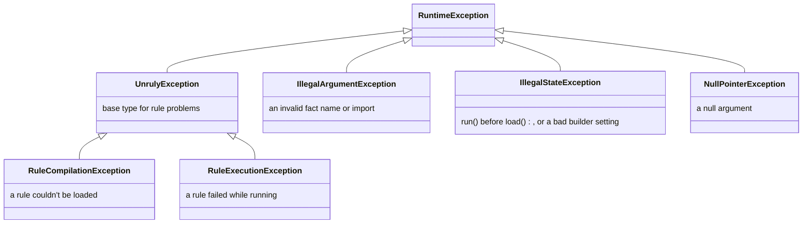

# 🚨 Error handling

The engine throws its own exceptions for rule problems and standard JDK exceptions for misuse of the API.

[← Back to README](../README.md)

- [Exception types](#-exception-types)
- [Exceptions by method](#-exceptions-by-method)
- [Caught when loading or only when running?](#-caught-when-loading-or-only-when-running)
- [Handling failures](#-handling-failures)

---

## 🧬 Exception types



All of them are unchecked.

> [!NOTE]
> `catch (UnrulyException e)` doesn't catch `IllegalArgumentException`, `IllegalStateException` or
> `NullPointerException`. Those signal a programming error rather than a problem with a rule.

## 📋 Exceptions by method

| Method | Exception | When |
| --- | --- | --- |
| `RulesEngineBuilder.firstMatch()` / `allMatches()` | `NullPointerException` | The output supplier is `null` |
| `language()` | `IllegalArgumentException` | The language's name is `null` or blank, or a language with the same name was added already |
| | `NullPointerException` | The language is `null` |
| `defaultLanguage()` | `NullPointerException` | The name is `null` |
| `imports()` / `listener()` / `listeners()` | `NullPointerException` | The argument or an element is `null`. Nothing is added. |
| `maxCopies()` | `IllegalArgumentException` | The limit on compiled copies is less than 1 |
| `runTimeout()` | `IllegalArgumentException` | The timeout is zero or negative |
| `outputType()` / `outputWriter()` / `option()` | `NullPointerException` | An argument is `null` |
| `build()` | `IllegalStateException` | The engine has no expression language; it has several and no default language; the default language, or a language given an option, isn't one of its languages; or a language found with `ServiceLoader` has a `null` or blank name, or two found languages have the same name |
| | `IllegalArgumentException` | An import is neither a loadable class nor a valid package name, or names a class that exists but can't be loaded, for example because a class it extends is missing from the class path |
| | `Error` (rethrown) | `ServiceLoader` fails to create a language it found, for example with a `ServiceConfigurationError`. It's thrown unchanged. |
| `Rule.RuleBuilder.build()` | `IllegalStateException` | The name is `null` or blank, or the condition or action is `null`. The message names the field, such as `ruleName must not be null`. |
| `load(rules)` | `RuleCompilationException` | A rule in the list is `null`; two rules share a name; a condition or action is blank; a condition contains an assignment or `import_static`; an expression has a syntax error its language detects; a rule names an expression language the engine doesn't have; an expression language throws while creating its compiler, or returns `null` instead of a compiler or a compiled expression |
| | `IllegalStateException` | The engine is closed |
| | `NullPointerException` | The list itself is `null` |
| | `Error` (rethrown) | A `VirtualMachineError` other than `StackOverflowError`, such as an `OutOfMemoryError`, is thrown while compiling. It's logged with the rule's name, or the language's name when the language fails to create its compiler, then rethrown unchanged, even when the language wraps it in its own exception. Every other `Error` — including a `NoClassDefFoundError` for a class a rule uses whose dependency is missing from the class path — is reported as a `RuleCompilationException` naming the rule, with the error as its cause. |
| `run(facts)` / `runWithResult(facts)` | `RuleExecutionException` | A condition or action throws; a condition evaluates to `null` or a non-boolean; an action returns `null` instead of an `ActionResult`, or a property it returned can't be set on the output; the output supplier throws or returns `null`; an expression language throws or returns `null` when it creates a session for the run; the run's thread is interrupted, which keeps the interrupt status set and makes the cause an `InterruptedException`; or the run passes its [timeout](#-stopping-a-run), which makes the cause a `TimeoutException` |
| | `IllegalArgumentException` | A fact is named `output`, or has a name rules can't use (see [Facts](facts.md#-naming-rules)); or a [declared fact](facts.md#-declaring-facts) isn't an instance of its type, and, with `requireDeclaredFacts()`, a declared fact is missing or an undeclared one was supplied |
| | `IllegalStateException` | `load()` has never been called, or the engine is closed |
| | `NullPointerException` | `facts` is `null` |
| | `Error` (rethrown) | A `VirtualMachineError` other than `StackOverflowError`, such as `OutOfMemoryError`, comes from a rule, from Java code a rule calls (a method, a getter or a lambda held in a fact), from the output supplier or from a listener. It's rethrown unchanged even when it arrives as the cause of another exception. Every other `Error`, including a `LinkageError` such as `NoClassDefFoundError` or `IllegalAccessError`, is reported as a `RuleExecutionException` naming the rule, with the error as its cause. |
| `RunOptions.withTimeoutOf()` / `withTimeout()` | `IllegalArgumentException` | The timeout is zero or negative |
| `runWithResult(facts, options)` | | As `runWithResult(facts)` |
| `rules()` | `IllegalStateException` | The engine is closed |
| `new Fact<>(...)` | `NullPointerException` | The name is `null`, or the fact to copy or its name is `null` |
| `FactMap` methods | `IllegalArgumentException` | A `null` name, a key that differs from the fact's name, or a duplicate name in the constructor |
| | `NullPointerException` | A `null` map, array, array element, fact or function passed to a constructor or method |

Messages about a specific rule name it, for example
`Failed to evaluate condition for rule 'prime-rate': ...`. In a
message, line breaks and other control characters are escaped (`\n`) in a rule, fact or language name **and in the
text copied from the underlying exception**, so neither a name nor a fact value that a language quoted can start a
log line of its own. A name longer than 200 characters is shortened, and the copied text at 1,000 characters.
The underlying exception itself is never changed: when the expression language or your code threw it, it's available
from `getCause()` and reads exactly as it was written, line breaks and all. An
expression the language rejected, such as a condition with an assignment or an MVEL syntax error, has an
`InvalidExpressionException` as its cause.

`load()` compiles every rule before it throws, so one `RuleCompilationException` reports every rule that
failed: `failures()` has each rule's own exception, and the message lists them, such as
`2 rules failed to compile: Condition for rule 'r1' failed to compile at line 1, column 6: Malformed expression; Action for rule 'r2' ...`.
A failure that isn't about one rule, such as a `null` rule, a duplicate name or a language that can't create its
compiler, is thrown at once.

`getExpressionKind()` on either exception says whether the rule's condition or its action failed. `issues()` on a
`RuleCompilationException` says where the language found each problem, with a line and column when it knows them.

To act on the failing rule without parsing the message, for example to disable it or count failures per rule, call
`getRuleName()` on the `RuleCompilationException` or `RuleExecutionException`. It returns the name exactly as the
rule has it, or `null` for failures that aren't about one rule, such as a failing
output supplier or an expression language that can't create its compiler.

## 🔍 Caught when loading or only when running?

`load()` compiles every expression, but MVEL's parser is lenient, so some mistakes in MVEL rules only
surface when a rule is evaluated. Another language decides what it catches when compiling.

| Mistake | Detected by |
| --- | --- |
| `null` or blank condition or action | ✅ `load()` |
| Duplicate rule name | ✅ `load()` |
| A rule in an expression language the engine doesn't have | ✅ `load()` |
| Assignment in a condition (`applicant.approved = true`, `x++`, `with`, `def`, `import_static`) | ✅ `load()` |
| Most syntax errors (`applicant.creditScore >=`) | ✅ `load()` |
| Some malformed expressions (`true)`, `output.put("k" 1)`) | ⚠️ only `run()` |
| A class that isn't imported (`Objects` without `imports("java.util")`) | ⚠️ only `run()` |
| A misspelled fact or property name | ⚠️ only `run()` |
| A condition that isn't a boolean (`applicant.name`) | ⚠️ only `run()` |
| A method call that changes a fact inside a condition (`applicant.setApproved(true)`) | ❌ never |

> [!TIP]
> Don't rely on `load()` alone. Test each rule against sample facts; see
> [Testing rules](writing-rules.md#-testing-rules).

## ⏱ Stopping a run

A run stops between rules, or when the expression that was running returns, once its thread is interrupted or it
has passed a deadline:

```java
RulesEngine<LoanDecision> engine = RulesEngineBuilder.firstMatch(LoanDecision::new)
        .runTimeout(Duration.ofSeconds(2))
        .build();
```

- The engine checks while a run waits for a compiled copy of the rules, before each condition and each action, and
  again when each one returns. So a run whose last condition or action returns past its deadline throws, even though
  that rule finished. What comes after that check, such as `afterExecute` listeners, isn't timed. A run that must stop throws a
  `RuleExecutionException` whose `getRuleName()` is `null` — an interrupt or a deadline isn't that rule's fault — with
  an `InterruptedException` or a `TimeoutException` as its cause. An interrupted run leaves the interrupt status set,
  so an executor shutting down still sees it.
- **Not inside an expression.** An expression that is already running isn't stopped: MVEL has no hook inside one, so
  `while (true) {}` still blocks the thread for ever. A language that can stop part-way — one built on JEXL's
  cancellation, for example — is given the run's deadline and can stop there; see
  [Other expression languages](languages/custom.md#-stopping-a-run).
- **Nothing is rolled back.** What ran before the run stopped keeps its effects, like any other failed run.
- `runWithResult(facts, RunOptions.withTimeoutOf(Duration.ofMillis(200)))` gives one run a timeout instead of the engine's.
  A run can be given a longer timeout than the engine's, but not none at all.
- **A run started from inside another run** on the same thread, such as one an action starts on another engine,
  stops at whichever deadline comes first: its own, or the outer run's. A run started on another thread doesn't
  inherit it.
- **A condition or action that throws once the run is cancelled** stops the run the same way, instead of failing its
  rule. That's what happens when a run an action started stops at the deadline it inherited, or when a language gives
  up by throwing. The rule's `before*` callback is closed with `onError` and the stop exception, and what the
  expression threw is kept as a suppressed exception.
- A stopped run is logged at **WARN**, not ERROR: the caller asked for it, and no rule failed. Listeners get
  `beforeRun` and `onRunError`. Stopped between rules, the rule it would have gone on to gets no callback at all,
  because it never started; stopped when a condition or action returns or throws, that rule gets `onError`.

> [!TIP]
> A caller that catches the failure and goes on to serve the next request **on the same thread** must clear the
> interrupt status first, for example with `Thread.interrupted()`. The engine leaves it set on purpose, and every
> later run on that thread stops at its first rule.

## 🛠 Handling failures

```java
try {
    LoanDecision decision = engine.run(facts);
    // ...
} catch (RuleExecutionException e) {
    // A rule failed at run time. The message names the rule; getCause() holds the underlying error.
} catch (IllegalArgumentException e) {
    // A fact has a name that rules can't use.
}
```

Keep in mind:

- **All-matches runs aren't atomic.** Actions that ran before the failing one keep their changes to the output object
  and to any facts they modified. Discard the output object when `run()` throws.
- **A failed reload is safe.** If `load()` throws, the engine keeps the rules it had before.
- **Failures are already logged.** The engine logs each one at ERROR before throwing, except a run stopped by an
  interrupt or a deadline, which is a WARN; see
  [Logging setup](listeners-and-logging.md#-logging-setup). The message can contain fact values, copied from the
  exception a rule caused, such as `For input string: "123-45-6789"`. With sensitive facts, turn off the
  `io.github.brantunger.unruly` logger and log a redacted form yourself.
- **Listeners hear about it first.** When a condition or action fails, `onError` receives the same exception before
  `run()` throws it. A failing output supplier, a rejected fact name and an expression language that fails to create
  a session are thrown without calling any listener.
- **An interrupt isn't lost.** If a rule, listener, output supplier or expression language is interrupted while it
  blocks, for example in `Thread.sleep` or `BlockingQueue.take`, the `InterruptedException` clears the thread's
  interrupt status and reaches the engine wrapped. The engine sets the status again before it throws, and the run
  stops at the next rule rather than carrying on, so an executor shutting down or `Future.cancel(true)` still sees
  the interrupt and no more actions fire. A listener that swallows an interrupt doesn't hide it: the check before the
  next rule finds it. An `InterruptedIOException` such as `SocketTimeoutException` isn't treated as an interrupt.
