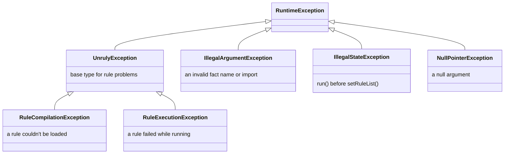

# 🚨 Error handling

The engine throws its own exceptions for rule problems and standard JDK exceptions for misuse of the API.

[← Back to README](../README.md)

- [Exception types](#-exception-types)
- [Exceptions by method](#-exceptions-by-method)
- [Caught when loading or only when running?](#-caught-when-loading-or-only-when-running)
- [Handling failures](#-handling-failures)

---

## 🧬 Exception types



All of them are unchecked.

> [!NOTE]
> `catch (UnrulyException e)` doesn't catch `IllegalArgumentException`, `IllegalStateException` or
> `NullPointerException`. Those signal a programming error rather than a problem with a rule.

## 📋 Exceptions by method

| Method | Exception | When |
| --- | --- | --- |
| `RulesEngineBuilder.stateless()` / `stateful()` | `NullPointerException` | The output supplier is `null` |
| | `IllegalArgumentException` | The limit on compiled copies, `maxCopies`, is less than 1 |
| `setRuleList(rules)` | `RuleCompilationException` | A rule in the list is `null`; two rules share a name; a condition or action is `null` or blank; a condition contains an assignment or `import_static`; an expression has a syntax error its language detects; a rule names an expression language that isn't registered; an expression language throws while creating its compiler, or returns `null` instead of a compiler or a compiled expression |
| | `NullPointerException` | The list itself is `null` |
| | `Error` (rethrown) | An `Error` other than `StackOverflowError` or `AssertionError` is thrown while compiling, such as a `NoClassDefFoundError` for a class a rule uses whose dependency is missing from the class path. It's logged with the rule's name, or the language's name when the language fails to create its compiler, then rethrown unchanged, even when the language wraps it in its own exception. Before 1.2.0 it was wrapped in a `RuleCompilationException`. |
| `run(facts)` | `RuleExecutionException` | A condition or action throws; a condition evaluates to `null` or a non-boolean; an action returns `null` instead of an `ActionResult`, or a property it returned can't be set on the output; the output supplier throws or returns `null`; an expression language throws or returns `null` when it creates a session for the run; on an engine with a limit on compiled copies, the thread is interrupted while the run waits for one (the interrupt status stays set) |
| | `IllegalArgumentException` | A fact is named `output`, or has a name rules can't use (see [Facts](facts.md#-naming-rules)) |
| | `IllegalStateException` | `setRuleList()` has never been called |
| | `NullPointerException` | `facts` is `null` |
| | `Error` (rethrown) | An `Error` other than `StackOverflowError` or `AssertionError`, such as `OutOfMemoryError`, comes from a rule, from Java code a rule calls (a method, a getter or a lambda held in a fact), from the output supplier or from a listener. It's rethrown unchanged even when it arrives as the cause of another exception. |
| `addImport()` / `addImports()` | `IllegalArgumentException` | A string is neither a loadable class nor a valid package name, or names a class that exists but can't be loaded, for example because a class it extends is missing from the class path. Nothing is imported. |
| | `NullPointerException` | The argument or an element is `null` |
| `registerLanguage()` | `IllegalArgumentException` | The language's name is `null` or blank |
| | `NullPointerException` | The language is `null` |
| `registerListener()` / `registerListeners()` | `NullPointerException` | The listener, list or an element is `null`. Nothing is registered. |
| `FactMap` methods | `IllegalArgumentException` | A `null` name, a key that differs from the fact's name, or a duplicate name in the constructor |
| | `NullPointerException` | A `null` map, array, array element, fact or function passed to a constructor or method |

Messages about a specific rule name it, for example
`Failed to evaluate condition for rule 'prime-rate': ...`. A rule without a name appears as `(unnamed)`. In a
message, line breaks and other control characters in a rule, fact or language name are escaped (`\n`), and a name
longer than 200 characters is shortened, so a name can't start a log line of its own.
When the expression language or your code threw the underlying error, it's available from `getCause()`. An
expression the language rejected, such as a condition with an assignment or an MVEL syntax error, has an
`InvalidExpressionException` as its cause.

`setRuleList()` compiles every rule before it throws, so one `RuleCompilationException` reports every rule that
failed: `failures()` has each rule's own exception, and the message lists them, such as
`2 rules failed to compile: Condition for rule 'r1' failed to compile at line 1, column 6: Malformed expression; Action for rule 'r2' ...`.
A failure that isn't about one rule, such as a `null` rule, a duplicate name or a language that can't create its
compiler, is thrown at once.

`getExpressionKind()` on either exception says whether the rule's condition or its action failed. `issues()` on a
`RuleCompilationException` says where the language found each problem, with a line and column when it knows them.

To act on the failing rule without parsing the message, for example to disable it or count failures per rule, call
`getRuleName()` on the `RuleCompilationException` or `RuleExecutionException`. It returns the name exactly as the
rule has it, or `null` for a rule without a name and for failures that aren't about one rule, such as a failing
output supplier or an expression language that can't create its compiler.

## 🔍 Caught when loading or only when running?

`setRuleList()` compiles every expression, but MVEL's parser is lenient, so some mistakes in MVEL rules only
surface when a rule is evaluated. Another language decides what it catches when compiling.

| Mistake | Detected by |
| --- | --- |
| `null` or blank condition or action | ✅ `setRuleList()` |
| Duplicate rule name | ✅ `setRuleList()` |
| A rule in an expression language that isn't registered | ✅ `setRuleList()` |
| Assignment in a condition (`applicant.approved = true`, `x++`, `with`, `def`, `import_static`) | ✅ `setRuleList()` |
| Most syntax errors (`applicant.creditScore >=`) | ✅ `setRuleList()` |
| Some malformed expressions (`true)`, `output.put("k" 1)`) | ⚠️ only `run()` |
| A class that isn't imported (`Objects` without `addImport("java.util")`) | ⚠️ only `run()` |
| A misspelled fact or property name | ⚠️ only `run()` |
| A condition that isn't a boolean (`applicant.name`) | ⚠️ only `run()` |
| A method call that changes a fact inside a condition (`applicant.setApproved(true)`) | ❌ never |

> [!TIP]
> Don't rely on `setRuleList()` alone. Test each rule against sample facts; see
> [Testing rules](writing-rules.md#-testing-rules).

## 🛠 Handling failures

```java
try {
    LoanDecision decision = engine.run(facts);
    // ...
} catch (RuleExecutionException e) {
    // A rule failed at run time. The message names the rule; getCause() holds the underlying error.
} catch (IllegalArgumentException e) {
    // A fact has a name that rules can't use.
}
```

Keep in mind:

- **Stateful runs aren't atomic.** Actions that ran before the failing one keep their changes to the output object
  and to any facts they modified. Discard the output object when `run()` throws.
- **A failed reload is safe.** If `setRuleList()` throws, the engine keeps the rules it had before.
- **Failures are already logged.** The engine logs each one at ERROR before throwing; see
  [Logging setup](listeners-and-logging.md#-logging-setup). The message can contain fact values, copied from the
  exception a rule caused, such as `For input string: "123-45-6789"`. With sensitive facts, turn off the
  `io.github.brantunger.unruly` logger and log a redacted form yourself.
- **Listeners hear about it first.** When a condition or action fails, `onError` receives the same exception before
  `run()` throws it. A failing output supplier, a rejected fact name and an expression language that fails to create
  a session are thrown without calling any listener.
- **An interrupt isn't lost.** If a rule, listener, output supplier or expression language is interrupted while it
  blocks, for example in `Thread.sleep` or `BlockingQueue.take`, the `InterruptedException` clears the thread's
  interrupt status and reaches the engine wrapped. The engine sets the status again before it throws or carries on,
  so an executor shutting down or `Future.cancel(true)` still sees it. An `InterruptedIOException` such as
  `SocketTimeoutException` isn't treated as an interrupt.
