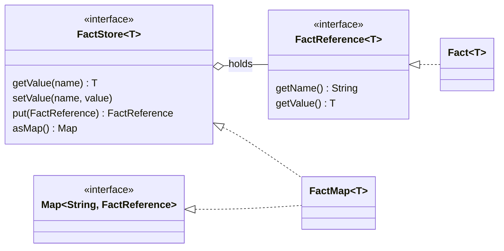

# 📁 Facts

> [!NOTE]
> Describes 2.0.0, which isn't released yet. For 1.8.0, see
> [this page at v1.8.0](https://github.com/brantunger/unruly-engine/blob/v1.8.0/docs/facts.md).

Facts are the inputs to a run. Each fact has a **name**, which rules use as a variable, and a **value**, which is
any Java object.

[← Documentation index](README.md)

- [The fact types](#-the-fact-types)
- [Adding facts](#-adding-facts)
- [Naming rules](#-naming-rules)
- [Declaring facts](#-declaring-facts)
- [Null and missing facts](#-null-and-missing-facts)
- [Generics](#-generics)
- [Copying and sharing](#-copying-and-sharing)

---

## 🧱 The fact types



| Type | Kind | Role |
| --- | --- | --- |
| `FactReference<T>` | interface | A named value |
| `Fact<T>` | final class | The built-in `FactReference`. Its name and value can't change. |
| `FactStore<T>` | interface | Facts keyed by name: `getValue`, `setValue`, `put`, and a read-only `asMap()` view |
| `FactMap<T>` | class | The built-in `FactStore`, backed by a `HashMap`. It's also a `Map<String, FactReference<T>>`. |

The engine reads the store through `asMap()`: each **key** is a variable name, bound to its fact's **value**.

## ➕ Adding facts

```java
FactStore<Object> facts = new FactMap<>();

// The simplest way: a name and a value
facts.setValue("applicant", new Applicant("Ada", 780));

// Or add a Fact object
facts.put(new Fact<>("order", Map.of("id", 42)));

// Read a value back
Applicant applicant = (Applicant) facts.getValue("applicant");
```

`FactMap` also has constructors that take `Fact` objects (`new FactMap<>(fact1, fact2)`) or copy another map
(`new FactMap<>(otherMap)`).

A `FactStore` isn't a `Map`. To read every fact, use `facts.asMap()`, a read-only view that follows later changes. A
variable declared as `FactMap` has the `Map` methods too, such as `remove` and `clear`.

Any readable property works in a rule. `applicant.creditScore` calls a JavaBean getter (`getCreditScore()`), a
record accessor (`creditScore()`) or looks up a `Map` key.

## 🔤 Naming rules

A rule can only refer to a fact whose name reads as a single variable in its expression language. The table shows
MVEL's rules. `run()` checks each fact against every language the loaded rules use, or against the engine's
default language when the rule list is empty, and another language decides which names it rejects.

| ✅ Allowed | ❌ Rejected | Why |
| --- | --- | --- |
| `applicant`, `order2`, `_ctx` | `my-fact`, `2nd`, `first name` | Not a Java identifier (`my-fact` would read as `my - fact`) |
| `claim` | `empty`, `null`, `true`, `nil`, `in`, `is`, `if`, `def`, `new`, `with`, `contains`, `foreach`, `isdef`, `this`, ... | A reserved MVEL word |
| `math` | `Math`, `String`, `System`, `Integer`, ... | A class MVEL always resolves |
| `date` | `Date` on an engine built with `imports("java.util")` | A class from an import |
| `result` | `output` | Reserved for the output object |

The checks happen in two places, and both throw `IllegalArgumentException`:

- **`FactMap`** rejects a `null` name, a key that differs from the fact's own name
  (`put("claim", new Fact<>("other", 1))`), and two facts with the same name in its constructor.
- **`run()`** rejects any name in the table above, whichever `FactStore` implementation you use.

A `Fact` needs a name: `new Fact<>(null, value)` throws `NullPointerException`.

## 📣 Declaring facts

Tell the engine which facts its rules use, and what type each one is. Nothing has to be declared, and an engine that
declares nothing behaves exactly as before.

```java
RulesEngine<LoanDecision> engine = RulesEngineBuilder.firstMatch(LoanDecision::new)
        .outputType(LoanDecision.class)
        .fact("applicant", Applicant.class)
        .fact("amount", Integer.class)
        .requireDeclaredFacts()
        .build();
```

- **`fact(name, type)`** says what a run's value must be. A run that supplies something else fails with
  `IllegalArgumentException` naming the fact. A `null` value passes, because nothing about it contradicts the
  declaration. A run that leaves the fact out is unaffected. A primitive type is declared as its wrapper, so
  `fact("age", int.class)` accepts an `Integer`. Declaring `output` fails at once, and `load()` fails for a declared
  name the rules' languages can't refer to.
- **`facts(map)`** declares several at once. Declaring the same name twice keeps the last type.
- **`requireDeclaredFacts()`** says the declarations are the *whole* list: a run that supplies a fact nobody declared,
  or leaves a declared one out, fails with `IllegalArgumentException`.

### Catching a typo when the rules load

`requireDeclaredFacts()` is also what lets a language check the rules themselves. MVEL does it when you turn on its
`strongTyping` option: it compiles the rules with strong typing, so a misspelled property or an unknown fact fails
`load()` with the line and column instead of failing a run:

```java
RulesEngine<LoanDecision> engine = RulesEngineBuilder.firstMatch(LoanDecision::new)
        .outputType(LoanDecision.class)
        .fact("applicant", Applicant.class)
        .requireDeclaredFacts()
        .option("mvel", "strongTyping", "true")
        .build();

engine.load(List.of(Rule.builder().ruleName("prime-rate")
        .condition("applicant.creditScor >= 750")   // RuleCompilationException: unqualified type ... creditScor
        .action("output.interestRate = 6.9").build()));
```

Strong typing only works when MVEL can check everything, so with the option on, `load()` fails, saying why, unless
all of these hold:

| Needed | Why |
| --- | --- |
| `requireDeclaredFacts()`, and at least one fact declared | Otherwise a name nobody declared may still be supplied at run time, so it isn't a mistake |
| No fact declared as `Object`, a `Map`, a `Collection`, or an array of one of them | MVEL's strict mode rejects `order.id` on a `Map`, `items[0].qty` on a `List` and any property of an `Object`, so one such fact would reject working rules |
| `outputType(...)` set to a type that isn't one of those | An action writes to `output`, so its type has to be checkable too |

Strong typing also rejects some rules that work without it: a `foreach` variable needs a type
(`foreach (int n : list) { ... }`), a map's entries are read by key (`m['a']`, not `m.a`), and `def` functions can't be
used. See
[MVEL](languages/mvel.md#-strong-typing). The option is off by default, so declaring facts never changes what compiles.
The engine's own checks on a run's facts don't depend on it, and neither does any other language: each one is told
what was declared and uses it as it can.

> [!NOTE]
> Strong typing doesn't catch a non-boolean condition; the engine checks that itself, on every engine.

## 🚫 Null and missing facts

| Situation | In a rule |
| --- | --- |
| A fact whose value is `null` | The variable is `null`, so `coapplicant == null` is `true` |
| No fact with that name in the store | Referring to it throws `unresolvable property or identifier` |

To check whether a fact was supplied at all, use `isdef`. It is also `true` for a fact whose value is `null`, so
check for `null` too before reading a property:

```java
.condition("isdef coapplicant && coapplicant != null && coapplicant.creditScore >= 700")
```

## 🔣 Generics

`run()` accepts a `FactStore` of any type, so a `FactMap<Applicant>` works as well as a `FactStore<Object>`.

## 📋 Copying and sharing

- `setValue` always stores a **new** `Fact`. A `FactMap` copied from another (`new FactMap<>(other)`) can
  therefore be changed with `setValue` without affecting the original.
- The copy is **shallow**. `Fact` objects added with `put` and the values themselves are shared. A `Fact` can't
  change, so sharing one is safe, but a value such as an `Applicant` is the same object in both maps.
- The engine doesn't copy fact values either. If an action calls a method that changes a fact, such as
  `applicant.setCreditScore(0)`, rules that fire later in the same run see the change.

> [!IMPORTANT]
> Build a fresh `FactStore` for each request and don't share one between threads. The engine itself is safe to
> share; see [Thread safety](thread-safety.md).
