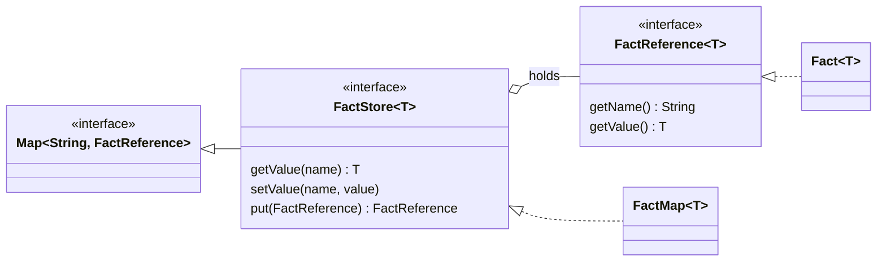

# 🗂️ Facts

Facts are the inputs to a run. Each fact has a **name**, which rules use as a variable, and a **value**, which is
any Java object.

[← Back to README](../README.md)

- [The fact types](#-the-fact-types)
- [Adding facts](#-adding-facts)
- [Naming rules](#-naming-rules)
- [Null and missing facts](#-null-and-missing-facts)
- [Generics](#-generics)
- [Copying and sharing](#-copying-and-sharing)

---

## 🧱 The fact types



| Type | Kind | Role |
| --- | --- | --- |
| `FactReference<T>` | interface | A named value |
| `Fact<T>` | class | The built-in `FactReference` |
| `FactStore<T>` | interface | A `Map<String, FactReference<T>>` keyed by fact name, plus value-level helpers |
| `FactMap<T>` | class | The built-in `FactStore`, backed by a `HashMap` |

The engine reads each entry's **key** as the variable name and binds it to the fact's **value**.

## ➕ Adding facts

```java
FactStore<Object> facts = new FactMap<>();

// The simplest way: a name and a value
facts.setValue("applicant", new Applicant("Ada", 780));

// Or add a Fact object
facts.put(new Fact<>("order", order));

// Read a value back
Applicant applicant = (Applicant) facts.getValue("applicant");
```

`FactMap` also has constructors that take `Fact` objects (`new FactMap<>(fact1, fact2)`) or copy another map
(`new FactMap<>(otherMap)`).

Any readable property works in a rule. `applicant.creditScore` calls a JavaBean getter (`getCreditScore()`), a
record accessor (`creditScore()`) or looks up a `Map` key.

> [!TIP]
> Use `new Fact<>(name, value)` rather than `new Fact<>(value)`. The one-argument constructor names the fact after
> `value.toString()`, such as `"java.lang.Object@4501b7af"`, which rules usually can't refer to.

## 🏷 Naming rules

A rule can only refer to a fact whose name reads as a single MVEL variable.

| ✅ Allowed | ❌ Rejected | Why |
| --- | --- | --- |
| `applicant`, `order2`, `_ctx` | `my-fact`, `2nd`, `first name` | Not a Java identifier (`my-fact` would read as `my - fact`) |
| `claim` | `empty`, `null`, `true`, `nil`, `in`, `is`, `if`, `def`, `new`, `with`, `contains`, `foreach`, `isdef`, `this`, ... | A reserved MVEL word |
| `math` | `Math`, `String`, `System`, `Integer`, ... | A class MVEL always resolves |
| `date` | `Date` after `addImport("java.util")` | A class from an import |
| `result` | `output` | Reserved for the output object |

The checks happen in two places, and both throw `IllegalArgumentException`:

- **`FactMap`** rejects a `null` name, a key that differs from the fact's own name
  (`put("claim", new Fact<>("other", 1))`), and two facts with the same name in its constructor.
- **`run()`** rejects any name in the table above, whichever `FactStore` implementation you use.

Rules see a fact by its map key, so renaming a `Fact` after adding it doesn't change the name rules use.

## 🕳 Null and missing facts

| Situation | In a rule |
| --- | --- |
| A fact whose value is `null` | The variable is `null`, so `coapplicant == null` is `true` |
| No fact with that name in the store | Referring to it throws `unresolvable property or identifier` |

To check whether a fact was supplied at all, use `isdef`. It is also `true` for a fact whose value is `null`, so
check for `null` too before reading a property:

```java
.condition("isdef coapplicant && coapplicant != null && coapplicant.creditScore >= 700")
```

## 🔣 Generics

`run()` accepts a `FactStore<Object>`. Java generics are invariant, so a `FactMap<Applicant>` isn't accepted even
when every value is an `Applicant`. Declare the store as `FactStore<Object>`, or write `new FactMap<>()` where the
target type is `FactStore<Object>`.

## 📋 Copying and sharing

- `setValue` always stores a **new** `Fact`. A `FactMap` copied from another (`new FactMap<>(other)`) can
  therefore be changed with `setValue` without affecting the original.
- The copy is **shallow**. `Fact` objects added with `put` and the values themselves are shared, and calling
  `setValue` on a shared `Fact` object changes it in every map that holds it.
- The engine doesn't copy fact values either. If an action calls a method that changes a fact, such as
  `applicant.setCreditScore(0)`, rules that fire later in the same run see the change.

> [!IMPORTANT]
> Build a fresh `FactStore` for each request and don't share one between threads. The engine itself is safe to
> share; see [Thread safety](thread-safety.md).
