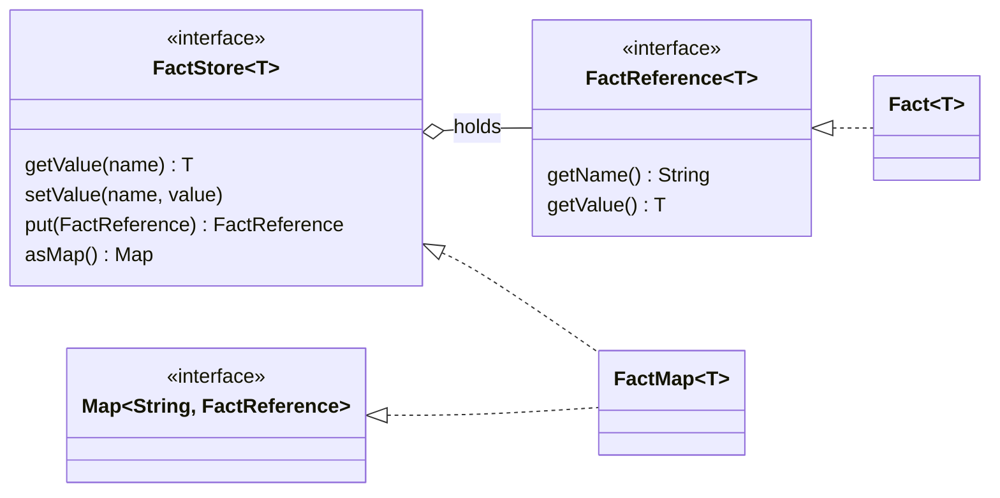
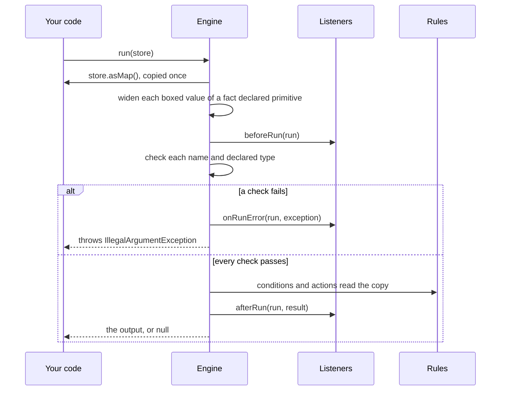

# 📁 Facts

Facts are the inputs to a run. Each fact has a **name**, which rules use as a variable, and a **value**, which is
any Java object.

**Who it's for:** rule authors and application developers.
**You'll be able to:** give a run its facts, name them so rules can see them, tell a `null` fact from a missing one,
declare the facts an engine expects, and reuse or implement a fact store safely.
**Before you start:** the [Quick start](../README.md#-quick-start).

[← Documentation index](README.md)

- [The fact types](#-the-fact-types)
- [Adding facts](#-adding-facts)
- [Naming rules](#-naming-rules)
- [Null and missing facts](#-null-and-missing-facts)
- [Reading a fact's properties](#-reading-a-facts-properties)
- [Who sees facts](#-who-sees-facts)
- [Reusing and sharing a store](#-reusing-and-sharing-a-store)
- [Declaring facts](#-declaring-facts)
- [Implementing FactStore](#-implementing-factstore)

---

## 🧱 The fact types



| Type | Kind | Role |
| --- | --- | --- |
| `FactReference<T>` | interface | A named value |
| `Fact<T>` | final class | The built-in `FactReference`. Its name and value can't change. |
| `FactStore<T>` | interface | Facts keyed by name: `getValue`, `setValue`, `put`, and a read-only `asMap()` view |
| `FactMap<T>` | class | The built-in `FactStore`, backed by a `HashMap` and not synchronised. It's also a `Map<String, FactReference<T>>`. |

The engine reads the store through `asMap()`, once, when the run starts: each **key** is a variable name, bound to its
fact's **value**. See [Reusing and sharing a store](#-reusing-and-sharing-a-store).

## ➕ Adding facts

```java
FactStore<Object> facts = new FactMap<>();

// The simplest way: a name and a value
facts.setValue("applicant", new Applicant("Ada", 780));

// Or add a Fact object
facts.put(new Fact<>("order", Map.of("id", 42)));

// Read a value back
Applicant applicant = (Applicant) facts.getValue("applicant");
```

`FactMap` also has constructors that take `Fact` objects (`new FactMap<>(fact1, fact2)`) or copy another map
(`new FactMap<>(otherMap)`).

A `FactStore` isn't a `Map`. To read every fact, use `facts.asMap()`, a read-only view that follows later changes. A
variable declared as `FactMap` has the `Map` methods too, such as `remove` and `clear`.

`run()` accepts a `FactStore` of any type, so a `FactMap<Applicant>` works as well as a `FactStore<Object>`.

### Copies of a FactMap

- `setValue` always stores a **new** `Fact`. A `FactMap` copied from another (`new FactMap<>(other)`) can
  therefore be changed with `setValue` without affecting the original.
- The copy is **shallow**. `Fact` objects added with `put` and the values themselves are shared. A `Fact` can't
  change, so sharing one is safe, but a value such as an `Applicant` is the same object in both maps.

## 🔤 Naming rules

A rule can only refer to a fact whose name its expression language can read as a variable. Two rules hold for every
language, and each language adds its own.

| Name | Every language | Why |
| --- | --- | --- |
| `null` (only a custom `FactStore` can hold one) | ❌ rejected | `fact name must not be null` |
| `output` | ❌ rejected | `'output' is reserved for the output object and cannot be used as a fact name` |
| `Output`, `OUTPUT` | ✅ allowed | The check is exact and case-sensitive |
| Anything else | The rules' languages decide | Each language rejects the names it can't refer to |

`run()` checks each fact's name, and throws `IllegalArgumentException` for the first one that breaks a rule:

- It checks against every language the loaded rules use, or the engine's default language when the rule list is
  empty. A language that has no rules in the list isn't asked.
- The check comes after listeners get `beforeRun` and before any condition runs, so it reaches `onRunError`, and no
  output object is created.
- **`FactMap`** already rejects a `null` name, a key that differs from the fact's own name
  (`put("claim", new Fact<>("other", 1))`), and two facts with the same name in its constructor, each with
  `IllegalArgumentException`.

A `Fact` needs a name: `new Fact<>(null, value)` throws `NullPointerException`.

**In MVEL,** a name must be a Java identifier, and can't be a reserved word such as `empty` or `in`, or a class name
MVEL resolves, such as `Math` or a class you import. See
[Fact names MVEL rejects](languages/mvel.md#fact-names-mvel-rejects) for the full list and the messages.

## 🚫 Null and missing facts

A fact whose value is `null` and a fact that isn't there are different things to the engine:

| In the store | The run's facts | Declared type check | With `requireDeclaredFacts()` |
| --- | --- | --- | --- |
| A value `null`: `setValue("x", null)` | Key `x`, value `null` | Passes | Counts as supplied |
| A null `FactReference`: `put("x", null)` on a `FactMap` | Key `x`, value `null` | Passes | Counts as supplied |
| No entry named `x` | No key `x` | Not checked | Fails: `Fact 'x' was declared, but the run didn't supply it, ...` |

A language tells the first two from the third with `facts().containsKey(name)`. `FactStore.getValue(name)` can't:
it returns `null` in all three cases.

**In MVEL,** `x == null` is `true` for the first two, and fails the run for a missing fact. Use `isdef x` to check
that a fact was supplied. See [Null and missing facts in MVEL](languages/mvel.md#null-and-missing-facts) for the
messages and for a `Map` fact without a key.

## 🧲 Reading a fact's properties

The engine hands each language the fact values as they are. It doesn't read properties itself: when a rule writes
`applicant.creditScore`, the rule's language decides what that means and what happens when the property isn't there.

| Fact | MVEL | A language using `FactProperties` |
| --- | --- | --- |
| Public record or JavaBean | ✅ accessor or getter | ✅ component or getter |
| `Map` with the key | ✅ | ✅ exact `String` key |
| `Map` without the key | ❌ `could not access: <key>` | ❌ `IllegalArgumentException` |
| Public field, no getter | ✅ | ❌ not a property |
| Class that isn't public | ⚠️ only through a public interface declaring the accessor, even on the class path | ✅ through a public interface, or where its package is open |

`FactProperties` is a helper a language may use, and MVEL doesn't. Its rules are in
[Reading facts](languages/custom.md#-reading-facts); MVEL's are in
[Facts in MVEL](languages/mvel.md#-facts-in-mvel). Check another language's own documentation.

## 👀 Who sees facts

Everything that sees a run's facts gets the values the engine copied when the run started, as a read-only view:

| Who | Gets the facts | How |
| --- | :---: | --- |
| Conditions | ✅ | `EvaluationContext.facts()` |
| Actions | ✅ | `ActionContext.facts()`, and `output` |
| `beforeRun`, `afterRun`, `onRunError` | ✅ | `run.facts()` on the `RunContext` |
| `beforeEvaluate`, `afterEvaluate` | ✅ | The `facts` argument, the same view as `run.facts()` |
| `beforeExecute`, `afterExecute` | ❌ | Only the rule and the output object |
| `onError` | ❌ | Only the rule and the exception |

- A write to a view throws `UnsupportedOperationException`. Putting a fact names it, for example
  `The facts passed to an action are read-only; 'applicant' can't be changed. Put the result in the output object
  instead.`
- A view doesn't stop a method call that changes a fact's value, such as `applicant.setCreditScore(0)`. Every rule
  after it in the run, the listeners and your own code see the change. See
  [What rules can change](writing-rules.md#-what-rules-can-change).
- A listener that needs the facts in `beforeExecute` or `afterExecute` can keep `run.facts()` from `beforeRun`: rule
  callbacks come on the run's own thread, between its `beforeRun` and its `afterRun` or `onRunError`.

## 🔁 Reusing and sharing a store

A run copies the store's entries **once, when it starts**, and never reads the store again. The engine promises this:

- **One run after another** can use the same store. Change it between runs, and the next run sees the change.
- **A fact added, replaced or removed during a run**, by a listener, an action or another thread, isn't seen by that
  run.
- **A change inside a fact's value** is seen. The engine reads each fact's value once, when the run starts, and every
  rule and listener gets that same object (a [widened](#primitive-types-widen) value is a new wrapper), so an
  `Applicant` changed by its setter is changed for every later rule, listener and the caller. A `FactReference` that
  would return a different object later in the run isn't asked again.



The copy is taken before the run waits for a [compiled copy](glossary.md#compiled-copy) of the rules, and before
`beforeRun`; a boxed primitive whose fact is declared with a primitive type is [widened](#primitive-types-widen)
in the copy. The run then checks every fact against the engine's and the languages' naming rules and the declared
types; a failure reaches `onRunError` and `run()` throws `IllegalArgumentException`. Otherwise conditions and actions
read the copy, listeners get `afterRun`, and `run()` returns.

> [!WARNING]
> A `FactMap` is an unsynchronised `HashMap`. Never change one while another thread's run may be copying it: that run
> can miss or mix up facts, or throw `ConcurrentModificationException`.

A new store for each request is the simplest way to stay safe. Two concurrent runs may read the same store if nothing
changes it, but they also share every value in it, so a value one run's rules change is changed for the other. See
[Thread safety](thread-safety.md).

## 📣 Declaring facts

Tell the engine which facts its rules use, and what type each one is. Nothing has to be declared, and an engine that
declares nothing behaves exactly as before.

```java
RulesEngine<LoanDecision> engine = RulesEngineBuilder.firstMatch(LoanDecision::new)
        .outputType(LoanDecision.class)
        .fact("applicant", Applicant.class)
        .fact("amount", Integer.class)
        .requireDeclaredFacts()
        .build();
```

- **`fact(name, type)`** says what a run's value must be. A run that supplies something else fails with
  `IllegalArgumentException` naming the fact. A `null` value passes, because nothing about it contradicts the
  declaration. A run that leaves the fact out is unaffected. A primitive type [widens](#primitive-types-widen), and a
  `null` for one stays `null`. Declaring the same name twice keeps the last type. Declaring `output` fails at once,
  and `load()` fails for a declared name the rules' languages can't refer to.
- **Only the class is checked.** `fact("items", List.class)` accepts any `List`, whatever its elements are.
- **`facts(map)`** declares several at once, as `fact()` does each one.
- **`requireDeclaredFacts()`** says the declarations are the *whole* list: a run that supplies a fact nobody declared,
  or leaves a declared one out, fails with `IllegalArgumentException`.

### Primitive types widen

A fact declared with a primitive type, such as `fact("n", long.class)`, accepts a boxed primitive that Java widens to
it ([JLS 5.1.2](https://docs.oracle.com/javase/specs/jls/se21/html/jls-5.html#jls-5.1.2)): along `byte`, `short`,
`int`, `long`, `float`, `double`, and from `char` to `int` or further. The engine converts the value to the declared
type's wrapper when it copies the store, before `beforeRun`, so an `Integer` 5 reaches listeners,
`RunContext.facts()` and every language as a `Long` 5. Your store isn't changed. A language's
`CompileContext.declaredFacts()` still reports `Long`.

It is lossy exactly as in Java: an `Integer` or `Long` can round in a `float` fact, a `Long` beyond ±2^53 in a
`double` one, and a `Character` in an `int` fact becomes its code, 97 for `'a'`.

Nothing else is converted: a `Long` or `Double` for an `int` fact, a `BigDecimal`, a `BigInteger`, or a `Boolean`
for a number fails. When the declared type is primitive and the value is a number, a character or a boolean, the
message ends `(a value is only widened as Java widens a primitive, never narrowed or converted)`; any other value,
such as a `String`, gets only `Fact 'n' was declared as int, but the run supplied a java.lang.String`.

A wrapper declaration doesn't widen and never adds the clause: `fact("n", Long.class)` rejects an `Integer`, as Java
never turns an `Integer` into a `Long`, so declare `long.class` to accept narrower numbers. The
[default output writer](engines-and-runs.md#how-actions-change-it) uses the same widening rules.

A `null` passes a primitive declaration too, and stays `null`, where Java would throw `NullPointerException` as it
unboxed it. What happens next depends on where it goes. The default output writer never passes it to a primitive
setter, so it fails the rule unless another setter of that name takes `null`. In MVEL, `output.x = n` stores `0` in
an `int` property, while `output.setX(n)` fails the rule; see
[Assignment gotchas](languages/mvel-gotchas.md#-assignment-gotchas).

### Catching a typo when the rules load

`requireDeclaredFacts()` is also what lets a language check the rules themselves: every language is told what was
declared and uses it as it can, and the engine's own checks on a run's facts don't depend on it. In MVEL, turn on
the `strongTyping` option, and a misspelled property or an unknown fact fails `load()` with its line and column
instead of failing a run; see [MVEL strong typing](languages/mvel.md#-strong-typing) for what it needs and the rules
it rejects. The option is off by default, so declaring facts never changes what compiles.

## 🪛 Implementing FactStore

Most applications use `FactMap`. If you write your own `FactStore`, this is what the engine relies on:

- **Only `asMap()`.** A run calls it once, when it starts, iterates the entries, and calls each `FactReference`'s
  `getValue()` once. It never calls the store's own `getValue`, `setValue` or `put`, and never writes to the map, so
  `asMap()` may return an unmodifiable map.
- **The keys are the names rules use.** A fact is bound under its key, even when its `getName()` says something else.
- **A `null` entry** (a null `FactReference`) binds its key to `null`, like a fact whose value is `null`.
- **A `null` key** fails the run with `IllegalArgumentException` (`fact name must not be null`), after `beforeRun`, so
  it reaches `onRunError`.
- **`asMap()` must not return `null` or throw.** If it does, `run()` throws that exception, or a
  `NullPointerException`, before any listener callback: no `beforeRun`, no `onRunError`.
- **Iterating must be safe** while other threads use the store. The run copies the entries on its own thread.
