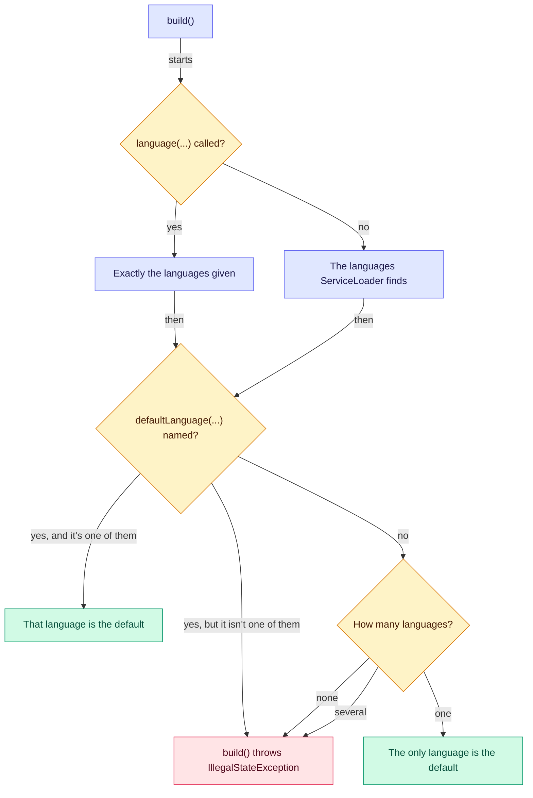

# 🧩 Expression languages

How an engine gets its expression languages, which one each rule is written in, and what your build needs.

**Who it's for:** application developers.
**You'll be able to:** give an engine several languages and choose one for each rule, predict which language a rule
without one gets, and pick the artifacts and module declarations your build needs.
**Before you start:** [Writing rules](../writing-rules.md).

[← Documentation index](../README.md)

- [Choosing a language per rule](#-choosing-a-language-per-rule)
- [How the engine picks a language](#-how-the-engine-picks-a-language)
- [What a language can offer](#-what-a-language-can-offer)
- [Dependencies](#-dependencies)
- [Security](#-security)
- [Gotchas](#-gotchas)
- [Questions you might not think to ask](#-questions-you-might-not-think-to-ask)

---

## 🧩 Choosing a language per rule

A rule is written in the [expression language](../glossary.md#expression-language) its `language` names, or in the
engine's [default language](../glossary.md#default-language) when that is `null`, which is [MVEL](mvel.md) when MVEL
is the only language found. An engine can have any number of languages, and one rule list can mix them.

```java
import io.github.brantunger.unruly.mvel.MvelExpressionLanguage;

RulesEngine<LoanDecision> engine = RulesEngineBuilder.firstMatch(LoanDecision::new)
        .language(new MvelExpressionLanguage())     // giving languages replaces finding them, so add MVEL too
        .language(new MyLanguage())
        .defaultLanguage("mvel")                    // the language of rules without one
        .build();

engine.load(List.of(
        Rule.builder()
                .ruleName("prime-rate")
                .language("my")                     // the name MyLanguage.name() returns
                .condition("...")
                .action("...")
                .build(),
        Rule.builder()
                .ruleName("standard-rate")          // no language: the default, MVEL
                .condition("applicant.creditScore >= 650")
                .action("output.interestRate = 6.9")
                .build()));
```

`MyLanguage` stands for a language of your own or a third party's, and `LoanDecision` is the class from the
[Quick start](../../README.md#-quick-start).

**An engine's languages are fixed at `build()`.** Once you call `language(...)`, the engine has exactly the languages
you give it, so add `new MvelExpressionLanguage()` too if rules still use MVEL. A language whose name is `null` or
blank, or a second language with a name already given, fails `language(...)` with an `IllegalArgumentException`.

**Names match exactly**, and are case-sensitive. A rule whose `language` is `"MVEL"` is rejected by `load()` like any
language the engine doesn't have, with `Rule 'prime-rate' is written in 'MVEL', which isn't one of the engine's
expression languages: [mvel]`. That is one rule's failure, reported together with the other rules that don't compile.

**Options** are set for one language with `.option("mvel", "strongTyping", "true")`, and each language sees only its
own. An option for a language the engine doesn't have fails `build()` with `Options are given for the expression
language 'cel', which isn't one of the engine's expression languages: [mvel]`.

**Fact names** are checked by every language the loaded rules use: `run()` rejects a name one of them can't refer to,
and `load()` rejects a [declared fact](../facts.md#-declaring-facts) with such a name. A language no loaded rule uses
isn't asked, and an empty rule list is checked against the default language. See [Naming
rules](../facts.md#-naming-rules).

## 🧭 How the engine picks a language

`build()` settles the engine's languages and its default once, and every `load()` compiles with them:



**Given languages win.** With `language(...)` on the builder, `ServiceLoader` isn't used at all.

**Otherwise `build()` finds languages** with `java.util.ServiceLoader`: every class named in a jar's
`META-INF/services/io.github.brantunger.unruly.api.language.ExpressionLanguage` file or in a module's `provides` clause,
which is how MVEL is found. It looks on every `build()`, with this library's class loader and then the building thread's
context class loader, and creates a new instance of each language it finds. Two found languages with the same name, or
one whose name is blank, fail `build()`. Anything a language throws while it's created, such as a
`ServiceConfigurationError`, comes out of `build()` unchanged.

**The default language** is the one `defaultLanguage(...)` names, which must be one of the engine's languages: otherwise
`build()` fails with `The default language 'cel' isn't one of the engine's expression languages: [mvel]`. Without a
name, it's the engine's only language. With several and no name, `build()` fails with `The engine has several expression
languages, [cel, mvel], so name the language of rules without one with defaultLanguage()`; with none, with `The engine
has no expression language: add one with language(), or put a language on the class path or, with a provides clause, on
the module path`.

## 📋 What a language can offer

Languages differ in what rules can reach, whether a running rule can be stopped, and what `load()` can check:

| If you need | Look for | For example |
| --- | --- | --- |
| Rules that read like Java and can call any method | A language with full JVM access | MVEL, shipped in `unruly-engine` |
| Rules written by people you don't fully trust | A language without JVM access, one that only reads facts | JsonLogic, CEL |
| A timeout that stops a rule part-way | A language whose interpreter can be cancelled, so its adapter can stop it at the run's [deadline](../glossary.md#deadline) | JEXL's `cancellable(true)` interpreter, cancelled by the adapter at the deadline |
| A guarantee that every rule finishes | A language that isn't Turing-complete | CEL |
| Misspelled properties caught by `load()` | A typed language, or MVEL's [strong typing](mvel.md#-strong-typing) | `.option("mvel", "strongTyping", "true")` |

The project ships only MVEL. The other names are examples of what a language can offer, not adapters you can download
here; anyone can write one, as [Writing a language](custom.md) shows.

Whatever the language, the engine enforces the same contract: unique rule names, no blank expressions, priority
order, a `Boolean` from every condition, no fact named `output` or `null`, failures reported as
`RuleCompilationException` or `RuleExecutionException` and to listeners, and a run stopped between rules and when an
expression returns. Stopping inside an expression is up to the language; see
[Stopping a run](custom.md#-stopping-a-run).

## 📦 Dependencies

| If your rules | Depend on | Which brings |
| --- | --- | --- |
| Use MVEL, alone or with other languages | `unruly-engine` | MVEL, and the engine and its API (`unruly-engine-core`) |
| Never use MVEL | `unruly-engine-core` | The engine and its API, and no language |
| Are in a language you're writing, in its tests | `unruly-engine-test`, with test scope | The contract test kit and the engine's contexts |

With Maven, a build that uses more than one of them should also import the BOM, `unruly-engine-bom`, which keeps
them at one version; see [Testing with the contract kit](contract-kit.md#-testing-with-the-contract-kit).

The coordinates and version are in the root README's [Installation](../../README.md#-installation) section, whose
"On the module path" block covers MVEL's module.

**On the class path,** a language is found when its jar is there: the jar's `META-INF/services` file is enough.

**On the module path,** a language is a module with a `provides` clause for
`io.github.brantunger.unruly.api.language.ExpressionLanguage`, which the engine's module `uses`. Your application
requires `io.github.brantunger.unruly` with MVEL, or `io.github.brantunger.unruly.core` without it. The engine reads
your fact classes and writes your output class from its own module, so export or open their packages to
`io.github.brantunger.unruly.core`, unless the language reads them itself, as MVEL does. The rule is in
[Packaging](custom.md#-packaging); the README's module-path block covers MVEL.

**A repackaged (shaded) jar** must merge the `META-INF/services` files, or `build()` finds no language. See [Migrating
to 2.0](../migrating-to-2.md#-expression-languages-are-found-with-serviceloader).

## 🔒 Security

A rule's condition and action are code, and what they can reach depends on the language. MVEL rules have the same
access to the JVM as your own code; see [Security in MVEL](mvel.md#-security). A language that can't reach the JVM,
such as one that only reads facts, is safer for rules written by less trusted people.

A [timeout](../stopping-runs.md#-what-a-timeout-doesnt-do) stops a run only between rules, or when an expression
returns, unless the language honours `isCancelled()`, so a language that allows loops and ignores it can still block
`run()`. Read a language's documentation for what its rules can do, and whether they can be stopped part-way. The
root README's [Security](../../README.md#-security) section covers the engine as a whole.

## 🚧 Gotchas

| Gotcha | What happens | Do this instead |
| --- | --- | --- |
| **`language(new MyLanguage())` alone** | `ServiceLoader` isn't used, so MVEL is gone: rules without a language are compiled by `MyLanguage`, and rules naming `mvel` fail `load()` | Add `new MvelExpressionLanguage()` too |
| **`.language("MVEL")` on a rule** | Names are case-sensitive, so `load()` rejects the rule as written in a language the engine doesn't have | Use the name `name()` returns: `"mvel"` |
| **A typo in `option(...)`'s language** | `build()` fails with `Options are given for the expression language ...`, and no engine is built | Name a language the engine has. MVEL checks its own option keys at `load()` |
| **A language jar whose constructor throws** | `ServiceLoader` runs on every `build()`, so every engine built without `language(...)` fails with that error | Remove or fix the jar, or give the engine its languages with `language(...)` |
| **A shaded jar that kept one service file** | `build()` fails with `The engine has no expression language ...` | Merge the service files |

## ❓ Questions you might not think to ask

### Which language compiles a rule whose `language` is `null`?

The default language: the one `defaultLanguage(...)` names, or else the engine's only language. See
[How the engine picks a language](#-how-the-engine-picks-a-language).

### Does a language I gave the engine, but no loaded rule uses, check fact names?

No. Only the languages the loaded rules use check them, or the default language when the rule list is empty. See
[Choosing a language per rule](#-choosing-a-language-per-rule).

### Can I add a language after `build()`?

No. An engine's languages are fixed when it's built; build another engine and `load()` the rules into it. See
[Choosing a language per rule](#-choosing-a-language-per-rule).

### Is one language instance shared between engines?

Only if you pass the same object to several builders with `language(...)`; `ServiceLoader` creates new instances on
every `build()`. Either way a language must be thread-safe; see [Thread safety](custom.md#-thread-safety).
