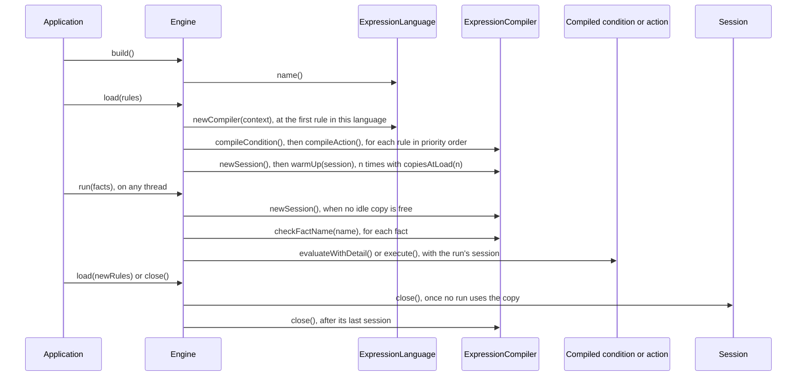

# 🔨 Writing an expression language

How to implement `ExpressionLanguage` so rules can be written in a language of your own, and what the engine calls,
when, and on which thread. [The contract test kit](contract-kit.md) covers testing the language.

**Who it's for:** language authors.
**You'll be able to:** implement the four interfaces, report compile errors the way the engine expects, read facts of
any shape, keep run state in sessions, and package the language for both paths.
**Before you start:** [Expression languages](README.md), [Facts](../facts.md) and
[Compiled copies](../compiled-copies.md). Moving a language from 1.x?
[Migrating a language or an engine](../migrating-to-2-implementers.md) lists what changed.

[← Documentation index](../README.md)

- [Lifecycle at a glance](#-lifecycle-at-a-glance)
- [Implementing the interfaces](#-implementing-the-interfaces)
- [Errors when rules load](#-errors-when-rules-load)
- [Reading facts](#-reading-facts)
- [Actions and results](#-actions-and-results)
- [Fact names](#-fact-names)
- [Stopping a run](#-stopping-a-run)
- [Thread safety](#-thread-safety)
- [Packaging](#-packaging)
- [Testing with the contract kit](#-testing-with-the-contract-kit)
- [Gotchas](#-gotchas)
- [Questions you might not think to ask](#-questions-you-might-not-think-to-ask)

---

## 🛑 Lifecycle at a glance

Nothing is created at `build()`: a [compiler](../glossary.md#compiler) exists once `load()` needs it, and a
[session](../glossary.md#session) once a run does, or once `load()` makes its copies on an engine built with
[`copiesAtLoad(n)`](../compiled-copies.md#making-copies-at-load).



| Method | When | Thread | Concurrent with itself? |
| --- | --- | --- | --- |
| `name()` | `language(...)`, `build()`, and when `ServiceLoader` finds the language | The building thread | Keep it constant |
| `newCompiler` | During `load()` or `validate()`, at the first rule in your language; for an empty list, only if you're the default. Never at `build()` | The calling thread | Yes: concurrent `load()` calls, and engines sharing one instance |
| `compileCondition`, `compileAction` | Each rule in priority order, condition first; the action only if the condition compiled | The `load()` or `validate()` thread | No |
| `checkFactName` | Each declared fact, once every rule has been compiled or has failed; then each fact of each run | `load()` or `validate()`, then run threads | Yes |
| `newSession` | A run that finds no idle copy of the rules; with `copiesAtLoad(n)`, also up to `n` times during `load()`, once every rule has compiled. Return `Session.none()` or a new session each time | The run's thread, or the `load()` thread | Yes |
| `warmUp` | Each session `load()` creates for a copy it makes, before any run uses it. Never for `Session.none()`, a session a run creates, or `validate()` | The `load()` thread | No |
| `evaluateWithDetail`, `execute` | Each rule the run reaches, once. By default `evaluateWithDetail` calls your `evaluate` | The run's thread | Yes, each with its own session |
| `Session.close()` | Once, when the copy it belongs to is done with (the cases are below). Don't throw; see [Thread safety](#-thread-safety) | Depends on the case | Yes, alongside other sessions |
| `ExpressionCompiler.close()` | Once, after its last session has closed; at once when the `load()` fails, or when `validate()` returns | The last thread to finish with the rule list, or the `load()` or `validate()` caller | Never while any method above runs |

Who closes a session depends on its copy. An extra copy, or a kept copy in use when the rules are retired: its run,
when it ends. An idle copy: the `load()` or `close()` caller that retires the rules. A copy shared by every run holds
only `Session.none()`, the session of a language that keeps no state (see [Thread safety](#-thread-safety)), whose
`close()` does nothing.

Two failures close things early. A session made for a copy that another language then fails to make is closed on the
run's thread, at once, before it's used. A `load()` that fails closes the compilers it created at once, on the
`load()` thread; when it fails while making its copies, it closes the sessions of the copies it made first, then each
compiler once.

A run holds its copy from before `checkFactName` until after its last expression, so the compiler's `close()` never
overlaps them, and both compile methods finish before any run can see the compiler. A language the engine has but no
loaded rule uses gets no compiler, no session and no fact-name check.

## 🚀 Implementing the interfaces

Implement these interfaces from `io.github.brantunger.unruly.api.language`:

| Interface | You implement | It returns |
| --- | --- | --- |
| `ExpressionLanguage` | `name()` and `newCompiler(CompileContext)` | A new compiler for each rule list |
| `ExpressionCompiler` | `compileCondition(Expression)`, `compileAction(Expression)`, `newSession()`, and optionally `checkFactName(String)`, `warmUp(Session)` and `close()` | Compiled expressions that every run shares |
| `CompiledCondition`, `CompiledAction` | `evaluate(EvaluationContext, Session)` and `execute(ActionContext, Session)`; optionally `evaluateWithDetail(EvaluationContext, Session)` | A `Boolean`; an `ActionResult`; a `ConditionResult` |
| `Session` | Optionally `close()`, if your expressions keep state while they run | Nothing |

The engine creates the `CompileContext`, `EvaluationContext` and `ActionContext` it passes to your language. They're
sealed, so only the engine implements them; tests create them with
[`LanguageTestContexts`](contract-kit.md). A method added to an interface you implement is a
`default` method, so a language written against an earlier 2.x release keeps compiling and working.

```java
import io.github.brantunger.unruly.api.exception.InvalidExpressionException;
import io.github.brantunger.unruly.api.language.*;

public final class MyLanguage implements ExpressionLanguage {

    @Override
    public String name() {
        return "my";
    }

    @Override
    public ExpressionCompiler newCompiler(CompileContext context) {
        // One compiler per rule list: keep per-list caches here. context has the imports and class loader.
        return new ExpressionCompiler() {
            @Override
            public CompiledCondition compileCondition(Expression source) {
                MyExpression parsed = MyParser.parse(source.text());   // see "Errors when rules load" below
                if (parsed.assignsSomething()) {
                    throw new InvalidExpressionException("contains an assignment");
                }
                return (evaluation, session) -> parsed.evaluate(evaluation.facts());   // must return a Boolean
            }

            @Override
            public CompiledAction compileAction(Expression source) {
                MyExpression parsed = MyParser.parse(source.text());
                return (action, session) -> {
                    parsed.execute(action.facts(), action.output());   // changes output in place
                    return ActionResult.done();
                };
            }

            @Override
            public Session newSession() {
                // Nothing changes while these expressions run. Otherwise, return a new session holding that state.
                return Session.none();
            }
        };
    }
}
```

`MyParser` and `MyExpression` stand for your language's own parser and compiled form.

**The expression.** An `Expression` has its `ruleName()`, whether it's the rule's `CONDITION` or its `ACTION`, and its
`text()`, which is never blank.

**Facts and output.** `facts()` is a read-only map of fact values by name, whose values can be `null`; writing to it
throws `UnsupportedOperationException`. Actions see the output object as `output` (`ActionContext.OUTPUT_NAME`), and the
engine already rejects a fact with that name.

**Errors while running.** An exception from `evaluate`, `evaluateWithDetail` or `execute` becomes a
`RuleExecutionException` naming the rule; a [fatal error](../glossary.md#fatal-error) is rethrown unchanged, even
wrapped in your own exception. A condition that returns anything but a `Boolean`, including `null`, fails the rule:
the engine coerces nothing.

**The `CompileContext`** carries what the engine was built with, all optional: the packages and classes from
`imports(...)` with `classLoader()`, the context class loader of the `load()` or `validate()` thread; `outputType()`,
or `Object`;
`options()`, from `.option("my", "key", "value")`; and `declaredFacts()`, primitives as wrappers, with
`allFactsDeclared()`. Reject a name nobody declared only when that is `true`: otherwise a run may supply undeclared
facts.

**Warnings.** For a problem that shouldn't stop a rule loading, call `warn(source, issue)` on the `CompileContext`. The
engine logs `Condition for rule 'prime-rate' has a warning at line 2, column 5: deprecated` at WARN on
`io.github.brantunger.unruly.engine`, whatever the issue's severity.

### Explaining a condition's result

Since 2.2.0, a condition can say why it came out as it did. Override `evaluateWithDetail` and return the value together
with a detail, from one evaluation:

```java
return new CompiledCondition() {
    @Override
    public Object evaluate(EvaluationContext evaluation, Session session) {
        return parsed.evaluate(evaluation.facts());
    }

    @Override
    public ConditionResult evaluateWithDetail(EvaluationContext evaluation, Session session) {
        MyTrace trace = parsed.evaluateTraced(evaluation.facts());   // the value and what decided it, in one pass
        return ConditionResult.of(trace.value(), trace.toString());  // a Boolean, and the detail
    }
};
```

`MyTrace` stands for your language's own record of an evaluation.

The engine calls `evaluateWithDetail`, once for each rule it evaluates, and never calls `evaluate` itself. The default
returns `ConditionResult.of(evaluate(context, session))`, a result with no detail, so a language that implements only
`evaluate` works unchanged. For a `Boolean` it returns a shared constant, `ConditionResult.TRUE` or `FALSE`, so the
default allocates nothing extra, and neither does `ConditionResult.of(value, null)`.

Since 2.3.0, two `ConditionResult`s are equal when their values are equal and their details are equal by the
detail's own `equals`. `toString()` prints it in the form of the call that makes it, such as `ConditionResult.TRUE`,
`ConditionResult.FALSE` or `ConditionResult.of(true, <detail>)`, as `ActionResult` does. A test can compare two
results with `assertEquals` when the detail has value equality, such as a `String` or a record; an array, or a class
that doesn't override `equals`, compares by identity.

The value follows `evaluate`'s rule: anything but a `Boolean` fails the rule, and so does a `null` result. Keep
`evaluate` returning the same value. The engine never calls it, but a condition that wraps yours, or your own tests,
may. The kit's `evaluateAgreesWithDetail` check fails a condition whose two methods disagree.

The detail can be any object, or `null`. The application reads it as
[`RuleEvaluation.detail()`](../run-results.md#-what-a-run-reports) on the run result. The engine records it for
every rule it evaluates, whether or not anyone reads it, so keep it cheap to build. It's kept only with a `Boolean`
value: any other value fails the run, and the detail with it. `afterEvaluate` on a listener
doesn't receive it.

- **Don't return the session, or hold it.** Sessions are closed when their copy is retired, and reused by later runs.
- **Keep it usable after `close()`.** An application may keep the run result after the engine is closed, so at least
  the detail's `toString()` must still work then.

> [!WARNING]
> A condition that wraps another one must override `evaluateWithDetail` and forward it. A lambda implements only
> `evaluate`, so the default answers with no detail, and the wrapped condition's detail is silently dropped.

## 🚨 Errors when rules load

What your compiler throws or returns decides what the user sees from `load()`, or gets back from `validate()`, which
compiles the same way but returns the failures and logs only a fatal error, not your warnings and not the failures
themselves. Every row but the session one applies to both; `validate()` makes no copies, so only `load()` ever
reaches that one:

| You throw or return | The user sees | Reported |
| --- | --- | --- |
| `InvalidExpressionException(message, issues)` | `Condition for rule 'prime-rate' ` + your message, with your issues; your exception as the cause | Per rule, with every other broken rule |
| Any other exception | `Condition for rule 'prime-rate' failed to compile: ` + its description; no issues; your exception as the cause | Per rule |
| Anything with a `StackOverflowError` as a cause | `... failed to compile: the expression is too long or too deeply nested to compile` | Per rule |
| `null` from `compileCondition` or `compileAction` | `... wasn't compiled: its expression language returned null` | Per rule |
| An exception from `newCompiler`, or `null` | `The 'my' expression language failed to create a compiler: ` + its description, or `returned no compiler`; no rule name | Once, in place of the first rule that needed the language; the rules written in it aren't compiled |
| An exception from `newSession` or `warmUp`, or `null` from `newSession`, while `load()` makes the copies of [`copiesAtLoad(n)`](../compiled-copies.md#making-copies-at-load) | `The 'my' expression language failed to create a session: ` or `failed to warm up a session: ` + its description, or `returned no session`; no rule name | By `load()` alone, after every rule has compiled; the rules loaded before stay loaded |
| A [fatal error](../glossary.md#fatal-error), thrown or as a cause | Logged, then rethrown unchanged | At once |
| `IllegalArgumentException` from `checkFactName` for a declared fact | `Declared fact 'empty' can't be used: ` + your message; no rule name | Last, after the rules' failures |

`Action for rule ...` replaces `Condition for rule ...` for an action, a `null` message reads `was rejected by its
expression language`, and every failure is logged at ERROR. The engine copies your message the way
[Exceptions by method](../exceptions-by-method.md) describes: shortened and escaped, with the root
cause's class named when a message is missing. An exception with no message and no cause is described by its class
name alone.

An [issue](../glossary.md#issue) has a severity, a line and a column counting from 1, with 0 for unknown, and a message.
The `RuleCompilationException` carries the same issues; for several rules its message is `2 rules failed to compile:
<first>; <second>`, its name, kind and issues are the first failure's, and `failures()` has each rule's.

- **Order.** Rules compile in priority order, highest first, `null` last and equal priorities in list order, so
  `failures()` is in that order. The condition compiles before the action.
- **What the engine rejects before asking you.** A blank condition or action
  (`Rule 'prime-rate' has a blank condition expression`) and a language the engine doesn't have
  (`Rule 'prime-rate' is written in 'cel', which isn't one of the engine's expression languages: [mvel]`, with no
  expression kind) are one rule's failure, collected with the rest. A `null` rule or a duplicate name fails at once,
  before anything compiles.

> [!WARNING]
> A condition that doesn't compile hides its action's errors: the action isn't compiled, so they appear only after
> the condition is fixed and the rules are loaded again. One load reports every broken *rule*, not every broken
> expression.

When failures other than a rule's are among them, the message reads `2 failures while loading the rules: ...`
instead of `2 rules failed to compile: ...`.

## 📁 Reading facts

Rules everywhere are written `applicant.creditScore`, where the fact may be a record, a JavaBean or a `Map`. The
engine hands you the fact objects as they are, so making all three work is your job, and it's what adapters most
often get wrong: a record's component is a method, so a language that looks only for a getter or a field reads
nothing, and the condition is silently `false`. `FactProperties.read(fact, "creditScore")` does it:

| Fact | What `read` returns |
| --- | --- |
| A record | The component `creditScore()`, or one of the record's own getters when no component matches |
| A JavaBean, or any other class | The public no-argument `getCreditScore()`, or `isCreditScore()` when it returns a boolean. Public fields aren't read |
| A `Map` | The value under the exact `String` key, which may be `null` |

> [!IMPORTANT]
> `read` throws `IllegalArgumentException` when the fact has no such property. Let it reach the engine: a missing
> property is a mistake in the rule, and evaluating it to `false` or to undefined hides it.

A property that exists but whose accessor throws, or can't be called, fails with `IllegalStateException` instead, so
a getter that rejects its own state is never mistaken for a misspelled rule. A fact whose class isn't public is read
through a public supertype that declares the accessor, a superclass or an interface, or else directly where its
package is open to `io.github.brantunger.unruly.core`: always on the class path, and on the module path when the
application `opens` it; see [Packaging](#-packaging).

A language is expected to compare whole numbers of different types by value on the way in, so a condition written for
`x` = 1 matches a `Long`, a `Short` or a `BigDecimal` fact holding 1; a strongly typed language that deliberately
doesn't can skip the [contract kit](contract-kit.md)'s check by overriding
`comparesWholeNumbersByValue()` in its test to return `false`.

`FactProperties.toData(fact, depth)` converts a record, a bean or a map into a map of its properties, for a language
that reads only maps. It throws `IllegalArgumentException` for a value it doesn't take apart, such as a number, a
string or a collection, so convert the whole fact map, with one more level, not each fact.

```java
Map<String, Object> data = FactProperties.toData(evaluation.facts(), depth + 1);
// {applicant={creditScore=750}, score=750}
```

## 📤 Actions and results

An action that changes `output` in place returns `ActionResult.done()`. A language without side effects, such as CEL
or JsonLogic, returns `ActionResult.set(Map.of("approved", true, "interestRate", 4.5))` instead. `set` copies the
map; a `null` name throws `NullPointerException`, an empty one `IllegalArgumentException`, and `null` values are
allowed.

The engine sets each property in map order after the action returns, and after its cancellation check, with its
`OutputWriter`: by default `put` on a `Map` output, or the output's public setter, reached the same way
`FactProperties` reaches a getter. It widens a boxed primitive only as Java does, and only when no setter takes it as
it is, so a `Long` never reaches an `int` setter; see
[The output object](../engines-and-runs.md#-the-output-object).

An application can set its writer with `.outputWriter(...)`; don't assume how a property is stored. A property
the writer can't set, or a `null` result, fails the rule with a `RuleExecutionException`. In an all-matches run, a
later rule's properties overwrite an earlier one's.

## 🔤 Fact names

Override `checkFactName(String)` to reject a name your rules couldn't refer to, such as a keyword, by throwing an
`IllegalArgumentException`; by default every name is accepted. The engine calls it:

- for every fact of every run, on the run's thread, after `beforeRun`, so a rejection reaches `onRunError`. `run()`
  throws your exception as it is, logged at ERROR. Anything else you throw becomes an `IllegalArgumentException`
  reading `The 'my' expression language failed to check fact name 'x': ...`, except a fatal error, which is rethrown;
- for each [declared fact](../facts.md#-declaring-facts) at `load()`, once every rule has been compiled or has failed,
  by the compilers that were created; when none was, the names wait for the next `load()`. A rejection fails
  the load with `Declared fact 'empty' can't be used: ` followed by your message.

Only the languages the loaded rules use are asked, in the order the rules first used them, or the default language
for an empty rule list. The engine has already rejected `null` and `output`, and caches nothing, so keep the check
cheap and thread-safe.

## ⏳ Stopping a run

A run can be interrupted, or given a [timeout](../stopping-runs.md). A run your language starts from inside an
expression, on the same thread, stops no later than the run around it. The engine checks between rules, so what your
language can do decides whether a rule that is already running can be stopped:

| Language | Can it stop inside an expression? |
| --- | --- |
| MVEL | No. It has no hook inside a loop, so `while (true) {}` runs for ever. |
| JEXL 3 | Yes, with [`JexlBuilder.cancellable(true)`](https://commons.apache.org/proper/commons-jexl/apidocs/org/apache/commons/jexl3/JexlOptions.html), whose interpreter checks for interruption and cancellation. |
| CEL | Bounded by construction: the language isn't Turing-complete, and cel-java supports cost limits. |

Both contexts tell an expression where it stands:

```java
public CompiledAction compileAction(Expression expression) {
    return (context, session) -> {
        while (moreWork()) {
            if (context.isCancelled()) {         // interrupted, or past the deadline
                return ActionResult.done();
            }
            step(context.deadline());            // null when the run has no deadline
        }
        return ActionResult.done();
    };
}
```

`isCancelled()` is `true` while the calling thread is interrupted, or once the deadline has passed. It reads the thread
it's called on, so call it on the run's thread, not from a worker your language hands work to.

Returning when it's `true` is enough: the engine checks again as soon as the expression returns, and stops the run
whatever it returned. Throwing an exception once the run is cancelled stops the run the same way, unless an `Error`
is anywhere in its cause chain, even wrapped in your own exception: the throw is then still that rule's failure,
logged at ERROR; see [What stops a run](../stopping-runs.md#-what-stops-a-run).

`deadline()` is an `Instant`, or `null` when the run has no timeout. Use it to give a call of your own a timeout.

Neither is required. A language that evaluates an expression and returns needn't check anything.

A runtime that clears the thread's interrupt status when it cancels, as JEXL's `cancellable(true)` does before it
throws `JexlException.Cancel`, hides the caller's interrupt from the engine, which sees an interrupt only in that
status or as an `InterruptedException` in the cause chain of what an expression throws. Unless the deadline has passed
too, a throw is then reported as that rule's failure, logged at ERROR, and a return lets the run go on. Call
`Thread.currentThread().interrupt()` before you throw or return, or throw with an `InterruptedException` as the cause.

## 🧵 Thread safety

| What | The rule |
| --- | --- |
| Your `ExpressionLanguage` instance | May serve several engines and concurrent `load()` calls at once: keep it stateless, with a constant `name()` |
| `compileCondition`, `compileAction` | Called on one thread, the `load()` caller, and all finish before any run sees the compiler |
| `warmUp` | Called on the `load()` thread, one session at a time, after every compile call and before any run sees the compiler |
| `checkFactName`, `newSession` | Called from many threads at once |
| Compiled conditions and actions | Shared by every run, on many threads at once, each with its own session |
| A `Session` | Used by one run at a time, possibly on different threads one after another. So `newSession()` must not return a session it returned before, unless it's `Session.none()`: the engine doesn't check, and the kit's `sessionsClosed` check fails it |
| `Session.close()` | May run while other sessions of the same compiler are in use, so don't tear down what they share. The kit's `sessionsClosed` check fails a `close()` that throws |
| `isCancelled()` | Reads the calling thread's interrupt status and the deadline, so call it on the run's thread |
| `ExpressionCompiler.close()` | Never runs while any of the above does |

Keep whatever changes while an expression runs in a `Session`: `newSession()` creates one for each
[compiled copy](../glossary.md#compiled-copy) of the rules, and every condition and action of your language in a run
gets that copy's session. Return `Session.none()` when your compiled expressions keep no state while they run, and a
new session when they do, such as a single-threaded interpreter context. A rule list whose languages all return
`Session.none()` needs no copies: every run shares one set of sessions, and no
[copy limit](../compiled-copies.md#-limiting-the-copies) applies to it.

> [!WARNING]
> Only the `Session.none()` instance counts as stateless: the engine checks identity, not `equals`. A stateless
> `new MySession()` silently turns on copies and the copy limit for every rule list that uses your language.

A `newSession()` that throws, even a `Throwable` that is neither an `Exception` nor an `Error`, or returns `null` fails
the run that needed the session with a `RuleExecutionException`, logged at ERROR, and closes the sessions other
languages already made for that copy; it happens before `beforeRun`, so no listener is told. A fatal error from closing
them is thrown instead, with the `RuleExecutionException` in its `getSuppressed()` unless it can't keep one; see
[A fatal error while closing](../thread-safety.md#a-fatal-error-while-closing).

A `close()` that throws is logged at WARN and the rest are still closed. Only a fatal error is rethrown, once every
idle session of the rule list is closed, and its compilers too if no run still uses it; if there are several, the
first. See [A fatal error while closing](../thread-safety.md#a-fatal-error-while-closing).

### Warming up a session

An engine built with [`copiesAtLoad(n)`](../compiled-copies.md#making-copies-at-load) makes its copies during
`load()`, and passes each new session to `warmUp(Session)` before any run uses it. Override it to do there what your
session would otherwise do on its first runs, such as compiling expressions into it. By default it does nothing, and
the copies are still made. MVEL compiles every condition and action into the session.

- **When:** on the `load()` thread, one session after another, after every expression has compiled.
- **Not called:** for `Session.none()`, for a session a run creates, or by `validate()`, which makes no copies.
- **If it throws:** `load()` fails with a `RuleCompilationException` naming your language, logged at ERROR; the rules
  loaded before stay loaded, and the failed load's sessions and compilers are closed. A fatal error is logged and
  rethrown unchanged.

A fatal error from closing a failed load's sessions and compilers wins over the load's own failure (a
`RuleCompilationException`, or the `IllegalStateException` of an engine closed while it compiled), which it keeps in
`getSuppressed()` unless it can't keep one; see
[A fatal error while closing](../thread-safety.md#a-fatal-error-while-closing). If the load itself failed with a
fatal error, that one came first and is thrown instead, and the one from closing is only logged at WARN.

## 📦 Packaging

A language in its own jar needs only `unruly-engine-core`, the engine without MVEL. An engine built without
`language(...)` finds a language when its jar declares it as a service, and the class needs a public no-argument
constructor. Declare it both ways, to support both paths:

- **Class path:** a file `META-INF/services/io.github.brantunger.unruly.api.language.ExpressionLanguage` that contains
  the class name, such as `com.example.lang.MyLanguage`.
- **Module path:** a `provides` clause. The engine's module `uses` the service, and `ServiceLoader` runs on every
  `build()`, so a constructor that throws fails every engine built without `language(...)`.

```java
module com.example.lang {
    requires io.github.brantunger.unruly.core;   // transitive, if your public API exposes engine types

    provides io.github.brantunger.unruly.api.language.ExpressionLanguage
            with com.example.lang.MyLanguage;

    // exports com.example.lang;                 // only if applications call language(new MyLanguage())
}
```

The engine, not your module, reads facts with `FactProperties` and writes the output with its default
`OutputWriter`, from the module `io.github.brantunger.unruly.core`. So an application whose rules use your language
exports or opens its fact and output packages to that module, and needn't export them to yours:

```java
module com.example.app {
    requires io.github.brantunger.unruly.core;
    exports com.example.app.model to io.github.brantunger.unruly.core;   // or opens, for classes that aren't public
}
```

A public class needs `exports`; a class that isn't public needs `opens`, because calling its method is deep
reflection. A language that reflects on facts itself needs its own access: in MVEL's case an export with no `to`
clause at all, because the accessor classes MVEL generates live in the unnamed module, as the root README's
[Installation](../../README.md#-installation) block explains. A test that extends the contract kit opens its package
`to org.junit.platform.commons`.

### Native image

A language works in a GraalVM native image if it generates no classes while rules run: an image can't load a class
that wasn't in it when it was built. Register the reflection the language itself needs in its jar, in
`META-INF/native-image/<group>/<artifact>/reflect-config.json`, which `native-image` reads from the class path. The
`unruly-engine` jar does this for MVEL. `native-image` registers the provider in your `META-INF/services` file, so
`ServiceLoader` finds the language as on the JVM.

The application registers its own fact and output classes, because `FactProperties` and the default `OutputWriter`
read and write them by reflection. Only MVEL has been tested in an image; see [Native image](../native-image.md).

## 🧪 Testing with the contract kit

[The contract test kit](contract-kit.md) covers adding `unruly-engine-test` to a language's tests, and what each of its
checks promises.

## 🚧 Gotchas

| Gotcha | What happens | Do this instead |
| --- | --- | --- |
| **A stateless session of your own** | `new MySession()` with no state still gets copies and the copy limit: only `Session.none()` itself counts | Return `Session.none()` |
| **A missing property read as `false`** | The rule never fires, and nothing says why | Use `FactProperties.read`, and let its `IllegalArgumentException` reach the engine |
| **`toData` on each fact** | Throws for a number, a string or a collection | Convert `evaluation.facts()` itself, with `depth + 1` |
| **A condition that doesn't compile** | Its action isn't compiled, so the action's errors appear only after the next `load()` | Expect a second failure after fixing a condition |
| **A runtime that clears the interrupt** | An interrupted rule is reported as the rule's failure, at ERROR, not as a stop | Restore the interrupt status, or throw with an `InterruptedException` cause |
| **`isCancelled()` from a worker thread** | It reads that thread's interrupt status, so the run thread's interrupt is missed | Poll it on the run's thread |
| **A lambda that wraps a condition** | It implements only `evaluate`, so the wrapped condition's detail is dropped, and `detail()` is `null` | Override `evaluateWithDetail` and forward it; see [Explaining a condition's result](#explaining-a-conditions-result) |
| **A `close()` that throws** | The engine logs it at WARN and carries on, so nothing but a fatal error reaches the application, and only once everything is closed | Don't throw from `Session.close()`; the kit's `sessionsClosed` check fails it |

## ❓ Questions you might not think to ask

### When is `newCompiler` called, and can I do expensive setup there?

During `load()`, at the first rule in your language, or for an empty rule list if you're the default; never at
`build()`. Once per `load()`, so per-list setup belongs there. See [Lifecycle at a glance](#-lifecycle-at-a-glance).

### Are sessions created for runs that never reach my rules?

Yes. A copy of the rules has one session for every language the rule list uses, whichever rules a run reaches. See
[Thread safety](#-thread-safety).

### If `newSession()` fails, do listeners hear about it?

No. It happens before `beforeRun`, so the run throws a `RuleExecutionException`, logged at ERROR, and no listener is
called. See [Thread safety](#-thread-safety). When `load()` is making copies, it throws a `RuleCompilationException`
instead, and listeners aren't involved either.

### Do I have to implement `warmUp`?

No. By default it does nothing, and an engine built with `copiesAtLoad(n)` still makes its copies at load. Implement
it when a session's first use is costly, such as compiling or loading classes. See
[Warming up a session](#warming-up-a-session).

### Do I have to implement `evaluateWithDetail`?

No. By default it calls your `evaluate` and gives no detail, so `RuleEvaluation.detail()` is `null` for your rules.
MVEL doesn't implement it either. If you do, `evaluate` must still return the same value, and the kit checks that. See
[Explaining a condition's result](#explaining-a-conditions-result).

