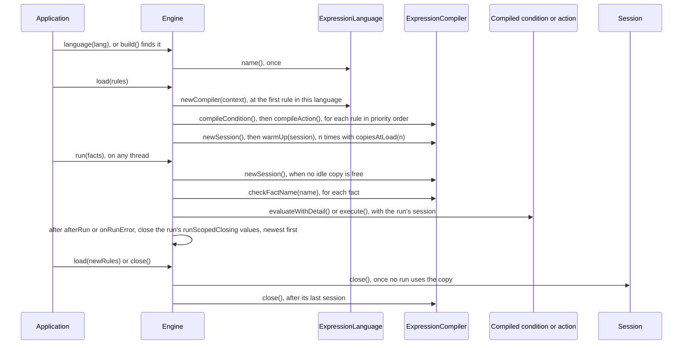

# 🔨 Writing an expression language

How to implement `ExpressionLanguage` so rules can be written in a language of your own, and what the engine calls,
when, and on which thread.

**Who it's for:** language authors.
**You'll be able to:** implement the four interfaces, report compile errors the way the engine expects, read facts of
any shape, keep state in sessions or for one run, and package the language for both paths.
**Before you start:** [Expression languages](README.md), [Facts](../facts.md) and
[Compiled copies](../compiled-copies.md). Moving a language from 1.x?
[Migrating a language or an engine](../migrating-to-2-implementers.md) lists what changed.

[← Documentation index](../README.md)

- [Lifecycle at a glance](#-lifecycle-at-a-glance)
- [Implementing the interfaces](#-implementing-the-interfaces)
- [Errors when rules load](#-errors-when-rules-load)
- [Reading facts](#-reading-facts)
- [Actions and results](#-actions-and-results)
- [Fact names](#-fact-names)
- [Stopping a run](#-stopping-a-run)
- [Thread safety](#-thread-safety)
- [Packaging](#-packaging)
- [Testing with the contract kit](#-testing-with-the-contract-kit)
- [Gotchas](#-gotchas)
- [Questions you might not think to ask](#-questions-you-might-not-think-to-ask)

---

## 🛑 Lifecycle at a glance

Nothing is created at `build()`: a [compiler](../glossary.md#compiler) exists once `load()` needs it, and a
[session](../glossary.md#session) once a run does, or once `load()` makes its copies on an engine built with
[`copiesAtLoad(n)`](../compiled-copies.md#making-copies-at-load).


```mermaid
sequenceDiagram
    participant App as Application
    participant Engine
    participant Lang as ExpressionLanguage
    participant Comp as ExpressionCompiler
    participant Expr as Compiled condition or action
    participant Sess as Session
    App->>Engine: language(lang), or build() finds it
    Engine->>Lang: name(), once
    App->>Engine: load(rules)
    Engine->>Lang: newCompiler(context), at the first rule in this language
    Engine->>Comp: compileCondition(), then compileAction(), for each rule in priority order
    Engine->>Comp: newSession(), then warmUp(session), n times with copiesAtLoad(n)
    App->>Engine: run(facts), on any thread
    Engine->>Comp: newSession(), when no idle copy is free
    Engine->>Comp: checkFactName(name), for each fact
    Engine->>Expr: evaluateWithDetail() or execute(), with the run's session
    Engine->>Engine: after afterRun or onRunError, close the run's runScopedClosing values, newest first
    App->>Engine: load(newRules) or close()
    Engine->>Sess: close(), once no run uses the copy
    Engine->>Comp: close(), after its last session
```

| Method | When | Thread | Concurrent with itself? |
| --- | --- | --- | --- |
| `name()` | Once: in `language(...)`, or when `ServiceLoader` finds it | The building thread | Keep it constant |
| `newCompiler` | During `load()` or `validate()`, at the first rule in your language; for an empty list, only if you're the default. Never at `build()` | The calling thread | Yes: concurrent `load()` calls, and engines sharing one instance |
| `compileCondition`, `compileAction` | Each rule in priority order, condition first; the action only if the condition compiled | The `load()` or `validate()` thread | No |
| `checkFactName` | Each declared fact, once every rule has compiled or failed; then each fact of each run | `load()` or `validate()`, then run threads | Yes |
| `newSession` | A run that finds no idle copy of the rules; with `copiesAtLoad(n)`, also up to `n` times during `load()`, once every rule has compiled. Return `Session.none()` or a new session each time | The run's thread, or the `load()` thread | Yes |
| `warmUp` | Each session `load()` creates for a copy it makes, before any run uses it. Never for `Session.none()`, a session a run creates, or `validate()` | The `load()` thread | No |
| `evaluateWithDetail`, `execute` | Each rule the run reaches, once. By default `evaluateWithDetail` calls your `evaluate` | The run's thread | Yes, each with its own session |
| `close()` of a [`runScopedClosing`](#-reading-facts) value | After its run's last listener call | The run's thread | Only with other runs' values |
| `Session.close()` | Once, when the copy it belongs to is done with (the cases are below). Don't throw; see [Thread safety](#-thread-safety) | Depends on the case | Yes, alongside other sessions |
| `ExpressionCompiler.close()` | Once, after its last session has closed; at once when the `load()` fails, or when `validate()` returns. Don't throw | The last thread to finish with the rule list, or the `load()` or `validate()` caller | Never while any method above runs |

Who closes a session depends on its copy. An extra copy: its run. A kept copy in use when the rules are
retired: its run, or, while runs wait on those rules, a later run. An idle copy: the `load()` or `close()` that retires
the rules, or a later one if that stopped part way.

A copy shared by every run holds only `Session.none()`, whose `close()` does nothing.

Two failures close things early. A session made for a copy that another language then fails to make is closed on the
run's thread before it's used. A `load()` that fails closes the compilers it created at once, on the
`load()` thread; when it fails while making its copies, it closes the sessions of the copies it made first, then each
compiler once.

A run holds its copy from before `checkFactName` until after its last expression, so the compiler's `close()` never
overlaps them. A language no loaded rule uses gets no compiler, no session and no fact-name check.

## 🚀 Implementing the interfaces

Implement these interfaces from `io.github.brantunger.unruly.api.language`:

| Interface | You implement | It returns |
| --- | --- | --- |
| `ExpressionLanguage` | `name()` and `newCompiler(CompileContext)` | A new compiler for each rule list |
| `ExpressionCompiler` | `compileCondition(Expression)`, `compileAction(Expression)`, `newSession()`, and optionally `checkFactName(String)`, `warmUp(Session)` and `close()` | Compiled expressions that every run shares |
| `CompiledCondition`, `CompiledAction` | `evaluate(EvaluationContext, Session)` and `execute(ActionContext, Session)`; optionally `evaluateWithDetail(EvaluationContext, Session)` | A `Boolean`; an `ActionResult`; a `ConditionResult` |
| `Session` | Optionally `close()`, if your expressions keep state while they run | Nothing |

Your language gets a `CompileContext`, `EvaluationContext` and `ActionContext` from the engine, which alone implements
these sealed interfaces; tests create them with
[`LanguageTestContexts`](beyond-the-contract-kit.md#-testing-a-compiler-without-an-engine). An evaluation or action
context equals only itself. Methods added to interfaces you implement are `default`, so a language from an earlier 2.x
release keeps compiling and working.

```java
import io.github.brantunger.unruly.api.exception.InvalidExpressionException;
import io.github.brantunger.unruly.api.language.*;

// MyParser and MyExpression stand for your language's own parser and compiled form.
public final class MyLanguage implements ExpressionLanguage {

    @Override
    public String name() {
        return "my";
    }

    @Override
    public ExpressionCompiler newCompiler(CompileContext context) {
        // One compiler per rule list: keep per-list caches here. context has the imports and class loader.
        return new ExpressionCompiler() {
            @Override
            public CompiledCondition compileCondition(Expression source) {
                MyExpression parsed = MyParser.parse(source.text());   // see "Errors when rules load" below
                if (parsed.assignsSomething()) {
                    throw new InvalidExpressionException("contains an assignment");
                }
                return (evaluation, session) -> parsed.evaluate(evaluation.facts());   // must return a Boolean
            }

            @Override
            public CompiledAction compileAction(Expression source) {
                MyExpression parsed = MyParser.parse(source.text());
                return (action, session) -> {
                    parsed.execute(action.facts(), action.output());   // changes output in place
                    return ActionResult.done();
                };
            }

            @Override
            public Session newSession() {
                // Nothing changes while these expressions run. Otherwise, return a new session holding that state.
                return Session.none();
            }
        };
    }
}
```

**The expression.** An `Expression` has its `ruleName()`, whether it's the rule's `CONDITION` or its `ACTION`, and its
never-blank `text()`.

**Facts and output.** `facts()` is a read-only map of fact values by name, whose values can be `null`; writing to it
throws `UnsupportedOperationException`. Actions see the output object as `output` (`ActionContext.OUTPUT_NAME`), and the
engine already rejects a fact with that name.

**Errors while running.** An exception from `evaluate`, `evaluateWithDetail` or `execute` becomes a
`RuleExecutionException` naming the rule; a [fatal error](../glossary.md#fatal-error) is rethrown unchanged, even
wrapped in your own exception. Keep caught exceptions as causes. A condition returning anything but a `Boolean`,
`null` included, fails the rule: the engine coerces nothing.

If code your expression calls starts a failing nested run, throw what it threw, or a wrapper with exactly its message,
as MVEL's adapter does: added words get the nested failure [logged twice](../nested-runs.md#-what-is-logged).

**The `CompileContext`** carries what the engine was built with, all optional: the Java packages and classes from
`imports(...)` with `classLoader()`, the `load()` or `validate()` thread's context class loader; `outputType()`, or
`Object`; `options()`, from `.option("my", "key", "value")`; and `declaredFacts()`, primitives as wrappers, with
`allFactsDeclared()`. Reject a name nobody declared only when that is `true`: otherwise a run may supply undeclared
facts.

**Your own imports.** Since 2.19.0, `languageImports()` lists those given with `.languageImports("my", ...)`: as
written, in order, unmodifiable, and empty if none. They're yours alone, unchecked but for length; to reject one,
throw from `newCompiler`, which fails [only a rule list using your language](README.md#-choosing-a-language-per-rule).

**Warnings.** For a problem that shouldn't stop a rule loading, call the `CompileContext`'s `warn(source, issue)`. The
engine logs `Condition for rule 'prime-rate' has a warning at line 2, column 5: deprecated` at WARN on
`io.github.brantunger.unruly.engine`, whatever the issue's severity.

### Explaining a condition's result

Since 2.2.0, a condition can say why it came out as it did. Override `evaluateWithDetail` and return the value with a
detail, from one evaluation:

```java
return new CompiledCondition() {
    @Override
    public Object evaluate(EvaluationContext evaluation, Session session) {
        return parsed.evaluate(evaluation.facts());
    }

    @Override
    public ConditionResult evaluateWithDetail(EvaluationContext evaluation, Session session) {
        // MyTrace stands for your language's own record of an evaluation: the value and what decided it, in one pass
        MyTrace trace = parsed.evaluateTraced(evaluation.facts());
        return ConditionResult.of(trace.value(), trace.toString());  // a Boolean, and the detail
    }
};
```

The engine calls `evaluateWithDetail`, once for each rule it evaluates, and never `evaluate` itself. The default
returns `ConditionResult.of(evaluate(context, session))`, a result with no detail, so a language that implements only
`evaluate` works unchanged. For a `Boolean` it returns the shared `ConditionResult.TRUE` or `FALSE`, so neither
it nor `ConditionResult.of(value, null)` allocates.

Since 2.3.0, `ConditionResult`s with equal values and details are equal, by the detail's own `equals`, so an array
compares by identity. `toString()` prints the call that makes it, such as `ConditionResult.of(true, <detail>)`.

Keep `evaluate` returning the same value: a condition that wraps yours, or your own tests, may call it. The kit's
`evaluateAgreesWithDetail` check fails a condition whose two methods disagree.

The detail can be any object, or `null`. The application reads it as
[`RuleEvaluation.detail()`](../run-results.md#-what-a-run-reports) on the run result. The engine records it for every
rule it evaluates, so keep it cheap to build. It's kept only with a `Boolean` value, and `afterEvaluate` doesn't receive
it.

- **Don't return the session, or hold it.** Sessions are closed when their copy is retired, and reused by later runs.
- **Keep it usable after `close()`.** A run result may outlive later runs and `close()`, so the detail's
  `toString()` must still give the same text.

> [!WARNING]
> A condition that wraps another one must override `evaluateWithDetail` and forward it. A lambda implements only
> `evaluate`, so the default answers with no detail, and the wrapped condition's detail is silently dropped.

## 🚨 Errors when rules load

What your compiler throws or returns decides what `load()` throws and logs and `validate()` returns: `validate()`
compiles the same way but logs only a fatal error, not your warnings or the failures. Every row but the session one
applies to both:

| You throw or return | The user sees | Reported |
| --- | --- | --- |
| `InvalidExpressionException(message, issues)` | `Condition for rule 'prime-rate' ` + your message, with your issues; your exception as the cause | Per rule, with every other broken rule |
| Any other exception | `Condition for rule 'prime-rate' failed to compile: ` + its description; no issues; your exception as the cause | Per rule |
| Anything with a `StackOverflowError` as a cause | `... failed to compile: the expression is too long or too deeply nested to compile` | Per rule |
| `null` from `compileCondition` or `compileAction` | `... wasn't compiled: its expression language returned null` | Per rule |
| An exception from `newCompiler`, or `null` | `The 'my' expression language failed to create a compiler: ` + its description, or `returned no compiler`; no rule name | Once, in place of the first rule that needed the language; its rules aren't compiled |
| An exception from `newSession` or `warmUp`, or `null` from `newSession`, while `load()` makes the copies of [`copiesAtLoad(n)`](../compiled-copies.md#making-copies-at-load) | `The 'my' expression language failed to create a session: ` or `failed to warm up a session: ` + its description, or `returned no session`; no rule name | By `load()` alone, after every rule has compiled; the rules loaded before stay loaded |
| A [fatal error](../glossary.md#fatal-error), thrown, as a cause or suppressed | Logged, then rethrown unchanged | At once |
| `IllegalArgumentException` without a [fatal error](../glossary.md#fatal-error) from `checkFactName` for a declared fact | `Declared fact 'empty' can't be used: ` + your message; no rule name | Last, after the rules' failures |

`Action for rule ...` replaces `Condition for rule ...` for an action, a `null` message reads `was rejected by its
expression language`, and every failure is logged at ERROR. The engine shortens and escapes your message, and a
warning's issue, as [Exceptions by method](../exceptions-by-method.md) describes. Any other exception with no message
shows its class name, and any root cause's in `(caused by ...)`.

An [issue](../glossary.md#issue) has a severity, a line and a column counting from 1, with 0 for unknown, and a message.
Leave raw a message the engine shortens and escapes: it would count escapes in `(N more characters)`; its cut never
splits one. Text the engine shows as it came, such as the issues you throw, is yours to make safe: since 2.16.0,
`io.github.brantunger.unruly.api.language.MessageText` has `quote(name)` for a name and, as `truncate` cuts plainly,
`escape(truncate(text))` for other text.

The `RuleCompilationException` carries the same issues; for several rules its message is `2 rules failed to compile:
<first>; <second>`, its name, kind and issues are the first failure's, and `failures()` has each rule's.

- **Order.** Rules compile in priority order, highest first, `null` last and equal priorities in list order, and
  so is `failures()`. The condition compiles before the action.
- **What the engine rejects first.** A blank condition or action
  (`Rule 'prime-rate' has a blank condition expression`) and a language the engine doesn't have
  (`Rule 'prime-rate' is written in 'cel', which isn't one of the engine's expression languages: [mvel]`, with no
  expression kind) fail one rule, collected with the rest. A `null` rule or a duplicate name fails at once.

> [!WARNING]
> A condition that doesn't compile hides its action's errors: the action isn't compiled until a `load()` with the
> condition fixed. One load reports every broken *rule*, not every broken expression.

With failures other than a rule's among them, the message reads `2 failures while loading the rules: ...`.

## 📁 Reading facts

Rules are written `applicant.creditScore` whether the fact is a record, a JavaBean or a `Map`, and the engine hands you
facts as they are, so making all three work is your job. Adapters most often get records wrong: a component is a method,
so a language that looks only for a getter or a field reads nothing, and the condition is silently `false`.
`FactProperties.read(fact, "creditScore")` does it:

| Fact | What `read` returns |
| --- | --- |
| A record | The component `creditScore()`, or one of the record's own getters when no component matches |
| A JavaBean, or any other class | The public no-argument `getCreditScore()`, or `isCreditScore()` when it returns a boolean. Public fields aren't read |
| A `Map` | The value under the exact `String` key, which may be `null` |

> [!IMPORTANT]
> `read` throws `IllegalArgumentException` when the fact has no such property. Let it reach the engine: a missing
> property is a mistake in the rule, and evaluating it to `false` or to undefined hides it.

A property that exists but whose accessor throws, or can't be called, fails with `IllegalStateException` instead, so a
getter that rejects its own state is never mistaken for a misspelled rule. A fact whose class isn't public is read
through a public supertype that declares the accessor, or else directly where its package is open to
`io.github.brantunger.unruly.core`: always on the class path, and on the module path when the application `opens` it;
see [Packaging](#-packaging).

`FactProperties.has(fact, "creditScore")` is `true` exactly when `read` wouldn't report the property missing, even if
its getter throws; `propertyNames(fact)` lists the names `read` can reach. Neither calls a getter, though a map's
`containsKey` or key iteration runs, so use them for `in`, `hasattr` or `Object.keys`.

A language is expected to compare whole numbers of different types by value, so a condition written for `x` = 1
matches a `Long`, a `Short` or a `BigDecimal` fact holding 1; a strongly typed language that doesn't can override
`comparesWholeNumbersByValue()` in its [contract kit](contract-kit.md) test to return `false`.

`FactProperties.toData(fact, depth)` converts a record, a bean or a map into a map of its properties, for a language
that reads only maps. It throws `IllegalArgumentException` for a value it doesn't take apart, such as a number, a
string or a collection, so convert the whole fact map, with one more level, not each fact.

```java
Map<String, Object> data =
        evaluation.runScoped(this, () -> FactProperties.toData(evaluation.facts(), depth + 1));
// {applicant={creditScore=750}, score=750}
```

Since 2.13.0, `runScoped(key, init)` converts the facts once per run: the first expression to ask makes the map, the
others share it. Key it with the compiler (`this`), not each expression. Nested and later runs make their own. The map
misses a fact that Java code changes after it's made, and the engine drops it, unclosed, when the run returns: keep a
resource with `runScopedClosing`.

```java
// MyInterpreter stands for your runtime's AutoCloseable context; a nested run makes and closes its own
MyInterpreter interpreter = evaluation.runScopedClosing(MyInterpreter.class, MyInterpreter::new);
```

Since 2.20.0, `runScopedClosing(key, init)` closes the value however the run ends, before the copy is given back,
newest first. A `close()` that throws is logged at WARN; a fatal error is then thrown, carrying a run failure that
isn't fatal, but a fatal run failure wins. Using both methods on one key, or `runScopedClosing` once closing began,
throws `IllegalStateException`. A value asked for on another thread as the run ends is closed with the others or
refused.

## 📤 Actions and results

An action that changes `output` in place returns `ActionResult.done()`. A language without side effects, such as CEL
or JsonLogic, returns `ActionResult.set(Map.of("approved", true, "interestRate", 4.5))` instead. `set` copies the
map; a `null` name throws `NullPointerException`, an empty one `IllegalArgumentException`, and `null` values are
allowed.

The engine sets each property in map order after the action returns and passes its cancellation check, with its
`OutputWriter`: by default `put` on a `Map` output, or the output's public setter, reached the same way
`FactProperties` reaches a getter. It widens a boxed primitive only as Java does, and only when no setter takes it as
is, so a `Long` never reaches an `int` setter; see
[The output object](../engines-and-runs.md#-the-output-object).

An application can set its writer with `.outputWriter(...)`; don't assume how a property is stored. A `null` result,
or a property the writer can't set, fails the rule unless the run must [stop](../stopping-runs.md#-what-stops-a-run).
In an all-matches run, a later rule's properties overwrite earlier ones.

## 🔤 Fact names

Override `checkFactName(String)` to reject a name your rules couldn't refer to, such as a keyword, with an
`IllegalArgumentException`; by default every name passes. The engine calls it:

- for every fact of every run, on the run's thread, after `beforeRun`, so a rejection reaches `onRunError`. `run()`
  throws your exception as it came and logs it shortened and escaped at ERROR: leave a name in it raw. Anything else
  becomes an `IllegalArgumentException` reading `The 'my' expression language failed to check fact name 'x': ...`;
- for each [declared fact](../facts.md#-declaring-facts) at `load()`, once every rule has compiled or failed, by the
  compilers created; with none, they wait for the next `load()`. A rejection fails it.

A [fatal error](../glossary.md#fatal-error), even your exception's cause or suppressed on it, is logged with that
`failed to check` message and rethrown, by `load()` too. Only the loaded rules' languages are asked, in first-use order,
or the default language for an empty list. The engine rejects `null`, blank names and `output` first, and caches
nothing: keep `checkFactName` cheap and thread-safe. The [contract kit](contract-kit.md) tests it both ways:
`unusableFactName()` and `usableFactNames()`.

## ⏳ Stopping a run

A run can be interrupted, or given a [timeout](../stopping-runs.md), which a
[nested run](../nested-runs.md#-what-counts-as-nested) inherits. The engine checks between rules, so what your language
can do decides whether a running rule can be stopped:

| Language | Can it stop inside an expression? |
| --- | --- |
| MVEL | No. It has no hook inside a loop, so `while (true) {}` runs for ever. |
| JEXL 3 | Yes, with [`JexlBuilder.cancellable(true)`](https://commons.apache.org/proper/commons-jexl/apidocs/org/apache/commons/jexl3/JexlOptions.html), whose interpreter stops for an interrupt. For a timeout, also set the flag its context's `JexlContext.CancellationHandle` returns after `context.timeLeft()`. |
| CEL | Bounded by construction: the language isn't Turing-complete, and cel-java supports cost limits. |

Both contexts tell an expression where it stands:

```java
public CompiledAction compileAction(Expression expression) {
    return (context, session) -> {
        while (moreWork()) {
            if (context.isCancelled()) {         // interrupted, or past the deadline
                return ActionResult.done();
            }
            step(context.timeLeft());            // about 292 years when the run has no deadline
        }
        return ActionResult.done();
    };
}
```

`isCancelled()` is `true` while the calling thread is interrupted, or once the deadline has passed.

Returning then is enough: the engine checks again when the expression returns, and stops the run whatever it
returned. Throwing once the run is cancelled stops it the same way, unless what it throws
[fails the rule](../stopping-runs.md#-what-stops-a-run).

Since 2.9.0, `timeLeft()` is the time left before the run's deadline, as the engine measures it, and
`Duration.ZERO` once past: time your own calls with it. `deadline()` is a wall-clock `Instant` for showing, `null`
without a timeout. None is required.

A runtime that clears the interrupt status when it cancels, as JEXL's `cancellable(true)` does, hides the caller's
interrupt from the engine, which sees an interrupt only in that status or as an `InterruptedException` causing, or
suppressed in, what an expression throws. Unless the deadline has passed too, a throw is then reported as that rule's
failure, at ERROR, and a return lets the run go on.

So record what cancelled the runtime. When an interrupt cancelled it, call `Thread.currentThread().interrupt()`
before you throw or return, or throw with an `InterruptedException` as the cause. When your adapter cancelled it
for the deadline, restore nothing: the engine reports the timeout. The engine checks the interrupt first, so restoring
it reports the timeout as an interrupt and leaves the caller's thread interrupted, failing its next run:

```java
class CancellableContext extends MapContext implements JexlContext.CancellationHandle {
    private final AtomicBoolean cancel = new AtomicBoolean();

    @Override
    public AtomicBoolean getCancellation() {
        return cancel;
    }
}

// scheduler: a ScheduledExecutorService your compiler owns; the JexlEngine is built with cancellable(true).
// context: the EvaluationContext or ActionContext the engine passed. Pass a new CancellableContext each time: JEXL
// leaves its flag set after any cancel.
Object execute(JexlScript script, CancellableContext jexlContext, EvaluationContext context) {
    AtomicBoolean forDeadline = new AtomicBoolean();
    ScheduledFuture<?> timer = context.deadline() == null ? null : scheduler.schedule(() -> {
        forDeadline.set(true);                           // record why, before cancelling
        jexlContext.getCancellation().set(true);
    }, context.timeLeft().toNanos(), TimeUnit.NANOSECONDS);
    // timeLeft() is timed as the engine times the run, so the timer fires once the run has passed its deadline,
    // whatever the system clock does. Not Duration.between(Instant.now(), context.deadline()): that is off by any
    // step of the system clock since the run started. Without a deadline, timeLeft() is
    // Duration.ofNanos(Long.MAX_VALUE), about 292 years; the timer is skipped then, since a cancelled task can stay
    // in a ScheduledThreadPoolExecutor's queue until its delay.
    try {
        return script.execute(jexlContext);
    } catch (JexlException.Cancel e) {
        if (!forDeadline.get()) {
            Thread.currentThread().interrupt();          // an interrupt cancelled it: give it back
        }
        throw e;
    } finally {
        if (timer != null) {
            timer.cancel(false);
        }
    }
}
```

## 🧵 Thread safety

| What | The rule |
| --- | --- |
| Your `ExpressionLanguage` instance | May serve several engines and concurrent `load()` calls at once: keep it stateless, with a constant `name()` |
| `compileCondition`, `compileAction` | Called on one thread, the `load()` caller, and all finish before any run sees the compiler |
| `warmUp` | Called on the `load()` thread, one session at a time, after every compile call and before any run sees the compiler |
| `checkFactName`, `newSession` | Called from many threads at once |
| Compiled conditions and actions | Shared by every run, on many threads at once, each with its own session |
| A `Session` | Used by one run at a time, perhaps on another thread each time, so `newSession()` must not return one twice, unless it's `Session.none()`. Only the kit's `sessionsClosed` and `concurrentRuns` check, among the sessions they get |
| `Session.close()` | May run on any thread, while its compiler's other sessions run: don't tear down shared state, or throw. The kit's `sessionClosedWhileAnotherRuns` fails either; `sessionsClosed` and `sessionClosedOnAnotherThread` fail a throw |
| Per-thread state, such as a `ThreadLocal` | An expression may start a [nested run](../nested-runs.md#-what-counts-as-nested) on its thread, which may fail, so keep a run's state in its `Session` or [`runScoped`](#-reading-facts), or restore it in a `finally`, as the kit's [nested-run checks](contract-kit.md#-testing-with-the-contract-kit) require |
| Built-in objects and globals the runs share | An action's change there mustn't reach a later run: refuse it at load, fail it before it changes anything, or keep it to the run, as `sharedStateStaysLocal` checks |
| `ExpressionCompiler.close()` | Never runs while any of the above does |

`newSession()` creates a session for each [compiled copy](../glossary.md#compiled-copy) of the rules, and every
condition and action of your language in a run gets that copy's session. Return `Session.none()` when your compiled
expressions keep no state while they run, and a new session when they do, such as a single-threaded interpreter
context. A rule list whose languages all return `Session.none()` needs no copies: its runs share one set of sessions,
with no [copy limit](../compiled-copies.md#-limiting-the-copies). Values kept with `runScoped` need no session.

> [!WARNING]
> Only the `Session.none()` instance counts as stateless: the engine checks identity, not `equals`. A stateless
> `new MySession()` silently turns on copies and the copy limit for every rule list using your language.

A `newSession()` that throws, even a `Throwable` that is neither an `Exception` nor an `Error`, or returns `null` fails
the run that needed the session with a `RuleExecutionException`, logged at ERROR, and closes the sessions other
languages already made for that copy; it all happens before `beforeRun`, so no listener is told. A fatal error from
closing them is thrown instead, with the `RuleExecutionException` in its `getSuppressed()` unless it can't keep one.

A `close()` that throws is logged at WARN, unless a [nested run](../nested-runs.md#-what-is-logged) logged it, and the
rest are still closed. Only a fatal error is rethrown, once every idle session of the rule list is closed, and its
compilers too if no run still uses it.
See [A fatal error while closing](../error-handling.md#-a-fatal-error-while-closing).

### Warming up a session

An engine built with [`copiesAtLoad(n)`](../compiled-copies.md#making-copies-at-load) makes its copies during
`load()`, and passes each new session to `warmUp(Session)` before any run uses it. Override it to do there what your
session would otherwise do on its first runs, such as compiling expressions. By default it does nothing, and
the copies are still made. MVEL compiles every condition and action into the session.

- **When:** on the `load()` thread, one session after another, after every expression has compiled.
- **Not called:** for `Session.none()`, for a session a run creates, or by `validate()`, which makes no copies.
- **If it throws:** `load()` fails with a `RuleCompilationException` naming your language, logged at ERROR; the rules
  loaded before stay loaded, and the failed load's sessions and compilers are closed. A fatal error is logged and
  rethrown unchanged.

## 📦 Packaging

A language in its own jar needs only `unruly-engine-core`, the engine without MVEL. An engine built without
`language(...)` finds a language when its jar declares it as a service, and the class needs a public no-argument
constructor. Declare it both ways:

- **Class path:** a file `META-INF/services/io.github.brantunger.unruly.api.language.ExpressionLanguage` that contains
  the class name, such as `com.example.lang.MyLanguage`.
- **Module path:** a `provides` clause. The engine's module `uses` the service, and `ServiceLoader` runs on every
  `build()`, so a constructor that throws fails every engine built without `language(...)`.

```java
module com.example.lang {
    requires io.github.brantunger.unruly.core;   // transitive, if your public API exposes engine types

    provides io.github.brantunger.unruly.api.language.ExpressionLanguage
            with com.example.lang.MyLanguage;

    // exports com.example.lang;                 // only if applications call language(new MyLanguage())
}
```

The engine, not your module, reads facts with `FactProperties` and writes the output with its default
`OutputWriter`, from the module `io.github.brantunger.unruly.core`. So an application whose rules use your language
exports or opens its fact and output packages to that module, and needn't export them to yours:

```java
module com.example.app {
    requires io.github.brantunger.unruly.core;
    exports com.example.app.model to io.github.brantunger.unruly.core;   // or opens, for classes that aren't public:
                                                                          // calling their methods is deep reflection
}
```

A language that reflects on facts itself needs its own access: MVEL needs an export with no `to` clause, because its
generated accessor classes live in the unnamed module; see the root README's
[Installation](../../README.md#-installation). A test module that `requires` the contract kit opens its package `to
org.junit.platform.commons`.

### Native image

A language works in a GraalVM native image if it generates no classes while rules run: an image can't load a class
that wasn't in it when it was built. Register the reflection the language itself needs in its jar, in
`META-INF/native-image/<group>/<artifact>/reflect-config.json`, which `native-image` reads from the class path. The
`unruly-engine` jar does this for MVEL. `native-image` registers the provider in your `META-INF/services` file, so
`ServiceLoader` finds the language as on the JVM.

The application registers its own fact and output classes, because `FactProperties` and the default `OutputWriter`
read and write them by reflection. Only MVEL has been tested in an image; see [Native image](../native-image.md).

## 🧪 Testing with the contract kit

See [The contract test kit](contract-kit.md) and [Testing beyond the contract kit](beyond-the-contract-kit.md).

## 🚧 Gotchas

| Gotcha | What happens | Do this instead |
| --- | --- | --- |
| **A stateless session of your own** | `new MySession()` still gets copies and the copy limit | Return `Session.none()` |
| **A missing property read as `false`** | The rule never fires, and nothing says why | Use `FactProperties.read`, and let its `IllegalArgumentException` reach the engine |
| **`toData` on each fact** | Throws for a number, a string or a collection | Convert `evaluation.facts()` itself, with `depth + 1` |
| **A condition that doesn't compile** | Its action's errors appear only after the next `load()` | Expect a second failure after fixing it |
| **A runtime that clears the interrupt** | An interrupted rule is reported as the rule's failure, at ERROR, not as a stop | Restore the interrupt status, or throw with an `InterruptedException` cause, unless you cancelled it for the deadline |
| **Evaluating on a worker thread** | `isCancelled()` there misses the run thread's interrupt, and a run an expression starts isn't [nested](../nested-runs.md#-what-counts-as-nested): it may wait five seconds for a [copy](../compiled-copies.md#runs-that-dont-wait), then log a WARN | Evaluate, or at least poll `isCancelled()`, on the run's thread |
| **Numbers that are all `Long` or `Double`** | The default writer [never narrows](../engines-and-runs.md#-the-output-object), so a `Long` fails an `int` bean property, a `Double` an `int` or `float` one | Have users set an `outputWriter(...)` that narrows a value that fits exactly, then calls `OutputWriter.beansAndMaps()` |
| **A lambda that wraps a condition** | It implements only `evaluate`, so the wrapped condition's detail is dropped, and `detail()` is `null` | Override `evaluateWithDetail` and forward it; see [Explaining a condition's result](#explaining-a-conditions-result) |
| **A `close()` that throws** | The engine logs it at WARN, so nothing but a fatal error reaches the application, and only once everything is closed | Don't throw; the kit's `compilerClosed` and [session checks](#-thread-safety) fail it |

## ❓ Questions you might not think to ask

### When is `newCompiler` called, and can I do expensive setup there?

Once per `load()`, at the first rule in your language, never at `build()`, so per-list setup belongs there. See
[Lifecycle at a glance](#-lifecycle-at-a-glance).

### Are sessions created for runs that never reach my rules?

Yes. A copy of the rules has one session for every language the rule list uses, whichever rules a run reaches. See
[Thread safety](#-thread-safety).

