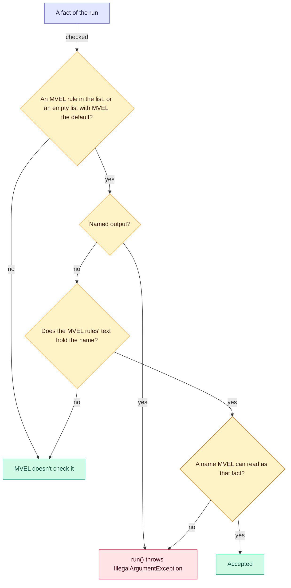

# 🔤 MVEL fact names

Which fact names MVEL rejects, which facts it checks at all, and where that check is only a best effort.

**Who it's for:** rule authors, and application developers who name the facts MVEL rules read.
**You'll be able to:** pick fact names MVEL rules can read, tell why a name was rejected, and know which names MVEL
leaves unchecked.
**Before you start:** [MVEL](mvel.md) and [Naming rules](../facts.md#-naming-rules).

[← Documentation index](../README.md)

- [How MVEL checks a fact's name](#-how-mvel-checks-a-facts-name)
- [Fact names MVEL rejects](#-fact-names-mvel-rejects)
- [Which fact names MVEL checks](#-which-fact-names-mvel-checks)
- [The name output](#-the-name-output)

---

## 🧭 How MVEL checks a fact's name

A run checks each fact's name against the rule list it runs, after the engine's own checks in
[Naming rules](../facts.md#-naming-rules). MVEL takes part only for a rule list with an MVEL rule, or an empty one
while MVEL is the [default language](../glossary.md#default-language). Then, in this order:

1. **`output` is rejected**, whatever the rules read: it's the output object's name. See
   [The name output](#-the-name-output).
2. **MVEL checks the names its rules' text holds.** A fact whose name the text of the list's MVEL conditions and
   actions holds, as a name or a word, must be one MVEL can read as that fact; see
   [Fact names MVEL rejects](#-fact-names-mvel-rejects). Any other fact isn't checked by MVEL; see
   [Which fact names MVEL checks](#-which-fact-names-mvel-checks).



A rejected fact fails `run()` with `IllegalArgumentException` before any condition runs. A
[declared fact](../facts.md#-declaring-facts) is checked the same way when a rule list is compiled: `load()` throws a
`RuleCompilationException` for it, and `validate()` returns one. A blank name fails `fact()`.

When a rule of the list fails to compile, MVEL can't say what its rules read, so `load()` and `validate()` check
every declared fact's name with it, whatever the text holds: their failures can then include one such as
`Declared fact 'empty' can't be used`.

> [!NOTE]
> Up to 2.27.0, MVEL checked every fact's name, whatever its rules' text held, and reserved `output` for every rule
> list, so a declared `output` failed `build()`.

## 🚫 Fact names MVEL rejects

These rules apply to a fact whose name the rule list's MVEL text holds. `run()` throws `IllegalArgumentException` for
such a fact whose name MVEL can't read as that fact. A declared one fails `load()` instead, with a
`RuleCompilationException` (`Declared fact 'Math' can't be used: ...`).

A name must be a Java identifier. `my-fact` would read as `my - fact`, so it is rejected with the message below. So is
`2nd` where a rule's text holds it, such as in a comment: code that reads it, such as `2nd == 1`, fails `load()` with
`invalid number literal: 2nd`.

```text
'my-fact' is not a valid fact name: rules can only refer to a fact named with a Java identifier
```

MVEL reads these as something else before the facts, so they're rejected too:

| Kind | Names |
| --- | --- |
| Literals | `true` `false` `null` `nil` `empty` |
| Primitive type names | `boolean` `byte` `char` `double` `float` `int` `long` `short` |
| Built-in class names | The 22 in [Classes and imports](mvel.md#-classes-and-imports), such as `Math`, `String` and `Thread` |
| Operators and keywords | `and` `assert` `contains` `convertable_to` `def` `do` `else` `for` `foreach` `function` `if` `import` `import_static` `in` `instanceof` `is` `isdef` `new` `or` `return` `soundslike` `stacklang` `strsim` `switch` `until` `var` `while` `with` `this` |
| Imported classes | The simple name of an imported class: `LocalDate` for `imports("java.time.LocalDate")`, `Entry` for `imports("java.util.Map.Entry")`. Any class in an imported package: `Date` for `imports("java.util")` |
| Package roots | `java` once a rule uses `java.lang.Integer.MAX_VALUE`. Here MVEL would read the fact in the class's place; see below |

```text
'Math' cannot be used as a fact name: MVEL reads it as a keyword or class name, so rules would never see the fact
```

- The check is case-sensitive: `date` is accepted with `imports("java.util")`, and `Date` when nothing imports it.
- `$x`, `_` and `café` are accepted; `𝒜` (U+1D49C, beyond U+FFFF) isn't, though `imports(...)` accepts it in a
  package name.
- A class in an imported package that can't be loaded isn't read as a class name, so the fact keeps it, as in
  MVEL's own lookup; a [fatal error](../glossary.md#fatal-error) such as an `OutOfMemoryError` leaves `run()` instead.

**Package roots** are per rule list: the first part of each class its rules use, named with its package
outside strings and comments (`new java.util.ArrayList()`), from a package import (`acme` for `Order` with
`imports("acme.orders")`), nested in an imported class (`Map.Entry`) or a rule's `import`.

A root that comes from an import, and so isn't written in the rule, is rejected only where a rule's text also
holds the name, even in a comment. That's `acme` for `Order` with `imports("acme.orders")`, or `java` for `Map.Entry`
with `imports("java.util.Map")`. Where no rule's text holds `acme`, a fact `acme` is accepted, and the rules still
read the class.

A field or method of a singly imported or built-in class, such as `Math.PI`, adds nothing, nor does an unused
import. The message says why, even for a class name:

```text
'java' cannot be used as a fact name: the rules use a class whose package starts with 'java', and MVEL would read the fact in the class's place
```

## 🔍 Which fact names MVEL checks

As `load()` or `validate()` compiles each condition and action, MVEL scans its text for the names a rule could read a
fact by. Strings and comments are scanned too. The names are:

- each identifier, such as `applicant` and `creditScore` in `applicant.creditScore`;
- each word, split four ways: at whitespace alone; at whitespace, brackets, commas, quotes and operators such as `==`,
  `&&` and `?`; the same without the comma; and those with `* / + %` too;
- each part of a word between dots.

MVEL then checks only the facts named in that set. So:

- another language's rules in the same list can read a fact `in`, when no MVEL rule's text holds `in`;
- a name no rule's text can hold, one with a space or a line break such as `first name`, is never rejected by MVEL;
- an empty rule list, with MVEL as the default language, checks no name against MVEL's rules; `output` is still
  rejected.

### A best effort both ways

The scan finds extra names, such as the words of a comment. That's harmless: a fact by such a name is checked, as
every fact was up to 2.27.0.

It also misses some names MVEL reads. A fact by such a name isn't checked, so a rule can read it, or read other facts
in its place:

- **A name glued to a minus sign.** A word isn't split at `-`, as that would split `my-fact` itself. With facts `my`
  and `fact` present, `my-fact-1 == 0` computes `my` minus `fact` minus 1, and a fact `my-fact` isn't rejected.
  `my-fact == 1`, `(my-fact)`, `my-fact*2` and `my-fact.equals(1)` still reject it. `a.b--` reads a fact named `a.b`,
  unchecked.

- **Some names with punctuation in them that `isdef` reads up to a comment**, such as `a!b` in `isdef a!b/**/`.

- **Some odd names**, such as a fact named `\` alone, which MVEL reads from `\\a`; one named with the first half alone
  of a character Java stores as two `char`s, such as U+D835, read from U+1D465 (a mathematical italic x); or `\a`
  between an operator and a comma, as in `java.lang.Math.max(1+\a,2)`.

> [!WARNING]
> This departs from the [`factNamesRead()` contract](custom.md#-fact-names), which asks a language for more names,
> never fewer. Don't rely on MVEL to reject a fact named like those above. A follow-up issue tracks these gaps.

## 📤 The name output

MVEL's actions see the output object as `output`, so MVEL reserves the name, but only for a rule list with an MVEL
rule, or an empty one while MVEL is the default language. For such a list:

- a run rejects a fact `output`, whatever the rules read, with
  `'output' is reserved for the output object and cannot be used as a fact name`;
- `load()` throws, and `validate()` returns, a `RuleCompilationException` for a declared `output`, with
  `'output' is reserved for the output object and cannot be declared as a fact`. `build()` accepts the declaration.

A rule list with no MVEL rule, such as one of only another language's rules, accepts a fact `output`, unless another
of the engine's languages reserves it; see [Fact names](custom.md#-fact-names). `Output` and `OUTPUT` are ordinary
names.
