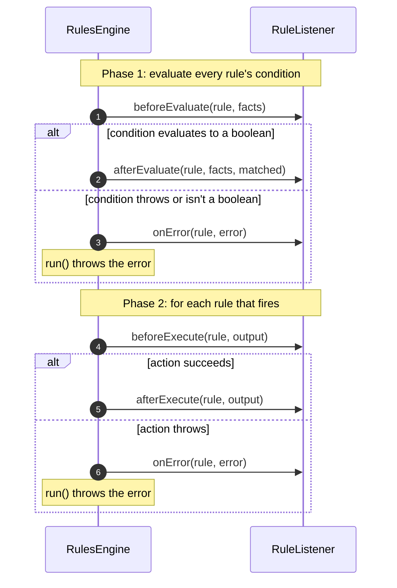

# 👂 Listeners & logging

Register a `RuleListener` to trace which rules matched, time each rule, or audit decisions. The engine also logs
its own failures through SLF4J.

[← Back to README](../README.md)

- [Callbacks](#-callbacks)
- [Writing a listener](#-writing-a-listener)
- [Guarantees](#-guarantees)
- [LoggingRuleListener](#-loggingrulelistener)
- [Logging setup](#-logging-setup)

---

## 🔔 Callbacks

Every method has an empty default implementation, so override only the ones you need.

| Callback | Called | Arguments |
| --- | --- | --- |
| `beforeEvaluate(rule, facts)` | Before a condition is evaluated | The rule, and a read-only view of the fact values |
| `afterEvaluate(rule, facts, matched)` | After a condition evaluates to a boolean | ... plus whether it matched |
| `beforeExecute(rule, output)` | Before an action runs | The rule and the output object |
| `afterExecute(rule, output)` | After an action completes | The rule and the output object |
| `onError(rule, error)` | Instead of `afterEvaluate` or `afterExecute`, when the condition or action fails | The rule and the `RuleExecutionException` that `run()` is about to throw |



Compile errors from `setRuleList()` are never reported to listeners; they're thrown directly.

## ✍ Writing a listener

```java
engine.registerListener(new RuleListener() {
    @Override
    public void afterEvaluate(Rule rule, Map<String, Object> facts, boolean matched) {
        System.out.println(rule.getRuleName() + " matched: " + matched);
    }

    @Override
    public void onError(Rule rule, RuleExecutionException error) {
        System.out.println(rule.getRuleName() + " failed: " + error.getMessage());
    }
});
```

Use `registerListeners(List)` to add several at once. Listeners can be added at any time, but not removed.

### Tracing each rule

Every `before*` callback is followed by exactly one closing callback, so anything you open can always be closed.
`startSpan` and `endSpan` stand in for your own tracing API:

```java
engine.registerListener(new RuleListener() {
    @Override
    public void beforeExecute(Rule rule, Object output) {
        startSpan(rule);
    }

    @Override
    public void afterExecute(Rule rule, Object output) {
        endSpan(rule);
    }

    @Override
    public void onError(Rule rule, RuleExecutionException error) {
        endSpan(rule, error);
    }
});
```

## ✅ Guarantees

| Guarantee | Detail |
| --- | --- |
| 🔗 **Paired callbacks** | Every `beforeEvaluate` / `beforeExecute` is followed by exactly one matching `after*` or `onError`. A listener registered partway through a run starts with a `before*` callback, never with a closing one. |
| 🧯 **Listener failures are contained** | An exception thrown by a listener, including a `StackOverflowError` or `AssertionError`, is logged at WARN and the run continues. Any other `Error`, such as `OutOfMemoryError`, propagates out of `run()`. |
| 💥 **Errors in rules** | A rule that throws a `StackOverflowError` or `AssertionError` is wrapped in the `RuleExecutionException`. Any other `Error` is wrapped for `onError` and then rethrown unchanged from `run()`. |
| 📄 **Private copies** | Each callback receives its own copy of the `Rule`. Changing it affects nothing else. |
| 🔏 **Read-only facts** | The `facts` map holds fact values, not the `FactStore`. Writing to it throws `UnsupportedOperationException`. |
| 🧵 **Concurrency** | An engine shared across threads calls the same listener from every thread, possibly at the same time. **Listeners must be thread-safe.** |

## 🪵 LoggingRuleListener

A ready-made listener that logs every lifecycle event at **DEBUG** level:

```java
engine.registerListener(new LoggingRuleListener());
```

```text
Evaluating condition for rule: prime-rate
Evaluated condition for rule: prime-rate | Match: true
Executing action for rule: prime-rate
Executed action for rule: prime-rate
Failed rule: standard-rate | Error: Failed to execute action for rule 'standard-rate': ...
```

## 🔧 Logging setup

The engine depends only on the **SLF4J 2.x API**. Without a provider on the classpath, SLF4J prints
`No SLF4J providers were found` and discards every message. Spring Boot already includes Logback; other
applications can add Logback, Log4j 2's SLF4J 2 provider, or `slf4j-simple`.

| Logger | Level | Messages |
| --- | --- | --- |
| `io.github.brantunger.unruly.core.AbstractRulesEngine` | `ERROR` | Every rule list `setRuleList()` rejects, fact `run()` rejects, rule failure and output-supplier failure, logged just before the exception is thrown. Misuse isn't logged: a `null` argument, `run()` before `setRuleList()`, or an invalid `addImport()` string. |
| `io.github.brantunger.unruly.core.AbstractRulesEngine` | `WARN` | A listener threw an exception |
| `io.github.brantunger.unruly.api.LoggingRuleListener` | `DEBUG` | Lifecycle events, if you registered the listener |

> [!NOTE]
> The engine already logs each failure at ERROR. If you also log the exception you catch, you'll see it twice.
> Lower the engine logger's level if you prefer to handle logging yourself.

**Logback** (`logback.xml`):

```xml
<logger name="io.github.brantunger.unruly.api.LoggingRuleListener" level="DEBUG"/>
```

**Spring Boot** (`application.properties`):

```properties
logging.level.io.github.brantunger.unruly.api.LoggingRuleListener=DEBUG
```
