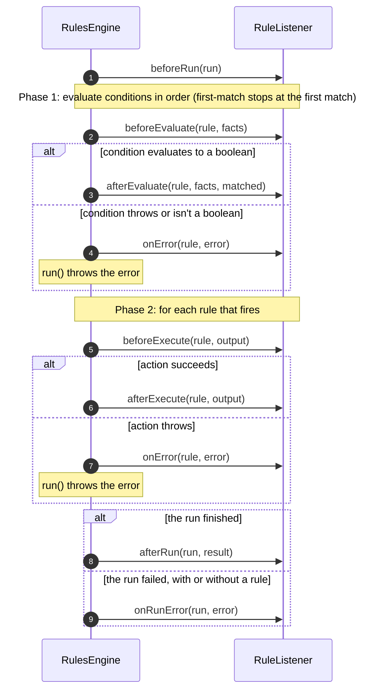

# 👂 Listeners & logging

Add a `RuleListener` to an engine to trace which rules matched, time each rule, or audit decisions. The engine also logs
its own failures through SLF4J, and records slow runs as JDK Flight Recorder events.

[← Documentation index](README.md)

- [Callbacks](#-callbacks)
- [Writing a listener](#-writing-a-listener)
- [Guarantees](#-guarantees)
- [LoggingRuleListener](#-loggingrulelistener)
- [Flight Recorder events](#-flight-recorder-events)
- [Logging setup](#-logging-setup)

---

## 🔔 Callbacks

Every method has an empty default implementation, so override only the ones you need.

| Callback | Called | Arguments |
| --- | --- | --- |
| `beforeRun(run)` | When a run starts, before any condition | The `RunContext`: the run's number, its parent run, the match policy, the checksum of the rules it uses, its facts, its tags, and the instant its validity windows are judged at |
| `afterRun(run, result)` | When a run has finished | ... plus the `RunResult`: the output, the rules that fired, each rule's outcome, the rules' checksum, and the run's tags and instant |
| `onRunError(run, error)` | Instead of `afterRun`, when the run fails | ... plus what the run failed with, **including failures that belong to no rule**. See below the diagram |
| `beforeEvaluate(rule, facts)` | Before a condition is evaluated | The rule, and a read-only view of the fact values |
| `afterEvaluate(rule, facts, matched)` | After a condition evaluates to a boolean | ... plus whether it matched. Not the language's [detail](engines-and-runs.md#-what-a-run-reports): read that from `afterRun`'s result |
| `beforeExecute(rule, output)` | Before an action runs | The rule and the output object |
| `afterExecute(rule, output)` | After an action completes | The rule and the output object |
| `onError(rule, error)` | Instead of `afterEvaluate` or `afterExecute`, when the condition or action fails | The rule and the `RuleExecutionException` the run fails with |



A run's callbacks are paired like a rule's: `beforeRun` is followed by exactly one `afterRun` or `onRunError`. A
failure that belongs to no rule — a fact name no language can refer to, an output supplier that throws, more than one
rule matching on a unique-match engine, an interrupt or a passed deadline while the run waits for a compiled copy of
the rules or reads them again after a reload or a `close()`, an interrupt while it waits for a build slot, or a run
stopped because its thread was interrupted or it passed its deadline between rules — reaches `onRunError` only,
because no rule was involved. The rule a stopped run would have gone on to gets no callback either: the check runs
before `beforeEvaluate` and `beforeExecute`, so there is no open callback for `onError` to close.

A run stopped while a condition or action was running is different: that rule's callback is closed with `onError`,
whose exception has no rule name and an `InterruptedException` or `TimeoutException` cause, so don't count it as a
rule failure.

A condition or action that throws with an `Error` anywhere in the cause chain is the one case that still reports
that rule's failure, named and at ERROR, even once the run must stop; see
[What stops a run](stopping-runs.md#-what-stops-a-run).
[What happens on each failure](error-handling.md#-what-happens-on-each-failure) lists every case, and
[Stopping a run](stopping-runs.md#-what-listeners-see) explains where a run stops.

`onRunError`'s `error` is a `RuleExecutionException`, or an `IllegalArgumentException` for a fact the engine or a
language rejects. When `run()` rethrows a fatal `Error`, such as an `OutOfMemoryError`, `error` is a
`RuleExecutionException` that carries it, not the error `run()` throws.

A run of the same engine started on the same thread, from inside an action or a listener, has the run around it as
its `parent()`, so nested runs stay apart without a `ThreadLocal`. A run of another engine started there has no
`parent()`. A context equals only itself, so it can key a map from `beforeRun` to `afterRun` or `onRunError`, even when
facts change during the run or another engine runs with equal facts; its `toString()` names the run but never the
facts. `RunContext` is sealed to the engine, so test a listener by running an engine rather than by constructing a
context.

A rule the run [skips](engines-and-runs.md#-choosing-which-rules-a-run-uses), because it's disabled, outside its
validity window or without the run's tags, gets no callback at all. It appears only in the `RunResult` that
`afterRun` receives, with the outcome `SKIPPED`.

The context says what chose the rules: `tags()` is the run's `RunOptions.tags()`, empty when it uses every rule, and
`startedAt()` is the instant its windows were judged at, from the
[engine's clock](engines-and-runs.md#the-validity-window-and-the-engines-clock). Every run callback gets both, even
`onRunError` for a run stopped while it waited for a compiled copy. A nested run doesn't inherit them: it reads the
clock again, and has only the tags its own options give it. Conditions and actions can't read either value, because
neither is on `EvaluationContext` or `ActionContext`.

Compile errors from `load()` are never reported to listeners; they're thrown directly.

## 📝 Writing a listener

```java
RulesEngine<LoanDecision> engine = RulesEngineBuilder.firstMatch(LoanDecision::new)
        .listener(new RuleListener() {
            @Override
            public void afterEvaluate(Rule rule, Map<String, Object> facts, boolean matched) {
                System.out.println(rule.getRuleName() + " matched: " + matched);
            }

            @Override
            public void onError(Rule rule, RuleExecutionException error) {
                System.out.println(rule.getRuleName() + " failed: " + error.getMessage());
            }
        })
        .build();
```

Use `listeners(Collection)` to add several at once, in order. An engine's listeners are set when it's built, and can't
be added or removed afterwards.

### Tracing each rule

Every `before*` callback is followed by exactly one closing callback, so anything you open can always be closed.
`startSpan` and `endSpan` stand in for your own tracing API:

```java
RulesEngine<LoanDecision> engine = RulesEngineBuilder.firstMatch(LoanDecision::new)
        .listener(new RuleListener() {
            @Override
            public void beforeExecute(Rule rule, Object output) {
                startSpan(rule);
            }

            @Override
            public void afterExecute(Rule rule, Object output) {
                endSpan(rule);
            }

            @Override
            public void onError(Rule rule, RuleExecutionException error) {
                endSpan(rule, error);
            }
        })
        .build();
```

## ✅ Guarantees

| Guarantee | Detail |
| --- | --- |
| 🔗 **Paired callbacks** | Every `beforeRun`, `beforeEvaluate` and `beforeExecute` is followed by exactly one matching `after*`, `onError` or `onRunError`. |
| 🧾 **Every failure of a run** | `onRunError` reports what the run failed with, including the failures no rule causes. A failure inside a rule reaches that rule's `onError` first. |
| 🛑 **Runs that never start** | Misuse — `null` facts, running before `load()`, or on a closed engine — and a language that fails to create a session reach no callback. |
| ⏱️ **A stopped run** | A run stopped because its thread was interrupted, or because it passed its deadline, reaches `onRunError`. Stopped between rules, the rule it would have gone on to gets nothing: the check runs before `beforeEvaluate` and `beforeExecute`, so no callback is open. Stopped when a condition or action returns, or throws an exception with no `Error` in its cause chain, that rule gets `onError` with the stop exception; a throw with an `Error` in its chain gets `onError` with that rule's failure instead. A listener that throws an `InterruptedException`, or an exception caused by one, doesn't hide the interrupt: the engine sets it again, and the next check, if a condition or action is still to come, finds it. |
| 🧯 **Listener failures are contained** | An exception thrown by a listener, including a `StackOverflowError`, an `AssertionError` or a missing class (`NoClassDefFoundError`), is logged at WARN with its class and message, escaped and shortened, its stack trace is logged at DEBUG, and the run continues. A `VirtualMachineError` such as `OutOfMemoryError` propagates out of `run()` once every listener has received the same callback, also when it's the cause of an exception the listener throws. If it came from a `before*` callback, the condition or action doesn't run, and every listener first gets `onError` to close that callback; if it came from `beforeRun`, every listener gets `onRunError`. When `onError` closes a failure that is fatal itself and a listener throws another `VirtualMachineError` there, the failure's own error is still the one `run()` throws: the first other one a listener threw is kept in the `getSuppressed()` of the exception `onRunError` gets, and any later one is only logged. |
| 💥 **Errors in rules** | A rule that throws a `StackOverflowError`, an `AssertionError` or a `LinkageError` — a missing or unreadable class, which means the rule is misconfigured rather than the JVM failing — is wrapped in the `RuleExecutionException`. A `VirtualMachineError` such as `OutOfMemoryError`, including one thrown by a method, a getter or a lambda the rule calls, is wrapped for `onError`, and `onRunError` gets the same exception, naming the rule, before the error is rethrown unchanged from `run()`. |
| 🔚 **A fatal error from `afterRun`** | Every listener gets `afterRun`, then the error leaves `run()`, although the run succeeded. No listener gets `onRunError`. |
| 🆘 **A fatal error from `onRunError`** | Every listener gets `onRunError`, then that error leaves `run()` in place of the exception the run failed with. |
| 📋 **Registration order** | Every callback goes to the listeners in the order they were added, and each one gets it even when an earlier one threw. |
| 📄 **The rules you loaded** | A `Rule` is immutable, so each callback receives the rule you passed to `load()`: the same instance every time. |
| 🔏 **Read-only facts** | The `facts` map holds fact values, not the `FactStore`. Writing to it throws `UnsupportedOperationException`. |
| 🧵 **Concurrency** | An engine shared across threads calls the same listener from every thread, possibly at the same time. **Listeners must be thread-safe.** |

## 🪵 LoggingRuleListener

A ready-made listener that logs each rule's callbacks at **DEBUG** level: `beforeEvaluate`, `afterEvaluate`,
`beforeExecute`, `afterExecute` and `onError`. It doesn't log the run callbacks. With DEBUG off, it returns at once
from every callback.

```java
RulesEngine<LoanDecision> engine = RulesEngineBuilder.firstMatch(LoanDecision::new)
        .listener(new LoggingRuleListener())
        .build();
```

For the README's quick start, a first-match engine and a score of 780, it logs:

```text
Evaluating condition for rule: prime-rate
Evaluated condition for rule: prime-rate | Match: true
Executing action for rule: prime-rate
Executed action for rule: prime-rate
```

A first-match engine stops at the first match, so `standard-rate` is never evaluated and doesn't appear. An
all-matches engine evaluates every condition first, so it would log both rules before firing either action. When a
condition or action fails, the listener logs a line such as
`Failed rule: prime-rate | Error: Failed to execute action for rule 'prime-rate': ...` in place of the closing line.
When the run stops during a rule, because its thread was interrupted or it passed its deadline, the line reads
`Stopped rule: prime-rate | run() passed its deadline of ...` instead.

Rule names appear as the engine's error messages show them: line breaks and other control characters are escaped
(`\n`), and a name longer than 200 characters is shortened, so a name can't start a log line of its own. The failure
message on that line is escaped the same way and isn't shortened, because it carries text the engine didn't write,
such as the fact values a language quotes in its own message.

## 📡 Flight Recorder events

The engine emits two [JDK Flight Recorder](https://docs.oracle.com/en/java/javase/21/jfapi/) events, whatever
language the rules are written in. They need no dependency and no listener, and an event that isn't enabled costs a
run nothing measurable, so they are how to see what an engine does in production without writing code. The event
names and fields below are the contract; the classes that emit them aren't API.

| Event | Enabled by default | One for every |
| --- | --- | --- |
| `io.github.brantunger.unruly.Run` | Yes, with a 10 ms threshold, so only slow runs are kept | `run()` call, from the call to its return or exception, including reading the facts and any wait for a compiled copy |
| `io.github.brantunger.unruly.Rule` | No | Condition evaluated and action run; a rule below a first match, or one the run skips, has none |

The run event's fields:

| Field | Value |
| --- | --- |
| `engineId` | Numbers the engines of the JVM in creation order, so two engines' runs can be told apart |
| `runId`, `parentRunId` | The run's number within its engine, as `RunContext.runId()` reports it, and the number of the run it was started from on the same thread, or 0 |
| `matchPolicy` | `firstMatch`, `allMatches` or `uniqueMatch` |
| `rulesEvaluated`, `rulesFired` | Conditions evaluated and actions run to completion, also for a run that failed or stopped part-way. Rules the run skips count in neither |
| `ruleSetChecksum` | The [checksum](glossary.md#checksum) of the rules the run used |
| `outcome` | `COMPLETED`; `STOPPED` when the run reported a stop because it was interrupted or passed its deadline, also while waiting for a copy; `FAILED` for any other exception, a rule that threw with an `Error` in its cause chain included, even once the run must stop |

The run event doesn't record the run's tags or the instant its validity windows were judged at. A listener can read
both from the `RunContext`.

The rule event carries `engineId` and `runId` too, so it joins to its run, plus `ruleName`, `language`, `phase`
(`CONDITION` or `ACTION`) and `result`: `MATCHED` or `NOT_MATCHED` for a condition, `FIRED` for an action, and
`STOPPED` or `FAILED` for either, with the same meaning as on the run. The run event keeps the stack trace of the
`run()` caller; the rule event records none. A run refused because nothing is loaded or the engine is closed records
nothing, unless the engine was closed while the run was starting: that run is `FAILED`. The first run of a JVM
registers the events with Flight Recorder, which loads about a hundred classes and takes about 50 ms once, with or
without a recording; after that, an event that isn't enabled costs nothing measurable.

> [!NOTE]
> The module `io.github.brantunger.unruly.core` requires `jdk.jfr`, which every JDK includes and jlink adds to an
> image that requires the engine. On the class path it's optional: a runtime image without `jdk.jfr` runs the engine
> with no events, as a native image without Flight Recorder support does (below).

A GraalVM native image built without `--enable-monitoring=jfr`, which is `native-image`'s default, has no Flight
Recorder. There the engine records no events and its runs work as usual: at the first run it finds that the event
classes can't be loaded, and logs that once at DEBUG. See [Native image](native-image.md#-flight-recorder-events).

To keep every run, lower the threshold; to see each rule, enable the rule event. Both can be done on a running JVM:

```text
jcmd <pid> JFR.start settings=default +io.github.brantunger.unruly.Run#threshold=0ms +io.github.brantunger.unruly.Rule#enabled=true
```

or on the command line that starts it:

```text
java -XX:StartFlightRecording:filename=run.jfr,settings=default,+io.github.brantunger.unruly.Run#threshold=0ms,+io.github.brantunger.unruly.Rule#enabled=true -cp ... App
```

Prefix each event name with `+`, on `jcmd` and on the JVM's command line alike. `settings=default` names a `.jfc`
file, and a setting is matched against the events that file lists, so a setting for an event it doesn't list is a
new one: `-XX:StartFlightRecording:help` says to prefix the event name with `+` to add a new event setting. Without
it the JVM warns `The .jfc option/setting '...' doesn't exist.` and drops the setting, so the rule event stays off
and the run event keeps its 10 ms threshold.

A `.jfc` file of your own lists the events itself, so it needs no `+`. Pass it as `settings=unruly.jfc`:

```xml
<?xml version="1.0" encoding="UTF-8"?>
<configuration version="2.0" label="Unruly">
  <event name="io.github.brantunger.unruly.Run">
    <setting name="enabled">true</setting>
    <setting name="threshold">0 ms</setting>
  </event>
  <event name="io.github.brantunger.unruly.Rule">
    <setting name="enabled">true</setting>
  </event>
</configuration>
```

Keep the `<configuration>` root. A `.jfc` holding two bare `<event>` elements isn't well-formed XML, and a JVM
started with `settings=` pointing at one logs `Could not parse file` and stops with
`Error occurred during initialization of VM` rather than running without the events.

Enabled, the rule event costs about 60 ns per condition or action, and a run of a thousand rules is up to two
thousand events, so enable it to investigate, not permanently. With the run event's threshold at 0 ms, every run
also walks the stack for its trace.

## 🔧 Logging setup

The engine depends only on the **SLF4J 2.x API**. Without a provider on the classpath, SLF4J prints
`No SLF4J providers were found` and discards every message. Spring Boot already includes Logback; other
applications can add Logback, Log4j 2's SLF4J 2 provider, or `slf4j-simple`.

| Logger | Level | Messages |
| --- | --- | --- |
| `io.github.brantunger.unruly.engine` | `ERROR` | A rule list `load()` rejects, including a fatal `Error` from compiling, which is logged and then rethrown. `validate()` logs only that fatal `Error`; the problems it returns aren't logged |
| `io.github.brantunger.unruly.engine` | `ERROR` | A rule that fails at run time, including with a fatal `Error`, which is logged and then rethrown |
| `io.github.brantunger.unruly.engine` | `ERROR` | A fact `run()` rejects, or a fact name a language failed to check |
| `io.github.brantunger.unruly.engine` | `ERROR` | An output supplier that fails, or a language that fails to create a session for a run, or to create or warm up one for a copy `load()` makes with `copiesAtLoad(n)` |
| `io.github.brantunger.unruly.engine` | `ERROR` | A listener that throws a fatal `Error` from a callback other than `onError`, such as `A listener threw java.lang.OutOfMemoryError in afterRun` |
| `io.github.brantunger.unruly.engine` | `WARN` | A listener threw an exception: `Listener threw exception in <callback>: <class>: <message>`, escaped and shortened to 1,000 characters (no `: <message>` when it has none), then a root-cause note such as ` (caused by java.io.IOException: disk full)` when the message would otherwise hide the root cause; see [Error handling](error-handling.md#-exceptions-by-method) |
| `io.github.brantunger.unruly.engine` | `WARN` | A run stopped because its thread was interrupted or it passed its deadline, once when a nested run's stop reaches the run around it for the same interrupt or deadline |
| `io.github.brantunger.unruly.engine` | `WARN` | A warning a language reports through `CompileContext.warn` while `load()` compiles |
| `io.github.brantunger.unruly.engine` | `WARN` | A language failed to close a session or a compiler |
| `io.github.brantunger.unruly.engine` | `WARN` | A copy of the rules a run gave back couldn't be kept for a later run, so its sessions were closed: `A copy of the rules couldn't be kept for a later run, so its sessions were closed: <message>`, escaped and shortened to 1,000 characters (the class name when it has no message), then a root-cause note when the message would otherwise hide the root cause |
| `io.github.brantunger.unruly.engine` | `WARN` | A fatal error from closing replaced a failure but can't keep it in `getSuppressed()`, as with an `OutOfMemoryError` the JVM throws itself: `A failure was replaced by the fatal error <class>: <message>, which can't carry it as a suppressed exception: <class>: <message>`. Each `<class>: <message>` is escaped and shortened to 1,000 characters (no `: <message>` when it has none), then a root-cause note when the message would otherwise hide the root cause; see [A fatal error while closing](thread-safety.md#a-fatal-error-while-closing) |
| `io.github.brantunger.unruly.engine` | `WARN` | A run waited five seconds for a compiled copy and made an extra one, once for each rule list |
| `io.github.brantunger.unruly.engine` | `DEBUG` | The stack trace of an exception a listener threw, which prints its message unescaped |
| `io.github.brantunger.unruly.engine` | `DEBUG` | `The engine records no Flight Recorder events here, because they can't be loaded: <error>`, once, where the event classes can't be loaded, such as a native image without Flight Recorder |
| `io.github.brantunger.unruly.api.LoggingRuleListener` | `DEBUG` | Each rule's callbacks, if you added the listener |

Each failure is logged just before its exception is thrown. Misuse isn't logged: a `null` argument, `run()` before
`load()`, or an invalid builder setting, such as an import that is neither a class nor a package name.

The engine already logs each failure at ERROR, so if you also log the exception you catch, you'll see it twice. The
problems `validate()` returns are the one case the engine doesn't log: log those yourself if you want them. Lower the
engine logger's level if you prefer to handle logging yourself.

> [!CAUTION]
> Failure messages can contain fact values. The JDK, MVEL and your own code put values into exception messages, such
> as `For input string: "123-45-6789"` or `uncomparable values <<123-45-6789>> and <<5>>`, and the engine copies the
> message into its ERROR and WARN lines, including a listener's exception, and into DEBUG lines: `LoggingRuleListener`'s,
> and a listener's stack trace, unescaped. If your facts hold sensitive data, turn off the `io.github.brantunger.unruly`
> logger and log a redacted form of the failure yourself.

The engine logs under the fixed name **`io.github.brantunger.unruly.engine`**, which is part of the API. In 1.x it
was `io.github.brantunger.unruly.core.AbstractRulesEngine`. The parent logger **`io.github.brantunger.unruly`** covers
the engine and `LoggingRuleListener`: Logback, Log4j 2 and Spring Boot apply a logger's level to every logger under
its name, and a more specific setting still takes precedence, as the `LoggingRuleListener` line below shows.

**Logback** (`logback.xml`):

```xml
<!-- For example, if you log the exceptions you catch: turn off the engine's own ERROR and WARN messages -->
<logger name="io.github.brantunger.unruly" level="OFF"/>
<!-- A more specific logger overrides the parent -->
<logger name="io.github.brantunger.unruly.api.LoggingRuleListener" level="DEBUG"/>
```

**Spring Boot** (`application.properties`):

```properties
logging.level.io.github.brantunger.unruly=OFF
logging.level.io.github.brantunger.unruly.api.LoggingRuleListener=DEBUG
```
