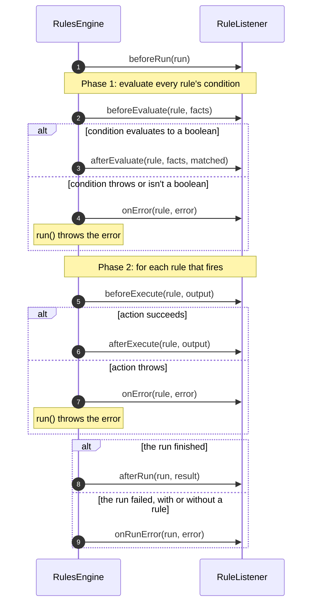

# 👂 Listeners & logging

Add a `RuleListener` to an engine to trace which rules matched, time each rule, or audit decisions. The engine also logs
its own failures through SLF4J.

[← Back to README](../README.md)

- [Callbacks](#-callbacks)
- [Writing a listener](#-writing-a-listener)
- [Guarantees](#-guarantees)
- [LoggingRuleListener](#-loggingrulelistener)
- [Logging setup](#-logging-setup)

---

## 🔔 Callbacks

Every method has an empty default implementation, so override only the ones you need.

| Callback | Called | Arguments |
| --- | --- | --- |
| `beforeRun(run)` | When a run starts, before any condition | The `RunContext`: the run's number, its parent run, the match policy, the checksum of the rules it uses, and its facts |
| `afterRun(run, result)` | When a run has finished | ... plus the `RunResult`: the output, the rules that fired, and the rules' checksum |
| `onRunError(run, error)` | Instead of `afterRun`, when the run fails | ... plus the exception `run()` is about to throw, **including failures that belong to no rule** |
| `beforeEvaluate(rule, facts)` | Before a condition is evaluated | The rule, and a read-only view of the fact values |
| `afterEvaluate(rule, facts, matched)` | After a condition evaluates to a boolean | ... plus whether it matched |
| `beforeExecute(rule, output)` | Before an action runs | The rule and the output object |
| `afterExecute(rule, output)` | After an action completes | The rule and the output object |
| `onError(rule, error)` | Instead of `afterEvaluate` or `afterExecute`, when the condition or action fails | The rule and the `RuleExecutionException` that `run()` is about to throw |



A run's callbacks are paired like a rule's: `beforeRun` is followed by exactly one `afterRun` or `onRunError`. A
failure that belongs to no rule — a fact name no language can refer to, an output supplier that throws, an
interrupt while the run waits for a compiled copy of the rules, or a run stopped because its thread was interrupted
or it passed its deadline between rules — reaches `onRunError` only, because no rule was involved. The rule a stopped run would
have gone on to gets no callback either: the check runs before `beforeEvaluate` and `beforeExecute`, so there is no
open callback for `onError` to close. A run stopped while a condition or action was running is different: that rule's
callback is closed with `onError`, whose exception has no rule name and an `InterruptedException` or
`TimeoutException` cause, so don't count it as a rule failure. A run started from inside an action has the run around it as its `parent()`, so nested runs stay apart
without a `ThreadLocal`. `RunContext` is sealed to the engine, so test a listener by running an engine rather than by
constructing a context.

Compile errors from `load()` are never reported to listeners; they're thrown directly.

## ✍ Writing a listener

```java
RulesEngine<LoanDecision> engine = RulesEngineBuilder.firstMatch(LoanDecision::new)
        .listener(new RuleListener() {
            @Override
            public void afterEvaluate(Rule rule, Map<String, Object> facts, boolean matched) {
                System.out.println(rule.getRuleName() + " matched: " + matched);
            }

            @Override
            public void onError(Rule rule, RuleExecutionException error) {
                System.out.println(rule.getRuleName() + " failed: " + error.getMessage());
            }
        })
        .build();
```

Use `listeners(Collection)` to add several at once, in order. An engine's listeners are set when it's built, and can't
be added or removed afterwards.

### Tracing each rule

Every `before*` callback is followed by exactly one closing callback, so anything you open can always be closed.
`startSpan` and `endSpan` stand in for your own tracing API:

```java
RulesEngine<LoanDecision> engine = RulesEngineBuilder.firstMatch(LoanDecision::new)
        .listener(new RuleListener() {
            @Override
            public void beforeExecute(Rule rule, Object output) {
                startSpan(rule);
            }

            @Override
            public void afterExecute(Rule rule, Object output) {
                endSpan(rule);
            }

            @Override
            public void onError(Rule rule, RuleExecutionException error) {
                endSpan(rule, error);
            }
        })
        .build();
```

## ✅ Guarantees

| Guarantee | Detail |
| --- | --- |
| 🔗 **Paired callbacks** | Every `beforeRun`, `beforeEvaluate` and `beforeExecute` is followed by exactly one matching `after*`, `onError` or `onRunError`. |
| 🧾 **Every failure of a run** | `onRunError` reports the exception `run()` throws, including the failures no rule causes. A failure inside a rule reaches that rule's `onError` first. Only misuse — running before `load()`, or on a closed engine — reaches no callback. |
| ⏱ **A stopped run** | A run stopped because its thread was interrupted, or because it passed its deadline, reaches `onRunError`. Stopped between rules, the rule it would have gone on to gets nothing: the check runs before `beforeEvaluate` and `beforeExecute`, so no callback is open. Stopped when a condition or action returns or throws, that rule gets `onError` with the stop exception. A listener that swallows an interrupt doesn't keep the run going — the next check finds it. |
| 🧯 **Listener failures are contained** | An exception thrown by a listener, including a `StackOverflowError`, an `AssertionError` or a missing class (`NoClassDefFoundError`), is logged at WARN and the run continues. A `VirtualMachineError` such as `OutOfMemoryError` propagates out of `run()` once every listener has received the same callback, also when it's the cause of an exception the listener throws. If it came from a `before*` callback, the condition or action doesn't run, and every listener first gets `onError` to close that callback. |
| 💥 **Errors in rules** | A rule that throws a `StackOverflowError`, an `AssertionError` or a `LinkageError` — a missing or unreadable class, which means the rule is misconfigured rather than the JVM failing — is wrapped in the `RuleExecutionException`. A `VirtualMachineError` such as `OutOfMemoryError`, including one thrown by a method, a getter or a lambda the rule calls, is wrapped for `onError` and then rethrown unchanged from `run()`. |
| 📄 **The rules you loaded** | A `Rule` is immutable, so each callback receives the rule you passed to `load()`: the same instance every time. |
| 🔏 **Read-only facts** | The `facts` map holds fact values, not the `FactStore`. Writing to it throws `UnsupportedOperationException`. |
| 🧵 **Concurrency** | An engine shared across threads calls the same listener from every thread, possibly at the same time. **Listeners must be thread-safe.** |

## 🪵 LoggingRuleListener

A ready-made listener that logs every lifecycle event at **DEBUG** level:

```java
RulesEngine<LoanDecision> engine = RulesEngineBuilder.firstMatch(LoanDecision::new)
        .listener(new LoggingRuleListener())
        .build();
```

For the README's quick start, a first-match engine and a score of 780, it logs:

```text
Evaluating condition for rule: prime-rate
Evaluated condition for rule: prime-rate | Match: true
Executing action for rule: prime-rate
Executed action for rule: prime-rate
```

A first-match engine stops at the first match, so `standard-rate` is never evaluated and doesn't appear. An
all-matches engine evaluates every condition first, so it would log both rules before firing either action. When a
condition or action fails, the listener logs a line such as
`Failed rule: prime-rate | Error: Failed to execute action for rule 'prime-rate': ...` in place of the closing line.

Rule names appear as the engine's error messages show them: line breaks and other control characters are escaped
(`\n`), and a name longer than 200 characters is shortened, so a name can't start a log line of its own. The failure
message on that line is escaped the same way and isn't shortened, because it carries text the engine didn't write,
such as the fact values a language quotes in its own message.

## 🔧 Logging setup

The engine depends only on the **SLF4J 2.x API**. Without a provider on the classpath, SLF4J prints
`No SLF4J providers were found` and discards every message. Spring Boot already includes Logback; other
applications can add Logback, Log4j 2's SLF4J 2 provider, or `slf4j-simple`.

| Logger | Level | Messages |
| --- | --- | --- |
| `io.github.brantunger.unruly.engine` | `ERROR` | Every rule list `load()` rejects, fact `run()` rejects, rule failure and output-supplier failure, logged just before the exception is thrown. That includes a fatal `Error` from compiling or running a rule, which is logged and then rethrown. Misuse isn't logged: a `null` argument, `run()` before `load()`, or an invalid builder setting, such as an import that is neither a class nor a package name. |
| `io.github.brantunger.unruly.engine` | `WARN` | A listener threw an exception |
| `io.github.brantunger.unruly.api.LoggingRuleListener` | `DEBUG` | Lifecycle events, if you added the listener |

> [!NOTE]
> The engine already logs each failure at ERROR. If you also log the exception you catch, you'll see it twice.

> [!CAUTION]
> Failure messages can contain fact values. The JDK, MVEL and your own code put values into exception messages, such
> as `For input string: "123-45-6789"` or `uncomparable values <<123-45-6789>> and <<5>>`, and the engine copies the
> message into its ERROR log line and into `LoggingRuleListener`'s DEBUG line. If your facts hold sensitive data, turn
> off the `io.github.brantunger.unruly` logger and log a redacted form of the failure yourself.
> Lower the engine logger's level if you prefer to handle logging yourself.

> [!IMPORTANT]
> The engine logs under the fixed name **`io.github.brantunger.unruly.engine`**, which is part of the API. In 1.x it
> was `io.github.brantunger.unruly.core.AbstractRulesEngine`. The parent logger **`io.github.brantunger.unruly`** covers
> the engine and `LoggingRuleListener`: Logback, Log4j 2 and Spring Boot apply a logger's level to every logger under
> its name, and a more specific setting still takes precedence, as the `LoggingRuleListener` line below shows.

**Logback** (`logback.xml`):

```xml
<!-- For example, if you log the exceptions you catch: turn off the engine's own ERROR and WARN messages -->
<logger name="io.github.brantunger.unruly" level="OFF"/>
<!-- A more specific logger overrides the parent -->
<logger name="io.github.brantunger.unruly.api.LoggingRuleListener" level="DEBUG"/>
```

**Spring Boot** (`application.properties`):

```properties
logging.level.io.github.brantunger.unruly=OFF
logging.level.io.github.brantunger.unruly.api.LoggingRuleListener=DEBUG
```
