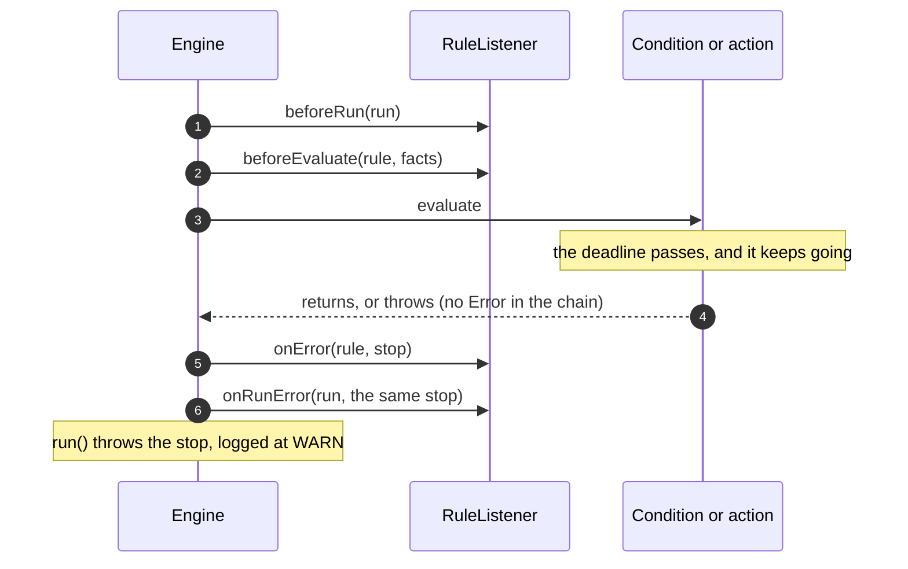

# ⏳ Stopping a run

A run stops when its thread is interrupted or it passes a timeout. This page says where it stops, what it throws, and
what a timeout can't stop.

**Who it's for:** application developers who give runs a timeout or cancel them, and listener authors.
**You'll be able to:** give an engine or one run a timeout, tell a stop from a rule failure, and predict what keeps
running past a deadline.
**Before you start:** the [Quick start](../README.md#-quick-start). [Error handling](error-handling.md) covers
failures that aren't stops.

[← Documentation index](README.md)

- [Quick start](#-quick-start)
- [What stops a run](#-what-stops-a-run)
- [What a timeout doesn't do](#-what-a-timeout-doesnt-do)
- [What listeners see](#-what-listeners-see)
- [Gotchas](#-gotchas)
- [Nested runs](#-nested-runs)
- [Questions you might not think to ask](#-questions-you-might-not-think-to-ask)

---

## 🚀 Quick start

`facts` is the store from the [Quick start](../README.md#-quick-start), and `rules` is the list it loads.

```java
RulesEngine<LoanDecision> engine = RulesEngineBuilder.firstMatch(LoanDecision::new)
        .runTimeout(Duration.ofSeconds(2))          // every run of this engine
        .build();
engine.load(rules);

try {
    LoanDecision decision = engine.run(facts);
    // One run with a timeout of its own, which replaces the engine's, longer or shorter
    RunResult<LoanDecision> result = engine.runWithResult(facts, RunOptions.withTimeoutOf(Duration.ofSeconds(10)));
} catch (RuleExecutionException e) {
    if (e.getRuleName() != null) {
        // A rule failed: see Error handling
    } else if (e.getCause() instanceof TimeoutException) {
        // The run passed its deadline
    } else if (e.getCause() instanceof InterruptedException) {
        // The thread was interrupted, and its interrupt status is still set
    } else {
        // A failure that belongs to no rule, such as an output supplier that threw
    }
}
```

- **A stopped run throws `RuleExecutionException`.** Its `getRuleName()` is `null`, because no rule failed, and its
  cause is a `java.util.concurrent.TimeoutException` or an `InterruptedException`. The engine logs it at WARN, not
  ERROR.
- **The [deadline](glossary.md#deadline) is taken when `run()` is called,** so reading the facts and waiting for a
  [compiled copy](glossary.md#compiled-copy) count towards it.
- **`RunOptions.withTimeoutOf(...)` replaces the engine's timeout for one run.** No option removes the engine's
  timeout, and a zero or negative timeout throws `IllegalArgumentException`.
- **Nothing is rolled back.** What ran before the stop keeps its effects on the output object and the facts, like
  any failed run.

## 🚦 What stops a run

The engine looks at the thread's interrupt status and the run's deadline at these points, and stops the run at the
first one that finds either:

| Where the engine checks | The message ends with |
| --- | --- |
| Before each condition and each action | `before rule 'x'` |
| When a condition or action returns, or throws anything with no `Error` in its cause chain | `during rule 'x'` |
| While the run waits for a compiled copy | `while waiting for a compiled copy of the rules: all N were in use` |
| While the run waits for a build slot, interrupts only | `while waiting to make a compiled copy of the rules: every build slot was in use` |
| While the run reads the engine's rules again, after a reload or `close()` closed the list it had read | `while reading the engine's rules again: the rules this run read had been closed by a reload or by close()` |

Each message starts with `run() passed its deadline of <instant>` or `run() was interrupted`.

- **A check when an expression returns stops the run, whatever it returned.** So a run whose last condition or action
  returns past its deadline throws, although that rule finished. An action stopped there doesn't have the properties
  it returned set on the output. When what it returned would have failed the rule, such as a condition that evaluated
  to a string or an action that returned `null`, that failure is kept in `getSuppressed()` as a
  `RuleExecutionException` naming the rule.
- **An exception thrown once the run must stop is a stop too,** not that rule's failure, unless an `Error` is
  anywhere in its cause chain. What the expression threw is kept in `getSuppressed()`. This is how a language gives
  up part-way, and how a [nested run](#-nested-runs) that stopped stops the run around it.
- **An exception with an `Error` anywhere in its cause chain is that rule's failure,** even once the run must stop:
  it names the rule, what the expression threw is its `getCause()` rather than a suppressed exception, and it's
  logged at ERROR. That is exactly what the same throw reports when the run isn't stopping. The case to expect is an
  `Error` thrown by Java code a rule calls — a method, a getter or a lambda held in a fact — which MVEL wraps in its
  own exception; then the `Error` sits deeper in the chain than `getCause()`. A
  [fatal error](glossary.md#fatal-error) still escapes `run()` unchanged, stopping or not.
- **A thread that is already interrupted** stops before its first rule, or fails at once if it would have to wait
  for a copy; see [Limiting the copies](compiled-copies.md#-limiting-the-copies).
- **A wait for a copy** happens only when the engine limits copies and all of them are in use. The run stops waiting
  at its deadline. But when no copy comes back for five seconds and the deadline is further away than that, it makes
  an extra copy and goes on instead; see [Runs that don't wait](compiled-copies.md#runs-that-dont-wait).
- **A wait for a build slot** happens only on an engine built with `unlimitedCopies()`, when a run on a virtual
  thread, not nested in another run on it, finds no idle copy. The deadline never fails it: the run waits at most half
  its time left, then makes its copy and goes on. Only an interrupt stops it; see
  [Waiting for a build slot](virtual-threads.md#-waiting-for-a-build-slot).
- **A second reading of the rules** happens when the list the run read was closed before it could borrow a copy of
  it, which a reload does to the list it replaces and `close()` does to the engine's last one. The run stops there
  if its thread was interrupted or its deadline has passed; otherwise it reads the engine's rules again and goes on
  with the new ones, or throws `IllegalStateException("The engine is closed")` after a `close()`; see
  [Reloading rules while running](thread-safety.md#-reloading-rules-while-running) and
  [Closing](thread-safety.md#closing).
- **An interrupt that a rule, listener, output supplier or language throws is put back.** When an
  `InterruptedException` is anywhere in the cause chain of what they throw, the engine sets the interrupt status again.
  A condition or action that throws it stops the run. A listener's exception is logged, and the next check stops the
  run if a condition or action is still to come; after the last one has returned, `run()` returns with the status set,
  unless a later listener clears it. An output supplier or a session that fails that way fails the run as usual, not
  as a stop: the status is set when it fails, but a listener or a language's `close()` can clear it after. Code that
  catches `InterruptedException` and neither rethrows it nor restores the status hides the interrupt from the engine.
  Only a run that stopped for an interrupt always throws with the status set, even if a listener or a language's
  `close()` cleared it.
  An `InterruptedIOException` isn't treated as an interrupt.

## 🐢 What a timeout doesn't do

> [!WARNING]
> A timeout never interrupts the thread, and it can't stop an expression that is already running. A rule that blocks
> or loops still holds the thread until it returns.

- **A blocked rule isn't woken.** A condition in `Thread.sleep` or a blocking call runs to its end, and the run stops
  when it returns.
- **An expression is stopped part-way only if its language checks.** A language can poll
  `EvaluationContext.isCancelled()` and give up; see [Writing a language](languages/custom.md#-stopping-a-run).
  In MVEL there is no such hook, so `while (true) {}` blocks the thread for ever. Run rules you don't trust in a
  process of their own.
- **Nothing is checked after the last condition or action returns.** Time spent in a listener callback, the output
  supplier or reading facts counts towards the deadline, and the next check stops the run. After the last check,
  though, the last rule's `afterEvaluate` or `afterExecute` and `afterRun` can run past the deadline, and the run
  returns normally.
- **An empty rule list evaluates nothing,** so a passed deadline or an interrupt can stop its run only while it waits
  for a copy, or while it reads the engine's rules again after a reload or a `close()`; an interrupt can also stop
  it while it waits for a build slot. Otherwise the run returns normally, and the interrupt status stays set. The
  same holds for a run that [skips](engines-and-runs.md#-choosing-which-rules-a-run-uses) every rule: nothing is
  checked before a skipped rule.
- **Another thread isn't covered.** Work an action hands to another thread gets neither the deadline nor the
  interrupt.

## 👂 What listeners see

A [stop](glossary.md#stop) reaches `onRunError` like a failure that belongs to no rule. What else a listener gets
depends on where the run stopped:

- **Before a rule:** nothing for that rule, because it never started.
- **When a condition or action returns, or throws anything with no `Error` in its cause chain:** that rule's
  `beforeEvaluate` or `beforeExecute` is closed with `onError`, and its exception is the stop, with no rule name.
  Don't count it as a rule failure.
- **While waiting for a copy, or reading the rules again:** `beforeRun` is sent only when that ends, then
  `onRunError`. A timer started in `beforeRun` doesn't measure the wait.

A throw with an `Error` anywhere in its cause chain is the one case that closes `onError` with that rule's failure
instead of the stop, named and logged at ERROR; see [What stops a run](#-what-stops-a-run).



[What happens on each failure](error-handling.md#-what-happens-on-each-failure) lists what reaches listeners for every
failure, stops included.

## 🚧 Gotchas

| Gotcha | What happens | Do this instead |
| --- | --- | --- |
| **A bug near the deadline** | A condition or action that returns a wrong result, or throws anything with no `Error` in its cause chain, once the run must stop is reported as a stop: no rule name, WARN, and the bug only in `getSuppressed()` | Check `getSuppressed()` before you dismiss a stop |
| **An interrupted pooled thread** | The engine leaves the interrupt status set, so an executor shutting down or `Future.cancel(true)` still sees it, and every later run on that thread stops before its first rule | Call `Thread.interrupted()` after catching whatever the run threw, a stop or a rule failure, before the thread serves more work |
| **A sleeping rule** | A timeout doesn't wake it: `Thread.sleep` or a blocking call runs to its end | Give the call its own timeout. A language can read `EvaluationContext.deadline()` |
| **A slow listener after the last rule** | The run returns normally although it passed its deadline | Time the listener's work yourself |
| **A run started from `afterRun`** | It inherits the finished run's deadline: it stops before its first rule if that has passed, and otherwise no later than it | Start it after `run()` returns |

## 🪆 Nested runs

> [!NOTE]
> This section is for runs started from inside other runs. You can skip it if you don't start any.

A nested run is a run started on the same thread while another run is in progress: from a condition, an action, or a
listener callback up to and including `afterRun` and `onRunError`. That includes the `beforeRun` and `onRunError` of a
run that stopped while waiting for a compiled copy, or while reading the engine's rules again: it never ran a rule,
but a run started from its callbacks still inherits its deadline, if it had one, and names it as its `parent()` on the
same engine. Such a run holds no copy, so a run started from its callbacks isn't covered by the rule that a nested run
never waits — but it doesn't wait either: with that run's deadline already passed, or the same interrupt on the
thread, it takes a free copy or fails at once.

- **It stops at whichever deadline comes first,** its own or the outer run's, on any engine. It sees the same
  interrupt, because the interrupt status belongs to the thread.
- **A stop that leaves the expression stops the outer run too.** When the outer run is past its deadline or
  interrupted, its rule gets `onError` with a stop, and the nested stop is in the cause chain of `getSuppressed()`'s
  exception, which is what the expression threw. When both stopped for the same reason, the same interrupt or the same
  deadline, the stop is logged once, by the nested run; otherwise each run logs its own.
- **A nested run that stops at an earlier deadline of its own fails the outer rule.** The outer run isn't past its
  deadline, so its rule fails with `a nested run() failed: run() passed its deadline ...`, naming the outer rule, and
  the stop is in its cause chain.
- **A nested run that failed with an `Error` in its cause chain fails the outer rule as well,** even when the outer
  run is past its deadline or interrupted; see [What stops a run](#-what-stops-a-run). The nested run reports its own
  rule's failure, and the outer rule then fails with `a nested run() failed: ...`, naming the outer rule, with the
  nested failure in its cause chain. Only the nested run logs, at ERROR, naming its own rule; the outer run logs
  nothing of its own, and its rule gets one `onError`, the run one `onRunError`.
- **`parent()` names the outer run only on the same engine.** A run on another engine has no parent, although it
  still inherits the deadline; see [Callbacks](listeners-and-logging.md#-callbacks).
- **A nested run never waits for a copy** while a run on its thread holds or is getting one; a run started from the
  callbacks of a run that stopped while waiting holds none, and fails at once instead. See
  [Runs that don't wait](compiled-copies.md#runs-that-dont-wait).

## ❓ Questions you might not think to ask

### Does a timeout interrupt my running rule?

No. Nothing interrupts the thread. A rule that sleeps past its deadline sleeps to the end, and the run stops when it
returns. See [What a timeout doesn't do](#-what-a-timeout-doesnt-do).

### How do I tell a timeout, an interrupt and a rule bug apart?

A rule failure has a `getRuleName()`. A stop has none, and its cause is a `TimeoutException` or an
`InterruptedException`. Once the run must stop, what a rule throws becomes a stop unless an `Error` is anywhere
in its cause chain, so look in `getSuppressed()` too. See [Quick start](#-quick-start) and
[What stops a run](#-what-stops-a-run).

### Why does every run on my pooled thread fail after I caught an interrupted run?

The interrupt status is still set, so each run stops before its first rule. Clear it with `Thread.interrupted()`. See
[Gotchas](#-gotchas).

### Does a run my action starts on another engine inherit my timeout? Is it my listener's `parent()`?

It inherits the deadline: any engine, on the same thread, even from `afterRun`. It isn't a `parent()` unless it's the
same engine. See [Nested runs](#-nested-runs).

### Can one run have no timeout when the engine has one?

No. `RunOptions.withTimeoutOf(...)` can give it a longer timeout, not none. See [Quick start](#-quick-start).
