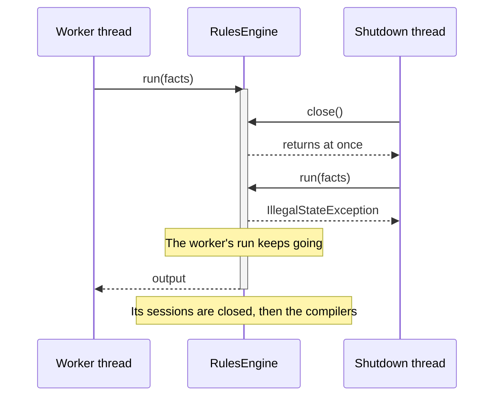
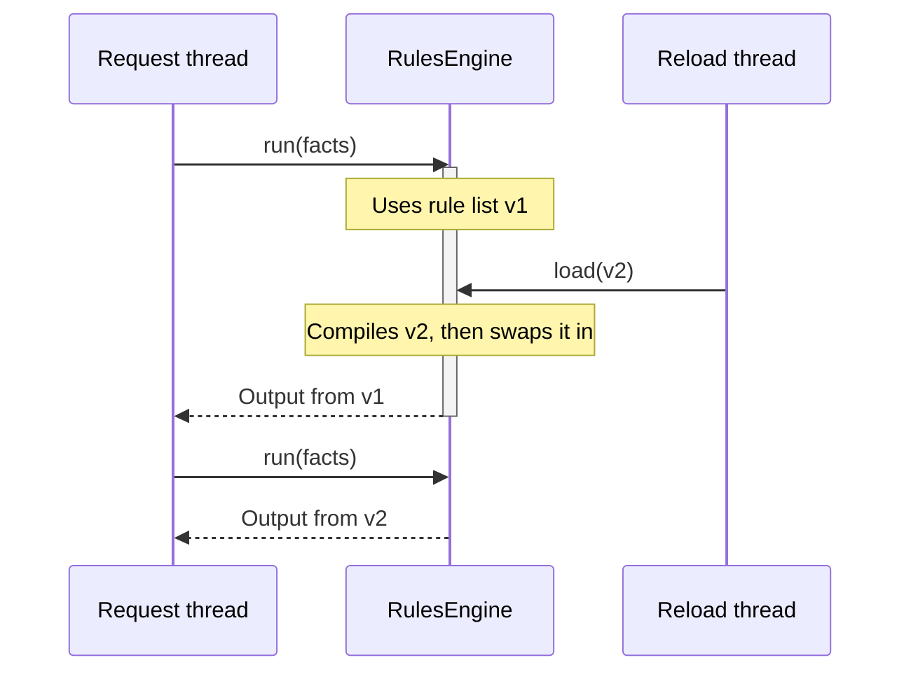
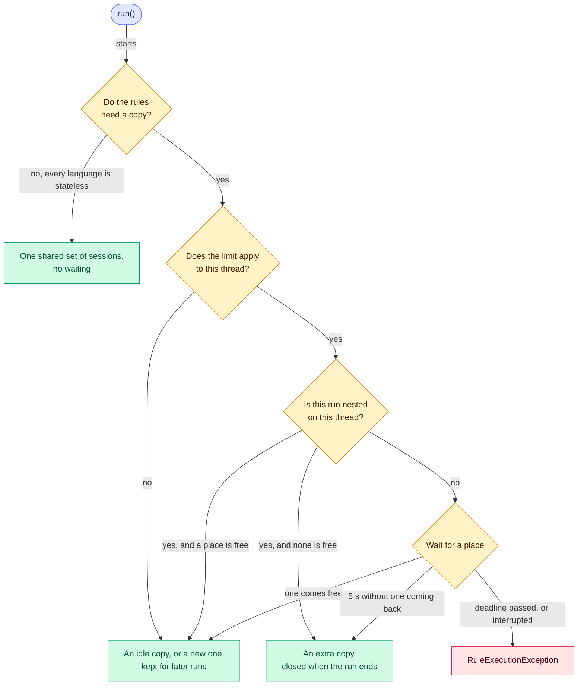

# 🧵 Thread safety

> [!NOTE]
> Describes 2.0.0, which isn't released yet. For 1.8.0, see
> [this page at v1.8.0](https://github.com/brantunger/unruly-engine/blob/v1.8.0/docs/thread-safety.md).

An engine is built once and shared by every thread in your application. This page says what that promises, what stays
yours, and what happens when you reload or close an engine while runs are going.

**Who it's for:** application developers sharing an engine across threads, reloading rules in a running application, or
tuning it for virtual threads.
**You'll be able to:** close an engine without losing work, reload rules under traffic, and size the
[compiled copies](glossary.md#compiled-copy) of your rules.
**Before you start:** the [Quick start](../README.md#-quick-start). [Engines and runs](engines-and-runs.md) covers what
one run does.

[← Documentation index](README.md)

- [At a glance](#-at-a-glance)
- [Lifecycle and closing](#-lifecycle-and-closing)
- [Reloading rules while running](#-reloading-rules-while-running)
- [Compiled copies](#-compiled-copies)
- [Virtual threads](#-virtual-threads)
- [Gotchas](#-gotchas)
- [Questions you might not think to ask](#-questions-you-might-not-think-to-ask)

---

## 🧭 At a glance

| Method | Thread-safe? | When to call it |
| --- | :---: | --- |
| `RulesEngineBuilder` methods and `build()` | ❌ | During setup, on one thread. The engine it builds is thread-safe, and everything but the rules is fixed from then on. |
| `load()` | ✅ | During setup, and again at any time to reload. When several threads call it at once, the last to finish compiling wins. |
| `run()`, `runWithResult()` | ✅ | From any number of threads, once `load()` has returned. |
| `rules()` | ✅ | At any time. Before the first `load()` it reports no rules; after `close()` it throws. |
| `close()` | ✅ | Once the engine is no longer needed. It returns at once, and runs already going finish with their rules. |

An engine's languages, imports, listeners, [copy limit](glossary.md#copy-limit), run timeout, output type, output
writer, declared facts and language options are all fixed when it's built. Only `load()` changes anything afterwards.

Interrupting the thread a run is on, or giving the run a timeout, stops it **between rules and when an expression
returns** — before each condition and each action, and when each one returns, so a run whose last condition or action
returns past its deadline fails. Whether an expression that is already running can be stopped depends on the
language: MVEL can't stop one, so in MVEL a rule that loops for ever still blocks its thread; run rules you don't
trust in a process of their own. See [Stopping a run](stopping-runs.md).

### What you must keep thread-safe

The engine protects its own state. These parts are yours:

- **Facts:** a store can serve one run after another, and concurrent runs can share a store that nothing changes; a
  new store for each run is the simplest way to stay safe. Don't share mutable fact objects between concurrent runs.
  See [Reusing and sharing a store](facts.md#-reusing-and-sharing-a-store).
- **The output supplier:** it must return a new object on every call. A shared instance would be changed by several
  runs at once.
- **A custom `OutputWriter`:** one instance sets properties for every run, on many threads at once.
- **Listeners:** the same listener instance is called from every thread running the engine.

## 🛑 Lifecycle and closing

An engine is built, then loaded, then closed. The rules can be replaced as often as you like in between.


| Engine state | `run()` | `load()` | `rules()` |
| --- | --- | --- | --- |
| Built, nothing loaded | `IllegalStateException`, at once | Compiles the list and swaps it in | No rules, the checksum of an empty list, no load time |
| Loaded | Runs the rules | Compiles the new list, then swaps it in | The loaded rules, their checksum and load time |
| Closed | `IllegalStateException`, at once | Compiles the list, then throws `IllegalStateException` without loading it | `IllegalStateException` |

A `run()` before the first `load()` fails **at once**: it doesn't wait for a `load()` that is still compiling on
another thread. Load your rules before the application accepts traffic.

### Closing

> [!IMPORTANT]
> `close()` returns at once. It doesn't wait for runs in progress, and it doesn't interrupt them. To drain, stop
> sending work first, then close.



- A run already in progress finishes normally and returns its result.
- Every new `run()`, `runWithResult()` and `rules()` throws `IllegalStateException("The engine is closed")` at once.
- `load()` compiles the whole list first: a list that doesn't compile throws `RuleCompilationException`, and one that
  does is compiled, then dropped with the same `IllegalStateException`.
- A **nested run** started from an action or a listener of a run that is still going throws it too: a nested run reads
  the engine's current rules, and a closed engine has none.

Each run's sessions are closed as it returns, and the languages' compilers after the last one. A failure to close a
session or a compiler is logged at WARN and doesn't fail a run. `RulesEngine` is `AutoCloseable`, so an engine built
for a short task can go in a try-with-resources block. Closing an engine twice does nothing the second time.

### Draining before you close

The engine has no "wait for runs to finish" call. Stop the work reaching it, then close:

```java
executor.shutdown();                                   // no new runs are submitted
executor.awaitTermination(30, TimeUnit.SECONDS);       // the runs in progress finish
engine.close();                                        // nothing is lost
```

In a web application, use your server's graceful shutdown so requests drain before the engine bean is destroyed; see
[Shutting down](spring-boot.md#-shutting-down) for Spring Boot.

## 🔄 Reloading rules while running

`load()` compiles the whole new list first, then swaps it in with a single atomic write, together with the fact-name
checks of the languages its rules use.



For the runs:

- A run already in progress finishes with the rules it started with. `RunResult.ruleSetChecksum()` identifies them,
  and may already differ from `rules().checksum()`.
- Runs that start after the swap use the new rules.
- A run that starts **while the new list is still compiling** uses the old rules, without waiting.
- A run checks its fact names with the languages of the rules it runs, whichever list that is.

For the load itself:

- If the new list fails to compile, nothing is swapped, the old rules stay in place, and the compilers the failed load
  created are closed.
- When two threads call `load()` at once, both compile the list they were given, and the one that finishes compiling
  last wins.
- Each condition and action is compiled on its own, so variables and inline `import` statements in one rule never
  affect another rule or a later reload.

> [!WARNING]
> A nested run uses the engine's rules **as they are when it starts**, not the outer run's. After a reload, a nested
> run can use newer rules, which the outer run's checksum doesn't describe.

At the swap, the replaced list is retired: its idle copies are closed straight away, a copy given back is closed
rather than kept, and its compilers close once the last run using it returns. A run that read the engine's rules just
before the swap uses that list only while a run of it is still going, and may then build a copy of it; when the list
is already closed, the run starts again on the new rules. Copies aren't carried over, so the first runs after each
`load()` build them again.

## 📑 Compiled copies

Every run shares the rules as `load()` compiled them. What an expression language changes while its expressions run
lives in a *[session](glossary.md#session)*, and a **compiled copy** of the rules is one session for each language the
rules use. Each `run()` borrows a copy that no other run is using, makes a new one if every copy is busy (as the first
run after `load()` does), and gives it back when it finishes.

A rule list that needs no copy at all is never limited, once the engine knows. When every language of the list returns
`Session.none()`, nothing a copy holds changes while the rules run, so every run shares one set of sessions. The engine
learns this from the list's first copy, so straight after a reload from rules that did need copies, the first such run
may still wait. See [Thread safety for language authors](languages/custom.md#-thread-safety) for what a language must
do to qualify.

In MVEL, a session compiles each expression again the first time that copy runs it, and MVEL generates accessor
classes for that session alone. See [Compiled copies in MVEL](languages/mvel.md#-compiled-copies).

### Memory sizing

| Copies alive at one instant | How many |
| --- | --- |
| Runs the limit applies to | At most the limit, for the whole engine, across reloads |
| Runs the limit doesn't apply to | One for each such run at your busiest moment |
| [Extra copies](glossary.md#extra-copy) | At most one for each nested or stalled run in progress; a nested run that finds a place free takes a kept copy |
| A rule list a reload replaced | The copies its unfinished runs still hold, unlimited ones only |

Count each engine separately: an engine's limit is its own. By default the limit applies only to runs on virtual
threads, so a platform thread pool of `N` threads can keep up to `N` copies. Don't add the last row to the first: a
draining list's *limited* runs hold permits from the same limit, so they're already in it.

**Kept copies never shrink.** The engine keeps as many as the most runs that held one at once, up to the limit, until
the next `load()` or `close()`. Memory doesn't come back after a traffic spike; a periodic reload releases it, at the
cost of rebuilding copies on the next runs.

### Limiting the copies

A copy isn't free: in MVEL each expression is compiled again the first time that copy runs it, and the copy generates
accessor classes of its own. A thread pool bounds the number of copies, because runs can't overlap more than its
threads. Virtual threads don't bound
anything: when each request runs on its own virtual thread, thousands of runs overlap, and the engine makes and keeps a
copy for each.

So an engine limits **runs on virtual threads** to one copy for every two processors, and at least one. The number of
processors is read once, by `build()`, so an engine's limit doesn't change while it runs. Runs on platform threads
aren't limited: the pool they come from already bounds how many copies exist. Set your own limit, or turn the default
off:

```java
// A limit on runs from every kind of thread, virtual and platform
RulesEngine<LoanDecision> engine = RulesEngineBuilder.firstMatch(LoanDecision::new).maxCopies(64).build();

// As many copies as the runs in progress need, on any thread, which is what 1.x did
RulesEngine<LoanDecision> unlimited = RulesEngineBuilder.firstMatch(LoanDecision::new).unlimitedCopies().build();
```

| Your runs are on | Your rules mostly | Build it with |
| --- | --- | --- |
| A platform thread pool | Anything | The default: the pool size already bounds the copies |
| Virtual threads | Compute | The default |
| Virtual threads | Wait on a database, a service or a file | `unlimitedCopies()`, or `maxCopies(n)` sized for the waiting runs you want at once |
| Virtual threads, MVEL rules, JDK 21 to 23 | Anything | See [Virtual threads](#-virtual-threads) before you raise the limit |
| Anything, with memory to protect | Anything | `maxCopies(n)`, which bounds platform-thread runs too |

The limit belongs to the **engine**, not to one rule list: while `load()` swaps in a new list, runs still using the old
list count against the same limit as runs on the new one, so a reload never raises it. Right after a reload, a run on
the new rules may wait for runs on the old rules to finish, when together they already hold every copy. Several
engines each have a limit of their own, so their limits add up.

`maxCopies(n)` therefore bounds the runs that make progress, not the copies that can exist at one instant: nested and
stalled runs take an extra copy on top (below), and the list a reload replaced keeps the copies its runs still hold.

### What a run waits for



While a run waits:

- A run that starts while every copy is in use waits until one is free, so at most that many runs make progress at
  once. On a virtual thread, a waiting run doesn't hold a platform thread.
- **Waiting isn't first-come-first-served**, and without a deadline it has no upper bound: as long as copies keep
  coming back, a run keeps waiting. Give runs a [timeout](stopping-runs.md#-quick-start) if latency matters.
- Listeners don't see a wait that ends with a copy: the run borrows it before `beforeRun`, so a listener's timings
  don't include the wait. Measure around `run()` instead.

When the wait is stopped:

- If the thread is interrupted while its run waits, `run()` throws a `RuleExecutionException` caused by the
  `InterruptedException`, and the thread's interrupt status stays set. A run whose thread was **already** interrupted
  doesn't wait: it takes a free copy and then stops at its first rule, exactly as it does without a limit. When no copy
  is free, `run()` fails at once, with the same exception.
- If the run's deadline passes while it waits, `run()` throws a `RuleExecutionException` caused by a
  `TimeoutException`. Waiting counts towards the timeout.

When the wait itself is stopped, by the deadline or by an interrupt with no copy free, the listeners still hear of
it: the run calls `beforeRun` and then `onRunError`, although it never held a copy and ran no rule. See
[What listeners see](stopping-runs.md#-what-listeners-see).

### Runs that don't wait

> [!WARNING]
> A run whose deadline is less than five seconds away never gives up waiting for an extra copy: it waits until its
> deadline and then fails with a `TimeoutException` cause, saying every copy was in use. A run started on a thread
> that already holds a copy never waits, deadline or not: it takes a free copy, or an extra one.

Two kinds of run never wait for a copy, so a limit can't deadlock an engine.

**A run started on a thread that is already holding a copy**, from an action or a listener of the run that holds it.
The copy it would wait for may be that one. This covers a run on any engine and any rule list, including rules a
`load()` has since replaced.

A run that stopped while waiting for a copy holds none, so a run started from its callbacks isn't covered by this
rule, but it doesn't wait either: it inherits that run's passed deadline, or sees the same interrupt, so it takes a
free copy or fails at once.

**A run that has waited five seconds without one single copy being given back.** That's what waiting for a run of
this engine on *another* thread looks like: a fan-out from an action, `executor.submit(engine::run).get()`, or two
engines whose actions run each other. A rule slower than the wait does it too, because a copy it holds comes back
only when it finishes.

An engine that is merely busy keeps giving copies back, so such a run keeps waiting and the limit holds: any copy
coming back restarts the five-second window. Giving up is logged at WARN once for each rule list, naming
`unlimitedCopies()`.

A stalled run, and a nested run that finds no place free, get an extra copy that isn't kept: its sessions are closed
when the run gives it back. So a limit bounds the runs that can make progress, rather than the copies that can exist
at one instant.

## 🧵 Virtual threads

> [!CAUTION]
> On JDK 21 to 23, a virtual thread waiting on a monitor keeps the platform thread carrying it. A language whose
> expressions contend on a lock shared by the whole JVM can then hold every carrier and deadlock. MVEL is one: read
> [MVEL on virtual threads](languages/mvel.md#-virtual-threads) before you raise the limit.

With more than one processor, the default is **below the number of processors**, which is how many platform threads
carry virtual threads unless the scheduler is configured otherwise. That makes a deadlock less likely without ruling
it out: the limit is per engine, so several engines' limits add up, a run that gives up waiting takes an extra copy,
and `-Djdk.virtualThreadScheduler.parallelism` can leave fewer carriers than the limit. Nothing changes for a Tomcat,
Jetty or executor pool: the default doesn't apply to runs on platform threads.

The default is **sized for rules that compute**. A rule that waits — on a database, a service, a file — holds its copy
while it waits, so a limit of `N` caps how many such runs make progress at once, however many virtual threads you
start. Build those engines with `unlimitedCopies()`, or with a `maxCopies(...)` sized for how many waiting runs you
want at once.

**Known issue on JDK 24 and later.** A virtual thread still keeps its carrier while the JVM loads a class. MVEL loads
classes while it compiles, and generates accessor classes during a copy's first runs, so a run that makes a new
compiled copy can pin its carrier for as long as that takes.
[#294](https://github.com/brantunger/unruly-engine/issues/294) is open and tracks making the copies when the rules
load instead. Since [#387](https://github.com/brantunger/unruly-engine/pull/387), MVEL's class lookups no longer wait
on each other, which shortens the waiting without removing the pinning.

## 🚧 Gotchas

| Gotcha | What happens | Do this instead |
| --- | --- | --- |
| **`close()` doesn't drain** | Runs in progress finish, but nothing waits for them | Stop the work reaching the engine, then close; see [Draining before you close](#draining-before-you-close) |
| **A reload reaches nested runs** | After a `load()`, a run started from an action or a listener uses the new rules, which the outer run's checksum doesn't describe | Reload between requests, or record each run's `ruleSetChecksum()` |
| **`maxCopies(n)` isn't a cap on copies** | A stalled run, or a nested run that finds no place free, takes an extra copy, and runs the limit doesn't apply to keep copies of their own | Size memory with [Memory sizing](#memory-sizing) |
| **Kept copies never shrink** | The memory a traffic spike took stays until the next `load()` or `close()` | Reload periodically, if that memory matters |
| **A deadline under five seconds never takes an extra copy** | A fan-out that would need one waits until its deadline and fails with a `TimeoutException` cause | Give engines that run each other `unlimitedCopies()` |
| **A reused interrupted thread** | The next run on that thread stops at its first rule, or fails at once when it would have waited | Call `Thread.interrupted()` before reusing the thread |

## ❓ Questions you might not think to ask

### What happens to runs in progress when I close the engine?

They finish and return their results. `close()` returns at once and waits for nothing. See [Closing](#closing).

### Can I call `load()` while runs are happening, or from two threads at once?

Yes to both. Runs in progress keep their rules, and of two concurrent loads the one that finishes compiling last wins.
See [Reloading rules while running](#-reloading-rules-while-running).

### Can a run start before the first `load()` finishes?

No. It throws `IllegalStateException("load() must be called before run()")` straight away, rather than waiting for the
load. Load the rules before the application accepts traffic.

### Does `maxCopies(4)` mean at most four copies exist?

No. It bounds the runs making progress. A stalled run, or a nested run that finds no place free, takes an extra copy;
runs the limit doesn't apply to keep copies of their own, also on a rule list a reload replaced; and every other
engine has its own limit. See [Memory sizing](#memory-sizing).

### Does memory shrink after a traffic spike?

No. Kept copies stay until the next `load()` or `close()`. A periodic reload releases them, and the next runs pay to
build new ones.

### Does waiting for a copy show up in my listener timings?

Not when the run gets a copy: the wait happens before `beforeRun`, so measure around `run()`. A wait that ends in a
stop calls `beforeRun` and then `onRunError`, with a run that never held a copy. See
[What a run waits for](#what-a-run-waits-for).

### My thread was interrupted earlier and I reuse it: why does every run fail?

The engine leaves the interrupt status set, so the next run on that thread stops at its first rule, or fails at once if
it would have waited for a copy. Call `Thread.interrupted()` before reusing the thread.

### Can an action call `load()` or `close()` on its own engine?

Yes, without deadlocking: the engine holds its lock only for the swap itself. The run finishes with the rules it
started with. After `close()`, though, a run that action starts fails; see [Closing](#closing).
