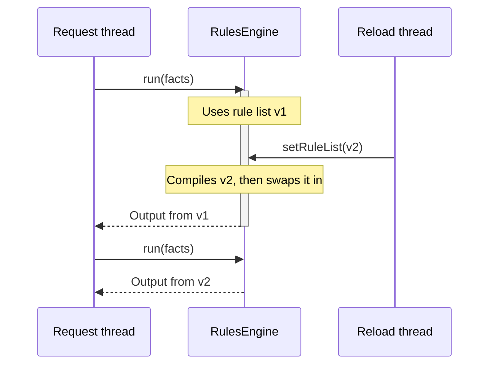

# 🧵 Thread safety

An engine is designed to be configured once and then shared by every thread in your application.

[← Back to README](../README.md)

- [At a glance](#-at-a-glance)
- [Reloading rules while running](#-reloading-rules-while-running)
- [What you must keep thread-safe](#-what-you-must-keep-thread-safe)
- [MVEL optimizer (JVM-wide)](#-mvel-optimizer-jvm-wide)

---

## 👀 At a glance

| Method | Thread-safe? | When to call it |
| --- | :---: | --- |
| `addImport()` / `addImports()` | ❌ | During setup, **before** `setRuleList()`. Imports are captured when rules compile, so adding one later has no effect until the next `setRuleList()`. |
| `setRuleList()` | ✅ | During setup, and again at any time to reload. When several threads call it at once, the last to finish wins. |
| `run()` | ✅ | From any number of threads, once `setRuleList()` has completed. |
| `registerListener()` / `registerListeners()` | ✅ | At any time, even from inside a listener callback. |

## 🔄 Reloading rules while running

`setRuleList()` compiles the whole new list first, then swaps it in with a single atomic write.



- A run already in progress finishes with the rules it started with.
- Runs that start after the swap use the new rules.
- If the new list fails to compile, nothing is swapped and the old rules stay in place.
- Each condition and action is compiled on its own, so variables and inline `import` statements in one rule never
  affect another rule or a later reload.

## 🤝 What you must keep thread-safe

The engine protects its own state. These parts are yours:

- **Facts:** build a new `FactStore` for each run and don't share mutable fact objects between concurrent runs.
- **The output supplier:** it must return a new object on every call. A shared instance would be changed by
  several runs at once.
- **Listeners:** the same listener instance is called from every thread running the engine.

## ⚡ MVEL optimizer (JVM-wide)

> [!WARNING]
> **Loading the engine changes a global MVEL setting for the whole JVM.** Any other library in the same JVM that
> uses MVEL is affected too.

MVEL caches an accessor in each compiled expression the first time it runs. When a later run binds the same fact
name to a different class, for example when `applicant` is an interface with several implementations, or is a
`Map` in one run and a record in another, MVEL replaces that accessor without synchronization. Two threads running
the same compiled expression can then fail intermittently with a `RuleExecutionException` caused by a
`ClassCastException`.

So concurrent runs never share a compiled expression. Each `run()` borrows a compiled copy of the rule list that no
other run is using, compiles a new copy if every copy is busy, and gives it back when it finishes. The engine keeps
as many copies as the most runs it has had in progress at once: the first time N runs overlap, the rule list is
compiled N times, and those N copies stay in memory until the next `setRuleList()`.

The engine also switches MVEL's default optimizer to its **reflective optimizer** when the engine class loads.
MVEL reads this from one global setting, so the choice can't be limited to one engine.

The reflective optimizer is somewhat slower. A rough single-threaded measurement with three rules went from
about 280 ns to 370 ns per `run()`. To keep MVEL's own setting instead (the JIT is on unless you pass
`-Dmvel2.disable.jit=true`), start the JVM with:

```shell
-Dunruly.mvel.jit=true
```

> [!NOTE]
> Because concurrent runs use separate compiled copies, facts whose runtime class varies from one run to another
> are safe to run concurrently with either optimizer.
