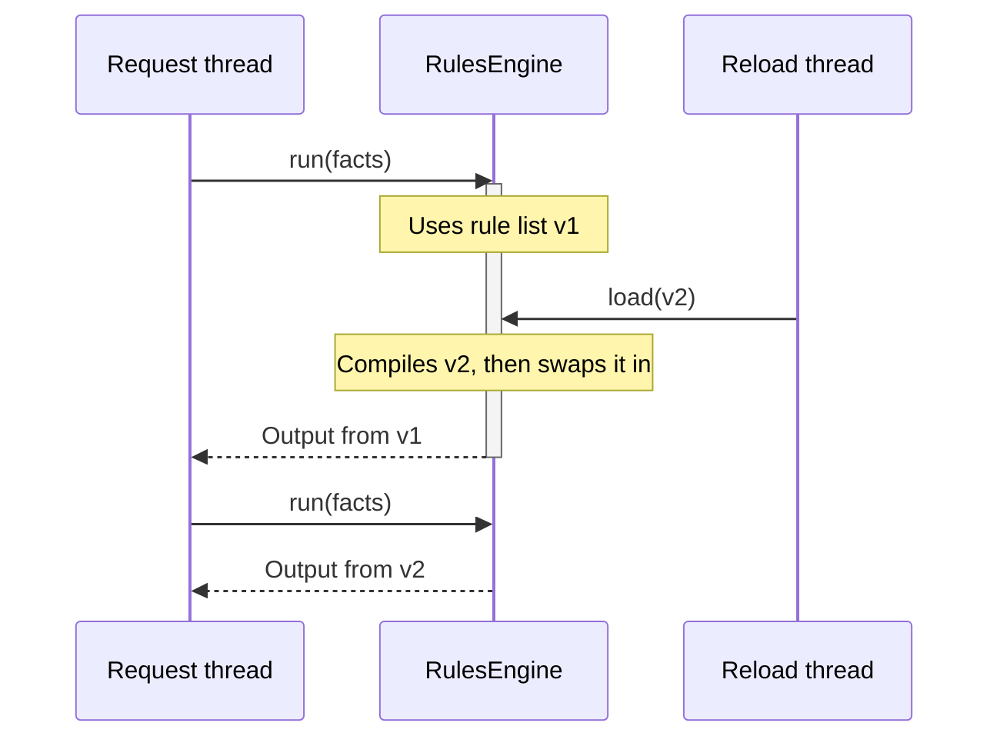

# 🧵 Thread safety

> [!NOTE]
> Describes 2.0.0, which isn't released yet. For 1.8.0, see
> [this page at v1.8.0](https://github.com/brantunger/unruly-engine/blob/v1.8.0/docs/thread-safety.md).

An engine is designed to be configured once and then shared by every thread in your application.

[← Documentation index](README.md)

- [At a glance](#-at-a-glance)
- [Reloading rules while running](#-reloading-rules-while-running)
- [What you must keep thread-safe](#-what-you-must-keep-thread-safe)
- [Compiled rules and concurrent runs](#-compiled-rules-and-concurrent-runs)

---

## 👀 At a glance

| Method | Thread-safe? | When to call it |
| --- | :---: | --- |
| `RulesEngineBuilder` methods and `build()` | ❌ | During setup, on one thread. The engine a builder builds is thread-safe, and its imports, languages and listeners can't change afterwards. |
| `load()` | ✅ | During setup, and again at any time to reload. When several threads call it at once, the last to finish wins. |
| `run()` | ✅ | From any number of threads, once `load()` has completed. |
| `close()` | ✅ | Once the engine is no longer needed. Runs in progress finish first. |

**Stopping a run:** interrupting the thread a run is on, or giving the run a timeout, stops it **between rules and when an expression returns** —
before each condition and each action, and when each one returns, so a run whose last condition or action returns
past its deadline fails. It can't stop an MVEL expression that is already running, so a rule
that loops for ever still blocks its thread; run rules you don't trust in a process of their own. See
[Stopping a run](error-handling.md#-stopping-a-run).

## 🔄 Reloading rules while running

`load()` compiles the whole new list first, then swaps it in with a single atomic write, together with the
fact-name checks of the languages its rules use.



- A run already in progress finishes with the rules it started with.
- Runs that start after the swap use the new rules.
- If the new list fails to compile, nothing is swapped and the old rules stay in place.
- A run that starts during the swap may check its fact names with the languages the other list's rules use. Only
  that run is affected, and only in whether it accepts a name one of the lists can't use.
- Each condition and action is compiled on its own, so variables and inline `import` statements in one rule never
  affect another rule or a later reload.

## 🤝 What you must keep thread-safe

The engine protects its own state. These parts are yours:

- **Facts:** build a new `FactStore` for each run and don't share mutable fact objects between concurrent runs.
- **The output supplier:** it must return a new object on every call. A shared instance would be changed by
  several runs at once.
- **Listeners:** the same listener instance is called from every thread running the engine.

## 📑 Compiled rules and concurrent runs

MVEL caches an accessor in each compiled expression the first time it runs. When a later run binds the same fact
name to a different class, for example when `applicant` is an interface with several implementations, or is a
`Map` in one run and a record in another, MVEL replaces that accessor without synchronization. Two threads running
the same compiled expression can then fail intermittently with a `RuleExecutionException` caused by a
`ClassCastException`.

So concurrent runs never share MVEL's compiled form of an expression. The engine compiles a rule list once, when
`load()` loads it, and every run shares those compiled rules. What an expression language changes while its
expressions run lives in a *session*, and a copy of the rules is one session for each language the rules use. Each
`run()` borrows a copy that no other run is using, makes a new one if every copy is busy (as the first run after
`load()` does), and gives it back when it finishes. The copies stay in memory until the next `load()` or `close()`,
and an engine keeps as many as the most runs it has had in progress at once — except that runs on **virtual threads**
are limited, by default, to one copy for every two processors. See [Limiting the copies](#limiting-the-copies).

MVEL's session compiles each MVEL expression again the first time it runs it, except the first session, which takes
the expression `load()` compiled. A language whose expressions several threads can run at once keeps nothing
in its sessions (see [Other expression languages](languages/custom.md#-thread-safety)).

### Closing

When `load()` replaces the rules, the engine closes the old rules' idle sessions at once, and a session still in
use when the run using it returns. Once no run uses the old rules, it closes their languages' compilers too.
`close()` does the same for the current rules, and afterwards `run()` and `load()` throw
`IllegalStateException`. `RulesEngine` is `AutoCloseable`, so an engine built for a short task can go in a
try-with-resources block. A failure to close a session or a compiler is logged at WARN and doesn't fail a run.

### Limiting the copies

A copy isn't free: every MVEL expression in it is compiled again, and as it runs, MVEL generates accessor classes for
that copy alone. A thread pool bounds the number of copies, because runs can't overlap more than its threads. Virtual
threads don't bound anything: when each request runs on its own virtual thread, thousands of runs overlap, and the
engine makes and keeps a copy for each.

So an engine limits **runs on virtual threads** to one copy for every two processors, and at least one. The number
of processors is read once, by `build()`, so an engine's limit doesn't change while it runs. Runs on platform threads
aren't limited: the pool they come from already bounds how many copies exist. Set your own limit, or turn the default
off:

```java
// A limit on runs from every kind of thread, virtual and platform
RulesEngine<LoanDecision> engine = RulesEngineBuilder.firstMatch(LoanDecision::new).maxCopies(64).build();

// As many copies as the runs in progress need, on any thread, which is what 1.x did
RulesEngine<LoanDecision> unlimited = RulesEngineBuilder.firstMatch(LoanDecision::new).unlimitedCopies().build();
```

- A run that starts while every copy is in use waits until one is free, so at most that many runs make progress at
  once. On a virtual thread, a waiting run doesn't hold a platform thread.
- With more than one processor, the default is **below the number of processors**, which is how many platform threads
  carry virtual threads. On JDK 21 to 23, a virtual thread that waits to enter a monitor, or waits while holding one,
  keeps its carrier. MVEL's expressions contend on a monitor shared by the whole JVM, so with one copy for each
  processor every carrier could be held and the runs deadlocked. The lower default makes that less likely but doesn't
  prevent it: each engine has its own limit, so the limits of several engines add up, and a run that waited
  five seconds without a copy coming back takes an extra copy on its own thread (see below). On JDK 21 to 23, use JDK
  24 or later if you can, where a virtual thread waiting on a monitor releases its carrier (JEP 491); otherwise run
  MVEL rules on platform threads, or keep the copies of all your engines together below
  `jdk.virtualThreadScheduler.parallelism` (the number of processors unless you set it).
- The default is **sized for rules that compute**. A rule that waits — on a database, a service, a file — holds its
  copy while it waits, so a limit caps how many such runs can overlap: 64 threads running a rule that waits 5 ms are
  about 8× slower with a limit of 8 than with none. Build those engines with `unlimitedCopies()`, or with a
  `maxCopies(...)` sized for how many waiting runs you want at once.
- If the thread is interrupted while its run waits, `run()` throws a `RuleExecutionException` caused by the
  `InterruptedException`, and the thread's interrupt status stays set. A run whose thread was **already** interrupted
  doesn't wait: it takes a free copy and then stops at its first rule, exactly as it does without a limit.
- The limit belongs to the engine, not to one rule list: while `load()` swaps in a new list, runs still using the old
  list count against the same limit as runs on the new one, so a reload never raises it. Right after a reload, a run
  on the new rules may wait for runs on the old rules to finish, when together they already hold every copy.
- A rule list that needs no copy at all is never limited. When every language of the list returns `Session.none()`,
  nothing a copy holds changes while the rules run, so every run shares one set of sessions, waits for nothing, and
  counts against no limit. The engine learns this from the list's first copy, so right after a reload from rules that
  need copies, runs of such a list that start before the first of them gets a copy may wait for runs on the old
  rules; later runs don't.

#### Runs that don't wait

Two kinds of run never wait for a copy, so a limit can't deadlock an engine:

- **A run nested in another run on the same thread**, started from an action or a listener. The copy it would wait for
  may be the one its own thread is holding. This covers a run on any engine and any rule list, including rules a
  `load()` has since replaced.
- **A run that has waited five seconds without one single copy being given back.** That's what waiting for a run of
  this engine on *another* thread looks like: a fan-out from an action, `executor.submit(engine::run).get()`, or two
  engines whose actions run each other. An engine that is merely busy keeps giving copies back, so such a run keeps
  waiting and the limit holds. Giving up is logged at WARN once for each rule list, naming `unlimitedCopies()`.

Either gets an extra copy that isn't kept: its sessions are closed when the run gives it back. So a limit bounds the
runs that can make progress, rather than the copies that can exist at one instant.

This works with any MVEL optimizer, so the engine leaves MVEL's global optimizer setting alone. MVEL's default JIT
optimizer stays in effect (unless you pass `-Dmvel2.disable.jit=true`), and other libraries in the same JVM that use
MVEL aren't affected.

> [!NOTE]
> Earlier versions switched MVEL to its slower reflective optimizer for the whole JVM when the engine class loaded,
> unless the JVM was started with `-Dunruly.mvel.jit=true`. Later 1.x releases ignored that property, and 2.0 removes
> the `AbstractRulesEngine.JIT_PROPERTY` constant that named it.
