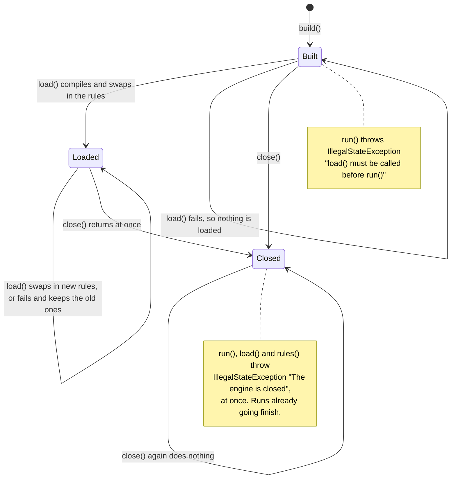
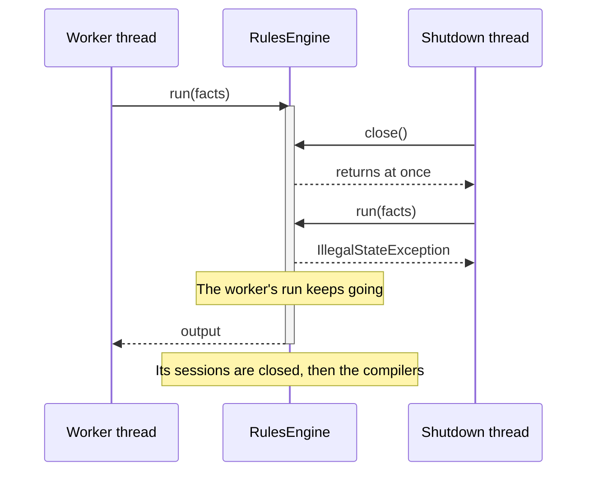
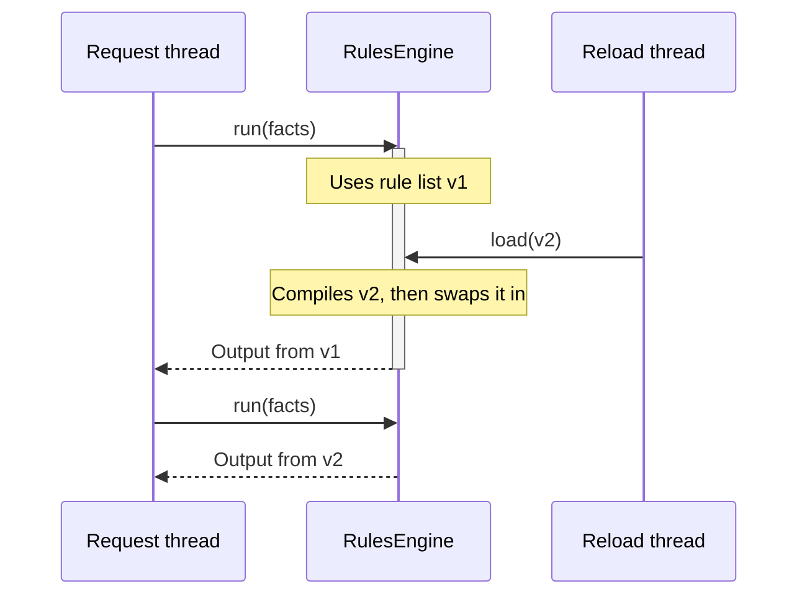

# 🧵 Thread safety

An engine is built once and shared by every thread in your application. This page says what that promises, what stays
yours, and what happens when you reload or close an engine while runs are going.

**Who it's for:** application developers sharing an engine across threads, or reloading rules in a running
application.
**You'll be able to:** close an engine without losing work, reload rules under traffic, and know what a run shares
with the runs around it.
**Before you start:** the [Quick start](../README.md#-quick-start). [Engines and runs](engines-and-runs.md) covers what
one run does.

[← Documentation index](README.md)

- [At a glance](#-at-a-glance)
- [Lifecycle and closing](#-lifecycle-and-closing)
- [Reloading rules while running](#-reloading-rules-while-running)
- [Compiled copies](#-compiled-copies)
- [Class loaders](#-class-loaders)
- [Gotchas](#-gotchas)
- [Questions you might not think to ask](#-questions-you-might-not-think-to-ask)

---

## 🧭 At a glance

| Method | Thread-safe? | When to call it |
| --- | :---: | --- |
| `RulesEngineBuilder` methods and `build()` | ❌ | During setup, on one thread. The engine it builds is thread-safe, and everything but the rules is fixed from then on. |
| `load()` | ✅ | During setup, and again at any time to reload. When several threads call it at once, the last to finish compiling wins. |
| `validate()` | ✅ | At any time, from any thread. It compiles and discards, and changes nothing. |
| `run()`, `runWithResult()` | ✅ | From any number of threads, once `load()` has returned. |
| `rules()` | ✅ | At any time. Before the first `load()` it reports no rules; after `close()` it throws. |
| `close()` | ✅ | Once the engine is no longer needed. It returns at once, and runs already going finish with their rules. |

An engine's languages, imports, listeners, [copy limit](glossary.md#copy-limit), copies at load, run timeout, output
type, output writer, declared facts and language options are all fixed when it's built. Only `load()` changes
anything afterwards.

Interrupting the thread a run is on, or giving the run a timeout, stops it **between rules and when an expression
returns** — before each condition and each action, and when each one returns, so a run whose last condition or action
returns past its deadline fails. Whether an expression that is already running can be stopped depends on the
language: MVEL can't stop one, so in MVEL a rule that loops for ever still blocks its thread; run rules you don't
trust in a process of their own. See [Stopping a run](stopping-runs.md).

### What you must keep thread-safe

The engine protects its own state. These parts are yours:

- **Facts:** a store can serve one run after another, and concurrent runs can share a store that nothing changes; a
  new store for each run is the simplest way to stay safe. Don't share mutable fact objects between concurrent runs.
  See [Reusing and sharing a store](facts.md#-reusing-and-sharing-a-store).
- **The output supplier:** it must return a new object on every call. A shared instance would be changed by several
  runs at once.
- **A custom `OutputWriter`:** one instance sets properties for every run, on many threads at once.
- **Listeners:** the same listener instance is called from every thread running the engine.

## 🛑 Lifecycle and closing

An engine is built, then loaded, then closed. The rules can be replaced as often as you like in between.



| Engine state | `run()` | `load()` | `rules()` |
| --- | --- | --- | --- |
| Built, nothing loaded | `IllegalStateException`, at once | Compiles the list and swaps it in | No rules, the checksum of an empty list, no load time |
| Loaded | Runs the rules | Compiles the new list, then swaps it in | The loaded rules, their checksum and load time |
| Closed | `IllegalStateException`, at once | `IllegalStateException`, at once, without compiling the list | `IllegalStateException` |

A `run()` before the first `load()` fails **at once**: it doesn't wait for a `load()` that is still compiling on
another thread. Load your rules before the application accepts traffic. `validate()` works in every state but
Closed, and changes none of them.

### Closing

> [!IMPORTANT]
> `close()` returns at once. It doesn't wait for runs in progress, and it doesn't interrupt them. To drain, stop
> sending work first, then close.



- A run holding a copy of the rules finishes normally and returns its result.
- Every new `run()`, `runWithResult()`, `load()`, `validate()` and `rules()` throws `IllegalStateException("The engine
  is closed")` at once. `load()` compiles nothing and logs no ERROR, even for a list that wouldn't compile; a `null`
  list still throws `NullPointerException`.
- A **nested run** started from an action or a listener of a run that is still going throws it too: it reads the
  engine's current rules, and a closed engine has none.

A run that had read the engine's rules but not yet borrowed a copy of them when `close()` closed them reads them
again, finds a closed engine, and throws the same `IllegalStateException`. One whose thread was interrupted, or whose
deadline has passed, stops there instead, with a message saying the rules were closed by a reload or by `close()`; see
[What stops a run](stopping-runs.md#-what-stops-a-run).

A `load()` that found the engine still open isn't stopped by `close()`. If it fails, it throws what it would on an open
engine, such as `RuleCompilationException`. If it succeeds, its rules are either dropped with the same
`IllegalStateException` or, if it swapped them in just before `close()`, closed with the rest, so a closed engine never
serves them.

Each run's sessions are closed as it returns, and the languages' compilers after the last one. A failure to close a
session or a compiler is logged at WARN and doesn't fail the run, `load()` or `close()` that closes them, unless it's
a [fatal error](glossary.md#fatal-error); see [A fatal error while closing](#a-fatal-error-while-closing).
`RulesEngine` is `AutoCloseable`, so an engine built for a short task can go in a try-with-resources block. Closing an
engine twice does nothing the second time.

### A fatal error while closing

Closing a rule list's sessions and compilers is never cut short. When one of them throws a fatal error, such as an
`OutOfMemoryError`, the engine still closes every idle session of that list, then its compilers if no run is still
using it, and only then rethrows the error. If several are fatal, the first is rethrown and the others are only
logged at WARN.

A failure of the call's own that isn't fatal loses to a fatal error from closing, which keeps it in
`getSuppressed()`. That's a failed `load()`'s own failure (a `RuleCompilationException`, or the
`IllegalStateException` of an engine closed while it compiled), or a run's failure when that run is the one that
closes. A fatal failure of the call's own came first, so it's thrown instead, and the one from closing is only logged
at WARN.

The call that closes throws it:

- `close()`, and `validate()`, which closes the compilers it created.
- A `load()` that replaced the rules (after the swap; see
  [Reloading rules while running](#-reloading-rules-while-running)), failed, or found the engine closed.

A run throws it too, even when its rules ran without failing. A run that gives back an extra copy, or a copy of rules
a reload or `close()` retired, closes that copy, and the last one closes the retired rules' compilers too; a run whose
new copy was only partly made closes the sessions it made; and a run whose borrow failed while it was the last user
closes the retired rules' compilers.

### Draining before you close

The engine has no "wait for runs to finish" call. Stop the work reaching it, then close:

```java
executor.shutdown();                                   // no new runs are submitted
executor.awaitTermination(30, TimeUnit.SECONDS);       // the runs in progress finish
engine.close();                                        // nothing is lost
```

In a web application, use your server's graceful shutdown so requests drain before the engine bean is destroyed; see
[Shutting down](spring-boot.md#-shutting-down) for Spring Boot.

## 🔄 Reloading rules while running

`load()` compiles the whole new list first, then swaps it in with a single atomic write, together with the fact-name
checks of the languages its rules use.



For the runs:

- A run already in progress finishes with the rules it started with. `RunResult.ruleSetChecksum()` identifies them,
  and may already differ from `rules().checksum()`.
- Runs that start after the swap use the new rules.
- A run that starts **while the new list is still compiling**, or while `load()` makes its
  [copies at load](compiled-copies.md#making-copies-at-load), uses the old rules, without waiting.
- A run checks its fact names with the languages of the rules it runs, whichever list that is.

For the load itself:

- If the new list fails to compile, or a language fails to create or warm up a session for a copy at load, nothing
  is swapped, the old rules stay in place, and the sessions and compilers the failed load created are closed.
- A [fatal error while closing](#a-fatal-error-while-closing) the replaced rules is thrown after the swap: the new
  rules serve.
- When two threads call `load()` at once, both compile the list they were given, and the one that finishes last wins:
  the last to swap in its rules, after making any copies at load.
- Each condition and action is compiled on its own, so variables and inline `import` statements in one rule never
  affect another rule or a later reload.

> [!WARNING]
> A nested run uses the engine's rules **as they are when it starts**, not the outer run's. After a reload, a nested
> run can use newer rules, which the outer run's checksum doesn't describe.

At the swap, the replaced list is retired: its idle [compiled copies](compiled-copies.md) are closed straight away, a
copy given back is closed rather than kept, and its compilers close once the last run using it returns. A run that
read the engine's rules just before the swap uses that list only while a run of it is still going, and may then build
a copy of it; when the list is already closed, the run starts again on the new rules, unless its thread was
interrupted or its deadline has passed, when it stops there instead. Copies aren't carried over, so the first runs
after each `load()` build them again, unless the engine was built with
[`copiesAtLoad(n)`](compiled-copies.md#making-copies-at-load), when `load()` builds them before the swap.

## 📑 Compiled copies

Every run shares the rules as `load()` compiled them. What an expression language changes while its expressions run
lives in a *[session](glossary.md#session)*, and a **compiled copy** of the rules is one session for each language the
rules use. Each `run()` borrows a copy that no other run is using, makes a new one if every copy is busy (as the first
run after `load()` does, unless the engine [makes copies at load](compiled-copies.md#making-copies-at-load)), and gives
it back when it finishes.

How many copies an engine keeps, how to limit them and what a run waits for when they run out are on their own page:
[Compiled copies](compiled-copies.md). What changes when runs come from virtual threads is on
[Virtual threads](virtual-threads.md).

## 🌳 Class loaders

The classes of your facts and of your output object must be reachable from the **context class loader of the thread
that calls `load()`**. The engine captures that loader while `load()` compiles the rules and gives it to every
expression language as the loader to find classes with. `RulesEngineBuilder` has no class-loader option, so that
context class loader is the only control there is.

Most applications never think about it: one class loader holds the application, the engine and the fact classes. It
matters when those classes live somewhere else, such as a plugin or tenant jar, a container's application class loader
or a test harness that isolates each case. Load the rules with that loader in place, and put the old one back:

```java
ClassLoader original = Thread.currentThread().getContextClassLoader();
Thread.currentThread().setContextClassLoader(pluginLoader);   // the loader that holds Applicant and LoanDecision
try {
    engine.load(rules);                                       // load() captures it
} finally {
    Thread.currentThread().setContextClassLoader(original);
}
```

> [!IMPORTANT]
> Wrap `load()`, not `run()`. The engine reads a context class loader in `build()`, `load()` and `validate()` only, so
> a run never uses the one on its own thread to find your classes.

- `validate(rules)` captures a loader the same way, on whichever thread calls it.
- `build()` uses the **building** thread's context class loader, for the engine's languages and for an import that
  names a single class. Imported packages are looked up with the **loading** thread's.
- A thread with no context class loader leaves the engine using this library's own class loader.

In MVEL, setting the context class loader around `run()` instead leaves the rule failing, and closing the engine
doesn't release the loader `load()` captured: MVEL's dynamic optimizer holds it, and holds the first loader to
evaluate a rule for the life of the JVM. That, and the flag that frees them, are in
[The dynamic optimizer and class loaders](languages/mvel.md#the-dynamic-optimizer-and-class-loaders).

## 🚧 Gotchas

| Gotcha | What happens | Do this instead |
| --- | --- | --- |
| **`close()` doesn't drain** | Runs in progress finish, but nothing waits for them | Stop the work reaching the engine, then close; see [Draining before you close](#draining-before-you-close) |
| **The context class loader set around `run()`** | In MVEL, the rule works for about 50 runs in quick succession and then fails for ever, with a fact or output class not found | Set it around `load()`; see [Class loaders](#-class-loaders) |
| **A reload reaches nested runs** | After a `load()`, a run started from an action or a listener uses the new rules, which the outer run's checksum doesn't describe | Reload between requests, or record each run's `ruleSetChecksum()` |

## ❓ Questions you might not think to ask

### What happens to runs in progress when I close the engine?

They finish and return their results. `close()` returns at once and waits for nothing. See [Closing](#closing).

### Can I call `load()` while runs are happening, or from two threads at once?

Yes to both. Runs in progress keep their rules, and of two concurrent loads the one that finishes last wins: the last
to swap in its rules, after making any copies at load.
See [Reloading rules while running](#-reloading-rules-while-running).

### Can a run start before the first `load()` finishes?

No. It throws `IllegalStateException("load() must be called before run()")` straight away, rather than waiting for the
load. Load the rules before the application accepts traffic.

### Can an action call `load()` or `close()` on its own engine?

Yes, without deadlocking: the engine holds its lock only for the swap itself. The run finishes with the rules it
started with. After `close()`, though, a run that action starts fails; see [Closing](#closing).
