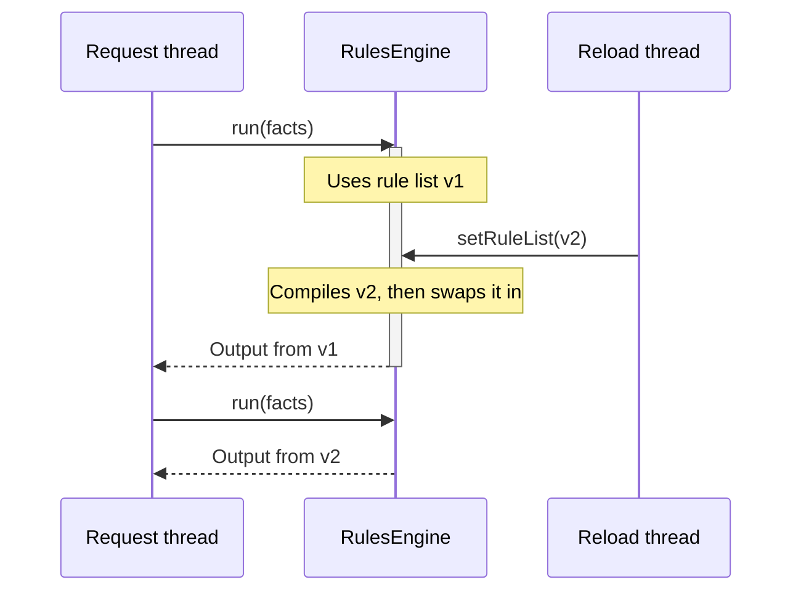

# 🧵 Thread safety

An engine is designed to be configured once and then shared by every thread in your application.

[← Back to README](../README.md)

- [At a glance](#-at-a-glance)
- [Reloading rules while running](#-reloading-rules-while-running)
- [What you must keep thread-safe](#-what-you-must-keep-thread-safe)
- [Compiled rules and concurrent runs](#-compiled-rules-and-concurrent-runs)

---

## 👀 At a glance

| Method | Thread-safe? | When to call it |
| --- | :---: | --- |
| `addImport()` / `addImports()` | ❌ | During setup, **before** `setRuleList()`. Imports are captured when rules compile, so adding one later has no effect until the next `setRuleList()`. |
| `setRuleList()` | ✅ | During setup, and again at any time to reload. When several threads call it at once, the last to finish wins. |
| `run()` | ✅ | From any number of threads, once `setRuleList()` has completed. |
| `registerLanguage()` | ✅ | During setup, before `setRuleList()`. A language registered later is used from the next `setRuleList()`; one already in progress may or may not see it. |
| `registerListener()` / `registerListeners()` | ✅ | At any time, even from inside a listener callback. |

## 🔄 Reloading rules while running

`setRuleList()` compiles the whole new list first, then swaps it in with a single atomic write, together with the
fact-name checks of the languages its rules use.



- A run already in progress finishes with the rules it started with.
- Runs that start after the swap use the new rules.
- If the new list fails to compile, nothing is swapped and the old rules stay in place.
- A run that starts during the swap may check its fact names with the other list's languages and imports. Only that
  run is affected, and only in whether it accepts a name one of the lists can't use.
- Each condition and action is compiled on its own, so variables and inline `import` statements in one rule never
  affect another rule or a later reload.

## 🤝 What you must keep thread-safe

The engine protects its own state. These parts are yours:

- **Facts:** build a new `FactStore` for each run and don't share mutable fact objects between concurrent runs.
- **The output supplier:** it must return a new object on every call. A shared instance would be changed by
  several runs at once.
- **Listeners:** the same listener instance is called from every thread running the engine.

## ⚡ Compiled rules and concurrent runs

MVEL caches an accessor in each compiled expression the first time it runs. When a later run binds the same fact
name to a different class, for example when `applicant` is an interface with several implementations, or is a
`Map` in one run and a record in another, MVEL replaces that accessor without synchronization. Two threads running
the same compiled expression can then fail intermittently with a `RuleExecutionException` caused by a
`ClassCastException`.

So concurrent runs never share a compiled MVEL expression. The rule list `setRuleList()` compiled is kept only to
copy from; no run uses it. Each `run()` borrows a copy that no other run is using, makes a new one if every copy is
busy (as the first run after `setRuleList()` does), and gives it back when it finishes. By default the engine keeps
as many copies as the most runs it has had in progress at once: the first time N runs overlap, N copies are made, and
they stay in memory, with the list they were copied from, until the next `setRuleList()`. To bound that number,
[limit the copies](#limiting-the-copies).

Each compiled condition and action makes its own copy. An MVEL expression is compiled again, so the first run after
`setRuleList()` compiles each MVEL rule a second time; an expression in another language that several threads can
run at once is shared instead (see [Other expression languages](languages/custom.md#-thread-safety)).

### Limiting the copies

A copy isn't free: every MVEL expression in it is compiled again, and as it runs, MVEL generates accessor classes for
that copy alone. A thread pool bounds the number of copies, because runs can't overlap more than its threads. Without
one, for example when each request runs on its own virtual thread, thousands of runs can overlap, and the engine
makes and keeps a copy for each.

Give the engine a limit when you build it:

```java
RulesEngine<LoanDecision> engine = RulesEngineBuilder.stateless(LoanDecision::new, 64);
```

- At most 64 copies are made, so at most 64 runs are in progress at once. A run that starts while all of them are in
  use waits until one is free. On a virtual thread, a waiting run doesn't hold a platform thread.
- A run started from inside another run on the same thread, such as from an action or a listener, doesn't wait: the
  copy it would wait for may be its own. If no copy is free, it gets an extra copy that isn't kept.
- If the thread is interrupted while its run waits, `run()` throws a `RuleExecutionException` caused by the
  `InterruptedException`, and the thread's interrupt status stays set.
- While `setRuleList()` swaps in a new list, runs still using the old list can hold up to that many copies more.

Choose a limit close to the number of runs that can make progress at once: around the number of processors for rules
that only compute, higher for rules that wait on I/O.

This works with any MVEL optimizer, so the engine leaves MVEL's global optimizer setting alone. MVEL's default JIT
optimizer stays in effect (unless you pass `-Dmvel2.disable.jit=true`), and other libraries in the same JVM that use
MVEL aren't affected.

> [!NOTE]
> Earlier versions switched MVEL to its slower reflective optimizer for the whole JVM when the engine class loaded,
> unless the JVM was started with `-Dunruly.mvel.jit=true`. That property is now ignored.
