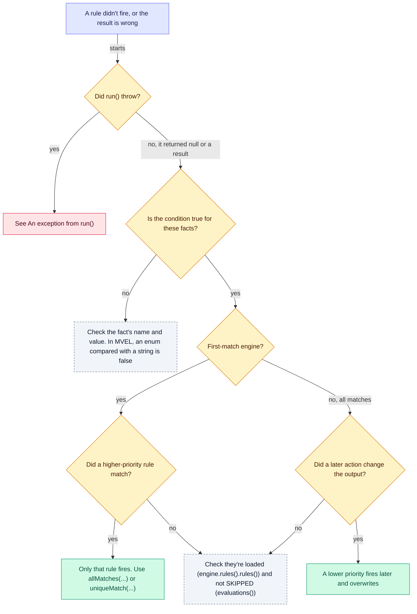

# 🩺 Troubleshooting

Symptoms, their usual causes, and the page that explains each one. This page states no rules of its own: every
answer links to the guide that owns it.

**Who it's for:** everyone.
**You'll be able to:** find out why a rule didn't fire, read an exception from `build()`, `load()` or `run()`, and
work out why rules that pass in tests fail in production.
**Before you start:** nothing. [Exceptions by method](exceptions-by-method.md) lists each method's exceptions.

[← Documentation index](README.md)

- [My rule didn't do what I expected](#-my-rule-didnt-do-what-i-expected)
- [An exception from build()](#-an-exception-from-build)
- [An exception from load()](#-an-exception-from-load)
- [An exception from run()](#-an-exception-from-run)
- [It works in tests but not in production](#-it-works-in-tests-but-not-in-production)

---

## 🔬 My rule didn't do what I expected

In words: if `run()` threw, read [An exception from run()](#-an-exception-from-run). If it returned `null` or a
result, check whether the condition is true for these facts; if not, check the fact's name and value (in MVEL, an
enum compared with a string is `false`). If it is true and the engine is first-match, a higher-priority match fires
instead of your rule. If the engine is all-matches, a lower-priority action may have overwritten the output. Otherwise
check the rules are loaded: `engine.rules().rules()` lists them, and an empty list returns `null`. A loaded rule the
run skipped reads `SKIPPED` in `runWithResult(facts).evaluations()`; see
[A rule's outcome is SKIPPED](#a-rules-outcome-is-skipped).

### run() returns null

No rule fired: no condition was true, or the rule list is empty. The [output supplier](glossary.md#output-supplier)
isn't called. See
[What a run reports](run-results.md#-what-a-run-reports).

### Only one rule fired, but several conditions are true

A [first-match engine](glossary.md#first-match-engine) fires only the highest-priority match, and doesn't evaluate
the rules below it. See
[First match or all matches](engines-and-runs.md#-first-match-or-all-matches).

### An all-matches result has the wrong value

Every matched action changes the same output object, in [evaluation order](glossary.md#evaluation-order), so a
lower-priority action runs later and can overwrite what a higher-priority one set. See
[Rule order](engines-and-runs.md#-rule-order).

### Two rules apply and you didn't notice

A first-match engine hides the overlap by firing the higher priority. A
[unique-match engine](glossary.md#unique-match-engine) fails the run and names both rules. See
[Unique match: one rule or none](engines-and-runs.md#unique-match-one-rule-or-none).

### A comparison is never true

In MVEL, an enum compared with a string is `false`, with no error, and other comparisons are looser than Java's. See
[Comparison gotchas](languages/mvel-gotchas.md#-comparison-gotchas).

### Output from the previous request shows up

The output supplier returns a shared object, so every run adds to it. See
[The output object](engines-and-runs.md#-the-output-object).

### How do I see why a rule didn't apply?

Read `runWithResult(facts).evaluations()`: one outcome for every loaded rule. See
[What a run reports](run-results.md#-what-a-run-reports).

### A rule's outcome is SKIPPED

The run didn't use the rule, and didn't evaluate its condition: the rule is disabled, the run started outside its
validity window by the engine's clock, or the run was given tags and the rule carries none of them. A rule with no
tags is skipped by every run given tags, and tags are compared case included. To tell which reason applied, compare
the rule's `isEnabled()`, `getValidFrom()`, `getValidTo()` and `getTags()` with `result.startedAt()` and
`result.tags()`. See [Choosing which rules a run uses](engines-and-runs.md#-choosing-which-rules-a-run-uses).

## 🔧 An exception from build()

Most of these are `IllegalStateException` from `build()`. The two that start with `Two expression languages` and
`An expression language's name` are `IllegalArgumentException` from `language(...)`, and those about imports are
`IllegalArgumentException` from `build()`.

| Message starts with | Cause | Fix |
| --- | --- | --- |
| `The engine has no expression language: add one with language(), or put a language on the class path or, with a provides clause, on the module path` | No language was given and `ServiceLoader` found none: `unruly-engine-core` alone, or a shaded jar without MVEL's service file | [How the engine picks a language](languages/README.md#-how-the-engine-picks-a-language); for shaded jars, [Expression languages are found with ServiceLoader](migrating-to-2.md#-expression-languages-are-found-with-serviceloader) |
| `The engine has several expression languages, ` | Two or more languages, and no default | Name one with `defaultLanguage(...)`; see [How the engine picks a language](languages/README.md#-how-the-engine-picks-a-language) |
| `The default language '` | `defaultLanguage(...)` names a language the engine doesn't have | [How the engine picks a language](languages/README.md#-how-the-engine-picks-a-language) |
| `Options are given for the expression language '` | `option(...)` names a language the engine doesn't have | [Exceptions by method](exceptions-by-method.md) |
| `Two expression languages are named '` | `language(...)` was given two languages with the same name | [Exceptions by method](exceptions-by-method.md) |
| `An expression language's name must not be null or blank` | `language(...)` was given a language whose `name()` is `null` or blank | [Exceptions by method](exceptions-by-method.md) |
| `The expression language ... found with ServiceLoader has a null or blank name` | A language jar on the class path has no name | [Exceptions by method](exceptions-by-method.md) |
| `The expression languages ... found with ServiceLoader are both named '` | Two language jars on the class path use the same name | [How the engine picks a language](languages/README.md#-how-the-engine-picks-a-language) |
| `'...' is neither a class nor a valid package name` | An import such as `"java.util."` | [Classes and imports](languages/mvel.md#-classes-and-imports) |
| `Can't import '...'` | The import is over 1,000 characters or 64 dot-separated parts, or names a class missing a dependency | [Classes and imports](languages/mvel.md#-classes-and-imports) |

A well-formed package name that doesn't exist, such as `"com.nope"`, is accepted by `build()` and `load()`. In MVEL,
a rule that uses a class from it fails at `run()` as if the import were missing: `could not resolve class` for a class
it creates, `unresolvable property or identifier` for one it calls; see
[Classes and imports](languages/mvel.md#-classes-and-imports).

## 🚨 An exception from load()

`load()` throws one `RuleCompilationException` for the whole list. `failures()` has one entry per broken rule; a
language that can't create its compiler and a rejected [declared fact](glossary.md#declared-fact) name are listed with
them. The previous rules stay loaded. `validate(rules)` returns the same problems without loading anything, except a
language that fails while `load()` makes the copies of `copiesAtLoad(n)`; see
[Checking a list before loading it](engines-and-runs.md#checking-a-list-before-loading-it) and
[Exceptions by method](exceptions-by-method.md).

| Message contains | Fix |
| --- | --- |
| `ruleName must not be null`, `must not be blank` | An `IllegalStateException` from `Rule.builder().build()`, not from `load()`: give the rule a name, condition and action. See [Exceptions by method](exceptions-by-method.md) |
| `Duplicate rule name '` | Two rules share a name. Thrown before anything compiles; see [Errors when rules load](languages/custom.md#-errors-when-rules-load) |
| `has a blank condition expression`, `has a blank action expression` | Fill in the expression; see [Errors when rules load](languages/custom.md#-errors-when-rules-load) |
| `is written in '...', which isn't one of the engine's expression languages` | The rule's `language` names one the engine doesn't have; see [How the engine picks a language](languages/README.md#-how-the-engine-picks-a-language) |
| `failed to compile` | A syntax error. In MVEL, `unknown class or illegal statement` is usually a missing import; see [Errors when rules load](languages/mvel.md#-errors-when-rules-load) |
| `contains an assignment ('`, `uses import_static` | In MVEL, a condition that assigns or declares, reported `at line L, column C`; see [Conditions can't assign](writing-rules.md#conditions-cant-assign) |
| `expression language failed to create a compiler` | In MVEL, an option that doesn't exist, or `strongTyping` when it can't apply; see [Strong typing](languages/mvel.md#-strong-typing) |
| `Declared fact '...' can't be used` | A declared fact has a name the rules' languages reject; see [Declaring facts](facts.md#-declaring-facts) and [Fact names MVEL rejects](languages/mvel.md#fact-names-mvel-rejects) |

> [!NOTE]
> `load()` doesn't check fact or property names unless the engine [declares its facts](facts.md#-declaring-facts) and
> its language can use them; see [Catching a typo when the rules load](facts.md#catching-a-typo-when-the-rules-load).
> Otherwise a typo fails the first run. What `load()` catches is in
> [Caught when loading or only when running?](error-handling.md#-caught-when-loading-or-only-when-running).

### NoClassDefFoundError: applicant (wrong name: Applicant)

In a class directory on a case-insensitive file system, the lookup for `applicant.class` finds `Applicant.class`. In
MVEL, such a class file counts as no class, so `applicant` is read as the fact and the rule compiles and runs; see
[Classes and imports](languages/mvel.md#-classes-and-imports). Any other `NoClassDefFoundError` while a rule
compiles fails `load()` with a `RuleCompilationException` naming the rule; see the
[migration guide](migrating-to-2.md#-a-missing-class-is-reported-like-any-other-failure).

## 🏃 An exception from run()

| Exception | Message contains | Cause and fix |
| --- | --- | --- |
| `IllegalStateException` | `load() must be called before run()` | No `load()` has succeeded yet. Load the rules before traffic; see [Lifecycle and closing](thread-safety.md#-lifecycle-and-closing) |
| `IllegalStateException` | `The engine is closed` | Your framework closed the engine at shutdown; see [Closing](thread-safety.md#closing) and [Shutting down](spring-boot.md#-shutting-down) |
| `IllegalStateException` | `while this run was borrowing a copy of it` | Not your code: an engine invariant has broken, and the message says which one. Report it with the stack trace at the issue link the message gives |
| `IllegalArgumentException` | `' is reserved for the output object` | A fact is named `output`; see [Naming rules](facts.md#-naming-rules) |
| `IllegalArgumentException` | `' is not a valid fact name`, `' cannot be used as a fact name` | In MVEL, the name isn't an identifier, or is a keyword or class name; see [Fact names MVEL rejects](languages/mvel.md#fact-names-mvel-rejects) |
| `IllegalArgumentException` | `was declared as`, `wasn't declared`, `was declared, but the run didn't supply it` | A fact doesn't match its declaration; see [Declaring facts](facts.md#-declaring-facts) |
| `RuleExecutionException` | `unresolvable property or identifier`, `unable to resolve variable` | In MVEL, a missing fact, or a class that isn't imported; see [Null and missing facts](languages/mvel.md#null-and-missing-facts) and [Classes and imports](languages/mvel.md#-classes-and-imports) |
| `RuleExecutionException` | `could not resolve class` | In MVEL, `new X()` for a class that isn't imported, or imported from a package that doesn't exist; see [Classes and imports](languages/mvel.md#-classes-and-imports) |
| `RuleExecutionException` | `could not access: ` | In MVEL, a misspelled property, a private field without a getter, or a `Map` without the key; see [Facts in MVEL](languages/mvel.md#-facts-in-mvel) for a property and [Reading a fact's properties](facts.md#-reading-a-facts-properties) for a `Map` |
| `RuleExecutionException` | `could not access field` | In MVEL, the fact's class isn't public, or its package isn't exported on the module path; see [Comparison gotchas](languages/mvel-gotchas.md#-comparison-gotchas) and [Installation](../README.md#-installation) |
| `RuleExecutionException` | `could not access property (` | In MVEL, an action sets a property the output has no setter or public field for, such as a record's component, and the output isn't a `Map`; see [Mostly in actions](languages/mvel.md#mostly-in-actions) |
| `RuleExecutionException` | `Cannot assign 'output'` | In MVEL, an action assigned to `output` itself; see [Mostly in actions](languages/mvel.md#mostly-in-actions) |
| `RuleExecutionException` | `A condition expression must evaluate to a boolean` | The condition returned `null` or a non-boolean; see [Caught when loading or only when running?](error-handling.md#-caught-when-loading-or-only-when-running). After `returned no result from evaluateWithDetail`, the rule's expression language returned `null` from `evaluateWithDetail`: a bug in the language, not in the rule; see [Explaining a condition's result](languages/custom.md#explaining-a-conditions-result) |
| `RuleExecutionException` | `Output factory returned null` | The output supplier returned `null`; see [The output object](engines-and-runs.md#-the-output-object) |
| `RuleExecutionException` | `expression language failed to create a session` | The language threw as the run started; see [What happens on each failure](error-handling.md#-what-happens-on-each-failure) |
| `RuleExecutionException` | `rules matched, but a unique-match engine allows one` | Two rows of the decision table overlap; see [Unique match: one rule or none](engines-and-runs.md#unique-match-one-rule-or-none) |
| `RuleExecutionException` | `run() was interrupted` | The thread was interrupted, and its interrupt status stays set: clear it with `Thread.interrupted()`; see [Why does every run on my pooled thread fail](stopping-runs.md#why-does-every-run-on-my-pooled-thread-fail-after-i-caught-an-interrupted-run) |
| `RuleExecutionException` | `run() passed its deadline` | The run passed its timeout; see [Stopping a run](stopping-runs.md) |
| `RuleExecutionException` | `No classes have been predefined during the image build` (the cause is an `UnsupportedFeatureError`), or `unable to instantiate accessor compiler` with `DynamicOptimizer` in its cause | In a native image, MVEL's JIT is on: start the executable with `-Dmvel2.disable.jit=true`; see [MVEL's JIT must be off](native-image.md#-mvels-jit-must-be-off) |
| `RuleExecutionException` | `MissingReflectionRegistrationError` as the cause | In a native image, a class or method the rule uses isn't registered for reflection; see [Registering your classes](native-image.md#-registering-your-classes) |
| `RuleExecutionException` | `NoClassDefFoundError` or `ClassNotFoundException` naming a fact or output class, after about 50 runs in quick succession | That class isn't reachable from the context class loader of the thread that called `load()`; see [Class loaders](thread-safety.md#-class-loaders) |
| `RuleExecutionException` | `NoClassDefFoundError`, `IllegalAccessError` as the cause | A `LinkageError` from a rule, reported naming the rule; see [Exceptions by method](exceptions-by-method.md). On the module path, see [Installation](../README.md#-installation) |

A [stop](glossary.md#stop) and a failure are both `RuleExecutionException`. In a stack trace the class shows as
`io.github.brantunger.unruly.core.ReportedFailure`, the engine's internal subclass of `RuleExecutionException`. Catch
`RuleExecutionException`, never the class name. Line breaks in a language's message are escaped in the engine's
message; the original is `getCause()`. See [Exceptions by method](exceptions-by-method.md).

## 🚢 It works in tests but not in production

### Packaging and logging

- **The application fails to start with `FindException: Module mvel2 not found`**, or a rule fails on its first run
  with `could not access field`, or after about 50 runs with `IllegalAccessError`: the module path needs MVEL's module
  name and an export without a `to` clause; see [Installation](../README.md#-installation).
- **No log output:** there's no SLF4J provider on the class path; see
  [Logging setup](listeners-and-logging.md#-logging-setup).
- **Rules pass on the JVM but fail in a native image:** MVEL's JIT is on, or the image doesn't register a class or
  method the rules use; see [Errors and what they mean](native-image.md#-errors-and-what-they-mean).

### A rule fails for ever after about 50 runs in quick succession

A rule works in tests and in the first minutes of production, then fails on every run. In MVEL that comes after about
50 runs in quick succession, when the JIT optimizer takes over the rule's accessors; see
[The dynamic optimizer and class loaders](languages/mvel.md#the-dynamic-optimizer-and-class-loaders). It has two
shapes:

- On the class path, a `NoClassDefFoundError` or `ClassNotFoundException` naming a fact or output class: that class
  isn't reachable from the context class loader of the thread that called `load()`; see
  [Class loaders](thread-safety.md#-class-loaders).
- On the module path, an `IllegalAccessError` naming your package: it needs an export without a `to` clause; see
  [Installation](../README.md#-installation).

### Under load, or at shutdown

- **Runs on virtual threads wait:** the default [copy limit](glossary.md#copy-limit) applies to them; see
  [Limiting the copies](compiled-copies.md#-limiting-the-copies). With `unlimitedCopies()`, a run that finds no idle
  copy waits for a build slot; see [Waiting for a build slot](virtual-threads.md#-waiting-for-a-build-slot).
- **Every run on one pool thread fails at its first rule:** its interrupt status is still set; see
  [Gotchas](stopping-runs.md#-gotchas).
- **Runs fail with `The engine is closed` during shutdown:** the engine bean was closed before the work stopped; see
  [Shutting down](spring-boot.md#-shutting-down).
- **Metaspace or the class-loader count climbs across redeploys, plugin or tenant reloads:** the old loaders are
  not collected, because in MVEL the dynamic optimizer holds them; see
  [MVEL's dynamic optimizer](languages/mvel.md#the-dynamic-optimizer-and-class-loaders).

### With facts the tests never used

**A rule that passed its tests fails on a fact or property name:** the production facts have another shape, such as
a bean without the property or a `Map` without the key, and names are checked when a rule runs, not by `load()`,
unless the facts are declared and the language checks rules against them; see
[Caught when loading or only when running?](error-handling.md#-caught-when-loading-or-only-when-running). Test each
rule against facts shaped like production's; see [Testing rules](writing-rules.md#-testing-rules).
